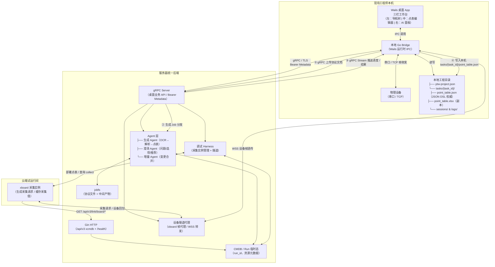

> **文档定位**：本文件是「点表智能工作台」产品设计文档集的**入口导航**，覆盖产品线（P1–P5）与技术线（T1–T11），适合所有角色在开始阅读任意子文档前首先阅读。
> **最后更新**：2026-06-24 | **状态**：正式版 v1.7（新增 T12 数据与物料存储边界设计，专题化提炼本机 / 云端 / xboard 的存储归属与边界规则）

---

# 点表智能工作台 — 总览与文档索引

## §1 产品定位

**一句话**：「点表智能工作台」是一款面向工业现场工程师的 AI 辅助设备接入工具，把厂商协议文档交给 AI 自动生成点表、连上设备对答案验证，一键提交上报。

**一段话展开**：工业自动化现场的设备接入长期依赖人工逐页翻阅协议手册、手动录入点表，耗时数天乃至数周，且容错率低。「点表智能工作台」将这一流程 AI 化：工程师在一个工程里可以导入多个厂商协议文档（PDF/Word/图片），每次导入都会创建一个独立的协议点表任务并自动触发生成；生成完成后进入该任务的单点表工作台，独立完成编辑、调试、验收和提交。确认后直接连接设备进行真实采集验证，通过后一键发布到 xboard；xboard 通过本后端内置的 xcmdb 兼容接口查询已生成点表的设备信息。产品以**二进制桌面 App（Wails + Go，支持 macOS/Windows/Linux）**交付给工程师本机使用，后端为**服务器统一 Go 服务**，采用 C/S 架构；桌面前端只调用 Wails Binding，本地 Go Bridge 通过 gRPC/TLS 访问云端后端，Gin HTTP 仅保留给 xboard xcmdb 兼容接口和运维探活。本机 JSON DSL 文件为点表权威数据源。

---

## §2 系统总览图

> **核心数据流**：工程内导入协议 → 前端经 Wails Binding 调用本地 Bridge → Bridge 通过 gRPC 创建协议点表任务（task_id）并上传文档 → 后端自动触发生成 Job（run_id）→ Bridge 通过 gRPC Stream 接收进度和结果并写回本机 `tasks/{task_id}/point_table.json`（权威）→ 导出 xlsx 副本 → 在该任务工作台内调试验证（xboard 采集请求 → 云端后端设备代理 → 本地 Bridge → 现场设备 → 原路回包 → xboard collect → AI 判定）→ 提交上报。桌面前端不直接 `fetch/axios` 云端 HTTP API。

---

## §3 文档地图

### 产品线（`产品/` 目录）

| # | 文档标题 | 文件名 | 核心内容 | 推荐读者 |
|---|---------|--------|---------|--------|
| P1 | 产品愿景与价值主张 | [P1-产品愿景与价值主张.md](产品/P1-产品愿景与价值主张.md) | 行业痛点 / 核心价值 / 差异化优势 / 北极星指标 | 所有人 |
| P2 | 用户与使用场景 | [P2-用户与使用场景.md](产品/P2-用户与使用场景.md) | 角色画像 / 端到端用户旅程 / 典型场景剧本 | 产品 / 设计 / 研发 |
| P3 | 产品需求规格 PRD | [P3-产品需求规格PRD.md](产品/P3-产品需求规格PRD.md) | F1–F18 功能规格 / 状态机 / 验收标准 | 产品 / 研发 / 测试 |
| P4 | 信息架构与交互设计 | [P4-信息架构与交互设计.md](产品/P4-信息架构与交互设计.md) | Sitemap / 三栏工作台布局 / 交互契约 | 前端 / 后端适配 |
| P5 | 产品路线图与里程碑 | [P5-产品路线图与里程碑.md](产品/P5-产品路线图与里程碑.md) | M1/M2/M3 里程碑 / 差距矩阵 / 外部依赖 | 产品 / 管理 |

### 技术线（`技术/` 目录）

| # | 文档标题 | 文件名 | 核心内容 | 推荐读者 |
|---|---------|--------|---------|--------|
| T1 | 系统架构设计 | [T1-系统架构设计.md](技术/T1-系统架构设计.md) | 目标架构（To-Be）：C/S 拓扑 / 能力划分 / 数据流 / 状态归属 / 集成契约 | 架构师 / 全栈 |
| T1A | 现状到目标架构演进方案 | [T1A-现状到目标架构演进方案.md](技术/T1A-现状到目标架构演进方案.md) | 现状代码 → 目标架构：现有 Gin 服务梳理 / 差距与缺失模块 / 架构张力 / M1–M3 实施路线 | 架构师 / 全栈 |
| T2 | Agent 系统设计 | [T2-Agent设计.md](技术/agent%20详细设计/T2-Agent设计.md) | 设计层 / 两大能力契约 / Agent 封装契约（IO·Schema·校验·置信度·出处·路由）/ 生成与调试编排状态机 / 评估门禁 | AI 工程师 / 架构师 |
| T3 | 数据库与数据模型 | [T3-数据库与数据模型设计.md](技术/T3-数据库与数据模型设计.md) | 目标数据模型（To-Be）：JSON DSL 模型 / SQLite 目标 schema / jobfs / ER 图 | 后端 |
| T3A | 数据存储现状与演进方案 | [T3A-数据存储现状与演进方案.md](技术/T3A-数据存储现状与演进方案.md) | 现状存储层 → 目标：现有 DDL / 已知问题 / 迁移机制 / Schema 演进与一致性策略 / M1–M3 | 后端 |
| T4 | API 与桌面 Bridge | [T4-API与桌面Bridge设计.md](技术/T4-API与桌面Bridge设计.md) | 业务 API 契约 / Bridge 方法 / gRPC 写回契约 | 前端 / 后端 |
| T5 | 安全权限与审计 | [T5-安全权限与审计设计.md](技术/T5-安全权限与审计设计.md) | 目标态（To-Be）：gRPC Metadata 鉴权 / 写点安全门禁 / 审计留痕 | 安全 / 后端 |
| T5A | 安全现状评估与演进方案 | [T5A-安全现状评估与演进方案.md](技术/T5A-安全现状评估与演进方案.md) | 现状安全评估 → 目标：威胁全景 / 鉴权链路现状 / 明文 API Key 风险 / P0–P2 补齐 / M1–M3 安全基线 | 安全 / 后端 |
| T6 | 部署分发与运维 | [T6-部署分发与运维设计.md](技术/T6-部署分发与运维设计.md) | 目标态（To-Be）：容器化 / 二进制分发 / 监控 / 日志聚合 / 本机备份迁移 | DevOps / 后端 |
| T6A | 部署运维现状与演进方案 | [T6A-部署运维现状与演进方案.md](技术/T6A-部署运维现状与演进方案.md) | 现状部署运维 → 目标：现有构建/配置/打包 / 缺口汇总 / 运维补齐优先级 / 最小可行配置 | DevOps / 后端 |
| T7 | 质量保障与测试 Eval | [T7-质量保障与测试Eval设计.md](技术/T7-质量保障与测试Eval设计.md) | 目标态（To-Be）：准确率指标 / 黄金样本 / 测试分层策略 | 测试 / AI 工程师 |
| T7A | 测试覆盖现状与演进方案 | [T7A-测试覆盖现状与演进方案.md](技术/T7A-测试覆盖现状与演进方案.md) | 现状测试覆盖 → 目标：现有 Eval/单测 / 覆盖度现状 / 样本库建设 / Eval 接入 CI / 工具链 | 测试 / AI 工程师 |
| T8 | 桌面端 gRPC Bridge 架构 | [T8-gRPC桥接架构设计.md](技术/T8-gRPC桥接架构设计.md) | gRPC 传输实现权威 / 与 T4 分工 / Proto 设计 / Bridge gRPC 客户端 / EventsEmit 流式推送 / 与 Gin 共存 / M1–M3 实施路线 | 桌面端 / 后端 / 架构师 |
| T9 | AI 调试报文采集与诊断数据链路 | [T9-AI调试报文采集与诊断数据链路设计.md](技术/agent%20详细设计/T9-AI调试报文采集与诊断数据链路设计.md) | xboard `debug/info` 权威契约 / 帧↔命令↔测点↔值↔错误码语义关联 / 保活轮询调度 / Observer→RoundObservation→DiagnoseAgent / 喂 AI 与桌面端 | AI 工程师 / 后端 / 架构师 |
| T10 | Agent 能力包实现设计 | [T10-Agent能力包实现设计.md](技术/agent%20详细设计/T10-Agent能力包实现设计.md) | T2 的实现层落地 / `agentkit` 内核（Agent·三道闸·Prompt 版本·哨兵错误）/ 生成与调试两个自包含能力包 / 端口与默认适配器 / 构造装配与 harness | AI 工程师 / 后端 / 架构师 |
| T11 | Agent 能力包集成与扩展指南 | [T11-Agent能力包集成与扩展指南.md](技术/agent%20详细设计/T11-Agent能力包集成与扩展指南.md) | 操作手册 / 系统接入三步（端口·装配·进度 Sink·错误映射）/ 扩展字段家族成员·校验闸·调试白名单·Prompt 版本 / harness 独立运行 / 接入与扩展 checklist | AI 工程师 / 后端 / 架构师 |
| T12 | 数据与物料存储边界设计 | [T12-数据与物料存储边界设计.md](技术/目标态/T12-数据与物料存储边界设计.md) | 目标态（To-Be）：四类存储域（本机权威 / SQLite 永久态 / jobfs 临时态 / xboard 部署侧）/ 物料全量归属清单 / xlsx 多副本与 canonical 归属 / 谁是源规则 / 边界不变量 / TTL 清理 | 架构师 / 后端 / 桌面端 |

### 开发计划与评审（顶层）

| # | 文档标题 | 文件名 | 核心内容 | 推荐读者 |
|---|---------|--------|---------|--------|
| MVP | MVP 开发计划 | [MVP-开发计划.md](MVP-开发计划.md) | MVP 边界（gRPC / 单用户 / 含调试 / Alpine 原型）/ IN-OUT 清单 / 端到端流程 / WBS / 三阶段里程碑 / 真机调试依赖兜底 | 全体研发（开发基线）|
| R | 设计评审与改进建议 | [设计评审与改进建议.md](设计评审与改进建议.md) | 代码现状 vs 既有目标设计的实现差距 / 四维度评审 / P0–P3 落地路线图 | 架构师 / 全栈 / 管理 |

> 本文是对上述 P/T 系列设计的**评审视角**：不重新设计，而是核实"已设计的目标"在代码中的落地差距，并修掉与既有设计的冲突。建议在通读相关 T 系列后阅读。

---

## §4 推荐阅读顺序

| 角色 | 推荐阅读路径 | 说明 |
|------|------------|------|
| **新加入的产品同学** | P1 → P2 → P3 → P5 | 从愿景到用户到功能规格，再了解交付节奏 |
| **新加入的研发同学** | P1 → P3 → T1 → T3 → T12 → T4 | 先理解产品目标，再深入架构、数据模型、存储边界与 API |
| **AI 工程师** | P3 → T1 → T2 → T10 → T11 → T9 → T7 | 功能需求 → 架构边界 → Agent 设计 → Agent 实现落地 → 集成与扩展 → 调试数据链路 → Eval 指标 |
| **前端 / 桌面端** | P4 → T4 → T8 → T12 → T5 | 交互设计 → Bridge & API 契约 → gRPC Bridge 实施 → 本机/云端存储边界 → 安全鉴权 |
| **DevOps** | T1 → T6 → T5 | 整体架构 → 部署运维 → 安全合规 |

---

## §5 统一术语表

### 产品侧术语

| 术语 | 含义 |
|------|------|
| **工程** | 一个设备接入项目的顶层容器，对应本机一个工程目录，包含多个协议点表任务（设备驱动任务） |
| **协议点表任务 / 设备任务** | 工程下由一次协议导入创建的独立工作单元，通常对应一个设备/型号的点表；含协议文件、生成 run、点表 DSL、调试会话和验收状态 |
| **协议文档** | 厂商提供的设备通信协议手册，支持 PDF / Word / 图片，由 MinerU OCR 解析；导入工程后创建或追加到某个协议点表任务 |
| **单点表工作台** | 某个协议点表任务的独立工作区；编辑、调试、验收、提交都发生在这里，不直接发生在工程总览层 |
| **七级分类** | 点表标准分类体系：系统→子系统→设备类型→设备→子设备→点组→测点，共七层 |
| **草稿** | AI 生成但未经工程师确认的点表状态 |
| **待澄清** | 存在不确定项、AI 已发起澄清问题等待工程师回答的状态 |
| **待复核** | 澄清完成、等待工程师二次人工核查的状态 |
| **调试中** | 工程师正在用真实设备验证采集结果的状态 |
| **已确认** | 所有测点经工程师确认无误的状态 |
| **已提交** | 点表已发布至 xboard，且后端内置 xcmdb 兼容接口可供 xboard 查询设备信息的终态 |
| **澄清条** | 单条待澄清记录，包含问题描述、选项列表、AI 推荐答案、证据来源 |
| **门禁** | 写点安全校验规则，防止未授权或超出协议范围的寄存器写操作 |
| **协议采数质量域** | 以真实设备返回值为基准的测点质量评估维度（地址/类型/值域） |
| **测点描述质量域** | 以协议文档语义为基准的测点描述质量评估维度（命名/单位/分类） |
| **假设-证据-结果** | 调试验证的三元记录结构，用于留痕和回溯 |
| **试运行间** | 云端 xboard 采集实例运行环境；通过后端设备代理和本地 Bridge 间接采集现场设备，不直接连接物理设备 |
| **快捷提交** | 跳过调试直接提交点表的快速路径，需额外确认 |

### 技术侧术语

| 术语 | 含义 |
|------|------|
| **run_id** | 后端生成 Job 的全局唯一标识符，贯穿生成 → 澄清 → 合并全流程 |
| **resource_id** | 后端 CMDB 中设备/资源实例的唯一 ID，供 xboard 通过 `/api/v3/link/board` 查询 |
| **PointID** | 点表中单个测点的业务唯一标识，格式为 `{device_id}:{register_address}:{type}` |
| **seq** | 增量合并中的版本序号，用于检测并发冲突 |
| **canonical** | 经过标准化处理的测点或分类路径，消除别名歧义后的权威表示 |
| **baseline** | 增量合并的基准版本快照，新版本 diff 基于此计算 |
| **Decision** | 澄清条的工程师决策记录，含选项索引、自定义值、决策时间戳 |
| **fold** | 点表视图的折叠/展开状态，存储于本地 layout.json |
| **effective** | 测点在当前时刻实际生效的配置值（可能覆盖草稿默认值） |
| **jobfs** | 服务器端生成 Job 的文件系统命名空间，存储协议原文、中间产物、merged.json |
| **point_table.json** | 客户端本机 `tasks/{task_id}/` 目录中的 JSON DSL 权威文件，点表完整状态的单一数据源 |
| **MergedPoint** | 服务器合并多轮生成结果后输出的标准测点对象，下发给客户端写入 DSL |
| **JSON DSL** | 点表的结构化领域专用语言（JSON 格式），定义测点 schema 及工程元数据 |
| **board_type** | xboard 设备板卡类型标识，影响测点地址空间和采集协议选择 |
| **SpotResourceID** | 测点与 CMDB 资源的绑定标识，用于上报时的资源映射 |
| **xboard** | 独立运行的数采/试运行服务，加载点表并发起采集请求 |
| **xcmdb** | 本后端内置的 xcmdb 兼容接口域，不是独立服务；仅提供 `info` / `list` / `count` 给 xboard 查询设备信息 |

---

## §6 现状 vs 目标速览

> 下表为产品级速览；系统架构层面**现状代码 → 目标架构**的完整梳理、差距清单与分阶段实施路线见 [T1A-现状到目标架构演进方案.md](技术/T1A-现状到目标架构演进方案.md)。
> 「什么数据 / 文件存本机、什么存云端、什么存 xboard」的**存储边界完整说明**见 [T12-数据与物料存储边界设计.md](技术/目标态/T12-数据与物料存储边界设计.md)。

| 维度 | 当前现状 | 目标形态 |
|------|---------|--------|
| **产物权威** | 服务器 jobfs（xlsx + merged.json） | 客户端本机 JSON DSL（layout.json） |
| **点表格式** | Excel xlsx | JSON DSL（xlsx 为只读副本） |
| **鉴权** | 无 | Bridge 通过 gRPC Metadata 携带 Bearer Token + 工程级隔离 |
| **前端形态** | 静态 HTML 原型 | Wails 二进制桌面 App（Win/macOS/Linux） |
| **Agent 数量** | 12 个（生成 + 调试） | 19 个（新增 OCR / 澄清 / 增量 / harness 等） |
| **文档 OCR** | 无（仅接受 .md / .txt） | 接入 MinerU（PDF / Word / 图片） |
| **澄清队列** | 无 | 完整澄清 Session（问题 / 选项 / AI 推荐 / 证据） |
| **写点安全** | 无保护 | 授权模式 + 逐点确认 + 审计日志 |
| **工程用量** | 原型为旧用量 mock 文案 | 仅在工程总览展示工程级用量；不暴露 LLM 配置、模型或 token 明细 |
| **部署** | 单进程 config.json | 容器化 + 环境变量注入 + 健康检查 |

---

## §7 已废弃文档声明

> ⚠️ **已废弃**：`ai-point-table/DESIGN.md`（仓库根目录）是基于旧 Genkit 框架的历史设计草稿，与现行实现严重脱节，**不应作为任何实现依据**。

现行权威设计文档分布在两处：
1. **本套产品设计文档**（`docs/产品设计/`）：产品级整体设计，产品线 + 技术线双覆盖；
2. **子系统实现文档**（`ai-point-table/docs/设计文档/`）：后端各子系统的权威实现设计（生成 / 调试 / 证据 / 版本 / 规范等）。

---

## §8 与现有子系统文档的关系

`docs/产品设计/`（本套文档）与 `ai-point-table/docs/设计文档/`（子系统文档）构成互补的两层设计体系：

| 维度 | 本套产品设计文档 | 子系统实现文档 |
|------|--------------|-------------|
| **覆盖范围** | 产品级整体设计，跨前端 + 后端 + AI | 后端各子系统技术实现细节 |
| **视角** | 以用户旅程和产品原型为蓝图 | 以代码实现和接口契约为基准 |
| **权威层级** | 描述**目标形态**（To-Be） | 描述**当前实现**（As-Is） |
| **技术线关系** | T1–T11 引用并延伸子系统文档 | 是 T1–T11 的技术细节权威来源 |
| **冲突处理** | 以本套文档为目标定义，差异记为待对齐项 | 以子系统文档为现状描述，差异记为技术债 |

**重要原则**：当本套文档描述与子系统文档出现不一致时，**本套文档描述「目标」（应该做什么）**，子系统文档描述「现状」（目前做了什么）；研发团队应以本套文档为方向，逐步使实现向目标靠拢。
