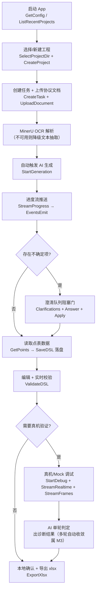

> **文档定位**：本文是「点表智能工作台」的 **MVP 开发计划与落地指南**，供研发团队按此推进首个可用版本的开发。
> **最后更新**：2026-06-24 | **状态**：MVP 开发基线 v1.0
> **边界决策（2026-06-24 定）**：① 通信协议 = gRPC（路径 A，见 T8）；② 含真机调试（依赖兜底见 §7）；③ 单机单用户，MVP 不做鉴权与工程隔离；④ 前端沿用现有 Alpine 原型接真实数据，是否重构 Vue/React 后续再定。

---

# 点表智能工作台 — MVP 开发计划

## §1 MVP 目标与成功标准

### 1.1 一句话定义

> MVP = 让一个工程师在桌面 App 里**独立跑通**「打开工程 → 上传协议文档 → AI 生成点表 → 澄清确认 → 编辑校验 → 真机调试验证 → 导出 xlsx」的端到端闭环，全程无需命令行介入。

### 1.2 成功标准（MVP 验收门槛）

| # | 标准 | 量化指标 |
|---|---|---|
| 1 | 端到端可用 | 用 1 份真实协议文档（PDF 或 Word），从导入到导出 xlsx 全程在 GUI 内完成 |
| 2 | 生成质量 | 协议采数关键字段（功能码/寄存器/解析函数）准确率 ≥ 85%（MVP 阶段门槛，低于 P5 的 90% 正式门槛）|
| 3 | 本地产物 | 生成结果落地为本机 `point_table.json`（JSON DSL）+ `point_table.xlsx` 副本 |
| 4 | 调试可验证 | 通过现有 xboard 采集服务加载点表、完成一轮真实采集与 AI 判定（D3/D5 走真实链路，见 §7）|
| 5 | 可分发 | 产出 Windows / macOS 桌面安装包，在干净机器上可启动运行 |

### 1.3 MVP 不追求的（明确放弃）

- 不做多用户鉴权、工程隔离（单机单用户）
- 不做增量文档分析（E 域）、规则包版本管理（J 域）、工程用量展示
- 不做完整自收敛调试 loop（多轮自动锁定收敛点 + 自动应用 + `/updateTemplate` 重部署，H-12，属 M3）；MVP 调试以「采集 → AI 判定出诊断结果」单轮为限（无人工评审/apply 路径——该路径在目标态已删除）
- 不追求 1 万行 60fps 的极致表格性能（MVP 用现有原型表格即可）
- 不做 xboard 正式发布（publish 到生产 xboard），MVP 终点是「导出 xlsx + 本地确认」

---

## §2 范围边界（IN / OUT 清单）

### 2.1 功能域 IN/OUT（对照 T4 域划分）

| 域 | 功能 | MVP | 说明 |
|---|---|---|---|
| A | 工程/任务管理 | ✅ IN（精简） | 仅 create/list/get 工程 + 任务；不做删除、分页可简化 |
| B | 文档上传与解析 | ✅ IN | 上传 + MinerU OCR；OCR 不可用时降级为本地文本抽取（仅 .md/.txt/文本型 PDF）|
| C | 点表生成 + 进度流 | ✅ IN | 复用现有生成流水线 + gRPC 进度流 |
| D | 澄清队列 | ✅ IN | F4 强阻塞门；F4-OPT 轻量弹窗不在 MVP |
| E | 增量文档分析 | ❌ OUT | 后续迭代 |
| F | 点表数据（读写/版本） | ✅ IN | 复用现有端点逻辑 |
| G | 证据链 | ✅ IN | 复用现有 |
| H | 调试与 Harness | 🟡 部分 IN | 调试发起/实时值/收发报文/AI 单轮判定出诊断结果（IN，走现有 xboard 采集 + `debug/info` 报文，见 §7 / T9）；完整自收敛 loop（多轮自动锁定 + 自动应用 + 重部署收敛）属 M3（OUT）；Harness 假设时间线/命令画像（OUT）|
| I | 确认与提交 | 🟡 部分 IN | 本地确认（IN）；快捷提交到在线服务器（OUT，MVP 终点是导出）|
| J | 规则包与工程用量 | ❌ OUT | 后续迭代 |
| K | xcmdb 兼容 | ✅ 维持 | 现有 HTTP，不动 |
| L | 健康检查 | ✅ 维持 | 现有 |

### 2.2 Bridge 方法 IN/OUT

| 方法 | MVP | 备注 |
|---|---|---|
| SelectProjectDir / GetConfig / SaveConfig / ListRecentProjects | ✅ | 本地能力，必须实现 |
| SaveDSL / LoadDSL | ✅ | 本地落盘核心 |
| ExportXlsx | ✅ | MVP 终点产物 |
| ValidateDSL | ✅ | 离线校验 |
| ListSerialPorts / SendFrame | ✅ | 真机调试需要 |
| SubmitToServer | ❌ OUT | 提交到在线服务器，后续做 |
| GetRulePackVersion | ❌ OUT | 规则包管理，后续做 |

---

## §3 MVP 端到端流程（Happy Path）



---

## §4 技术架构（MVP 版）

### 4.1 MVP 拓扑

```
现场工程师本机（Wails 桌面 App）
  ├── 前端：Alpine.js 原型（接真实 Bridge 数据，替换 mock-data.js）
  ├── Bridge：app.go
  │     ├── gRPC 客户端（连服务器，无 TLS / 开发期 insecure）
  │     ├── 本地能力：文件 / 配置 / 串口
  │     └── 流式：EventsEmit 推前端
  └── 本地工程目录：ptw-project.json + tasks/{task_id}/

服务器（单 Go 进程）
  ├── gRPC Server :50051（桌面端业务，MVP 无 Auth 拦截器）
  └── Gin HTTP :8080（保留 /api/v3 xcmdb + /health）

调试链路（MVP 走真实 xboard）
  ├── 后端 internal/xboard.Client → xboard 采集服务（现成，POST /update 加载点表 + GET /collect/value 取值）
  ├── D3 采集实例编排 / D5 设备隧道：MVP 必须打通（真实链路）
  └── D4 原始报文 hex：来自 xboard debug/info（非缺失）→ 后端集成（见 §7 / T9）
```

### 4.2 与 T8 的差异（MVP 简化）

| 项 | T8 正式设计 | MVP 简化 |
|---|---|---|
| TLS | 强制 | 开发期 `grpc.WithInsecure()` |
| Auth 拦截器 | Bearer Token + workspace 隔离 | **不做**，单用户 |
| Proto 域 | 全 11 个 | 仅 MVP IN 的域（A/B/C/D/F/G/H 精简）|
| 设备隧道代理 | xboard → 后端代理 → WSS → Bridge | MVP 打通 D3/D5 真实链路（xboard 采集现成）；D4 hex 经 xboard debug/info 集成（见 T9）|

### 4.3 复用现有资产（不要重写）

> **关键原则：后端生成内核已跑通，MVP 后端工作主要是「给现有 Service 套 gRPC 外壳」，不是重写业务逻辑。**

| 现有资产 | 位置 | MVP 复用方式 |
|---|---|---|
| 生成流水线（12 Agent） | `internal/pipeline`, `internal/agents` | 直接复用，gRPC Handler 调用 |
| 23 个 HTTP 端点的 Service 层 | `internal/service` | 直接复用，新增 gRPC Handler 薄封装 |
| 调试编排 | `internal/debug` | 复用 |
| 证据链 / 版本管理 / Excel 生成 | 对应 package | 复用 |
| **xboard 采集客户端** | `internal/xboard/client.go` | **直接复用**：`Update` 加载点表 / `CollectValue` 取实时值喂 AI；MVP 调试主链路 |
| mockxboard | `cmd/mockxboard` | 仅作离线单测/开发联调工具，**不是 MVP 调试主路径** |

---

## §5 工作分解（WBS）

### 5.1 后端（ai-point-table）

| 任务 | 文件/位置 | 复杂度 |
|---|---|---|
| 编写 MVP proto（A/B/C/D/F/G/H 精简） | `proto/*.proto` | 中 |
| 生成 Go stub | `internal/grpc/gen/` | 低（buf/protoc）|
| gRPC Server 与 Gin 并行启动 | `cmd/server/main.go` | 中 |
| ProjectService Handler（A 域） | `internal/grpc/handler/project.go` | 中（A 域 Service 是新增）|
| DocumentService Handler（B 域，含分块上传） | `internal/grpc/handler/document.go` | 中 |
| GenerationService Handler + 进度流 | `internal/grpc/handler/generation.go` | 中（复用生成 Service）|
| ClarificationService Handler（D 域） | `internal/grpc/handler/clarification.go` | 中（D 域 Service 新增）|
| PointTable / Evidence Handler（F/G 域） | `internal/grpc/handler/` | 低（复用）|
| DebugService Handler + 实时值流 + 报文流 | `internal/grpc/handler/debug.go` | 高（流式 + 兜底链路）|
| MinerU 接入 + 文本降级 | `internal/mineru/` | 中 |

### 5.2 桌面 Bridge（ai-point-web/desktop/app.go）

| 任务 | 复杂度 |
|---|---|
| App struct 加 gRPC 连接 + 各域 client 初始化 | 中 |
| 本地能力实现：SelectProjectDir/GetConfig/SaveConfig/ListRecentProjects | 低 |
| 本地能力：SaveDSL/LoadDSL/ExportXlsx/ValidateDSL | 中（ExportXlsx 用 excelize）|
| gRPC 封装方法：A/B/C/D/F/G 各域 | 中 |
| 流式：SubscribeProgress / StreamRealtime / StreamFrames → EventsEmit | 高 |
| 串口：ListSerialPorts / SendFrame（go.bug.st/serial） | 高 |
| 错误转换 grpcErrToAppErr | 低 |

### 5.3 前端（Alpine 原型接真实数据）

| 任务 | 复杂度 |
|---|---|
| 抽出数据访问层，把 `mock-data.js` 的引用改为 Bridge 调用 | 中 |
| 接入 Wails `Events.On` 监听进度/实时值/报文 | 中 |
| 启动页 / 工程总览接真实工程列表 | 低 |
| 工作台接真实点表数据 + 澄清门 + 校验 | 中 |
| 调试 Tab 接实时值流 + 报文流 | 中 |

---

## §6 MVP 内部里程碑（分阶段可验证，避免大爆炸）

> 把 MVP 拆成三个可独立验证的内部阶段，每阶段都有明确的「能演示什么」。

### MVP-A：生成链路打通（骨架）

**目标**：文档 → AI 生成 → 看到点表草稿 → 落本地。

- 后端：gRPC 框架 + A/B/C/F/G 域 Handler + 进度流
- Bridge：gRPC 连接 + 本地配置/目录 + SaveDSL/LoadDSL + SubscribeProgress
- 前端：启动页 + 工程总览 + 上传 + 进度可视 + 点表只读展示

**验收**：上传一份协议文档，能看到 AI 生成的点表并落地 `point_table.json`。

### MVP-B：编辑与导出闭环

**目标**：澄清 → 编辑 → 校验 → 导出 xlsx。

- 后端：D 域澄清队列 Handler
- Bridge：ValidateDSL + ExportXlsx
- 前端：澄清阻塞门 + 编辑 + 实时校验 + 导出

**验收**：处理澄清项 → 编辑修正 → 校验通过 → 导出 xlsx，平台导入验证兼容。

### MVP-C：调试验证闭环

**目标**：xboard 真实采集 → 实时值判定 → AI 单轮诊断出结果（自动应用与多轮自收敛属 M3，目标态无人工评审/apply 路径）。

- 后端：H 域调试 Handler + 诊断事件流；复用 `internal/xboard.Client`（`Update` 加载点表 + `CollectValue` 取值），新增 `GetDebug`（`debug/info` 报文采集，见 T9）；打通 D3（采集实例编排）/ D5（设备隧道）
- 后端：调试会话聚合层 + 保活轮询调度（T9 §3.4），输出结构化诊断事件（帧 + 测点绑定）
- Bridge：StreamRealtime / StreamFrames → EventsEmit（同源于诊断事件流）；ListSerialPorts / SendFrame（本地手动发包辅助）
- 前端：调试 Tab（实时值判定）+「收发报文」Tab（原始帧 TX/RX）+ 诊断结果展示

**验收**：通过现有 xboard 加载点表完成一轮真实采集，AI 基于实时值给出判定并输出诊断结果（多轮自动收敛/自动应用属 M3，见 T2 §5）。

---

## §7 真机调试的依赖现状与 MVP 策略（重要）

> **事实更新（2026-06-24）**：公司**已有现成可用的 xboard 采集服务**，能直接加载点表、采集现场设备数据并喂给 AI，后端 `internal/xboard/client.go` 已实现对接（`Update`/`Status`/`CollectValue`）。因此 MVP 调试**走真实采集链路，不使用 mock xboard 兜底**。
> **D4 结论修正**：经 `xboard.v2` 代码核实，**原始报文 hex 并不缺失**——可经 xboard `debug/info` 驱动调试接口获取「收发帧 + 命令 + 测点 + 解析值 + 错误码」的结构化绑定（详见 **T9-AI调试报文采集与诊断数据链路设计**）。D4 由「外部缺失项」修正为「后端集成任务」。

### 7.1 D3 / D4 / D5 在 MVP 中的定位

| 依赖 | 含义 | MVP 状态 | 说明 |
|---|---|---|---|
| **D3 采集实例编排** | 创建/加载点表/启停/销毁采集实例 | ✅ **MVP 必须打通** | 基于现有 xboard `Update`/`Status` 能力对接，是 MVP 调试主链路 |
| **D5 设备代理隧道** | 云端采集请求穿透到现场设备 | ✅ **MVP 必须打通** | 现有 xboard 采集已能触达设备；MVP 复用该链路 |
| **D4 原始报文 hex** | 收发帧 + 命令 + 测点 + 解析值 + 错误码 | ✅ **数据源已确定（xboard `debug/info`）** | 非缺失；本项目集成任务，方案见 T9（客户端 `GetDebug` + 报文解析 + 保活轮询调度）|

### 7.2 D4 集成方案（按 T9）

调试期报文与判定数据**唯一来自 xboard `debug/info`**（方案 A），不使用 `capture` 抓包（方案 B）。理由：`debug/info` 天然输出「帧↔测点↔解析值↔错误码」的语义绑定，而 AI 通讯层诊断的准确性正依赖该绑定（T9 §1）。

| 能力 | 数据来源（debug/info） | MVP 状态 |
|---|---|---|
| 数值合理性判定（超量程、偏大 10 倍、符号异常等） | `spots[].value` | ✅ |
| 字节序/解析函数错误推断 | 原始帧 + 解析值对照 | ✅ |
| CRC 校验错、Modbus 异常码（02/03）、超时诊断 | 原始帧（`interact[].packet`）后端派生 | ✅ |

**集成要点**（详见 T9 §3）：
- `internal/xboard/client.go` 新增 `GetDebug`（调用 `/api/v3/project/device/debug?resource_id=&debug_id=`）。
- 后端调试会话聚合层：解析 `packet` 字符串为结构化帧 + **保活轮询调度**（周期 2–3s 远小于 30s 超时、控制累积 < 100 条），把快照接口升级为连续无丢的诊断事件流。
- gRPC `StreamRealtime`（实时值）与 `StreamFrames`（收发报文）**同源**于诊断事件流。

### 7.3 需确认的外部事项

- 确认现有 xboard 的 D3 编排能力是否覆盖 MVP 所需的实例生命周期（加载/启停），如有缺口尽早提需求。
- 确认现场设备命令数与 `debug/info` 轮询周期的匹配（命令多的设备需调小轮询周期，保证 < 100 条累积不丢，见 T9 §3.4）。

---

## §8 MVP 完成定义（DoD）

| 维度 | 完成标准 |
|---|---|
| 功能 | §3 Happy Path 全程在 GUI 内可走通 |
| 质量 | §1.2 五条成功标准全部达成 |
| 代码 | gRPC 服务与 Gin 并行稳定运行；Bridge 无桩方法残留（MVP IN 范围内）|
| 产物 | 本地 `point_table.json` + `point_table.xlsx` 正确生成 |
| 分发 | Windows + macOS 安装包在干净机器可启动 |
| 文档 | proto 文件即接口契约；README 含本地启动步骤 |

---

## §9 关键风险与对策（MVP 视角）

| 风险 | 等级 | 对策 |
|---|---|---|
| D4 debug/info 为快照接口（30s 超时 / 100 条上限）| 🟡 中 | T9 §3.4 保活轮询调度：周期 2–3s 续命并 drain，命令多的设备调小周期，保证连续无丢 |
| D3/D5 编排/隧道能力有缺口 | 🟡 中 | 复用现有 xboard `Update`/`CollectValue`；MVP 必须打通，缺口尽早提需求 |
| gRPC + 流式 + 串口同时上手，桌面端工程量大 | 🟡 中 | §6 分三阶段（A/B/C），每阶段可独立演示验证 |
| MinerU OCR 接入未完成 | 🟡 中 | 降级为本地文本抽取，先支持文本型 PDF/Word/TXT |
| 生成准确率不稳定 | 🟡 中 | MVP 门槛降到 85%；三道防线（校验+澄清+调试）兜底 |
| Alpine 原型接真实数据后难维护 | 🟢 低 | 抽出数据访问层隔离；为后续 Vue/React 重构预留边界 |
| 单用户无鉴权的数据安全 | 🟢 低 | MVP 单机使用可接受；正式版按 T5 补 Auth |

---

## §10 与既有文档的关系

| 文档 | 关系 |
|---|---|
| T1 系统架构 | MVP 是 T1 目标架构的最小可用子集 |
| T4 API 与 Bridge | MVP proto 与 Bridge 方法来自 T4 契约的精简 |
| T8 gRPC Bridge | MVP 落实 T8 路径 A，但简化 TLS/Auth |
| P3 PRD | MVP IN 的功能对应 F1~F8 的核心路径 |
| P5 路线图 | MVP ≈ M1 + M2 核心 + M3 调试（基于现有 xboard 真实采集）|
| T9 调试数据链路 | MVP H 域报文采集 = T9 的最小落地（`GetDebug` + 保活轮询 + 诊断事件流）|

> **重要**：本 MVP 计划是 P5 里程碑的**务实落地版**。调试链路基于公司现成的 xboard 采集服务走真实采集（D3/D5 必须打通），不使用 mock。原始报文 hex（D4）经 xboard `debug/info` 接口获取（详见 T9），由「外部缺失项」修正为「后端集成任务」，AI 通讯层诊断能力在 MVP 即可具备。
