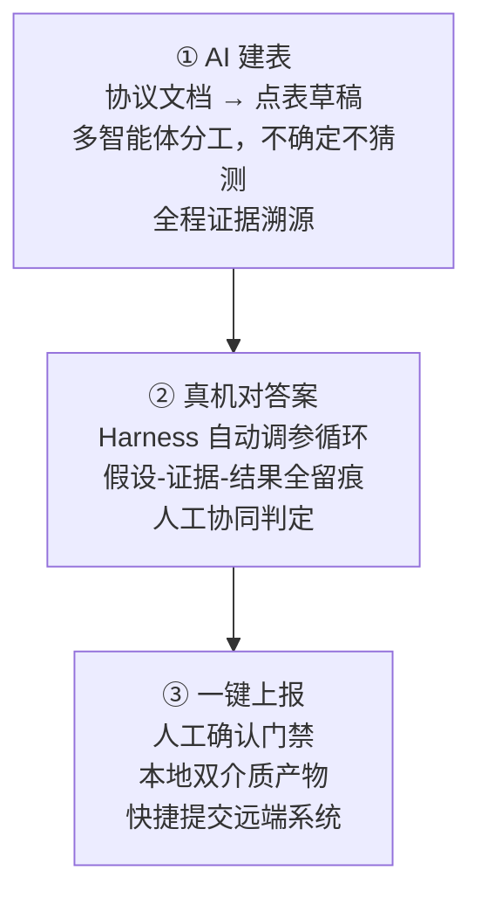
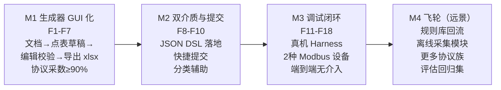

# P1 · 产品愿景与价值主张

> 本文是「点表智能工作台」产品线设计文档系列的**第一篇**，定位为产品的战略定位与核心价值声明，是后续 P2~P5 所有设计决策的思想源头和立场依据。本文内容以 BRD §1~§4 为权威基础，结合原型已确认的设计方向综合撰写。

---

## §1 行业背景与现场痛点

### §1.1 业务场景

公司主营 DCIM（数据中心基础设施管理）平台，为甲方数据中心监控管理系统提供端到端交付服务。每个项目的核心交付动作之一，是将甲方采购的第三方物联网设备（UPS、列头柜、精密空调、电表、传感器、柴油发电机等）接入监控平台，使平台能够实时采集设备数据、下发控制指令。

接入的核心载体是**设备驱动点表**——一种以多 Sheet 二维表呈现的驱动描述语言（DSL）：

| Sheet | 作用 | 关键字段示例 |
|---|---|---|
| 设备信息表 | 设备元数据与分类 | 七级分类路径、厂家、型号、协议类型 |
| 测点表\_读 | 可读测点清单 | 功能码、寄存器号、bit位、解析函数、变比、单位、状态映射 |
| 测点表\_写 | 可写测点清单 | 同上 + 设置建议、数值边界 |
| 命令表 | 读命令分段定义 | CMD / START\_ADDR / END\_ADDR |

平台侧采集模块解释执行该 DSL，完成真实发包、解包与数据上报。点表准确性直接决定监控数据的可靠性，是整个系统的质量基石。

### §1.2 现状痛点清单

| # | 痛点 | 根本原因 | 后果 |
|---|---|---|---|
| P1 | **点表编制纯人工**：工程师逐页阅读厂家协议文档（PDF/Word/扫描件），手工填写数百至上千行 Excel | 没有自动化工具，完全依赖人工理解与转录 | 单设备点表编制以人天计；项目集中交付期形成严重瓶颈 |
| P2 | **协议参数极易出错**：地址换算（40001 规则/十六进制/前导零）、解析函数（字节序/有无符号）、变比、bit 位、状态映射方向等细节点多 | 规则隐性化，高度依赖个人经验，无系统校验 | 错误隐蔽（数值"看起来像对的"），只有在设备现场才能发现，返工成本极高 |
| P3 | **现场调试靠人工试错**：改 Excel → 重新导入 → 重启采集 → 肉眼看值，每次迭代耗时十几分钟甚至数小时 | 调试链路不可视，无自动化诊断能力，全靠资深工程师经验 | 单设备调试以天计；驻场成本高；夜间维护窗口期浪费 |
| P4 | **知识沉淀在少数人身上**：不同型号设备的坑靠资深工程师口传，新人无法独立完成 | 没有结构化的知识沉淀与规则库 | 新人不可用、人员流动风险大、各项目重复踩坑 |
| P5 | **已有 AI 能力无法落地**：已验证的多智能体点表生成流水线（Codex Skill）需要 AI 编程能力才能使用 | 工具门槛高，一线工程师无法直接操作 | AI 红利被困在研发层，交付工程师无法受益 |
| P6 | **调试依赖平台环境**：现场工程师无法自主完成「生成 → 验证 → 入库」全流程，必须依赖后台支持 | 缺少独立的本地工具链 | 响应链条长，现场工程师等待时间长，资深工程师频繁被打断 |

### §1.3 时间压力与现场约束

现场工程师面临严苛的时间约束：甲方通常给出严格的竣工验收日期，而设备接入是倒数第二项工序——前置工序（装修、布线、硬件安装）的延期直接压缩了软件调试的时间窗口。单个项目往往需要同时接入数十至上百台不同型号的设备，每台设备的点表编制与调试都成为独立的时间成本节点。

---

## §2 产品定位与愿景

### §2.1 一句话定位

> 让一线交付/集成工程师在笔记本上，把「厂家协议文档」变成「调试通过、可入库」的设备驱动点表——文档阶段 AI 生成草稿，真机阶段 AI 闭环调参，全程人工最终确认权。

### §2.2 产品形态

**点表智能工作台**是一个 Wails 桌面客户端（本地 Go Bridge + Web 前端），编译为单一可执行文件（`.exe`）分发给现场工程师，连接公司统一后端服务器工作。桌面端不内置 Gin/HTTP 服务，前端只通过 Wails Binding 调用本地 Bridge。产品覆盖点表生命周期的三个阶段：

**关键架构选择**：

- **桌面客户端（C/S 部署）**：访问本地硬件（串口枚举/COM口读写）、承担设备↔平台采集实例的隧道代理角色，这是纯 Web 方案无法实现的能力
- **云端 Agent + 本地产物**：AI 建表与真机调试在公司云端（服务器）完成，本机零配置、无需安装大模型，现场工程师开箱即用；点表产物（JSON DSL 权威格式/xlsx 副本）、会话与日志均落在工程师本机的工程目录
- **离线优先**：文档编辑、点表校验、JSON/xlsx 导出在断网时完全可用；远端功能（AI 建表、调试实例、快捷提交）断网时置灰标注原因，绝不弹错阻塞

---

## §3 目标用户与使用动机

### §3.1 主用户：现场交付/集成工程师（"小李"）

| 维度 | 描述 |
|---|---|
| 画像 | 项目组成员，懂设备接线与基本协议常识，不精通编解包细节；日常工具是 Excel，不用命令行 |
| 核心目标 | 在项目现场，尽快完成设备点表编制与调试，通过甲方验收 |
| 主要痛点 | 协议文档厚、手工填表慢且易错；调试时不知道哪个参数错了；依赖资深同事支援 |
| 成功定义 | 能独立完成从"拿到协议文档"到"点表提交入库"的全流程，且在规定工期内完成 |
| 使用动机 | 减少手工录入；得到 AI 辅助诊断；减少对资深工程师的依赖；降低犯错风险 |

### §3.2 次要用户：资深驱动/点表复核员（"老王"）

| 维度 | 描述 |
|---|---|
| 画像 | Go 开发组/集成开发组资深成员，点表规范权威，精通各协议族的编解包细节 |
| 核心目标 | 高效复核 AI 生成的点表，确保进入平台的点表质量过关 |
| 主要痛点 | 复核时缺少证据依据，不知道 AI 为什么这样填；复核工作量随项目规模线性增长 |
| 成功定义 | 复核时间大幅缩短；每个字段的 AI 填写依据清晰可查；可以快速定位高风险字段 |
| 使用动机 | 字段证据溯源（一键跳转协议原文）；两类质量域分类（快速聚焦协议采数问题）；确认门禁（人工最终背书） |

### §3.3 观察用户：项目经理（"陈经理"）

| 维度 | 描述 |
|---|---|
| 画像 | 项目支持部，不参与技术实施，关注整体进度 |
| 核心目标 | 掌握项目内所有设备接入进度，及时汇报风险 |
| 使用动机 | P2 工程总览看板（状态分布、任务进度）；调试报告（点位通过率、残留问题） |

---

## §4 核心价值主张

### §4.1 三大核心价值

**① AI 建表**：将「协议文档 → 点表草稿」的过程从"人工通读填写"转变为"AI 生成 + 人工拍板"。多智能体分工（发现+专家分工）、不确定不猜测（风险字段强制澄清）、全程证据溯源（每个字段可追溯到协议文档页码）。

**② 真机对答案**：将「现场调试」从"人工试错"转变为"AI 假设驱动的自动迭代"。智能体根据采集值的业务合理性（值域、量纲、跨点一致性）自动提出修正假设，更新点表，热下发重测，每轮留痕。人工随时介入、暂停、回滚。

**③ 一键上报**：确认与提交分离，人工确认门禁（可疑=0、失败=0、未采=0、澄清=0）保障质量，确认后本地产出双介质（JSON DSL + xlsx），可选快捷提交或离线交付。

### §4.2 差异化亮点

| 亮点 | 描述 | 对比传统方式 |
|---|---|---|
| **云端 Agent，本机零配置** | AI 建表与调试在公司云端完成，工程师笔记本无需安装大模型，开箱即用 | 传统：AI 工具需要本地配置，门槛高，一线工程师用不了 |
| **全程假设-证据-结果留痕** | 所有 AI 填写/修改的字段都有可追溯的三元组记录，人可以查、可以否决 | 传统：人工填写无记录，复核时无法还原填写依据 |
| **人工最终确认权** | 确认与提交是两个独立的显式动作，未确认不可提交，编辑使确认失效 | 传统：点表入库过程缺乏规范化门禁，AI 产物可能未经审核直接入系统 |
| **离线可用** | 点表编辑、校验、JSON/xlsx 导出全程离线可用，不依赖网络 | 传统：完全离线操作，但缺少 AI 辅助；新型工具：往往需要持续在线 |
| **两类质量域区分** | 「协议采数」问题（影响采集正确性）与「测点描述」问题（业务语义）全局区分颜色图标，优先级清晰 | 传统：所有校验问题混在一起，工程师不知道哪些是高优先级 |
| **harness 自动调参** | 真机调试阶段智能体自动提出假设并迭代，不需要工程师手动逐个试参数 | 传统：完全手动试错，依赖资深工程师经验 |

---

## §5 成功度量

### §5.1 北极星指标

> **端到端交付耗时**：从「工程师拿到协议文档」到「产出人工确认无误、可提交的点表」的耗时，以小时为单位。

目标：**≤ 3 小时**（含 AI 生成、人工澄清、校验复核；如有真机调试则含调试，目标 ≤ 5 小时）

基线（待实测）：目前手工方式下，无设备编制约 0.5~2 人天，有设备调试再加 0.5~2 人天。

### §5.2 关键量化指标

| 指标 | 定义 | 目标 | 测量方法 |
|---|---|---|---|
| 协议采数字段准确率 | 生成点表中功能码、寄存器号、bit位、解析函数、变比、转换函数、命令分段字段与标准点表一致的比例 | ≥ 95%（进调试前） | 模板对比报告（accuracy_simple）|
| 测点描述字段准确率 | 名称、单位、数据类型、状态映射等描述字段与标准点表一致的比例 | ≥ 85% | 模板对比报告 |
| 单设备无设备编制耗时 | 从导入协议文档到产出「草稿已校验」状态点表的耗时 | ≤ 1 小时（含人工澄清与复核）| 任务创建到状态变更的时间戳差值 |
| 单设备真机调试耗时 | 从开始 Harness 到所有点位判定为「通过/有明确结论」的耗时 | ≤ 2 小时，无驱动开发介入 | 调试会话开始到结束的时间戳差值 |
| 提交一次通过率 | 快捷提交后平台复核「一次通过」（无需打回返工）的比例 | ≥ 80%（M2 目标）、≥ 90%（M3 目标）| 平台侧复核回执追踪 |
| 点位可用率 | 调试通过后点位达到「通过」状态的比例（其余需有明确结论：协议不支持/设备不支持/留待人工） | 100%（必须有明确结论）| 调试报告中点位状态统计 |
| 独立完成率 | 能够独立完成全流程（无需资深工程师介入）的任务比例 | ≥ 70%（M3 目标）| 任务历史中是否触发人工协同判定 |
| 新人上手时间 | 新入职工程师通过工具完成第一个独立点表任务的培训时长 | ≤ 0.5 天 | 用户调研 |

### §5.3 质量红线（不可逾越）

1. **远端系统永远不出现未经人审的 AI 产物**：快捷提交强制经过人工确认门禁（确认人、时间、内容哈希）。
2. **写点调试绝不自动执行**：智能体永不自动发起写操作，写点须进入授权模式且逐点人工确认。
3. **高风险字段必须有证据溯源**：协议采数字段（功能码/寄存器号/bit位/解析函数/变比）100% 带证据链接，无证据则进澄清队列。

---

## §6 产品战略位置

### §6.1 与现有平台的关系

产品对平台侧是**单向提交的工具客户端**，不做双向状态同步与在线协作：

- **输入**：平台账号认证、远端采集实例编排（调试阶段）、点表提交接口
- **输出**：人工确认后的点表（JSON DSL/xlsx）及可选附件（协议文档、调试报告）
- **不替代**：平台的复核流程、权限体系、驱动建档、在线预览等能力

### §6.2 三期演进路径

M1/M2 构成 MVP，先实现无设备阶段的生成与提交价值，迅速降低点表编制成本；M3 在 M1/M2 基础上叠加真机调试闭环，实现全流程覆盖；M4 为长期飞轮，实现知识自增长。
