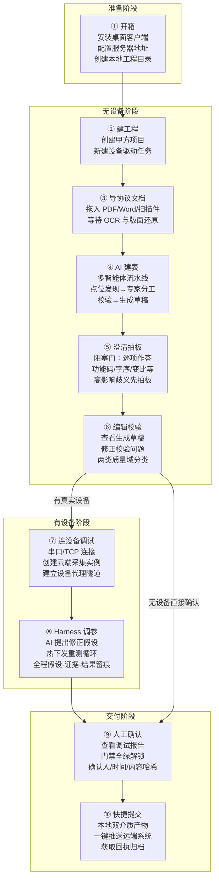
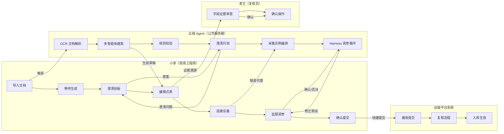

# P2 · 用户与使用场景

> 本文是「点表智能工作台」产品线设计文档系列的**第二篇**，定位为用户研究与使用场景描述，为 P3 功能规格提供需求上下文。本文以用户故事文档为主要依据，结合 BRD §4 和原型说明综合撰写。

---

## §1 角色画像

### §1.1 现场交付/集成工程师（主角）：小李

```
角色代称：小李
所属团队：集成开发组 / 项目交付组
典型任务：在现场将第三方设备接入 DCIM 平台
```

| 维度 | 详细描述 |
|---|---|
| **技术背景** | 懂设备接线与基本协议常识（Modbus 地址格式、功能码含义）；熟练使用 Excel；不精通编解包细节（字节序、有无符号、复合数据类型）；不使用命令行工具 |
| **核心目标** | 在项目现场的有限时间窗口内，将分配给自己的设备完成点表编制、调试、入库，通过甲方验收 |
| **主要痛点** | ① 协议文档厚（30~100页），手工通读提取数据费时费力；② 参数细节多，地址换算/字节序/变比极易出错；③ 调试时找不到问题根因，反复改导反复测；④ 遇到疑难问题只能等待资深同事远程支援 |
| **工作节奏** | 项目现场碎片化工作：甲方临时安排、设备现场条件变化频繁；调试窗口往往在非正常时间（夜间维护窗口、周末）|
| **对 AI 的态度** | 开放但存疑——希望 AI 帮忙干活，但不完全信任 AI 的输出，需要看到 AI 为什么这样填 |
| **成功定义** | 能独立完成全流程，不需要等待资深同事；在规定工期内交付；甲方验收通过 |

**小李的典型一天（现场调试日）：**
- 08:30 到达甲方机房，发现设备比预期多 3 台，工期压缩
- 09:00 拿到某台列头柜的协议文档（扫描件 PDF），开始处理
- 传统方式：通读 80 页文档 → 手工填表 → 导入平台 → 重启采集 → 看值不对 → 改参数 → 再等
- 使用工具：导入文档 → 等 AI 生成 → 拍板澄清项 → 查看点表 → 连设备调试 → 看 AI 调参建议 → 确认提交

### §1.2 资深驱动/点表复核员：老王

```
角色代称：老王
所属团队：Go 开发组 / 集成开发组（资深成员）
典型任务：点表规范维护、复核 AI 生成点表、处理疑难协议
```

| 维度 | 详细描述 |
|---|---|
| **技术背景** | 精通各主流协议族（Modbus RTU/TCP、DL/T645、BACnet 等）的编解包细节；是公司点表规范的实际制定者；能看懂 Go 代码和采集模块日志 |
| **核心目标** | 确保进入平台的点表质量过关；减少因点表错误导致的现场返工；逐步培养小李等一线工程师的自主能力 |
| **主要痛点** | ① 复核时不知道 AI 为什么这样填，无法快速判断对错；② 复核工作量随项目规模线性增长，本身也是瓶颈；③ 同样的坑反复出现，知识无法系统性沉淀 |
| **对 AI 的态度** | 理性审慎——明确知道 AI 会犯什么错（幻觉字段、错误类比），重点关注高风险字段（功能码、字节序、变比）的证据质量 |
| **成功定义** | 复核时间从"几小时"缩短到"几十分钟"；每个字段都有可查证据；AI 准确率随时间提升，复核工作量趋势下降 |

### §1.3 项目经理：陈经理

```
角色代称：陈经理
所属团队：项目支持部
典型任务：跟踪项目进度、汇报风险、协调资源
```

| 维度 | 详细描述 |
|---|---|
| **技术背景** | 不涉及具体技术实施，不看协议文档和点表细节 |
| **核心目标** | 掌握项目整体进度，能及时识别和汇报风险节点 |
| **使用场景** | P2 工程总览：查看各协议点表任务状态分布、未解决问题计数；调试报告：汇报给甲方的量化进度数据 |
| **成功定义** | 能从工具中直接获取进度数据，无需频繁打扰小李口头汇报 |

### §1.4 其他干系人（不直接使用产品）

| 角色 | 与产品的关系 |
|---|---|
| 智能体/规则维护者（阿哲） | 维护提示词、规则库与评估集；关注生成准确率趋势；通过规则包版本管理间接影响产品行为 |
| 平台管理员（运维张） | 管理采集实例配额与隧道网关；为产品提供 D3/D4/D5 接口 |
| 技术管理委员会 | 立项、接口规范裁决、LLM 成本预算审批 |

---

## §2 端到端用户旅程地图

### §2.1 主线旅程（小李视角）



### §2.2 泳道视图（多角色协同）



---

## §3 典型场景剧本

### §3.1 场景一：冷启动首次使用（新项目、新设备）

**背景**：小李领取了一个新项目——某银行数据中心二期，需要接入一台从未做过的艾默生 060KVA-2 列头柜。他刚安装好客户端，从来没用过这个工具。

**旅程叙述**：

1. 打开客户端，看到欢迎落地页。阅读「现场四步就收工」指引卡，明白这个工具能干什么，也理解了为什么调试时要连公司云端（与正式上线同款采集程序，跑通即上线无忧）。
2. 点击「新建工程」，选择本机工程目录（`D:\Projects\bank-dc-phase2`），填写工程名和甲方名称，跳过平台连接先开始工作。
3. 进入 P2 工程总览，点击「导入文档建点表」，把甲方给的协议 PDF 拖入；系统在当前工程下创建一个新的协议点表任务。
4. 看到 AI 生成动画：文档解析 → 自动生成 → 点位提取 → 字段补全 → 规则校验，约 3 分钟后生成摘要（29 读测点、6 写测点、4 可疑、1 待澄清）。
5. **澄清门弹出（阻塞）**：AI 问了两个关键问题：「功能码是 03 还是 04？」（附协议原文 P24 证据，AI 推荐 03，理由：协议示例帧头使用 0x03）；「电流单位是 W 还是 kW？」（附原文 P19 两处不一致的说明）。小李查看证据，拍板：03、W。
6. 进入工作台，看到已填充的点表。AI 标注了几个可疑点：A 相电流值 539A（疑似变比错误），总有功功率天文数字（疑似字节序错误）。小李点击 AI 建议卡查看修正建议和证据，决定「应用并重测」。
7. 连接上设备（串口 COM3，9600，8N1）后进入调试模式，Harness 自动调参，两轮迭代后全部测点转为通过或有明确结论。
8. 门禁全绿，小李确认，一键提交，获得回执。

**用户故事覆盖**：US-A2、US-B1、US-B2、US-C1、US-C2、US-D1、US-D2、US-E1、US-E2、US-F1、US-F2、US-F3、US-F5

### §3.2 场景二：返回用户继续工作（中断后续调）

**背景**：小李昨天下午开始调试一台施耐德 PM5350 电表（modbusTCP），调了一半被甲方临时叫走，会话断开。今天早上继续。

**旅程叙述**：

1. 打开客户端，看到最近工程卡片。「××银行数据中心二期」卡片上状态分布迷你条显示：1 台调试中（PM5350）。点击进入工程。
2. P2 工程总览显示 PM5350 协议点表任务状态「调试中」，点位数 118 读、4 写，最后更新「今天 11:40」。双击进入该任务工作台。
3. 由于昨天有 2 项未决澄清（被跳过的单位问题），进门先弹澄清门。小李这次把遗留问题处理完（逐条选答案），点「进入工作台」。
4. 工作台顶部显示：AI 进度 4/5（规则校验完成、调试验证进行中），筛选 chips 显示：通过 80、可疑 28、失败 10、未采 0。
5. 小李在右栏选择「TCP 客户端」模式，填入设备 IP:端口，点「连通自检」，链路三灯全绿（本地设备/采集实例/隧道均已恢复连接）。
6. 右栏「实时调试」Tab 显示昨天遗留的可疑和失败点，Harness 继续从断点运行。
7. 约 40 分钟后，剩余问题全部处理，小李确认提交。

**用户故事覆盖**：US-A2、US-F3、US-F4、US-F5、US-F8

### §3.3 场景三：离线查看已有点表（断网现场）

**背景**：小李在甲方内网隔离的机房现场，完全无法访问公司服务器。但他需要查看已经生成并确认的几台设备点表，以回答甲方技术人员的问题。

**旅程叙述**：

1. 打开客户端，顶部「平台连接 chip」显示灰点「离线（未连接平台）」，悬浮提示：AI 建表、真机调试、快捷提交不可用；本地编辑、校验、导出可用。
2. 进入工程总览，所有已完成任务（已确认/已提交）正常显示。
3. 小李找到美的 MDV 多联机空调（已提交），双击进入工作台。点表编辑器正常显示，所有测点和字段均可查看。两类质量域校验计数显示 0 错误。
4. 甲方技术人员询问「冷凝水泵运行状态」测点的寄存器号，小李在工作台搜索找到，查看字段证据（标注来自协议 P33），给出准确答复。
5. 甲方要求打印一份点表，小李点击「导出 xlsx」，成功导出（离线可用）。
6. 导出文件通过 U 盘交给甲方。

**关键特性验证**：所有已完成点表的查看、搜索、证据溯源、导出均在离线状态下正常工作，无任何功能阻断。

**用户故事覆盖**：US-A2（离线优先）、US-D1、US-D4、US-D6

### §3.4 场景四：增量协议变更（已有点表基础上的变更说明）

**背景**：小李上周已完成艾默生 060KVA-2 的点表并提交。甲方本周通知：现场实际到货的是 060KVA-3 型号，厂家提供了一份变更说明（6页 PDF）。小李需要在已有点表基础上处理变更。

**旅程叙述**：

1. 打开 060KVA-2 的工作台，当前任务状态「已提交」。
2. 左栏「协议文档」区块，点击「+ 上传文档」，上传「060KVA-3型号变更说明V1.0.pdf」，角色选「变更说明」。
3. 上传后系统自动触发 AI 增量影响分析（不重跑全表，仅分析变更文档对现有点表的影响）。约 1 分钟后，顶部出现紫色「变更影响 4」chip，变更影响清单展开。
4. **4条变更项**：
   - 新增进线温度 C 点 → 小李点「查看证据」（跳变更说明 P3），确认后「接受」→ 点表插入新行（紫色「变更」角标，状态=未采）
   - 新增进线温度 D 点 → 同上「接受」
   - 3 个电流测点变比从 0.01 改为 0.001 → 「查看证据」（P4 说明型号差异）→ 「接受」→ 3 个点判定重置为「未采」
   - 防雷器状态 B 点不适用于 060KVA-3 → 「接受不适用」→ 点位划线置灰，不计入统计
5. 顶部「确认提交」按钮重新锁定（未采 5 > 0），提示「5 个点位需重新调试」。
6. 连接设备，重新调试受影响的 5 个点位，调试通过后门禁重新解锁，确认提交新版本。

**关键特性验证**：增量变更不覆盖已有人工成果；每条变更需人工逐条接受/拒绝；接受产生的未采点自动锁住门禁。

**用户故事覆盖**：US-B4、US-B5、US-D1、US-E1

---

## §4 用户故事映射

| 旅程节点 | 对应用户故事 | 里程碑 |
|---|---|---|
| 开箱配置 | US-A1（平台账号登录）、US-H2（客户端自动更新） | M1 |
| 建工程 | US-A2（创建本地工程） | M1 |
| 导协议 | US-B1（导入协议文档）、US-B2（OCR 与版面还原）、US-B3（解析失败兜底）、US-B4（多文档与角色管理） | M1 |
| AI 建表 | US-C1（一键生成点表草稿）、US-C5（规则库版本管理） | M1 |
| 澄清拍板 | US-C2（不确定项澄清队列）、US-C3（字段证据溯源） | M1 |
| 编辑校验 | US-D1（多 Sheet 查看与编辑）、US-D2（实时校验与问题清单）、US-D3（批量操作）、US-C4（七级分类辅助） | M1/M2 |
| 双介质互转 | US-D4（xlsx 导入导出）、US-D5（模板对比）、US-D6（JSON DSL 权威格式） | M1/M2 |
| 连设备调试 | US-F1（连接本地设备）、US-F2（远端采集实例）、US-F3（设备代理隧道） | M3 |
| Harness 调参 | US-F4（实时值监视）、US-F5（智能体自动调参循环）、US-F6（人工协同判定）、US-F7（写点调试安全） | M3 |
| 会话管理 | US-F8（调试会话与断点续调） | M3 |
| 人工确认 | US-E1（人工确认门禁） | M2 |
| 快捷提交 | US-E2（快捷提交远端系统） | M2 |
| 增量变更 | US-B5（增量变更影响分析） | M1+ |
| 报告归档 | US-G1（调试完成报告） | M3 |

---

## §5 现场约束与设计影响

| 约束类型 | 具体约束 | 对产品设计的要求 |
|---|---|---|
| **网络约束** | 甲方内网通常有防火墙，公网访问受限；部分机房完全隔离；现场 4G 信号不稳定 | 离线优先：本地编辑/校验/导出不依赖网络；调试隧道走 443/WebSocket 提高穿透性；离线功能置灰标注原因，不弹错阻塞 |
| **硬件约束** | 工程师笔记本：Windows 10/11，串口适配器（USB-to-RS485）；设备可能是串口（COM口）或 TCP | 桌面客户端：串口枚举、本地端口读写；TCP 直连；隧道代理代替本地网段限制 |
| **时间约束** | 调试窗口碎片化（2~4小时）；夜间维护窗口；甲方随时可能打断 | 会话保存与断点续调；Harness 支持暂停/恢复；快速可见的状态摘要 |
| **操作人员约束** | 一线工程师不精通编解包细节；对命令行工具陌生；对 AI 可能存在信任顾虑 | GUI 操作为主，无命令行；AI 建议卡显示理由和证据（不是黑盒）；人工最终确认权（增加信任感）|
| **设备多样性约束** | 同一项目可能有十几到上百台不同品牌型号的设备；协议文档质量参差（扫描件/低分辨率） | 工程维度：多任务并行；OCR 失败兜底；文档角色管理 |
| **甲方信息安全约束** | 协议文档可能含甲方敏感信息；LLM 调用不能出境 | 本地工程加密存储；LLM 调用走公司内网网关；不向第三方发送原始文档 |
| **显示与设备约束** | 桌面客户端固定最小宽度（1280px）；工程师使用笔记本外接显示器或单屏 | 三栏高密度布局；行高约 26px；VTable 万级行虚拟滚动；最小宽度 1280px |
