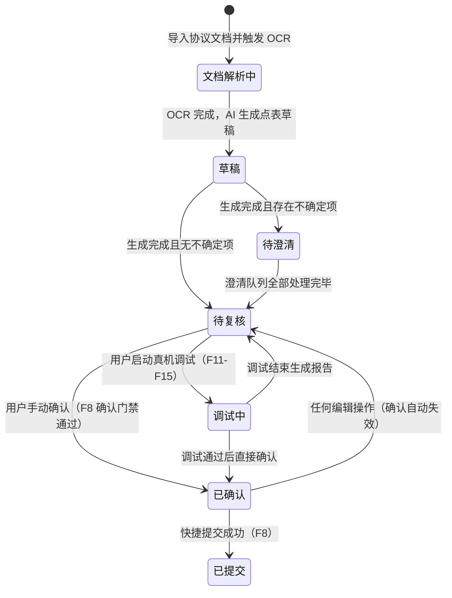

# P3 · 产品需求规格 PRD

> 本文是「点表智能工作台」产品线设计文档系列的**第三篇**，是最核心、最详细的功能规格文档，是研发实现的直接依据。本文以 BRD §7 功能清单为骨架，结合原型确认的交互逻辑、mock-data 字段结构，以及用户故事验收标准综合撰写。

---

## §1 功能规格总表（F1~F18）

### §1.1 功能概览

| 编号 | 功能名称 | 优先级 | 里程碑 | 描述摘要 |
|---|---|---|---|---|
| F1 | 工程与任务管理 | P0 | M1 | 本地工程目录（工程→协议点表任务/设备驱动任务）；任务生命周期 |
| F2 | 协议文档导入与解析 | P0 | M1 | PDF/DOC/图片导入；OCR/版面还原；页码证据保留 |
| F3 | 多智能体点表生成 | P0 | M1 | 产品化 skill 流水线；进度可视化 |
| F4 | 不确定项澄清队列 | P0 | M1 | 阻塞门；风险字段逐项呈现；协议原文证据 |
| F5 | 点表编辑器 | P0 | M1 | 多 Sheet 表格（VTable）；万级点位流畅编辑 |
| F6 | 实时校验与问题清单 | P0 | M1 | schema/rules 校验；两类质量域分类 |
| F7 | 本地双介质产物 | P0 | M1/M2 | JSON DSL ⇄ xlsx 无损互转；模板对比准确率报告 |
| F8 | 快捷提交 | P1 | M2 | 人工确认后一键推送远端系统；幂等重试 |
| F9 | 七级分类辅助 | P1 | M2 | 根据文件名/协议推荐分类码；校验合法性 |
| F10 | 工程用量展示 | P1 | M2 | 工程总览展示工程级用量；不暴露 LLM 配置、模型和 token 明细 |
| F11 | 本地设备连接 | P0 | M3 | 串口枚举/TCP 直连；连通自检 |
| F12 | 远端采集实例生命周期 | P0 | M3 | 创建/下发 DSL/热更新/销毁；状态监控 |
| F13 | 设备代理隧道 | P0 | M3 | 串口/TCP over WebSocket(TLS)；链路状态可视 |
| F14 | 实时值监视 | P0 | M3 | 逐点位展示原始报文/解析值/判定状态 |
| F15 | Harness 自动调参循环 | P0 | M3 | 假设→修改→重测；每轮留痕；熔断与轮次上限 |
| F16 | 人工协同判定 | P1 | M3 | 智能体发起现场问询；工程师输入实测值 |
| F17 | 写点调试安全机制 | P0 | M3 | 默认只读；逐点确认；边界强校验；操作留痕 |
| F18 | 调试会话与报告 | P1 | M3 | 会话保存/断点续调；调试报告本地归档 |

---

### §1.2 F1 · 工程与任务管理

**功能描述**：本地工程按「甲方项目/工程 → 协议点表任务（设备驱动任务）」两层结构组织。工程是聚合容器；每次在工程中导入一个协议，都会创建一个可独立生成、编辑、调试、验收和提交的协议点表任务。

| 要素 | 说明 |
|---|---|
| **输入/触发** | 用户点击「新建工程」向导；用户打开已有工程目录/工程文件 |
| **处理逻辑** | 工程目录由用户选择，程序在目录下创建工程元数据文件（`ptw-project.json`）；协议点表任务对应 `tasks/{task_id}` 子目录；本地配置由 Go 侧 `GetConfig/SaveConfig` 读写（原型用 localStorage 模拟）|
| **输出/结果** | 工程列表更新；P2 工程总览可见新工程；任务列表包含任务元数据（名称/状态/更新时间/点位计数/校验错误数）|
| **任务状态** | 文档解析中 → 草稿 → 待澄清 → 待复核 → 调试中（可选）→ 已确认 → 已提交，见 §2 状态机 |
| **验收标准** | ① 工程目录可在另一台电脑打开（工程文件包含相对路径引用）；② 任务列表显示七个状态的计数统计；③ 双击任务进入对应工作台；④ 删除任务有二次确认并说明本地文件去向 |
| **优先级** | P0 |
| **里程碑** | M1 |

**对象关系不变量**：

- 一个工程可以导入多个协议，工程总览只负责聚合这些协议点表任务的状态和统计。
- 一个协议点表任务是一次生成、一次或多次调试、编辑、验收、提交的最小业务边界。
- 首次导入协议会自动触发该任务的生成 run；后续补充/变更协议在同一任务内触发增量分析或重新生成。
- 不同协议点表任务之间的 DSL、run、debug session、确认记录和提交状态相互独立。

---

### §1.3 F2 · 协议文档导入与解析

**功能描述**：在工程中导入厂家协议文档（各类格式），创建新的协议点表任务或追加到已有任务，通过 OCR 与版面还原提取结构化内容，保留页码证据供后续智能体使用。

| 要素 | 说明 |
|---|---|
| **输入/触发** | 在 P2 工程总览点击「导入文档建点表」/拖拽协议文件；或在某个任务工作台点击「+ 上传文档」追加补充协议；支持格式：PDF/DOC/DOCX/XLS/XLSX/TXT/PNG/JPG |
| **处理逻辑** | ① 新协议导入时先创建 `task_id` 并进入解析中状态；② 普通文本文件直接提取；③ 扫描件/图片调用 MinerU（VLM）服务 OCR + 版面还原；④ 每个还原片段保留页码 + 表格位置元数据；⑤ 失败页面记录清单，不静默跳过 |
| **输出/结果** | 新任务出现在工程总览任务列表；文档列表更新（解析状态点：绿=已解析/黄闪=解析中/红=失败）；还原结果可与原文对照预览；页码证据供智能体使用；首次解析完成后自动触发该任务的生成 run |
| **文档角色** | 主文档 / 补充 / 变更说明 / 抓包记录；追加文档不替换已有文档；冲突优先级：变更说明 > 主文档 |
| **失败兜底** | 失败页支持框选区域重试；仍失败可标记「人工补录」并在点表中留占位提醒 |
| **验收标准** | ① 扫描版 PDF 还原结果可与原文对照预览；② 每个还原片段有页码/位置元数据；③ 失败页给出清单而非静默跳过；④ 文件名中含七级分类码（如 `2_4_4_7_1_6_2`）自动识别为候选分类 |
| **优先级** | P0（OCR/MinerU 为 P0），P1（框选重试） |
| **里程碑** | M1 |

---

### §1.4 F3 · 多智能体点表生成

**功能描述**：将某个协议点表任务的文档解析结果输入多智能体流水线，产品化 point-table-generator skill 方法论，生成该任务的点表草稿。

| 要素 | 说明 |
|---|---|
| **输入/触发** | 首次导入协议并解析完成后自动触发首次生成；工程师后续可在该任务工作台内手动重新生成或基于补充文档触发增量生成 |
| **处理逻辑** | 流水线阶段：① 点位发现（识别所有候选测点）→ ② 候选复核与分片（去重/分组）→ ③ 专家字段补全（并行子智能体：地址与访问/解析与变比/单位与数据类型/状态映射/命名/写元数据）→ ④ 合并与冲突裁决 → ⑤ 命令表生成 → ⑥ 规则校验；遵循「不确定不猜测」原则，风险字段无法推出时进入澄清队列 |
| **进度可视化** | 顶部 AI 进度分段条（5 阶段着色：完成/进行中/待处理/待开始）；点击展开弹层查看各阶段说明；中途可取消；失败可从断点重跑 |
| **输出/结果** | 点表草稿（JSON DSL）写入本地 `tasks/{task_id}/point_table.json`；不确定项进入澄清队列；任务状态 → 待澄清（有不确定项）或 待复核（无不确定项）|
| **完成摘要** | 候选点总数、读点/写点数、跳过点数、不确定项数、生成耗时；若有对比模板则显示预估准确率 |
| **验收标准** | ① 流水线阶段可视，各阶段产出可展开查看；② 失败节点支持单节点重试；③ 生成记录固化所用规则包版本；④ 同一工程下多个协议任务可并存，互不覆盖 DSL/run/debug 状态 |
| **优先级** | P0 |
| **里程碑** | M1 |

---

### §1.5 F4 · 不确定项澄清队列

**功能描述**：AI 无法从协议 + 规则中推出的风险字段，以阻塞门形式呈现，强制人工逐项拍板后方可进入工作台。

| 要素 | 说明 |
|---|---|
| **输入/触发** | 点表生成完成且存在不确定项；或重新打开已有任务且澄清队列未清空 |
| **处理逻辑** | 阻塞遮罩门：三栏置灰、不可操作；逐条卡片：问题描述 + 候选答案（AI 推荐项蓝色高亮 + 理由）+ 协议原文证据（可点击跳转对照预览）+ 影响点位列表；支持「全部采纳推荐」一键通过；支持「跳过」（需填写理由，留痕）；跳过项在编辑器和门禁清单持续可见 |
| **ask-first 原则** | 关键/高影响歧义（功能码、字序、寄存器基址、点位边界）在生成前由人先拍板；低影响项（单点单位）用 AI 推荐默认值在同门一并拍板；目的：一次生成准确率更高，避免错误猜测级联成大量可疑/失败点的返工 |
| **输出/结果** | 所有澄清项处理完毕 → 触发「应用全部答案并重新合并」→ 任务状态 → 待复核；全部采纳推荐可立即进入工作台 |
| **验收标准** | ① 硬阻塞：`clarifyCount > 0` 时「进入工作台」按钮禁用；② 每个澄清项含问题/候选答案/证据/影响点位数；③ 支持「全部采纳推荐」且全清后直接进入工作台；④ 跳过项在 T4 编辑器与 T6 门禁清单持续可见 |
| **优先级** | P0 |
| **里程碑** | M1 |

> **F4-OPT · 轻量化备选项弹窗（可选优化项，M3+）**
>
> 当前 F4 为全屏强阻塞遮罩门，适用于高影响不确定项（功能码、字序等关键字段）。针对低影响备选场景（如同名测点有 2 个候选寄存器地址、单位存在可接受歧义），可补充一种更轻量的非强制交互模式：
>
> | 要素 | 说明 |
> |---|---|
> | **触发时机** | 生成完成后，若存在低影响不确定项（`impact ≤ 2`），在「生成完成」提示弹窗中附加「有 N 项备选待确认」快捷入口 |
> | **交互形式** | Modal 弹窗（非全屏遮罩）；逐卡片展示备选项，每条显示选项 A / B 及 AI 推荐；支持「跳过本条」和「全部采纳推荐」一键通过 |
> | **非强制性** | 用户可关闭弹窗直接进入工作台；已选择的结果立即写入本地 DSL；未处理条目在点表行内以黄色角标持续标注，随时可召回处理 |
> | **与 F4 的区别** | F4 是**强阻塞**（`clarifyCount > 0` 禁用入口）；本优化项是**非强制提示**，不阻断工作台进入，仅在低影响场景（`impact ≤ 2`）触发 |
> | **优先级** | P2 |
> | **里程碑** | M3+（M1/M2 仅交付 F4 强阻塞模式即满足核心需求） |

---

### §1.6 F5 · 点表编辑器

**功能描述**：多 Sheet 高密度表格编辑器，是查看、编辑、校验点表的核心工作区。

| 要素 | 说明 |
|---|---|
| **输入/触发** | 从 P2 工程总览双击某个协议点表任务进入 P3；P3 只展示并操作该任务的点表 |
| **处理逻辑** | 四个 Sheet：读测点 / 写测点 / 命令表 / 设备信息；三态列视图切换（检阅/协议调试/物模型映射）；VTable 虚拟滚动（万级行 60fps）；编辑有撤销/重做；保存即写入本地 JSON DSL |
| **列组定义** | 测点描述列（序号/名称/单位/状态映射）+ 中段可切换列组（协议参数/物模型映射）+ 调试结果列（实时值/判定）；两端固定，中段随视图切换 |
| **字段证据溯源** | 协议采数字段（功能码/寄存器号/bit位/解析函数/变比/转换函数）100% 带证据链接；点击在文档预览中高亮对应区域 |
| **人工修改轨迹** | 人工修改 AI 填写的字段时，证据面板追加一条人工覆盖记录 |
| **确认失效** | 任务处于已确认状态时任何编辑立即触发「确认失效」提示条（红色，含重新确认入口）|
| **验收标准** | ① 1 万行点位滚动/筛选流畅（60fps）；② 列顺序与平台标准表头严格一致；③ 编辑有撤销/重做；④ 保存即写入 JSON DSL；⑤ 协议采数字段 100% 带证据链接 |
| **优先级** | P0 |
| **里程碑** | M1 |

---

### §1.7 F6 · 实时校验与问题清单

**功能描述**：编辑时实时触发规则/schema 校验，问题按两类质量域分类展示。

| 要素 | 说明 |
|---|---|
| **输入/触发** | 单元格编辑后即时触发；保存时全量触发 |
| **校验规则** | 必填字段空值检查；`功能码 + 寄存器号 + bit位` 重复键检查；命令表必须含且仅含 CMD/START\_ADDR/END\_ADDR 三列；标准化ID 必须留空（不允许手填）；序号连续性；写表解析函数前缀（如 HUBInt16）合法性；状态映射数值序格式正确性；字段值类型合规性 |
| **两类质量域** | **协议采数**（红色，影响采集值正确性）：功能码/寄存器号/bit位/解析函数/变比/转换函数/命令分段相关校验；**测点描述**（橙色，影响业务语义）：名称/单位/数据类型/状态映射/设置项相关校验 |
| **输出/结果** | 问题清单按两类分组，各自计数徽章；每条问题=规则名+位置+当前值；点击问题行定位到单元格；底部状态条实时更新两类计数 |
| **验收标准** | ① 校验实时触发；② 问题按两类质量域分色显示；③ 点击问题定位到单元格；④ 两类计数在底部状态条实时更新 |
| **优先级** | P0 |
| **里程碑** | M1 |

---

### §1.8 F7 · 本地双介质产物

**功能描述**：JSON DSL 为权威格式，与 xlsx 无损互转；可选模板对比准确率报告。

| 要素 | 说明 |
|---|---|
| **JSON DSL** | 权威格式：机器友好、可 diff、可纳入 git 版本管理；由 `point_table_workbook.schema.json` 衍生的 schema 校验；字段输出顺序稳定（无修改时两次导出 diff 为空）；调试闭环下发给采集实例的就是该 JSON DSL |
| **xlsx 导出** | 与远端系统导入格式严格兼容；Sheet 结构/列顺序/字段名称完全一致；导出结果可通过平台「导入点表」功能验证 100% 兼容 |
| **互转规则** | JSON → xlsx → JSON 往返字段无损；xlsx 导入时对不规范旧点表给出转换报告 |
| **模板对比报告** | accuracy_simple 表（每 Sheet 覆盖率/精确率/协议字段准确率/描述字段准确率）+ issues_simple 表（逐条问题：类别/字段/位置/生成值/正确值/原因）；归一化等价差异不计为缺陷 |
| **验收标准** | ① JSON ⇄ xlsx 往返字段无损；② 导出 xlsx 经平台导入验证 100% 兼容；③ JSON 字段顺序稳定，无修改时 diff 为空；④ 模板对比报告区分两类字段准确率 |
| **优先级** | P0 |
| **里程碑** | M1（互转），M2（模板对比） |

---

### §1.9 F8 · 快捷提交

**功能描述**：人工确认无误后，一键将点表（JSON DSL/xlsx，可附协议文档与调试报告）单向推送远端系统。

| 要素 | 说明 |
|---|---|
| **输入/触发** | 用户点击顶部「确认提交」按钮（需已通过确认门禁）|
| **前置条件** | ① 任务状态为「已确认」；② 远端服务器已配置且连通；③ 用户已登录 |
| **处理逻辑** | 打包 JSON DSL + xlsx + 可选附件（协议文档/调试报告）→ 调用平台 D2 接口提交；幂等：同内容哈希重复提交被平台识别 |
| **输出/结果** | 获取远端回执号；任务状态 → 已提交；提交历史列表记录（时间/内容哈希/回执号/结果）；失败可重试，本地产物完整性不受影响 |
| **D8 回执弹窗** | 显示远端回执号、提交内容哈希、时间；「复制回执」按钮 |
| **验收标准** | ① 未确认时提交按钮禁用并标注原因；② 提交前通过 F6 校验 + F（确认门禁）；③ 重复提交幂等；④ 失败不影响本地产物完整性；⑤ 返回远端回执记录到任务历史 |
| **优先级** | P1 |
| **里程碑** | M2 |

---

### §1.10 F9 · 七级分类辅助

**功能描述**：根据协议文档内容和文件名推荐设备七级分类码，并校验 `board_type` 合法性。

| 要素 | 说明 |
|---|---|
| **分类来源** | 候选分类来自 `groups_brd.json`（必要时 `groups_dev.json`）；文件名中的分类码格式（如 `2_4_4_7_1_6_2`）自动识别为候选；AI 从协议内容推断候选路径 |
| **选择界面** | D4 七级分类选择器：`groups_brd.json` 树形浏览 + 搜索；候选路径置顶高亮；不允许手输分类 JSON 之外的编码 |
| **回填** | 选定后自动回填设备信息表 `group/board_type/company/model/type` 字段 |
| **验收标准** | ① 候选分类来自 groups_brd.json，不允许出现 JSON 之外的编码；② 分类确定后自动回填设备信息表；③ 文件名中含分类码格式时自动识别为候选 |
| **优先级** | P1 |
| **里程碑** | M2 |

---

### §1.11 F10 · 工程用量展示

**功能描述**：在工程总览中展示当前工程的用量汇总（例如金额或平台定义的工程用量指标）。桌面客户端不提供 LLM 配置入口，不展示模型、密钥、token 明细或会话级成本；LLM 网关、模型、密钥、配额和成本核算均由云端后端统一配置和管理。

| 要素 | 说明 |
|---|---|
| **显示位置** | P2 工程总览的工程信息头/统计卡片，例如 `¥86 工程用量` |
| **显示粒度** | 仅工程级汇总；不提供任务/会话/token 下钻 |
| **配置边界** | 客户端不可修改 LLM 网关、模型、密钥、预算、配额；这些属于云端后端部署配置 |
| **验收标准** | ① 工程总览可看到工程级用量；② 设置页无 LLM 配置入口；③ 客户端任何页面不出现 token 用量、token 成本或模型配置项 |
| **优先级** | P1 |
| **里程碑** | M2 |

---

### §1.12 F11 · 本地设备连接

**功能描述**：枚举串口并配置连接参数；或填写 IP:端口连接 TCP 设备；提供连通自检工具。

| 要素 | 说明 |
|---|---|
| **串口模式** | 端口列表实时刷新（COM 口枚举）；波特率/数据位/校验位/停止位配置；超时参数 |
| **TCP 模式** | IP:端口配置；超时参数 |
| **连通自检** | D5 单帧收发工具（弹窗）：hex 发送输入框 + 响应 hex 显示 + 收发历史；常用 Modbus 帧模板快捷插入 |
| **验收标准** | ① 串口列表实时刷新；② 提供单帧收发手动工具做连通自检；③ 常见线序/参数错误给出排查提示 |
| **优先级** | P0 |
| **里程碑** | M3 |

---

### §1.13 F12 · 远端采集实例生命周期

**功能描述**：通过平台 D3 接口创建/销毁 Docker 采集实例，下发与热更新点表 DSL，监控实例状态。

| 要素 | 说明 |
|---|---|
| **创建流程** | 选定点表版本（默认当前 JSON DSL，显示内容指纹）→ 调用 D3 接口创建实例 → 平台拉起实例并下发 DSL |
| **状态监控** | 实例状态：创建中/运行/异常；实例日志入口；TTL 倒计时 |
| **热更新** | Harness 调参后自动热下发新版 JSON DSL，无需重建实例 |
| **生命周期管理** | 调试结束自动销毁；超 TTL 自动销毁并通知客户端；手动「销毁」按钮 |
| **验收标准** | ① 实例创建/就绪/异常状态可见；② 实例日志可在客户端查看；③ 调试结束或超 TTL 自动销毁；④ 热更新 DSL 无需重建实例 |
| **优先级** | P0 |
| **里程碑** | M3 |

---

### §1.14 F13 · 设备代理隧道

**功能描述**：客户端将本地串口/TCP 设备链路通过云端后端设备代理提供给远端采集实例，支持串口和 TCP 两种透传方式。xboard 的采集请求先进入后端设备代理，再由后端经 WSS 转发给本地 Bridge，设备回包按原路返回 xboard。

| 要素 | 说明 |
|---|---|
| **协议** | 串口/TCP over WebSocket(TLS) + Token 鉴权；通过平台 D5 隧道网关接入 |
| **状态显示** | 调试链路三灯（本地设备/采集实例/代理隧道）；收发字节计数（TX/RX）；实时时延（ms） |
| **异常处理** | 时延超阈值黄色告警；断线自动重连并暂停 Harness；实例泄漏自动回收（TTL） |
| **验收标准** | ① 串口与 TCP 两种透传；② TLS 加密+Token 鉴权；③ 断线自动重连并暂停 Harness；④ 时延超阈值告警；⑤ 隧道走 443/WebSocket 提高穿透性 |
| **优先级** | P0 |
| **里程碑** | M3 |

---

### §1.15 F14 · 实时值监视

**功能描述**：逐点位展示原始报文（hex）、原始寄存器值、解析值、判定状态，支持按状态筛选。

| 要素 | 说明 |
|---|---|
| **监视列** | 序号、测点名、判定状态（通过/可疑/失败/未采）、解析值、单位、原始寄存器值、报文摘要（hex）、最近更新时间 |
| **行展开** | 展开后显示：该点判定依据明细（命中的合理性维度）+ 历史值小走势 |
| **双向定位** | 点中栏点位行 → 右栏切到所属命令并高亮寄存器格；点右栏数据段寄存器格 → 反选中栏对应点位行 |
| **判定四态** | 通过（绿）/ 可疑（琥珀）/ 失败（红）/ 未采（灰）；与顶部概要 chips、筛选 chips 共用色码 |
| **验收标准** | ① 表格随采集周期刷新；② 可按判定状态筛选；③ 点击点位行展开完整报文历史；④ 双向定位（点位↔字节）正常工作 |
| **优先级** | P0 |
| **里程碑** | M3 |

---

### §1.16 F15 · Harness 自动调参循环

**功能描述**：智能体对「可疑/失败」点位自动提出修正假设、更新点表、热下发、重测，每轮留痕，支持人工介入。

| 要素 | 说明 |
|---|---|
| **触发** | 用户启动 Harness；或智能体在实时监视中检测到可疑/失败点 |
| **假设生成** | 智能体分析判定维度命中情况，生成修正假设；调参搜索空间按风险递增排序：功能码(03/04)→寄存器基址偏移(±1/40001规则)→字节序(AB/BA/ABCD/CDAB/BADC/DCBA)→有/无符号→变比→bit位→命令分段粒度 |
| **每轮卡片** | 轮次号、触发点位、假设（命中的判定维度+先验依据）、点表修改 diff（字段级，旧值→新值）、重测结果（改善/恶化/无变化）、token 消耗 |
| **熔断机制** | 轮次上限；连续 N 轮无改善即停（熔断），给出残留问题清单 |
| **控制操作** | 暂停/单步/回滚到任意轮次；回滚按钮在每轮卡片上 |
| **智能体限制** | 只允许修改协议采数字段；对测点描述字段仅生成「建议」标记（在 T4 中可见），不自动改；写点默认禁用 |
| **验收标准** | ① 每轮展示假设依据与修改 diff；② 支持暂停/单步/回滚；③ 轮次上限与熔断条件有效；④ 只修改协议采数字段；⑤ 测点描述字段只标记建议不自动改 |
| **优先级** | P0 |
| **里程碑** | M3 |

---

### §1.17 F16 · 人工协同判定

**功能描述**：智能体在无法仅凭数值判断时，向工程师发起现场问询，工程师输入实测值参与判定。

| 要素 | 说明 |
|---|---|
| **触发** | 智能体判断不确定，自动生成问询卡片（如「设备面板显示输出电压多少？」）|
| **问询卡片** | 问题描述 + 上下文（点位/当前解析值/为何存疑）+ 回答输入框（数值/选项）|
| **记录** | 工程师回答作为证据记入调试轨迹；可追溯 |
| **验收标准** | ① 问询带上下文；② 工程师回答记入轨迹；③ 回答后智能体继续判定流程 |
| **优先级** | P1 |
| **里程碑** | M3 |

---

### §1.18 F17 · 写点调试安全机制

**功能描述**：写点调试默认完全禁用，启用需进入「授权模式」且逐点确认、强校验数值边界，全部留痕可审计。

| 要素 | 说明 |
|---|---|
| **默认状态** | 写点调试完全禁用；左栏底部仅显示「授权」入口（红色，视觉提示）|
| **授权模式** | 显式开启「进入授权模式」开关（需再次确认）；全程红色警示横幅 |
| **逐点确认** | D6 写点确认弹窗：写入点名/目标值/数值边界校验结果/解析函数与编码预览/影响说明；需输入「确认」二字或二次勾选 |
| **安全限制** | 数值边界强校验（超界阻断）；智能体永不自动发起写操作；写操作全部留痕可审计 |
| **验收标准** | ① 默认只读；② 授权模式需显式开启并全程红色警示；③ 每次写操作前弹出确认（含写入值、边界、影响说明）；④ 智能体永不自动发起写操作；⑤ 写操作全部留痕可审计 |
| **优先级** | P0 |
| **里程碑** | M3 |

---

### §1.19 F18 · 调试会话与报告

**功能描述**：调试会话可保存和恢复，支持断点续调；调试结束生成标准报告并本地归档。

| 要素 | 说明 |
|---|---|
| **会话内容** | 点表版本、Harness 迭代历史、点位判定状态、通信参数快照 |
| **恢复机制** | 恢复时自动重建采集实例与隧道，校验设备一致性（防止设备更换后误用旧会话）|
| **调试报告** | 点位总数/通过率/修改轨迹/残留问题/耗时；现场问题清单（如 CT 极性反接类问题）；可导出 PDF/xlsx；快捷提交时可附带 |
| **验收标准** | ① 会话含点表版本、迭代历史、判定状态；② 恢复时自动重建实例与隧道并校验设备一致性；③ 报告可导出 PDF/xlsx；④ 提交时可附带调试报告 |
| **优先级** | P1 |
| **里程碑** | M3 |

---

## §2 任务状态机

### §2.1 七态定义与流转

### §2.2 七态详细说明

| 状态 | 含义 | 触发进入的动作 | 前置条件 | 页面位置 |
|---|---|---|---|---|
| **文档解析中** | 协议文档 OCR/版面还原进行中 | 导入协议文档并开始 AI 处理 | 至少有一个文档在解析队列 | P3 左栏文档列表：黄闪状态点；顶部 AI 进度条显示第 1 阶段 |
| **草稿** | 点表草稿已生成，零不确定项 | 生成流水线完成且无不确定项 | OCR 完成 + 生成流水线完成 | P3 工作台可正常编辑；顶部状态徽章 |
| **待澄清** | 存在未处理的不确定项，阻塞进入工作台 | 生成流水线完成且有不确定项 | OCR 完成 + 生成流水线完成 | 澄清阻塞遮罩门覆盖三栏；顶部脉冲 chip |
| **待复核** | 草稿已可被人工复核与编辑，无阻塞项 | 澄清队列全部处理完毕；或生成后无不确定项 | 澄清队列为空（包括跳过的项须有理由）| P3 工作台全功能可用 |
| **调试中** | 真机 Harness 调试进行中 | 用户在 F11 连接设备并启动调试 | 任务处于待复核状态 + 设备连接成功 | P3 顶部状态徽章；左栏链路三灯显示 |
| **已确认** | 人工已显式确认，解锁提交入口 | 用户通过确认门禁后点击「确认」按钮 | 校验错误=0 + 澄清队列清空 + 点位全通过（如已调试）| P3 顶部「已确认」徽章；确认记录卡显示 |
| **已提交** | 快捷提交远端系统成功 | 快捷提交请求成功并获得回执 | 任务处于已确认状态 + 服务器已连接 | P3/P2 状态徽章；任务历史记录回执 |

### §2.3 状态机约束

- 状态只可按规定路径流转，不可跳转（如不可直接从草稿到已确认）
- 确认后任何编辑立即使确认失效，状态退回待复核
- 增量变更影响分析接受「字段变更」或「新增点」后，若产生未采点位，且当前状态为已确认，则自动退回待复核
- 提交失败不影响状态（保持已确认），可重试

---

## §3 云端/本地职责划分矩阵

| 功能模块 | 职责 | 部署位置 | 离线降级行为 |
|---|---|---|---|
| 协议文档 OCR/版面还原（MinerU） | 扫描件/图片文字提取与表格结构还原；Go 后端调用 MinerU API `http://192.168.20.99:8001/file_parse`，并解析 Markdown/content_list/images ZIP | **云端**（MinerU API + VLM 服务） | 降级为本地文本提取（仅可处理已有文本的 PDF/DOC/TXT）；图片/扫描件不可处理，明示提示 |
| 多智能体点表生成流水线 | 点位发现、专家字段补全、规则校验 | **云端**（公司 LLM 网关）| 不可用；按钮置灰并标注「需连接云端」|
| 不确定项澄清队列（展示与交互） | 呈现问题、记录回答 | **本地**（客户端渲染）| 全程可用 |
| 点表编辑器（查看/编辑/搜索） | 多 Sheet 表格交互 | **本地** | 全程可用 |
| 实时校验 | schema/rules 规则校验 | **本地**（规则包本地缓存）| 全程可用；规则包过期时提示更新 |
| JSON DSL / xlsx 导出 | 双介质产物生成 | **本地** | 全程可用 |
| 模板对比准确率报告 | accuracy/issues 计算 | **本地** | 全程可用（模板文件在本地）|
| 远端采集实例编排 | 创建/销毁 Docker 实例、下发 DSL | **云端**（平台 D3 接口）| 不可用；置灰标注；本地产物不受影响 |
| 设备代理隧道 | 本地设备↔远端实例的数据透传 | **混合**（客户端发起 + 云端网关终止）| 不可用；调试功能置灰 |
| Harness 自动调参（假设生成） | 合理性判定 + 假设推导 | **云端**（公司 LLM 网关）| 不可用；手动调试仍可用（工程师自行判断）|
| 调试数据展示（实时值/报文） | 展示采集实例返回的数据 | **本地**（渲染客户端收到的数据）| 不可用（无实例数据）|
| 快捷提交 | 调用平台 D2 接口 | **云端**（平台 D2 接口）| 不可用；本地产物完整保留；排队重试 |
| 确认门禁与确认记录 | 门禁计算、确认记录写入 | **本地** | 全程可用 |
| 工程/任务管理 | 工程目录读写、元数据管理 | **本地**（Go 侧文件系统）| 全程可用 |
| 规则包版本管理 | 拉取最新规则包 | **云端**（D8 接口）| 使用本地缓存版本；提示更新 |
| 工程用量展示 | 工程级用量汇总渲染 | **本地缓存 + 云端同步** | 离线时展示最近一次同步值 |
| 平台账号登录 | Token 获取/刷新 | **云端**（D1 接口）| 未登录时仅本地功能可用；远端功能置灰 |

---

## §4 两类质量域规范

### §4.1 定义

| 质量域 | 英文标识 | 核心问题 | 影响 |
|---|---|---|---|
| **协议采数** | `proto` | 采集值正不正确？ | 直接影响采集的物理/数字值的正确性；错误通常是"采到了一个有意义的错误值" |
| **测点描述** | `meta` | 业务语义对不对？ | 影响平台侧的业务展示、告警配置、物模型映射；不影响采集值本身 |

### §4.2 协议采数字段清单

以下字段的错误归入**协议采数**质量域（红色）：

| 字段 | 典型错误模式 |
|---|---|
| 功能码 | 03（读保持）vs 04（读输入）混用；写功能码 06/10 混用 |
| 寄存器号 | 40001 偏移规则理解错误（40001=0x0000）；前导零处理错误 |
| bit 位 | 位域说明解析错误；重叠 bit 定义 |
| 解析函数 | 字节序（ABCD/BADC/CDAB/DCBA）错误；有符号/无符号混用；UInt16 vs UInt32 混用 |
| 变比（乘法） | 量级错误（0.01 vs 0.001）；遗漏变比；单位与变比不匹配 |
| 转换函数 | 枚举类型转换方向错误 |
| 命令表分段 | START\_ADDR/END\_ADDR 边界计算错误；分段过粗导致跨越设备 hole |
| 读/写归属 | 测点错误放入读表或写表 |

### §4.3 测点描述字段清单

以下字段的错误归入**测点描述**质量域（橙色）：

| 字段 | 典型错误模式 |
|---|---|
| 测点名称 | 命名不规范；歧义名称；与标准命名规范不符 |
| 单位 | 单位与实际不符；量级混用（W vs kW）|
| 数据类型 | 枚举型误标为数值型；范围类型标记错误 |
| 状态映射 | 映射方向反；枚举值不完整；数值序格式错误 |
| 设置建议/提示/边界 | 边界值超出物理合理范围；建议值为空 |
| 标准化 ID | 非法非空（规范要求必须留空）|

### §4.4 视觉语言约定

| 元素 | 协议采数（proto） | 测点描述（meta） |
|---|---|---|
| 颜色 | 红色（`#ef4444` / `red-500`）| 橙色（`#f97316` / `orange-500`）|
| 图标 | `⊗`（错误叉号，红色）| `△`（警告三角，橙色）|
| 单元格染色 | 浅红底色 | 浅橙底色 |
| 问题清单分组标题 | 「协议采数」+ 红色计数徽章 | 「测点描述」+ 橙色计数徽章 |
| 调试判定状态 | 通过=绿 / 可疑=琥珀 / 失败=红 / 未采=灰 | — |

### §4.5 门禁规则应用

两类质量域在门禁中的处理方式：

| 门禁项 | 通过条件 | 未通过时的行为 |
|---|---|---|
| 协议采数校验错误 | 数量 = 0 | 「确认提交」按钮禁用；提示「X 个协议采数问题待修复」|
| 测点描述校验错误 | 数量 = 0 | 同上；提示「X 个测点描述问题待修复」|
| 可疑/失败点位 | 数量 = 0 | 同上（如经过调试）|
| 未采点位 | 数量 = 0 | 同上（如经过调试）|
| 澄清队列 | 全部已答（跳过项须逐条列出并勾选「已知悉」）| 同上 |
| 未处理变更影响项 | 数量 = 0 | 同上 |

---

## §5 确认与提交分离的门禁规则

### §5.1 确认门禁通过条件（全部满足才解锁「确认」按钮）

| 条件 | 说明 |
|---|---|
| ① 协议采数校验错误 = 0 | F6 实时校验，协议采数域问题数 = 0 |
| ② 测点描述校验错误 = 0 | F6 实时校验，测点描述域问题数 = 0 |
| ③ 澄清队列已清空 | 所有澄清项已答或跳过（跳过项需勾选「已知悉」）|
| ④ 可疑点位 = 0（调试后）| 如已进行真机调试，所有点位须为通过/有明确结论（协议不支持/设备不支持/留待人工）|
| ⑤ 失败点位 = 0（调试后）| 同上 |
| ⑥ 未采点位 = 0（调试后）| 同上 |
| ⑦ 未处理变更影响项 = 0 | 所有变更影响清单项已接受或拒绝 |

> 注：条件 ④⑤⑥ 仅在任务经历过调试中阶段后才作为硬门禁；未进行真机调试的纯生成场景，确认门禁仅要求条件 ①②③⑦。

### §5.2 确认记录内容

| 字段 | 说明 |
|---|---|
| 确认人 | 当前登录用户账号（可手动修改） |
| 确认时间 | 时间戳（UTC+8）|
| 内容哈希 | 当前 JSON DSL 文件的 SHA256 哈希 |
| 确认声明 | 用户勾选「本人已复核该点表内容并确认无误」|

确认后再编辑点表则**确认自动失效**，需重新确认（确认记录卡显示「已失效」红色标注）。

### §5.3 提交门禁（在确认门禁基础上额外要求）

| 条件 | 说明 |
|---|---|
| 任务状态 = 已确认 | 必须先通过确认门禁并点击「确认」|
| 远端服务器已连接 | 「提交至 host」chip 显示绿点 |
| 用户已登录 | 平台账号 Token 有效 |

---

## §6 非功能需求

### §6.1 性能

| 指标 | 目标 |
|---|---|
| 点表编辑器万级行滚动/筛选 | 60fps（VTable 虚拟滚动）|
| 单轮 Harness 迭代（下发→采集→判定）| ≤ 30s |
| 协议文档 OCR/版面还原（30页 PDF）| ≤ 3 分钟 |
| 多智能体生成（100点位设备）| ≤ 5 分钟 |
| JSON DSL 保存/加载（1000行点位）| ≤ 1s |

### §6.2 离线能力

| 功能 | 离线状态 |
|---|---|
| 点表编辑、校验、导出 JSON/xlsx | 全程可用 |
| 工程/任务管理 | 全程可用 |
| 协议文档（已解析的）查看 | 全程可用 |
| AI 生成、调试实例、快捷提交 | 不可用；置灰并标注原因 |
| 平台账号登录 | 不可用；本地功能不受影响 |

### §6.3 可用性与可靠性

| 要求 | 说明 |
|---|---|
| 调试会话崩溃可恢复 | 会话数据持久化到本地；重启后可恢复 |
| 隧道断线自动重连 | 断线后 Harness 自动暂停，重连后可继续 |
| 采集实例泄漏自动回收 | TTL 超时自动销毁，通知客户端 |
| JSON 保存原子写 | 写入过程中崩溃不产生损坏文件 |

### §6.4 安全基线

| 要求 | 说明 |
|---|---|
| 隧道 TLS + Token 鉴权 | 设备↔采集实例数据链路全程加密 |
| 写点三重防护 | 默认禁用 + 授权模式 + 逐点确认 + 边界强校验 |
| 协议文档加密存储 | 本地工程目录中的协议文档加密存储（含甲方敏感信息）|
| LLM 调用走内网网关 | 协议文档内容通过公司内网 LLM 网关，不出境 |
| 提交幂等 | 同内容哈希重复提交可被远端识别，防止重复入库 |

### §6.5 兼容性

| 维度 | 要求 |
|---|---|
| 操作系统 | Windows 10/11 优先；后续支持 macOS |
| 最小窗口宽度 | 1280px（桌面客户端，不做移动端）|
| 导出 xlsx 兼容性 | 与平台导入格式严格兼容（100% 验证）|
| 规则包向后兼容 | 规则包升级不破坏已有点表的正常加载与编辑 |
