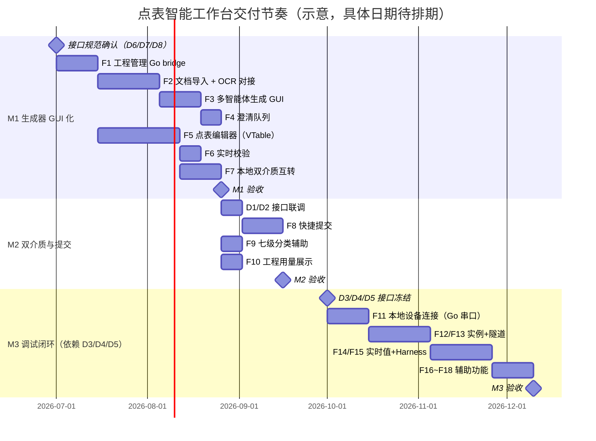

# P5 · 产品路线图与里程碑

> 本文是「点表智能工作台」产品线设计文档系列的**第五篇**，定位为研发规划与交付管理的参考依据，涵盖里程碑定义、功能能力差距矩阵、外部依赖风险和优先级裁决原则。本文以 BRD §7/§8/§11 为基础，结合现有后端/前端实现现状综合撰写。

---

## §1 里程碑定义

### §1.1 M1 · 生成器 GUI 化

| 维度 | 内容 |
|---|---|
| **范围** | F1~F7：工程管理 / 协议文档导入 / 多智能体生成 / 澄清队列 / 点表编辑器 / 实时校验 / 本地双介质产物 |
| **核心目标** | 让一线工程师能独立完成「拿到协议文档 → 人工确认合格的本地点表（JSON DSL + xlsx）」的全流程，全程离线可用 |
| **核心交付物** | ① 可分发 `.exe` 安装包；② 工程/任务管理本地存储；③ PDF/Word/图片导入与 OCR 解析；④ 多智能体流水线 GUI（进度可视化）；⑤ 澄清阻塞门；⑥ VTable 多 Sheet 编辑器（万级行）；⑦ 两类质量域实时校验；⑧ JSON DSL ⇄ xlsx 无损互转 |
| **验收标准** | 用 3 个历史项目协议文档（包含至少 1 份扫描件）实测：协议采数字段准确率 ≥ 90%（对照既有标准点表的 accuracy_simple 报告）；单设备点表编制耗时 ≤ 1 小时（含人工澄清与复核）；导出 xlsx 经平台导入验证 100% 兼容 |
| **里程碑标志** | 3 个测试协议文档全部通过验收标准，工程师可脱离命令行独立完成 |

**M1 功能细分**：

| 功能 | 详细验收点 |
|---|---|
| F1 工程管理 | 工程/任务本地存储；七态状态机；工程文件跨机器可打开 |
| F2 文档导入 | 支持 PDF/DOC/DOCX/XLS/XLSX/TXT/PNG/JPG；OCR 对接 MinerU；失败页清单明示 |
| F3 多智能体生成 | 流水线阶段可视；中途可取消；失败可断点重跑；生成记录固化规则包版本 |
| F4 澄清队列 | 阻塞遮罩门；AI 推荐项高亮+理由；「全部采纳推荐」；跳过留痕 |
| F5 点表编辑器 | VTable 1万行60fps；三态列视图；双向定位；字段证据溯源 |
| F6 实时校验 | 两类质量域；8 项规则；点击定位单元格；底部状态条计数 |
| F7 本地产物 | JSON DSL schema 校验；JSON⇄xlsx 无损互转；模板对比报告（M1 基础版）|

---

### §1.2 M2 · 双介质与提交

| 维度 | 内容 |
|---|---|
| **范围** | F8~F10（叠加在 M1 基础上）：快捷提交 / 七级分类辅助 / 工程用量展示；同时完善 F7（模板对比准确率报告完整版）|
| **核心目标** | 让点表从「本地产物」到「入库生效」打通最后一公里；工程总览可查看工程级用量 |
| **核心交付物** | ① 人工确认门禁（确认人/时间/内容哈希）；② 快捷提交接口对接（D2）；③ D8 提交回执弹窗；④ D4 七级分类选择器（与 groups\_brd.json 校验）；⑤ 工程总览用量汇总 |
| **验收标准** | ① JSON ⇄ xlsx 往返无损（diff 工具验证）；② 确认后点表一键提交远端系统成功且可正常解析；③ 幂等验证（同内容哈希重复提交被远端正确处理）；④ 七级分类选择器不允许出现 groups\_brd.json 之外的编码 |
| **里程碑标志** | 端到端：文档 → 生成 → 澄清 → 编辑 → 确认 → 提交 → 平台复核通过，全程 GUI 无命令行介入 |

---

### §1.3 M3 · 调试闭环

| 维度 | 内容 |
|---|---|
| **范围** | F11~F18（叠加在 M1/M2 基础上）：本地设备连接 / 采集实例生命周期 / 设备代理隧道 / 实时值监视 / Harness 自动调参 / 人工协同判定 / 写点调试安全 / 调试会话与报告 |
| **核心目标** | 让「现场调试」从人工试错升级为 AI 假设驱动的自动迭代，全程留痕，人工最终确认 |
| **核心交付物** | ① 串口/TCP 本地连接（Go 侧串口库）；② 采集实例编排接口对接（D3）；③ 设备代理隧道（WebSocket TLS，Go 侧实现）；④ 实时值监视表（含双向寄存器联动）；⑤ Harness 调参循环（假设-证据-结果留痕，支持暂停/回滚）；⑥ F17 写点三重防护；⑦ 调试会话保存/恢复；⑧ 调试报告生成 |
| **依赖项** | D3（采集实例编排）、D4（实时数据与报文接口，**关键**：原始报文 hex 透出）、D5（设备代理隧道网关）必须就绪（见 §3 外部依赖） |
| **验收标准** | 选 2 种真实 Modbus 设备（1 串口 1 TCP），从「未调试」到「全点位可用（通过或有明确结论）」，无驱动开发人员介入；单设备调试耗时 ≤ 2 小时 |
| **里程碑标志** | 两种真实设备端到端验证通过；调试报告可导出并附带提交 |

---

## §2 产品能力差距矩阵（F1~F18）

### §2.1 矩阵说明

- **已实现**：现有后端已提供，可直接对接
- **部分实现**：核心能力存在，但缺少客户端 GUI 封装、接口或关键细节
- **未实现**：完全待开发

### §2.2 完整差距矩阵

| 编号 | 功能名称 | 实现状态 | 说明 |
|---|---|---|---|
| **F1** | 工程与任务管理 | 🔴 未实现 | 桌面 Go bridge 的 7 个核心方法（`SelectProjectDir/GetConfig/SaveConfig/ListRecentProjects` 等）均为桩函数，仅有 `app.go` 骨架；本地 JSON DSL 读写、任务元数据持久化、工程注册表均未实现 |
| **F2** | 协议文档导入与解析 | 🟡 部分实现 | MinerU API 对接契约已明确：云端 Go 后端访问 `http://192.168.20.99:8001`，通过 `/file_parse` + `vlm-http-client` 获取 Markdown/content_list/images ZIP；尚未实现后端 `internal/mineru` 封装、B 域文档 gRPC 方法、客户端文件拖入、OCR 触发和失败页处理 |
| **F3** | 多智能体点表生成 | 🟡 部分实现 | 后端**核心能力已实现**：多 Agent 生成流水线（协议→Excel）、专家分工（地址/解析/单位/状态映射/命名/写元数据）、证据链已跑通；**未实现**：客户端 GUI 封装（进度可视化、流水线阶段展示）、gRPC `StreamProgress` + Bridge EventsEmit 进度推送、断点续跑机制 |
| **F4** | 不确定项澄清队列 | 🔴 未实现 | 后端尚未实现澄清队列存储与 API；客户端阻塞门 GUI 已有原型实现（HTML），但依赖后端提供澄清项数据 |
| **F5** | 点表编辑器 | 🟡 部分实现 | 原型已有 HTML table 实现；正式版需替换为 VisActor VTable（虚拟滚动）；字段证据溯源依赖后端 F2 OCR 结果；物模型映射列组（DTDL）的数据模型未定义 |
| **F6** | 实时校验与问题清单 | 🟡 部分实现 | 校验规则（schema/rules）资产已存在（`point_table_rules.json`/`point_table_workbook.schema.json`）；两类质量域定义已明确；客户端实时校验引擎（前端 or Go）未实现 |
| **F7** | 本地双介质产物 | 🟡 部分实现 | 后端已有 accuracy_simple/issues_simple 对比工具；JSON DSL schema（`point_table_workbook.schema.json`）已存在；客户端 JSON⇄xlsx 互转引擎、无损验证机制未实现 |
| **F8** | 快捷提交 | 🔴 未实现 | D2 提交接口依赖平台侧开发；客户端确认门禁逻辑（含内容哈希计算）未实现；原型有 toast 占位 |
| **F9** | 七级分类辅助 | 🟡 部分实现 | `groups_brd.json`/`groups_dev.json` 资产已存在；AI 从文件名/协议推断候选分类的逻辑在 skill 中有参考；客户端 D4 分类选择器为 toast 占位，未真正实现 |
| **F10** | 工程用量展示 | 🔴 未实现 | 工程级用量接口未定义；原型右上角仍是旧 mock 文案，需改为 `工程用量` |
| **F11** | 本地设备连接 | 🔴 未实现 | Go 侧串口枚举/读写为桩；D5 单帧收发工具为 toast 占位；TCP 连接模块未实现 |
| **F12** | 远端采集实例生命周期 | 🔴 未实现 | 依赖 D3（采集实例编排接口），平台侧尚未提供；客户端实例生命周期管理 UI 未实现 |
| **F13** | 设备代理隧道 | 🔴 未实现 | 依赖 D5（隧道网关接入点），平台侧尚未提供；Go 侧 WebSocket TLS 隧道代理未实现；链路三灯 UI 为 mock 数据 |
| **F14** | 实时值监视 | 🔴 未实现 | 依赖 D4（实时数据与原始报文接口，含 hex 透出）；原型 UI 存在但数据来源为 mock |
| **F15** | Harness 自动调参循环 | 🟡 部分实现 | 后端已有 **Triage/Fix 调试**、**证据链**、**人工筛选 overlay** 核心能力；**未实现**：harness 自动调参（假设生成→热下发→重测的迭代循环 API）、轮次历史存储、客户端时间线 UI |
| **F16** | 人工协同判定 | 🔴 未实现 | D7 弹窗为占位；后端问询触发机制未定义 |
| **F17** | 写点调试安全机制 | 🔴 未实现 | 客户端授权模式、D6 写点确认弹窗为占位；写点审计日志未实现 |
| **F18** | 调试会话与报告 | 🔴 未实现 | 会话持久化未实现；报告生成模板未定义；断点续调的实例/隧道恢复机制未实现 |

### §2.3 现有后端已实现的核心能力（可直接产品化）

| 能力 | 说明 | 对应功能 |
|---|---|---|
| 多 Agent 生成流水线（协议→Excel）| 点位发现→专家分工（6 个专家子 Agent）→合并→命令表→校验，已跑通端到端 | F3 |
| Triage/Fix 调试 | 合理性判定（值域/量纲/跨点一致性）+ 修正假设生成，已有基础实现 | F15 |
| 证据链 | 每个字段的三元组（假设-证据-结果）已由后端 Agent 产生 | F3/F15 |
| 人工筛选 overlay | 人工选择/拒绝 AI 建议的机制已有参考实现 | F4/F15 |
| 版本化发布到 xboard | 快捷提交的目标系统（建站资产库）已有点表导入接口 | F8 |
| CMDB 点表资产管理 | 远端系统已有按厂家/型号/分类检索点表的能力 | US-E3 |
| 点表规范资产 | `点表规范.md`/`schema.json`/`point_table_rules.json`/`groups_brd.json` 已存在 | F6/F7/F9 |
| accuracy_simple/issues_simple | 模板对比准确率报告工具已实现 | F7 |

### §2.4 后端尚未实现（研发排期必需）

| 待实现项 | 说明 | 影响里程碑 |
|---|---|---|
| OCR/MinerU 服务化接口 | API 地址与调用契约已明确（MinerU API `http://192.168.20.99:8001`，VLM Server 容器内 `http://mineru-openai-server:30000`）；需实现 Go 后端封装、ZIP 解析和页码证据元数据转换 | M1 |
| 澄清队列 API | 澄清项的存储、读取、更新接口；ask-first 模式下的预生成问询 | M1 |
| 增量文档分析 API | 变更说明的增量影响分析（不重跑全表）| M1+ |
| Harness 自动调参 API | 迭代循环（假设→热下发→重测）的编排与轮次历史接口 | M3 |
| 设备隧道/采集实例编排 | D3/D5 接口（见 §3 外部依赖）| M3 |
| DTDL 物模型映射 | Azure Digital Twins DTDL 资产模型管理接口 | M2+ |
| 工程/任务本地管理（Go bridge）| `SelectProjectDir/GetConfig/SaveConfig/ListRecentProjects` 等 7 个桩方法的真实实现 | M1 |
| 工程用量汇总接口 | 返回工程级用量金额/指标，不暴露 token、模型或会话明细 | M2 |
| 规则包版本管理 | 规则包版本化发布与客户端自动拉取机制 | M1 |
| 平台账号鉴权接口对接 | D1 接口的 Token 获取/刷新，客户端鉴权状态管理 | M2 |

---

## §3 外部依赖说明与阻塞风险

### §3.1 依赖总表

| 依赖编号 | 依赖项 | 提供方 | 当前状态 | 影响里程碑 | 阻塞程度 |
|---|---|---|---|---|---|
| D1 | 认证接口 | 平台 | 接口已有，需评审参数 | M2 | 中（M2 提交需要）|
| D2 | 快捷提交接口 | 平台 | 接口已有基础版，需确认幂等规格 | M2 | 高（M2 核心目标）|
| D3 | 采集实例编排接口 | 平台/基础平台组 | **未提供**，需排期 | M3 | **高（M3 直接阻塞）**|
| D4 | 实时数据与报文接口（含 hex 透出）| 平台/采集模块 | **部分实现**：有实时值，**无原始报文 hex**；hex 透出需采集模块增强 | M3 | **高（hex 缺失则 AI 诊断失效）**|
| D5 | 设备代理隧道接入点 | 平台/基础平台组 | **未提供**，需排期 | M3 | **高（M3 直接阻塞）**|
| D6 | LLM 网关 | 算法组/技管会 | 已有内网网关，需确认配额与弱网策略 | M1 | 中（M1 生成需要，可有临时方案）|
| D7 | OCR 服务（MinerU VLM）| 算法组 / 后端 | MinerU API 已可用，Go 后端访问 `http://192.168.20.99:8001`；`server_url` 固定传 `http://mineru-openai-server:30000` | M1 | 中（后端接入前可降级为本地文本抽取）|
| D8 | 点表规范规则库 | 规则维护者 | 规范文件已存在，**版本化发布机制未建立** | M1 | 低（M1 可用本地固化版本，M2 再建立版本机制）|

### §3.2 关键阻塞依赖详细说明

**D4 原始报文 hex 透出（最高风险）**：

Harness 调试的核心诊断能力依赖于能看到真实的原始请求/响应报文（hex），以判断：CRC 错误、Modbus 异常码（02 非法地址/03 非法值）、字节序异常、超时等。**如果现有采集模块不支持原始报文透出，则需要排期改造，直接影响 M3 交付质量**。

立项即需评审：采集模块是否能在实时数据推送中附加原始报文字段（至少 request\_hex 和 response\_hex）。

**D3/D5 平台侧编排能力（M3 直接阻塞）**：

M3 的全部真机调试功能（F11~F18）依赖 D3（采集实例编排）+ D5（设备代理隧道）同时就绪。二者任一不就绪则 M3 无法进入验收阶段。

建议：**M3 排期计划中明确 D3/D5 接口冻结日期**，若接口冻结晚于 M3 开发开始日期超过 4 周，则 M3 自动顺延。

---

## §4 风险识别与对策

### §4.1 里程碑级别风险

| 风险 | 等级 | 触发条件 | 对策 |
|---|---|---|---|
| **D3/D4/D5 平台接口未就绪** | 🔴 高 | M3 计划启动时 D3/D4/D5 任一未提供接口规范 | M3 自动顺延；M1/M2 先行交付，已交付价值不受影响；预留 M3 前 6 周作为接口联调缓冲期 |
| **采集模块不支持原始报文 hex 透出** | 🔴 高 | D4 接口中无 `request_hex`/`response_hex` 字段 | 立项评审时确认；若无法支持，M3 降级为「仅实时值监视，无 AI 通讯层诊断」，Harness 能力受限；或安排采集模块增强排期 |
| **MinerU OCR 后端接入未完成（D7）** | 🟡 中 | M1 开发期间 `internal/mineru` 封装、ZIP 解析或 B 域接口未完成 | 降级方案：使用本地文本抽取（仅支持已有文本的 PDF/Word/TXT）；图片/扫描件提示「需 OCR 服务」；M1 基础功能不受阻塞 |
| **LLM 幻觉填错协议参数** | 🟡 中 | 生成点表中关键字段（功能码/字节序）错误率超过 10% | 三道防线：规则/schema 硬校验 + 强制澄清 + 真机调试最终裁决；高风险字段 100% 证据溯源；评估集持续度量 |
| **现场工程师不信任 AI 输出** | 🟡 中 | 工程师习惯性无视 AI 建议、手动全部重填 | 全程可视化留痕（假设-证据-结果）建立信任；选 1~2 个真实项目试点，资深工程师带跑；准确率量化报告让价值可见 |
| **现场网络隔离导致云端功能不可用** | 🟡 中 | 甲方内网完全隔离，公司云端不可达 | 离线优先设计：本地编辑/校验/导出全程可用；隧道走 443/WebSocket 提高穿透性；M4 提供本地采集模块离线模式兜底 |
| **调参搜索空间爆炸导致云端成本上升** | 🟡 中 | 单设备 Harness 轮次超过 20 轮 | 假设按先验概率排序（错误模式库）；轮次熔断；熔断后人工介入；成本策略由云端后端统一控制，不在客户端暴露 token 预算 |

### §4.2 功能级别风险

| 风险 | 等级 | 对策 |
|---|---|---|
| 扫描件/低质量文档解析失败率高 | 🟡 中 | MinerU VLM 提升识别率；框选重试；失败页清单明示，不静默丢点 |
| 串口代理时延导致协议超时 | 🟡 中 | 采集实例侧超时参数可配；隧道层帧级缓冲与时延监控；超标自动提示改用本地模式 |
| 写点调试导致设备误动作 | 🔴 高（已有对策）| F17 三重防护（默认禁用/逐点确认/边界强校验）；写操作全部留痕；智能体永不自动写点 |
| xlsx 导出与平台导入格式不完全兼容 | 🟡 中 | 以平台导入接口的实际需求为准（不猜测）；M2 验收时用平台导入功能全量验证 |

---

## §5 建议交付节奏

### §5.1 总体节奏建议



### §5.2 切片优先级建议（在里程碑内的开发顺序）

**M1 内部切片**（参考用户故事 MVP 切片建议）：

| 切片 | 内容 | 优先级依据 |
|---|---|---|
| 切片 1 | US-A2→B1/B2→C1/C2→D1/D2→D6/D4：端到端最小可用（纯本地）| 最快产出可演示版本 |
| 切片 2 | US-E1/E2→A1→C3/C4→D5：确认门禁、快捷提交、证据溯源、准确率量化 | M2 核心价值 |
| 切片 3 | US-F1→F2→F3→F4→F7→F5：调试链路→手动调试→Harness | M3 渐进解锁 |
| 切片 4 | US-B4→B5→B3：多文档与增量变更 | 高频现场场景 |
| 切片 5 | US-F6/F8→G1→G2/G3→E3：飞轮 | M4 |

---

## §6 优先级裁决原则

### §6.1 功能取舍的判断框架

当资源/时间不足需要裁决功能范围时，优先保留满足以下条件的功能：

| 原则 | 说明 |
|---|---|
| **用户旅程完整性** | 不裁剪会导致关键旅程节点断裂的功能（如裁剪澄清队列会使生成流程不可用）|
| **质量门禁不可降** | 确认门禁（F8 前置）、写点安全（F17）不允许降级或跳过 |
| **离线降级保底** | 即使云端功能未就绪，本地编辑/校验/导出必须全程可用 |
| **P0 先于 P1** | 同里程碑内，P0 功能必须先完成再做 P1 |
| **依赖未就绪则顺延** | D3/D4/D5 平台接口未就绪时，M3 整体顺延，M1/M2 不受影响 |

### §6.2 P0/P1/P2 优先级定义

| 级别 | 含义 | 对应场景 |
|---|---|---|
| **P0** | MVP 必须：缺少此功能则里程碑目标无法达成 | 用户旅程核心节点；质量门禁；安全保障 |
| **P1** | 重要：用户明显受益，但可在下一迭代补充 | 辅助功能；量化报告；体验优化 |
| **P2** | 可选：未来飞轮能力；暂不影响核心交付 | 评估回归集；纠错回流；多人协作 |

### §6.3 当功能冲突时的优先序

1. 安全（写点三重防护 > 一切）
2. 数据完整性（JSON DSL 不损坏、确认记录不丢失）
3. 用户旅程完整性（从「文档」到「本地产物」的端到端可达）
4. 功能丰富性（额外辅助能力）
5. 体验细节（动画、响应时间优化）

---

## §7 版本号约定

| 维度 | 约定 |
|---|---|
| 客户端版本 | 语义化版本：`v{major}.{minor}.{patch}`（如 `v1.0.0`）|
| 规则包版本 | 年月格式：`v{YYYY}.{MM}`（如 `v2026.05`）；生成记录固化规则包版本 |
| JSON DSL schema 版本 | `$schema` 字段中固化版本 URL |
| 点表内容哈希 | SHA256（用于确认记录和幂等提交）|

---

## §8 待规划优化项（M3+ / P2）

> 本节收录已识别、但不影响 M1/M2/M3 核心交付的可选优化功能。进入正式迭代前，优先级和排期以当时产品目标为准。

| # | 功能项 | 来源 | 说明 | 相关文档 |
|---|---|---|---|---|
| OPT-01 | **轻量化备选项弹窗** | 产品决策 2026-06-23 | AI 生成完成后，对低影响不确定项（`impact ≤ 2`，如候选寄存器地址有 2 个备选）以非强制 Modal 弹窗呈现；用户可选 A/B 或采纳 AI 推荐；可关闭弹窗直接进入工作台；未处理条目在点表行内以黄色角标标注并随时可召回；与 F4 强阻塞门互补，不替代 | P3 §1.5 F4-OPT |

### OPT-01 交互决策流程

```
AI 生成完成
    │
    ├── 存在高影响不确定项（impact > 2）
    │       └──► F4 全屏阻塞遮罩门（M1，强制处理）
    │
    └── 仅存在低影响不确定项（impact ≤ 2）或无不确定项
            └──► 「生成完成」弹窗
                    ├── 无不确定项 → 直接「进入工作台」
                    └── 有低影响备选项（OPT-01）
                            ├── 点击「有 N 项备选待确认」→ 轻量 Modal 逐卡处理
                            └── 忽略 → 直接进入工作台
                                    未处理条目在点表行黄色角标标注
                                    点击角标 → 随时召回弹窗
```
