# T1A — 现状到目标架构演进方案

> 本文是系统架构设计文档（T1）的**配套演进方案**，描述**现状代码（As-Is）→ 目标架构（To-Be）的推进路线**：现有 Gin 服务的实现梳理、与目标架构的差距、以及分阶段实施步骤。
> **目标架构（C/S 拓扑、能力划分、数据流、状态归属）见 `T1-系统架构设计.md`**，本文不重复描述目标态本身，只描述「如何从现状走到目标」。
> **目标基线更新**：目标态已收敛为「**云端无跨会话持久态 + 数据全本地 + 调试每会话一个 xboard Docker 容器（收工销毁）**」。这意味着现状的 SQLite CMDB 永久态、常驻共享 xboard、无清理的 jobfs 都属于待演进项，演进路线见 [§2.5](#25-云端无状态化-per-session-容器演进路线)。
> 本文基于代码快照（`ai-point-table` 2026-06）梳理现状；现状随实现演进，差距清单与里程碑也应随之更新。
> 相关文档：发布节奏见 `../产品/P5-产品路线图与里程碑.md`；代码落地差距评审见 `../设计评审与改进建议.md`。

---

## 目录

- [§1 现状（现有 Gin 服务）](#1-现状现有-gin-服务)
- [§2 差距与演进](#2-差距与演进)

---

## §1 现状（现有 Gin 服务）

### 1.1 四层分层架构

```mermaid
flowchart TB
    subgraph L1["L1 — 传输层（api/）"]
        ROUTER["router.go\nGin 路由注册\n23 端点"]
        MW["middleware/\nRecover · RequestID · AccessLog"]
        HANDLER["handler/\nPointTableHandler\nEvidenceHandler\nDebugHandler\nXcmdbHandler"]
    end

    subgraph L2["L2 — 应用服务层（service/）"]
        PTS["PointTableService\n生成 Job 编排\n异步/同步模式"]
        DS["DebugService\n调试 Job · 评审 · apply · 版本切换"]
        ES["EvidenceService\n证据查询"]
        DevS["DeviceService\nCMDB 设备操作"]
    end

    subgraph L3["L3 — 领域层（pipeline/ · debug/ · agents/）"]
        PIPE["pipeline.Pipeline\nStage0→1a→1b→2 编排 Facade"]
        DBGORCH["debug.Orchestrator\nTriage + Fix 独立编排"]
        AGENTS["agents/*\n12 个专职 Agent\nbase.go callWithRetry[T]"]
        MERGER["merger.Merge\n按 PointID 合并"]
        LAYOUT["layout.Compute\n序号单一来源"]
        EXCEL["excel.Write\n写 Excel 工作簿"]
        EVIDENCE["evidence.Build\n证据链落盘"]
        VALID["validator\nG6 规范校验"]
    end

    subgraph L4["L4 — 基础设施层（store/ · job/ · llm/ · xboard/）"]
        SQLITE_S["store/sqlite\nSQLite CMDB\nDeviceStore"]
        JOBFS_S["job/jobfs\nJobFS 文件系统 Store"]
        LLM_S["llm.Client 接口\nopenai-go 实现\n指数退避重试"]
        XBOARD_S["xboard.Client\nHTTP 调 xboard"]
    end

    L1 --> L2
    L2 --> L3
    L3 --> L4
```



### 1.2 技术栈

| 组件 | 技术选型 | 版本 | 来源文件 |
|---|---|---|---|
| 语言运行时 | Go | 1.25.7 | `go.mod` |
| HTTP 框架 | Gin | v1.12.0 | `go.mod` |
| 依赖注入 | google/wire | v0.7.0 | `cmd/server/wire_gen.go` |
| LLM 客户端 | openai/openai-go | v1.12.0 | `go.mod` |
| Excel 生成 | xuri/excelize/v2 | v2.10.1 | `go.mod` |
| SQLite 驱动 | modernc.org/sqlite | v1.52.0 | `go.mod` (纯 Go，无 cgo) |
| 并发工具 | golang.org/x/sync | v0.21.0 | `pipeline.go` `errgroup+semaphore` |
| Prompt 模板 | Go `text/template` + `go:embed` | stdlib | `agents/base.go` |

### 1.3 现有 cmd 入口

| 入口 | 路径 | 职责 |
|---|---|---|
| `server` | `cmd/server/main.go` | HTTP 服务器（wire 装配，生产入口） |
| `generate` | `cmd/generate/main.go` | 命令行直接生成点表（离线调试用） |
| `eval` | `cmd/eval/main.go` | 批量评估 Pipeline 准确率 |
| `mockxboard` | `cmd/mockxboard/main.go` | 本地 mock xboard 服务（调试开发用） |

### 1.4 HTTP API（23 个端点）

> **现状说明**：以下是当前代码中的 Gin HTTP 路由清单，用于描述现有实现，不代表目标桌面端调用方式。目标态从 M1 开始由 Wails Bridge 通过 gRPC 调用业务服务；Gin HTTP 只保留 `/api/v3/link/board/*` 和 `/health`（目标态见 T1 §1.6）。

```
GET  /health

# 生成域
POST   /api/v1/point-table/generate
GET    /api/v1/point-table/runs/:run_id
GET    /api/v1/point-table/runs/:run_id/download
GET    /api/v1/point-table/runs/:run_id/evidence
GET    /api/v1/point-table/runs/:run_id/evidence/field

# 调试域：发起 / 报告
POST   /api/v1/point-table/runs/:run_id/debug
GET    /api/v1/point-table/runs/:run_id/debug/:debug_id
POST   /api/v1/point-table/devices/:resource_id/debug
GET    /api/v1/point-table/devices/:resource_id/runs

# 调试域：变更评审与应用
GET    /api/v1/point-table/runs/:run_id/debug/:debug_id/changes
POST   /api/v1/point-table/runs/:run_id/debug/:debug_id/decisions
POST   /api/v1/point-table/runs/:run_id/debug/:debug_id/changes/:change_id/decision
POST   /api/v1/point-table/runs/:run_id/debug/:debug_id/apply

# 版本化最终版
GET    /api/v1/point-table/runs/:run_id/points
GET    /api/v1/point-table/runs/:run_id/versions
POST   /api/v1/point-table/runs/:run_id/canonical

# 人工筛选 overlay
GET    /api/v1/point-table/runs/:run_id/selections
POST   /api/v1/point-table/runs/:run_id/selections

# 发布
POST   /api/v1/point-table/runs/:run_id/publish

# xboard 查询用 xcmdb 兼容接口（内置在本服务）
GET    /api/v3/link/board/list
GET    /api/v3/link/board/count
GET    /api/v3/link/board
```

### 1.5 依赖注入与装配（wire）

`cmd/server/wire_gen.go` 展示完整装配链：

```go
// 关键装配顺序（摘自 wire_gen.go）
config.Load(configPath)
→ ProvideLLMClient(openAIConfig)          // openai-go 客户端
→ ProvidePipeline(client, cfg, groupIdx)  // Pipeline Facade
→ ProvideSQLiteStore(cfg)                 // SQLite CMDB（含 cleanup）
→ ProvideJobStore(cfg)                    // JobFS Store
→ service.NewPointTableService(...)       // 生成 Service
→ ProvideDebugOrchestrator(...)           // 调试编排器
→ ProvideDebugService(...)                // 调试 Service
→ app.NewApp(cfg, router)                 // Gin App
```

### 1.6 现有部署形态

- **无容器化**：单 Go 二进制，`config.json` 配置文件驱动
- **单进程**：LLM 调用、Pipeline、调试编排均在同一进程内
- **无日志聚合**：标准 `log.Printf`，无结构化日志
- **无服务发现**：服务器地址硬配 `server_addr`
- **SQLite 单连接**：`SetMaxOpenConns(1)` 防并发写冲突（`store/sqlite/store.go`）

### 1.7 现有 xcmdb 集成接口的代码落点

T1 §1.6 描述了与 xboard 及内置 xcmdb 兼容接口的目标集成契约；下表给出现有代码落点与状态，作为演进对照（目标契约以 T1 §1.6 为准）：

| 接口 | 方向 | 现有代码落点 / 状态 |
|---|---|---|
| `POST /update` | 服务器→xboard | `internal/xboard/client.go` `Update()` |
| `GET /status` | 服务器→xboard | `internal/xboard/client.go` `Status()` |
| `GET /collect/value` | 服务器→xboard | `internal/xboard/client.go` `CollectValue()` |
| `GET /api/v3/project/device/debug?resource_id=&debug_id=` | 服务器→xboard | `internal/xboard/client.go` `GetDebug()`（待实现，见 T9） |
| `GET /api/v3/link/board/list` | xboard→内置 xcmdb 兼容接口 | `internal/api/handler/xcmdb.go` `List()` |
| `GET /api/v3/link/board/count` | xboard→内置 xcmdb 兼容接口 | `internal/api/handler/xcmdb.go` `Count()` |
| `GET /api/v3/link/board?resource_id=xxx` | xboard→内置 xcmdb 兼容接口 | `internal/api/handler/xcmdb.go` `Info()` |
| `POST /publish` | 客户端→服务器→xboard | `handler/debug.go` `Publish` |

### 1.8 现有多客户端隔离现状

T1 §1.7 描述了多工程师/多客户端隔离的**目标方案**；现状如下：

- 无任何鉴权与隔离，所有 API 裸暴露
- `resource_id` 由服务器内 `resource_seq`（`next_val` 起始 101）自增分配，无工程概念
- 调试串行锁（`debug.LockSet`，已实现）目前为全局粒度，未按 `project_id + resource_id` 隔离

---

## §2 差距与演进

### 2.1 核心张力：产物归属冲突

**问题**：现有架构中，所有点表产物（`merged.json`、`layout.json`、`xlsx` 等）在服务器文件系统 `jobs/{run_id}/versions/vN/` 下，而目标架构要求 JSON DSL 权威产物在**客户端本机**。

**解决方案设计**：

```
服务器（执行环境）                     客户端（权威存储）
─────────────────────────────────      ────────────────────────────────
jobs/{run_id}/versions/v1/             tasks/{task_id}/
  ├── merged.json        ──────────►     ├── point_table.json（JSON DSL）
  ├── {board_type}.xlsx  ──────────►     ├── point_table.xlsx
  ├── evidence.json      ──────────►     ├── evidence.json
  └── layout.json（留服务器用）          └── sessions/{run_id}/（归档快照）
```

**迁移路径**：
1. **阶段 M1（目标链路）**：服务器 Job 完成后，Bridge 调用 `PointTableService.GetPointTable/GetXlsx` 与 `EvidenceService.GetRun`（gRPC）领取结果，Wails `SaveDSL()` 落地本机（`app.go` 中已有桩方法）
2. **阶段 M2**：补齐 `GenerationService.StreamProgress`，Bridge 接收 gRPC Server Streaming 后用 `runtime.EventsEmit` 通知前端自动领取
3. **阶段 M3**：调试实时值和报文使用 gRPC Streaming（H-9/H-10），Bridge 统一转成 Wails Events；不让前端直连服务器 HTTP/WS

### 2.2 缺失模块清单

| 缺失模块 | 优先级 | 说明 | 影响范围 |
|---|---|---|---|
| **OCR 接入（MinerU）** | P0 | 现仅接受已转为 Markdown 的文本；目标接入 MinerU API `http://192.168.20.99:8001`，由 Go 后端调用 `/file_parse` 并解析 Markdown/content_list/images ZIP | 输入端 |
| **两阶段交互生成（ClarificationAgent）** | P0 | 现状=一次性产出固定结果；目标=**两阶段**：草稿+不确定项 →（疑虑点候选选项）→ 用户选择 → `ApplyAnswers` fold 落定最终 DSL（见 T2 §4）。原型 `ai.clarifications[]` 已展示澄清流，服务器待实现 | 生成核心交互 |
| **增量分析（IncrementalDeltaAgent）** | P1 | 原型 `changeSet` 展示型号变更说明的差量分析，无服务器实现 | 多版本协议 |
| **自收敛调试 loop（确定性外壳 + 可插拔 `Repairer` 内核）** | P1 | 现状=单 flow 出报告+人工 Decide/Apply；目标=**唯一形态的自收敛 loop**：采集→诊断→自动锁定正确点→对剩余点经 `Repairer` 提假设并自动应用（每轮 `/updateTemplate` 重部署、复用同一会话容器）→回采验证，直到收敛（见 T2 §5/§5.8）。安全/收敛不变量由确定性外壳独占；推理内核为可插拔 `Repairer` 端口：M3=v1 单次（永久基线），M4=v2 agentic 工具循环（第二实现）。从被动采集升级为主动 harness 编排，**无 report-only、无人工 Decide/Apply** | 调试子系统 |
| **设备隧道代理** | P1 | xboard 采集请求先到云端后端设备代理，再经 WSS 转发到本地 Bridge，由 Bridge 访问现场串口/TCP 设备 | 远程调试 |
| **Token 鉴权** | P1 | 23 个 API 端点全无鉴权，多工程师并发使用会产生数据混淆 | 安全 |
| **工程管理** | P2 | `ptw-project.json` 工程元数据（客户端）；服务器侧工程隔离（多 project） | 工程组织 |
| **gRPC 流式推送** | P2 | 生成进度目前需客户端轮询现有 HTTP run 状态，目标改为 `StreamProgress` + Wails EventsEmit | 用户体验 |
| **规则包版本管理** | P2 | mock `rulePack: v2026.05`，无版本化分发机制 | 一致性 |
| **InquiryAgent（人工问询 F16）** | P3 | 人工介入协同判断场景 | 高级调试 |

### 2.3 已知架构张力明细

| 张力点 | 现状 | 目标 | 影响 |
|---|---|---|---|
| **无 JSON DSL 概念** | 服务器只有 `merged.json`（内部 `types.MergedPoint[]`）和 `xlsx`；无 DSL schema | 客户端持有规范化 JSON DSL，服务器结果转换为 DSL 格式下发 | T3 §3 详述 DSL 演进路径 |
| **resource_seq vs PointID** | `resource_id` = 自增整数序列（起始 101）；PointID = Agent 内部 `p{N}` 临时 ID，无全局稳定性 | PointID 应作为设备级稳定 ID，与 run 无关；`resource_id` 用于 CMDB 设备标识 | 证据锚点、调试关联均受影响 |
| **无鉴权** | API 裸暴露，无 Token/Session | Bearer Token + ProjectID 隔离 | M1 可不做，M2 必须做 |
| **xlsx_path 不跟随 canonical** | `apply` 后 SQLite CMDB 的 `xlsx_path` 仍指向 v1（见 `点表产物与版本管理.md` §9.1） | apply 成功后同步更新 CMDB `xlsx_path` | xboard 部署路径错误 |
| **服务器产物 vs 客户端权威** | 所有产物在服务器；客户端无本地持久化 | DSL+xlsx 下发客户端，服务器 scratch 会话临时态领取后即清 | 核心架构冲突 |
| **持久 CMDB（SQLite）** | 服务器 SQLite `devices` 永久表 + `resource_seq` 自增 | **去持久化**：设备配置随 DSL 上传，仅会话存活期间在内存注册表持有，供 xcmdb 按会话查询 | 后端无状态化前提 |
| **共享单 xboard** | 常驻单实例 xboard，模板按 `device_type` 缓存共享、易污染（见 T1 §2.3） | **每会话一个 xboard 容器**，warm pool 预热 + late binding 注入 + 收工销毁 | 多工程师隔离 / 状态污染 |
| **jobfs 无清理** | 产物永久堆积，无 TTL | 会话临时态，结束 / 超时即清；生成 scratch 领取后即删 | 磁盘 / 合规 |
| **无 OCR pipeline** | 接受文本协议（已转 markdown）；原始 PDF 需外部工具预处理 | MinerU API 集成（Go 后端访问 `http://192.168.20.99:8001`，`server_url=http://mineru-openai-server:30000`），返回 `raw[]`/`ocr[]`/坐标证据 | 输入准入扩大 |

### 2.4 演进阶段建议

#### M1 — 生产可用（当前首要目标）

**架构要求**：C/S 基本连通，生成→下载→本地持久化流程跑通

- [ ] 实现 Wails `SaveDSL()`：生成完成后自动下载 merged.json + xlsx + evidence，写本地工程目录
- [ ] 实现 `GetConfig()`/`SaveConfig()`：本地 `ptw-project.json` 读写
- [ ] 修复 `xlsx_path` 不随 canonical 更新的 bug（自收敛 loop 每轮自动应用 / 版本 bump 后同步更新加载位，详见 T2 §5）
- [ ] 日志结构化（`slog`），方便现场问题定位
- [ ] 容器化部署（Docker Compose：`ai-point-table` + SQLite volume）

> **通信协议变更（T8）**：目标架构中桌面端与服务器的通信协议已决策从 HTTP REST 切换为 **gRPC**（路径 A），详见 `T8-gRPC桥接架构设计.md`。M1 开始实施，Gin HTTP 保留仅供 xcmdb `/api/v3` 接口和 `/health` 探活。

#### M2 — 核心交互（澄清 + 增量 + 鉴权）

**架构要求**：多工程师并发安全；澄清队列 API；PDF 协议支持

- [ ] Token 鉴权 middleware + 工程隔离（`project_id` 注入所有服务调用）
- [ ] 两阶段交互生成：ClarificationAgent + ClarificationService gRPC（`ListClarifications`/`AnswerClarification`/`ApplyClarifications`）；用户选中项 fold 落定最终 DSL（`dsl_version` bump）
- [ ] MinerU OCR 集成（Go 后端 `/file_parse` 调用、ZIP 解析、PageDoc/证据元数据转换）
- [ ] IncrementalDeltaAgent + IncrementalService gRPC 方法
- [ ] gRPC 生成进度流（取代轮询）

#### M3 — 完整 harness 调试 + 工程管理

**架构要求**：云端采集实例调试；工程目录同步；规则包分发

- [ ] 设备隧道代理（xboard 容器请求 → 后端会话级隧道代理 → 按 resource_id WSS → 正确工程师 Bridge → 串口/TCP）
- [ ] 自收敛调试 loop = **确定性自收敛外壳 + v1 单次 `Repairer` 内核 + 录制-回放评测台**（T2 §5.8 / T7 §1.6）：
  - 确定性外壳：`DiagnoseAgent` 判定 → 自动锁定正确点棘轮收敛 → 对剩余非收敛点经 `Repairer` 提假设并自动应用（每轮 `/updateTemplate` 重部署、复用同一会话容器）→ 回采验证不降级，收敛/`partial` 退出；无人工 Decide/Apply
  - v1 `Repairer`：包单次 `HypothesizeAgent`，作为永久基线/兜底（**非过渡代码**）
  - 录制-回放评测台为 M3 就绪硬门禁（离线度量收敛率/轮数/单调正确性；并作为 M4 切 agentic 的对比基准）
- [ ] 工程管理 API（服务器端工程/协议点表任务 CRUD）
- [ ] 规则包版本分发（客户端拉取/校验 `rulePack`）
- [ ] DSL schema 固化（客户端持有 JSON Schema 版本）

> M1 的「容器化部署（Docker Compose：`ai-point-table` + SQLite volume）」属过渡形态；目标态（M4）去除持久 SQLite，云端不再有任何跨会话持久卷，xboard 改为 per-session 容器。

#### M4 — 云端无状态化 + per-session 容器（架构收口）

**架构要求**：后端去除一切跨会话持久态，调试改为 per-session xboard 容器（详见 [§2.5](#25-云端无状态化-per-session-容器演进路线)）

- [ ] 去持久 CMDB：移除 SQLite `devices`/`resource_seq`，改内存会话注册表（xcmdb 读内存）
- [ ] 设备配置本地化：`device.json` 随 DSL 上传，会话存活期间内存持有
- [ ] xboard 最小镜像（仅 collect+api+modbus）+ warm pool + Go Docker SDK 容器生命周期
- [ ] 会话协调器：心跳 + idle/超时回收 + 隧道断连兜底 `docker rm`
- [ ] jobfs scratch TTL 清理（生成领取后即删；调试随会话销毁）
- [ ] v2 agentic `Repairer`（**同一 `Repairer` 端口的第二实现，非新架构**）：内核内跑只读侦查工具循环（`read_protocol`/`inspect_frame`/`decode_try`/`get_samples` + `propose_patch`），确定性外壳零改动；上线前需在录制-回放评测台上不劣于 v1 基线（T2 §5.8 / T7 §1.6）

### 2.5 云端无状态化 + per-session 容器演进路线

目标态把后端从「有持久态（SQLite CMDB + 常驻 jobfs + 共享单 xboard）」收口为「**无跨会话持久态 + per-session xboard 容器**」。下表是差距矩阵：

| 维度 | 现状（As-Is） | 目标（To-Be） | 演进动作 |
|---|---|---|---|
| 设备 CMDB | SQLite `devices` 永久表 | 内存会话注册表（会话作用域）| 实现满足 `store.DeviceStore` 的内存注册表，替换 SQLite 实现；xcmdb Info 改读内存 |
| resource_id 分配 | `resource_seq` 自增（起始 101），无工程概念 | 会话级临时 `resource_id`，会话内分配、结束驱逐 | 由会话协调器分配 |
| 设备配置来源 | 服务器自管 | 本机 `device.json` 随 DSL 上传 | 新增上传入口；scratch 物化设备配置 |
| xboard 形态 | 常驻共享单实例 | per-session 容器（warm pool + late binding + teardown）| Go Docker SDK 直控；最小镜像 |
| jobfs | 永久堆积 | 会话临时态 + TTL 清理 | 生成领取后即删；调试随会话销毁 |
| 隧道路由 | 单工程师（无路由隔离）| 会话级隧道代理按 `resource_id` 回正确工程师 | 路由表绑定会话→Bridge |
| 后端持久卷 | SQLite volume | 无持久卷（仅临时 scratch + 内存）| 移除 SQLite 接线（wire），`DatabaseDSN` 不再必需 |

**演进顺序建议**：先做内存会话注册表替换 SQLite（解耦持久态）→ 设备配置随 DSL 上传 → xboard 最小镜像与编排器（warm pool）→ 会话协调器（生命周期/超时回收）→ jobfs TTL。每一步都保持 xcmdb 兼容接口语义不变（仅数据源从 SQLite 改为内存）。存储边界目标态见 [T12](../目标态/T12-数据与物料存储边界设计.md)，部署运维细节见 [T6](../目标态/T6-部署分发与运维设计.md)。
