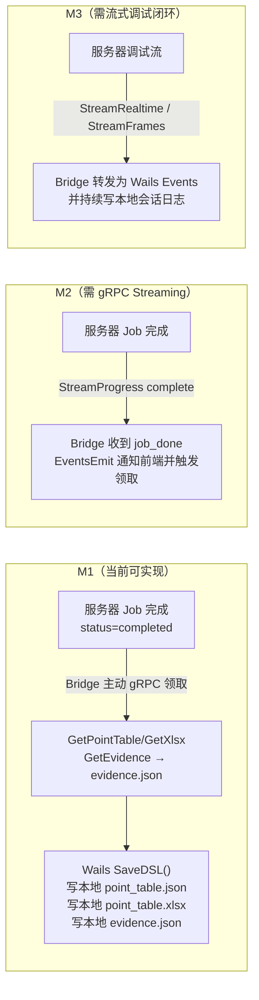

# T3A — 数据存储现状与演进方案

> 本文是数据库与数据模型设计文档（T3）的**配套演进方案**，描述**现状存储层（As-Is）→ 目标数据模型（To-Be）的推进路线**：现有 SQLite schema、JobFS 产物树、关联机制与落库规则的梳理，以及到目标数据模型的差距与迁移路径。
> **目标数据模型（JSON DSL、SQLite 目标 schema、jobfs、ER 图等目标态）见 `T3-数据库与数据模型设计.md`**，本文不重复描述目标态本身，只描述「如何从现状走到目标」。
> 本文基于代码快照（`ai-point-table` 2026-06）及前端原型（`ai-point-web/prototype/assets/mock-data.js`）梳理现状；现状随实现演进，差距清单也应随之更新。

---

## 目录

- [§1 现状存储层](#1-现状存储层)
- [§2 差距与演进](#2-差距与演进)

---

## §1 现状存储层

### 1.1 SQLite 完整 Schema（现有 DDL）

```sql
-- 来源：internal/store/sqlite/schema.sql

CREATE TABLE IF NOT EXISTS devices (
    resource_id    TEXT PRIMARY KEY,     -- 设备唯一 ID（resource_seq 自增，如 "101"）
    name           TEXT NOT NULL,        -- 设备显示名（如"艾默生060KVA-2列头柜"）
    device_type    TEXT NOT NULL,        -- 设备类型（来自 DeviceMeta AI 推断）
    is_collect     INTEGER NOT NULL DEFAULT 1,    -- 是否采集（1=是）
    limit_interval INTEGER NOT NULL DEFAULT 1000, -- 采集最小间隔(ms)
    protocol       TEXT NOT NULL,        -- 协议类型（"modbusRTU"/"modbusTCP" 等）
    transfer       TEXT NOT NULL,        -- 传输方式（"serial"/"tcp" 等）
    status_rule    TEXT NOT NULL,        -- 状态规则（JSON 字符串）
    is_simulated   INTEGER NOT NULL DEFAULT 0,    -- 是否模拟设备（0=真实）
    xlsx_path      TEXT NOT NULL,        -- canonical xlsx 绝对路径（供 xboard 通过后端 xcmdb 兼容接口读取）
    created_at     TEXT NOT NULL         -- ISO8601 时间戳
);

CREATE TABLE IF NOT EXISTS resource_seq (
    id       INTEGER PRIMARY KEY CHECK (id = 1),  -- 单行表（id 始终为 1）
    next_val INTEGER NOT NULL DEFAULT 101          -- 下一个 resource_id 数值，起始 101
);

INSERT OR IGNORE INTO resource_seq (id, next_val) VALUES (1, 101);
```

**字段语义说明**：

| 字段 | 语义 | 来源 | 已知问题 |
|---|---|---|---|
| `resource_id` | CMDB 设备主键 | `resource_seq.next_val` 自增分配 | 纯整数字符串，无工程隔离；`resource_seq` 无并发保护（依赖 `SetMaxOpenConns(1)`） |
| `xlsx_path` | canonical xlsx 绝对路径 | `pipeline.Result.XlsxPath` | **不随 canonical 更新**：apply 产生 v2 后，CMDB 仍指向 v1 路径（见 `点表产物与版本管理.md §9.1`） |
| `status_rule` | 状态规则（JSON） | xboard 配置 | 未见现有实现；字段留空时行为不明 |
| `is_simulated` | 是否为模拟设备 | 生成请求参数 | 调试时用于区分真实/仿真采集 |

**迁移机制**：

```go
// internal/store/sqlite/store.go（幂等 DDL）
func (s *Store) migrate() error {
    _, err := s.db.Exec(schema)  // CREATE TABLE IF NOT EXISTS（幂等）
    return err
}
// 无版本化迁移工具（无 goose/migrate），纯手写 DDL
// SetMaxOpenConns(1) — 防止 SQLite 并发写冲突
```

### 1.2 JobFS 产物树（完整 ASCII）

```
{output_dir}/jobs/
└── {run_id}/                        # UUID，由 service 生成
    ├── status.json                  # Job 记录（见 §1.2.1）
    ├── canonical                    # 纯文本，如 "versions/v2"（缺失=v1）
    ├── protocol/
    │   └── {协议文件名.md}           # 上传后的协议文本（Markdown，Pipeline 读入）
    ├── versions/
    │   ├── v1/                      # 生成版（只读保留）
    │   │   ├── {board_type}.xlsx    # 最终 Excel 产物（4 sheet）
    │   │   ├── merged.json          # 合并后 MergedPoint[]（apply baseline）
    │   │   ├── layout.json          # 序号/SpotResourceID（单一来源）
    │   │   ├── device_info.json     # 设备信息表（apply 重渲染所需）
    │   │   └── evidence.json        # 生成证据链
    │   └── v2/                      # apply 产生的修正版（调试→accept→apply）
    │       ├── {board_type}.xlsx
    │       ├── merged.json          # 应用 Decision 后的 MergedPoint[]
    │       ├── layout.json          # 重算序号
    │       └── device_info.json
    └── debug/
        └── {debug_id}/              # UUID，每次调试会话独立
            ├── session.json         # 会话状态 + 各轮判定汇总（见 §1.2.2）
            ├── baseline.json        # 会话启动时点表快照
            ├── samples_round{N}.json  # 第 N 轮 xboard 原始采样数据
            ├── triage_round{N}.json   # 第 N 轮 TriageAgent 判定报告
            ├── changeset.json         # 建议变更集（含逐条 accept/reject 决策）
            ├── fix_evidence.json      # 修正证据（调试域，不污染 v1 evidence）
            └── apply_record.json      # apply 结果（版本/校验/回采退化记录）
```

#### `status.json` 结构（`job.Job`）

```go
// internal/job/job.go
type Job struct {
    RunID      string    `json:"run_id"`
    Status     Status    `json:"status"`     // "running"/"completed"/"completed_with_warnings"/"failed"
    ResourceID string    `json:"resource_id"`
    BoardType  string    `json:"board_type,omitempty"`
    XlsxPath   string    `json:"xlsx_path,omitempty"`   // canonical xlsx 绝对路径
    Error      string    `json:"error,omitempty"`
    CreatedAt  time.Time `json:"created_at"`
    UpdatedAt  time.Time `json:"updated_at,omitempty"`
}
```

#### `layout.json` 结构（`layout.Layout`）

```go
// internal/layout/layout.go
type Layout struct {
    DeviceResourceID string        `json:"device_resource_id"`
    Points           []PointLayout `json:"points"`
}

type PointLayout struct {
    PointID         string `json:"point_id"`          // 内部 ID（"p1"/"p2"...）
    SheetTarget     string `json:"sheet_target"`       // "read"/"write"/"both"
    ReadSeq         int    `json:"read_seq,omitempty"`  // 读表序号（per-sheet 从 1 连续）
    WriteSeq        int    `json:"write_seq,omitempty"` // 写表序号（per-sheet 从 1 连续）
    SpotResourceID  string `json:"spot_resource_id,omitempty"` // "{resource_id}_{read_seq}"（xboard 读点 spot id）
}
```

#### `decisions/selections.json` 结构（人工筛选 Overlay）

```go
// internal/service/debug_service.go（Selections 相关）
type Selections struct {
    Disabled []string `json:"disabled"` // 被 disable 的 PointID 列表
    Enabled  []string `json:"enabled"`  // 从 disabled 恢复的 PointID 列表
}
```

### 1.3 resource_id ↔ run_id ↔ version 关联机制

```
resource_id（设备标识）
  └─ 来自 SQLite resource_seq 自增分配（generate 时写 CMDB）

run_id（生成任务标识）
  └─ UUID，由 service 在 generate 时生成
  └─ 存于 status.json.resource_id（反向关联）

version（vN）
  └─ jobfs 下 versions/ 目录枚举
  └─ canonical 文件（纯文本指针）

关联查询路径（软关联，无外键）：
  按 resource_id 查最新 run：
    jobfs.ListRunsByResourceID(resourceID)
    → 遍历 jobs/*/status.json，过滤 resource_id 字段，按 CreatedAt 降序

  按 run_id 查当前版本：
    jobfs.CanonicalVersion(runID) → 读 canonical 文件 → "v2"
    jobfs.CanonicalDir(runID) → jobs/{run_id}/versions/v2/
```

### 1.4 落 CMDB 规则

```go
// internal/service/point_table.go（runJob 末尾逻辑）
switch result.Status {
case "completed":
    // G6 通过 → 写 SQLite CMDB（CreateDevice）
    s.deviceStore.Create(Device{
        ResourceID: result.ResourceID,
        XlsxPath:   result.XlsxPath,  // 注意：指向 v1 路径
        ...
    })
case "completed_with_warnings":
    // G6 不通过 → 不落 CMDB，但 jobfs 产物保留（可用于调试）
}
```

---

## §2 差距与演进

> **目标基线更新**：目标态已收敛为「**云端无跨会话持久态**」——服务器**不再有持久化 SQLite**。`devices`（CMDB）改为**会话级内存注册表**（设备配置随 DSL 上传、会话结束驱逐）；`projects`/`device_tasks`/`runs`/`project_usage`/`rule_packs` 等元数据权威移到本机（`ptw-project.json` + `task.json`）。因此下面 §2.2「扩展 SQLite 表」属于过渡期方案，目标态最终**移除 SQLite**（见 [§2.5](#25-去持久化演进路线sqlite--内存会话注册表)）。

### 2.1 核心张力：产物在服务器 vs 权威在客户端

**现状**：所有点表数据权威在服务器 `jobs/{run_id}/versions/vN/`，客户端零持久化。

**目标**：`point_table.json`（JSON DSL）是客户端本机权威，服务器 Job 为执行环境。

**迁移路径设计**：



**关键工程决策**：
- M1 已可实现：`app.go` 中 `SaveDSL(path, content string)` 桩已定义，需补充实现
- M2 需新增 `GenerationService.StreamProgress` gRPC 流，并在 Bridge 内用 `runtime.EventsEmit` 推给前端
- 服务器侧通过 `runs` 表 `downloaded_at` 字段追踪"是否已交付"，用于 TTL 清理决策

### 2.2 过渡期 SQLite 调整（M1~M3，最终在 M4 移除）

> 在去持久化（M4）落地前，现有 SQLite 仍是过渡载体；下表是过渡期建议，**不是目标态**。目标态见 [§2.5](#25-去持久化演进路线sqlite--内存会话注册表)。

| 变更类型 | 过渡期目标 | 说明 |
|---|---|---|
| **`devices` 表新增字段** | `project_id TEXT`（工程隔离） | 过渡期引入；M4 随 SQLite 一并移除 |
| **`devices` 表新增字段** | `canonical_version TEXT DEFAULT 'v1'` | 同步 canonical，修复 `xlsx_path` 不更新问题 |
| **版本化迁移工具** | 引入 `goose` 或 `golang-migrate` | 仅服务过渡期 SQLite |

**立即可做的 `devices` 修复**（过渡期）：

```sql
-- 修复 xlsx_path 不随 canonical 更新的 bug
-- 在 internal/service/debug_service.go Apply() 方法末尾添加：
UPDATE devices
SET xlsx_path = ?, updated_at = ?
WHERE resource_id = ?
-- 参数：新版本 xlsx 绝对路径、当前时间、resource_id
```

> 注：上述 bug 在目标态自然消失——目标态没有持久 `xlsx_path`，会话 xlsx 由上传 DSL 重新渲染并挂载入容器。

### 2.3 JSON DSL Schema 设计建议

#### 从现有 `types.MergedPoint` 演进到 DSL 格式

**现有 `MergedPoint`（服务器内部类型）**：

```go
// internal/types/merged.go（示意）
type MergedPoint struct {
    PointID      string        // "p1"/"p2"...（内部临时 ID，run 间不稳定）
    RawName      string        // Discovery 发现的原始名
    SheetTarget  string        // "read"/"write"/"both"
    FC           string
    Register     int
    Span         int
    // ...各 Agent 产出字段
    Uncertainties []Uncertainty
}
```

**演进方向**：

| 差异点 | `MergedPoint`（现在） | `PointTableDSL.ReadPoint`（目标） |
|---|---|---|
| ID 稳定性 | `p1`/`p2` 随 run 变化 | 设备内稳定整数序号（layout 派生） |
| 调试字段 | 无 | `raw`/`rawVal`/`val`/`state`/`aiNote`/`suggestion` |
| 物模型列 | 无 | `dtModel`/`dtDevice`/`comp`/`compModel`/`compIdx`/`dtId` |
| 命令关联 | 无 | `cmd`（关联 `CommandEntry.id`） |
| 写表分离 | 同一结构按 SheetTarget 分 | `ReadPoint`/`WritePoint` 分开结构体 |
| Schema 版本 | 无 | `version` 字段（`"1.0"`） |

**演进步骤**：
1. 在 `/generate` 返回时，服务器将 `MergedPoint[]` 转换为 `PointTableDSL` JSON 结构
2. 新增 `GET /runs/:run_id/dsl` 端点，返回 DSL JSON（客户端领取后落地）
3. DSL 以 `JSON Schema`（draft-07）固化，客户端可做离线校验

### 2.4 一致性策略

> **目标态前提**：去持久化后服务器**不保留 canonical 长期版本**，权威单点在本机。下述「跨工程师 canonical 冲突」主要存在于过渡期（服务器仍持久化版本时）；目标态下每个工程师对自己本机任务持单一权威，版本历史在本机 `sessions/` 归档，不存在服务器侧并发覆盖。同一任务的多人协作通过工程级边界与上传时序约束，不引入 CRDT（见 [T1 §2.2](../目标态/T1-系统架构设计.md)）。

**场景（过渡期）**：客户端本地 `point_table.json` 版本为 `v1`，服务器 canonical 已更新至 `v2`（另一个工程师 apply 了变更）。

**冲突解决设计**：

```
客户端本地版本（dsl_version: "v1"）
    ↕ 不一致
服务器 canonical（v2）

检测时机：
  1. 客户端打开工程/任务时，GET /runs/:run_id 对比 canonical 版本
  2. 客户端发起调试 Job 时，服务器 Apply() 的 baseVersion 一致性检查（已实现）

解决方案（三选一）：
  A. 客户端版本落后 → 提示"服务器版本更新（v2），是否同步最新版本？"
     用户确认 → 客户端 GET /download?version=v2 重新领取
  B. 客户端有本地修改（尚未同步到服务器）→ 锁定，提示需先解决冲突
  C. 服务器版本回滚（canonical 指向了更早版本）→ 客户端持有的更新版本存入 sessions/

数据完整性保底：
  - 客户端 sessions/ 保存历史版本快照，任何版本都不丢失
  - 服务器 versions/ 目录只增不减（SetCanonical 只移动指针，不删目录）
  - apply 的 baseVersion 一致性检查（service.Apply 已实现）防止评审期间的并发冲突
```

### 2.5 去持久化演进路线（SQLite → 内存会话注册表）

目标态把存储层从「SQLite CMDB + 永久 jobfs」收口为「内存会话注册表 + 会话临时 scratch」。差距矩阵：

| 维度 | 现状（As-Is） | 目标（To-Be） | 演进动作 |
|---|---|---|---|
| 设备 CMDB | SQLite `devices` 永久表 | 内存 `SessionRegistry`（会话作用域，满足 `store.DeviceStore`）| 新增内存实现替换 `store/sqlite`；xcmdb Info 改读内存，未命中返回 404 |
| resource_id 分配 | `resource_seq` 自增（起始 101）| 会话级临时分配，结束驱逐 | 由会话管理器分配，不落库 |
| 设备配置来源 | 服务器自管（generate 时写）| 本机 `device.json` 随 DSL 上传物化 | 新增上传入口；scratch 物化设备配置入注册表 |
| 工程/任务/运行元数据 | （规划中）SQLite `projects`/`device_tasks`/`runs` | 本机 `ptw-project.json` + `task.json` 权威 | 元数据权威本地化，服务器运行中仅内存持有 |
| jobfs | 永久堆积，无清理 | 会话临时态 + TTL | 生成领取后即删；调试随会话销毁 |
| SQLite 接线 | `wire`/`wire_gen` 装配 SQLite Store，`DatabaseDSN` 必需 | 移除 SQLite 接线，`DatabaseDSN` 不再必需 | 改 wire 提供内存注册表 |

**演进顺序建议**：①内存会话注册表替换 SQLite `devices`（xcmdb 改读内存）→ ②设备配置随 DSL 上传物化 → ③移除 `resource_seq`，改会话级分配 → ④元数据权威本地化（`task.json`）→ ⑤移除 SQLite 接线，`DatabaseDSN` 退役 → ⑥jobfs TTL。每步保持 xcmdb 兼容接口语义不变。目标数据模型见 [T3 §1.3](../目标态/T3-数据库与数据模型设计.md)。
