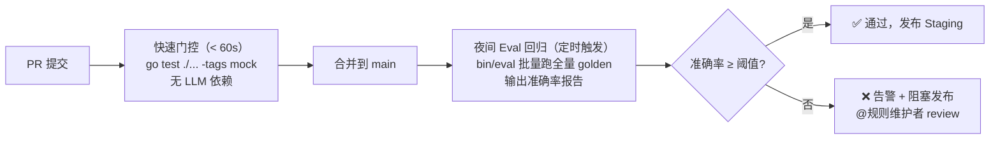

# T7A — 测试覆盖现状与演进方案

> 本文是质量保障与测试 Eval 设计文档（T7）的**配套演进方案**，描述**现状测试覆盖（As-Is）→ 目标质量体系（To-Be）的推进路线**：现有 Eval 框架与单元测试梳理、黄金样本覆盖现状、与目标的差距，以及黄金样本库建设、测试层级补齐、Eval 接入 CI 的分阶段实施步骤。
> **目标质量体系（准确率指标、黄金样本体系、测试分层、现场验收、持续质量监控）见 `T7-质量保障与测试Eval设计.md`**，本文不重复描述目标态本身，只描述「如何从现状走到目标」。
> 本文以代码库中 `eval/`、`cmd/eval/main.go`、`internal/debug/*_test.go` 的实际实现为基准；现状随实现演进，差距清单也应随之更新。
> 相关文档：T6 部署分发与运维设计；[AI 生成点表设计](../../ai-point-table/docs/设计文档/AI%20生成点表.md)；[BRD 里程碑验收标准](../../ai-point-web/BRD-设备驱动点表智能工作台.md)。

---

## 目录

- [§1 现状测试覆盖](#1-现状测试覆盖)
- [§2 差距与演进](#2-差距与演进)
- [附录：测试覆盖度追踪表（当前快照）](#附录测试覆盖度追踪表当前快照)

---

## §1 现状测试覆盖

### §1.1 Eval 框架（`eval/` 目录）

`eval/compare.go` 实现了完整的 XLSX 对比引擎：

- `CompareXLSX(expectedPath, actualPath, CompareOptions)`：按 Sheet 对比，以「寄存器号+功能码」为行键匹配，对比指定列的字段值。
- `Report`（整体）/ `SheetReport`（单表）/ `RowMatch`（行字段对比）三层结构。
- 字符串归一化（`normalize` = ToLower + TrimSpace），对大小写/首尾空格不敏感。
- `DefaultReadCompareCols`：`协议测点名称`、`功能码`、`寄存器号`、`bit位`、`解析函数`、`单位`、`状态映射`（7 列）。

> `eval.CompareXLSX` 当前实现按行匹配（寄存器号+功能码为键），按列对比；字段准确率 = `matchedFields / totalFields`，与 `eval.Report.Overall` 一致（目标准确率指标定义见 T7 §1.1.1）。
> `eval.DefaultReadCompareCols` 当前覆盖的 7 列横跨协议采数与测点描述两个质量域；按质量域分别统计的目标设计（`DomainReport`）见 T7 §1.1.2。

**现存限制**：
- 仅支持 `测点表_读` 一个 Sheet（默认）；`测点表_写` 和 `命令表` 对比需通过 `CompareOptions.Sheets` 手动指定且尚未测试。
- 行匹配仅支持精确键，不支持模糊匹配（如寄存器号有 40001/0x0000 两种写法）。
- 未区分协议采数域和测点描述域的独立准确率统计。

### §1.2 Eval 入口（`cmd/eval/main.go`）

`bin/eval` 命令行工具实现：

```
bin/eval -config config/config.json \
         -case eval/golden/transformer \
         -output eval/output/
```

执行流程：
1. 加载 `case.json` → 读取协议 md + expected xlsx 路径。
2. 实例化真实 LLM 客户端和 pipeline，调用 `p.Run()`。
3. 若 expected 存在，调用 `eval.CompareXLSX` 对比。
4. 输出 `{case_name}_report.json`（结构化）和 `{case_name}_report.md`（可读）。

**现存限制**：
- 每次只能运行单个 case（`-case` 单参数），无批量运行多个 golden case 的模式。
- 无汇总报告（多 case 统计整体准确率趋势）。
- 无 CI 集成（无法自动化触发 + 结果断言）。

### §1.3 现有单元测试覆盖

| 文件 | 覆盖内容 | 现状 |
|---|---|---|
| `internal/debug/triage_test.go` | Triage seq 绑定、缺失点 Missing 标记、LLM 判定集成（fakeLLM） | ✅ 基本完整 |
| `internal/debug/apply_test.go` | Apply 端到端（baseline→v2 生成→canonical 切换）、基线失配拒绝、xlsx+merged.json 验证 | ✅ 基本完整 |
| `internal/debug/sampler_test.go` | 多轮采样、per-spot 聚合（StatusOK/StatusBad/Values）、fakeXboard | ✅ 基本完整 |
| `internal/debug/patchguard_test.go` | 白名单过滤、无证据丢弃、受保护点、KindReview 条目、SetAll 接受不影响 KindReview | ✅ 基本完整 |
| `internal/api/router_test.go` | 路由注册无冲突（panic 检测） | ✅ 基础覆盖 |
| `eval/compare_test.go` | `CompareXLSX` 同文件 100% 准确率（基础回归） | ✅ 最小覆盖 |

**空白区域（未覆盖）**：
- `internal/agents/`：所有 Agent（ParserAgent/AddressAgent/NamingAgent 等）无单元测试。
- `internal/validator/`：G6 校验规则引擎无直接单元测试。
- `internal/merger/`：Merge 逻辑无单元测试。
- `internal/layout/`：序号计算无单元测试。
- `internal/pipeline/`：完整 pipeline 无集成测试（端到端）。
- 服务契约层：无 gRPC 契约测试；HTTP 兼容面仅有少量路由测试。
- 桌面端：无 E2E 测试。

> 目标测试分层（单元 / 集成 / 服务契约 / 桌面端 E2E）的完整设计见 T7 §1.3。

### §1.4 现有黄金样本（`eval/golden/`）

| 样本 | 协议文档 | expected.xlsx | 状态 |
|---|---|---|---|
| `transformer` | `变压器温控器通讯规约说明书.md` | `TCP-R5-3lu-2_4_11_102_1_1_1.xlsx` | ✅ 可跑 Eval 对比 |
| `meter_spm33` | `SPM33(2020版)-MODBUS通讯协议-V1.1.2-20250617.md` | 无（`expected: ""`） | ⚠️ 只能跑生成，不能对比准确率 |
| `dehumidifier` | `除湿机/protocol.md` | 无 | ⚠️ 只能跑生成，不能对比准确率 |

**覆盖度现状**：仅 1 个可对比的黄金样本（transformer），覆盖 FC03（Modbus TCP），缺少 FC01/FC02/FC04、位域组、写点、命令表的验证样本。

对照 T7 §1.2.3 的样本库覆盖度目标（M3 前），现状差距如下：

| 覆盖维度 | 目标要求 | 现状 |
|---|---|---|
| Modbus FC01（读线圈） | ≥ 1 个样本，含 expected | ❌ 缺 |
| Modbus FC02（读离散输入） | ≥ 1 个样本，含 expected | ❌ 缺 |
| Modbus FC03（读保持寄存器） | ≥ 2 个样本，含 expected | ✅ transformer 有 expected |
| Modbus FC04（读输入寄存器） | ≥ 1 个样本，含 expected | ❌ 缺 |
| 位域组（BitField） | ≥ 1 个样本，含 expected | ❌ 缺 |
| 写点（FC06/FC10） | ≥ 1 个样本，含 expected | ❌ 缺 |
| 命令表 | ≥ 1 个样本，含 expected | ❌ 缺 |
| 多设备协议混合 | ≥ 1 个样本 | ❌ 缺 |
| **样本总数（含 expected）** | **≥ 10 个** | **1 个（transformer）** |

---

## §2 差距与演进

### §2.1 黄金样本库建设计划

| 阶段 | 目标样本数（含 expected） | 建设方式 | 负责人 | 时间 |
|---|---|---|---|---|
| M1 前 | 4 个（新增 FC03 变种 + 位域组各 1 个） | 从历史交付项目中选 2~3 个，资深工程师标注 expected | 规则维护者 | M1 前 2 周 |
| M2 前 | 8 个（新增 FC01/FC04/写点/命令表） | 资深工程师标注 + M1 调试闭环产出回流 | 规则维护者 + 测试工程师 | M2 前 |
| M3 前 | 15 个以上（覆盖全功能码 + 多设备混合） | 现场验收通过的设备自动回流 | 团队协作 | M3 前 |
| M4 | 持续积累，目标 50 个以上 | 规则维护者月度审核入库 | 规则维护者 | 长期 |

**标注工作量估算**：每个样本人工标注约 2~4h（阅读协议文档，逐行验证期望输出），初期以 1~2 名资深工程师为主力。

### §2.2 缺失的测试层级与补齐计划

| 层级 | 缺失内容 | 建议工具 | 优先级 | 工作量 |
|---|---|---|---|---|
| 单元测试 | agents/ validator/ merger/ layout 模块 | `testing` + `testify` | P0 | 3~5 天 |
| 集成测试（离线 Mock） | Pipeline 端到端（mock LLM）| `testing` + 接口注入 | P0 | 2~3 天 |
| 集成测试（真实 LLM） | Pipeline + 黄金样本对比，生成准确率报告 | `cmd/eval` 批量模式 | P1 | 1~2 天 |
| API 测试 | gRPC 契约，含 Server/Bidi Streaming；HTTP 仅 xcmdb/health | `buf`/`grpc-go` test server + `net/http/httptest` | P1 | 2~3 天 |
| 桌面端 E2E | 关键路径（新建→生成→导出） | Playwright + Wails DevTools | P2 | 3~5 天 |

### §2.3 工具链建议

```
Go 后端测试：
├── testing             ← 标准库，CI 无依赖
├── github.com/stretchr/testify  ← assert/require/mock，已在 go.mod（间接）
├── google.golang.org/grpc/test/bufconn ← gRPC 契约测试
├── buf.build / buf breaking             ← Proto 兼容性检查
└── net/http/httptest                    ← xcmdb/health HTTP 兼容面测试

Eval 批量运行：
└── cmd/eval 扩展       ← 增加 -batch 模式，遍历 eval/golden/ 全部 case

桌面端 E2E：
└── @playwright/test    ← 驱动 Wails WebView；
                           macOS: WKWebView（webkit project）
                           Windows: WebView2（chromium project）

覆盖率：
└── go test -coverprofile=coverage.out ./...
    go tool cover -html=coverage.out
```

### §2.4 Eval 自动化接入 CI

**分阶段接入方案**：



**GitHub Actions（或 GitLab CI）示例**：

```yaml
# .github/workflows/ci.yml

name: CI

on: [push, pull_request]

jobs:
  test:
    runs-on: ubuntu-latest
    steps:
      - uses: actions/checkout@v4
      - uses: actions/setup-go@v5
        with:
          go-version: '1.25'
      - name: Wire + Build
        run: make build
      - name: Unit & Integration Tests (mock)
        run: go test ./... -tags mock -timeout 120s -coverprofile=coverage.out
      - name: Upload Coverage
        uses: codecov/codecov-action@v4

  eval-nightly:
    runs-on: ubuntu-latest
    if: github.ref == 'refs/heads/main'
    schedule:
      - cron: '0 2 * * *'    # 每天凌晨 2 点（UTC）
    steps:
      - uses: actions/checkout@v4
      - uses: actions/setup-go@v5
        with:
          go-version: '1.25'
      - name: Build Eval Binary
        run: make build
      - name: Run Golden Sample Batch Eval
        env:
          OPENAI_API_KEY: ${{ secrets.OPENAI_API_KEY }}
          OPENAI_BASE_URL: ${{ secrets.OPENAI_BASE_URL }}
        run: |
          for dir in eval/golden/*/; do
            case_name=$(basename "$dir")
            ./bin/eval \
              -config config/config.json \
              -case "$dir" \
              -output eval/output/
            echo "=== $case_name 完成 ==="
          done
      - name: Check Accuracy Threshold
        run: |
          # 解析所有 *_report.json，断言 overall ≥ 0.90
          go run scripts/check_accuracy.go --threshold 0.90 --dir eval/output/
      - name: Upload Eval Reports
        uses: actions/upload-artifact@v4
        with:
          name: eval-reports-${{ github.sha }}
          path: eval/output/
```

**`cmd/eval` 批量模式扩展**（最小改动方案）：

```bash
# 目标：支持批量运行所有 golden case
./bin/eval \
  -config config/config.json \
  -batch eval/golden/ \          ← 新增 -batch 参数，遍历子目录
  -output eval/output/ \
  -threshold 0.90               ← 新增 -threshold，低于则以非零退出码退出
```

批量模式输出汇总表：

```
=== Eval 批量报告 ===
case              overall   protocol  description
transformer       94.3%     93.1%     96.2%
meter_spm33       N/A       N/A       N/A   (no expected)
dehumidifier      N/A       N/A       N/A   (no expected)
---
可对比样本平均：   94.3%    ✅ 通过（阈值 90%）
```

---

## 附录：测试覆盖度追踪表（当前快照）

| 模块 | 文件路径 | 单元测试 | 集成测试 | API 测试 | E2E |
|---|---|---|---|---|---|
| debug/triage | internal/debug/triage.go | ✅ | — | — | — |
| debug/apply | internal/debug/apply.go | ✅ | — | — | — |
| debug/sampler | internal/debug/sampler.go | ✅ | — | — | — |
| debug/patchguard | internal/debug/patchguard.go | ✅ | — | — | — |
| eval/compare | eval/compare.go | ⚠️ 最小 | — | — | — |
| api/router | internal/api/router.go | ⚠️ 最小 | — | — | — |
| agents/* | internal/agents/ | ❌ 缺 | ❌ 缺 | — | — |
| validator | internal/validator/ | ❌ 缺 | — | — | — |
| merger | internal/merger/ | ❌ 缺 | — | — | — |
| layout | internal/layout/ | ❌ 缺 | — | — | — |
| pipeline | internal/pipeline/ | — | ❌ 缺 | — | — |
| api/handlers | internal/api/handler/ | — | — | ❌ 缺 | — |
| 桌面端 E2E | desktop/ | — | — | — | ❌ 缺 |

> 图例：✅ 已覆盖 ｜ ⚠️ 最小覆盖 ｜ ❌ 缺失 ｜ — 不适用
