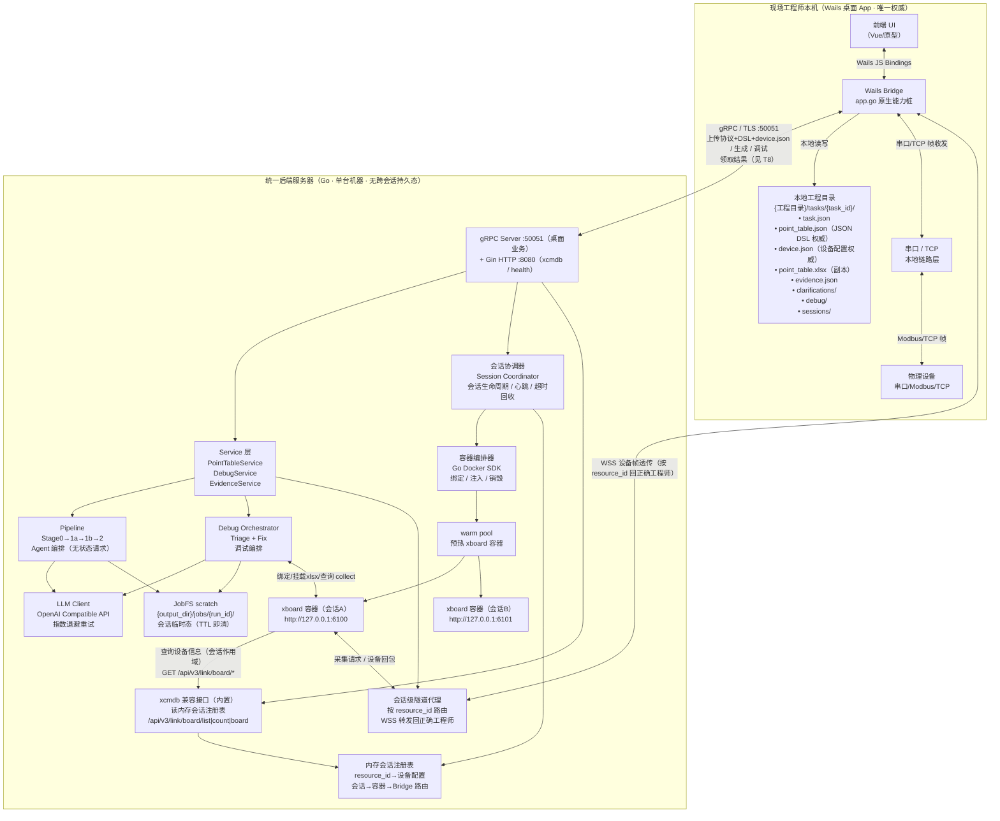
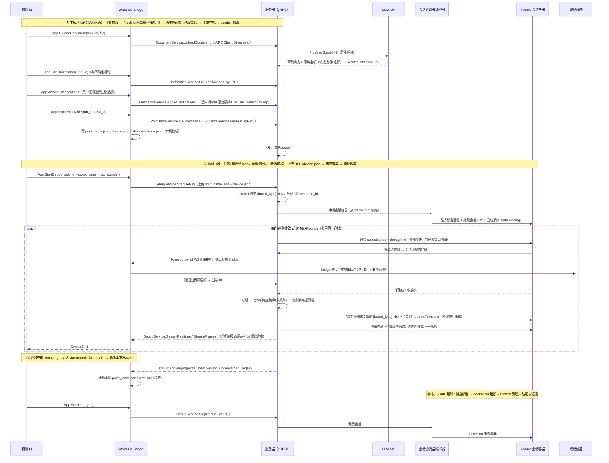
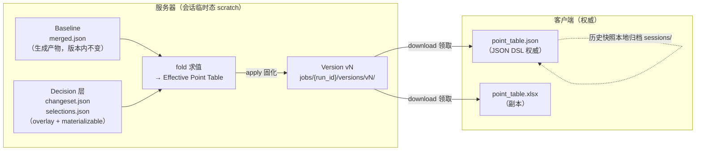
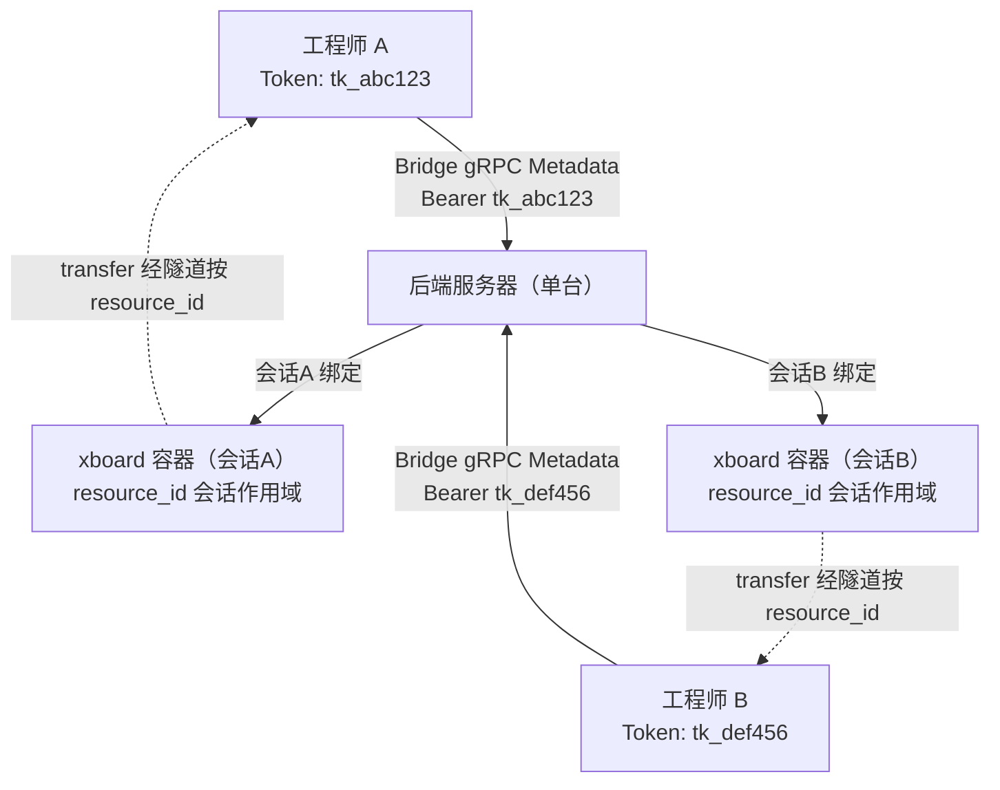

# T1 — 点表智能工作台：系统架构设计

> 本文是「点表智能工作台」项目的**系统架构设计文档（T1）**，只描述**目标状态（To-Be）**的系统架构：C/S 拓扑、本地与服务器能力划分、客户端↔服务器数据流、状态归属与集成契约，供架构评审与后续实施参考。
> **架构基线（已确认）**：**云端无跨会话持久态 + 数据全本地 + 调试时每会话一个 xboard Docker 容器（收工销毁）**。生成 = 无状态请求；调试 = 每会话一个隔离容器。设计依据见 [§2](#2-设计依据)。
> **现状代码 → 目标架构的演进路线**（现有 Gin 服务梳理、差距清单、分阶段实施步骤）见 [T1A-现状到目标架构演进方案.md](../现状&&演进/T1A-现状到目标架构演进方案.md)。
> T2（Agent 设计）见 `T2-Agent设计.md`；T3（数据模型）见 `T3-数据库与数据模型设计.md`；T8（桌面端 gRPC 桥接）见 `T8-gRPC桥接架构设计.md`；T12（存储边界）见 `T12-数据与物料存储边界设计.md`。

---

## 目录

- [§1 目标架构（C/S 拓扑）](#1-目标架构cs-拓扑)
- [§2 设计依据](#2-设计依据)

---

## §1 目标架构（C/S 拓扑）

### 1.1 全局拓扑图

> 关键变化（相对旧版常驻共享 xboard + SQLite 设计）：
> - **xboard 由「云端试运行间单实例」改为「per-session 容器 + warm pool」**；每个调试会话绑定一个独立容器，收工 / 超时即销毁。
> - **SQLite CMDB 永久态删除**；设备配置随 DSL 上传，仅会话存活期间在**内存会话注册表**持有，供 xcmdb 兼容接口按会话作用域查询。
> - 新增**会话协调器**（生命周期 / 心跳 / 超时）、**容器编排器**（Go Docker SDK）、**会话级隧道代理**（按 `resource_id` 把设备帧路由回发起该会话的工程师 Bridge）。

### 1.2 本地能力 vs 服务器能力划分

| 能力维度 | 客户端本机执行 | 必须连服务器 |
|---|---|---|
| **工程管理** | 工程目录创建/打开/切换；本地 `ptw-project.json` 读写；最近工程列表 | — |
| **协议文档** | 本地文件选取（PDF/DOC/XLSX 等）；协议版本记录 | 工程内导入协议后创建 task，并在解析完成后自动触发生成 |
| **AI 生成点表** | — | 全量：Pipeline 编排、LLM 调用、Excel 生成（**无状态请求**，产物全量下发本机）|
| **JSON DSL 权威产物** | `tasks/{task_id}/point_table.json` 落地、读取、展示（权威） | 生成完成后从服务器下载并写本地 |
| **设备配置（CMDB）权威** | `tasks/{task_id}/device.json` 落地、编辑、展示（权威）| 发起调试时随 DSL 上传 |
| **Excel 副本** | `point_table.xlsx` 本地副本展示 | 生成/版本更新后从服务器下载 |
| **证据链** | `evidence.json` 本地缓存展示 | 生成后由 Bridge 通过 gRPC EvidenceService 领取 |
| **澄清会话** | `clarifications/` 本地持久化 | 发送澄清答案触发服务器 MergeWithAnswer |
| **调试会话** | 调试日志、报文记录本地落地 | 调试 Job 在服务器编排；绑定 xboard 会话容器；Triage/Fix LLM 调用 |
| **串口/TCP 通讯** | 原生串口/TCP 帧收发（`SendFrame`）；链路状态显示 | — |
| **规则包** | 本地缓存 `rulePack` 版本 | Bridge 通过 gRPC 校验版本、拉取更新 |
| **鉴权** | Token 本地加密存储 | gRPC Metadata 鉴权与 Token 校验 |

### 1.3 客户端↔服务器数据流

> **生成两阶段**：①「无状态」指云端**无跨会话持久态**，非"单次不可交互"——疑虑点经 `Clarify`/`ApplyAnswers` 由用户选择落定为最终 DSL（详见 T2 §4）。
> **调试自收敛 loop**：②整个 loop 复用同一会话容器；每轮 `ACT` 重部署走 `/updateTemplate`（按 board_type 驱逐内存模板缓存重载，见 §2.3），**禁止只 `/update`**；变更经安全门自动应用，**无人工 Decide/Apply 审批**（详见 T2 §5）。

### 1.4 服务器端有状态 vs 无状态取舍

> **原则**：云端**没有任何跨会话持久态**。所有服务器侧状态都是「会话级软状态」，会话结束 / 超时即销毁；服务器重启不丢任何权威数据（权威全在本机）。

| 状态类型 | 存储位置 | 生命周期 | 归属说明 |
|---|---|---|---|
| **生成 scratch** | 服务器 `jobs/{run_id}/`（文件系统）| 客户端领取后即删；兜底短 TTL（≤24h）| 仅作执行环境；产物全量下发本机权威 |
| **调试 scratch** | 服务器 `jobs/{run_id}/debug/{debug_id}/` | **会话结束 / 超时即清** | 渲染 xlsx、采样数据、changeset 源 |
| **内存会话注册表** | 服务器内存 | 会话存活期间，结束即驱逐 | `resource_id→设备配置`（供 xcmdb 查询）+ 会话→容器→Bridge 路由 |
| **xboard 会话容器** | 服务器 Docker | 绑定即起、收工 / idle 超时 / 隧道断连即 `docker rm` | per-session 隔离，blast radius=1 |
| **warm pool 预热容器** | 服务器 Docker | 空闲资源池，不绑定任何会话数据 | 降冷启动延迟，late binding 注入会话配置 |
| **客户端权威** | 客户端本机工程目录 | 随工程存在 | `point_table.json` / `device.json` / 调试结果是最终权威 |

> **没有了**：旧设计的「SQLite CMDB 永久态」「常驻 jobfs 长期堆积」「常驻共享 xboard」。详见 [T12](T12-数据与物料存储边界设计.md) 与 [T3](T3-数据库与数据模型设计.md)。

### 1.5 统一数据模型（baseline + decision + fold + render + version）

承接 `点表管理规范.md` §2 的分层管线，在 C/S 拓扑下的映射如下（服务器侧均为会话临时态，产物下发本机为权威）：

**核心不变量**（来自规范 §4）：
- PointID 是跨层唯一锚，不随序号漂移
- 序号（ReadSeq/WriteSeq）在 `layout.json` 中统一计算，任何模块只读，不重算
- Baseline 不可变；Decision 可逆；Version 只增不减（版本快照在本机归档）

### 1.6 与 xboard 及内置 xcmdb 兼容接口集成契约

> 这里的 `xcmdb` 不是一个独立外部服务，而是本 Go 后端内置的兼容接口域。它只提供 `info`、`list`、`count` 三类查询能力，**数据源是内存会话注册表，按会话作用域返回**；调用方是当前会话绑定的 xboard 容器；桌面端、工程师和外部用户不直接调用这些接口。

| 接口 | 方向 | 用途 |
|---|---|---|
| 绑定容器 / 挂载 xlsx | 会话协调器→xboard 容器 | 从 warm pool 绑定容器，挂载会话 xlsx，late binding 注入设备配置 |
| `POST /update` | 服务器→会话容器 | 部署 / 更新点表到该会话 xboard 加载位（**不重读已缓存模板**，仅首部署用）|
| `POST /updateTemplate` | 服务器→会话容器 | **调试自收敛 loop 每轮重部署的必经接口**：会话内 DSL 迭代后按 board_type 驱逐内存模板缓存并重建板卡重载（覆盖 `{board_type}.xlsx` 后调用；见 §2.3 / T9 §3.1）|
| `GET /status` | 服务器→会话容器 | 设备健康检查（is_collect） |
| `GET /collect/value` | 服务器→会话容器 | 采集读点最新值（Triage 主数据） |
| `GET /api/v3/project/device/debug?resource_id=&debug_id=` | 服务器→会话容器 | 调试态拉取收发原始帧 + 测点解析值 + 错误码（见 **T9**） |
| `GET /api/v3/link/board/list|count|board` | 会话容器→服务器内置 xcmdb | 拉取设备列表 / 数量 / 单设备（**读内存会话注册表，会话作用域**）|
| docker rm 销毁 | 会话协调器→编排器 | 收工 / 超时回收会话容器 |

> 上述接口在现有代码中的落点与实现状态，见 [T1A](../现状&&演进/T1A-现状到目标架构演进方案.md) §1.7。容器编排与镜像构建见 [T6](T6-部署分发与运维设计.md)；隧道路由见 [T8](T8-gRPC桥接架构设计.md) / [T9](../现状&&演进/agent%20详细设计/T9-AI调试报文采集与诊断数据链路设计.md)。

### 1.7 多工程师/多客户端隔离方案

- **Token 签发**：服务器颁发 `project_token`，绑定 `project_id` + 权限范围
- **业务鉴权**：gRPC Auth Interceptor 从 Metadata `authorization: Bearer <token>` 提取上下文；Gin AuthMiddleware 仅服务 xcmdb 兼容接口
- **会话级隔离**：调试时每会话独立 xboard 容器 + 会话作用域 `resource_id`；容器边界即隔离边界，多工程师互不可见、互不污染（消除共享 xboard 的模板缓存污染问题，见 [§2.3](#23-容器化的事实依据xboard-实测缓存缺陷)）
- **路由隔离**：会话级隧道代理按 `resource_id` 把设备帧路由回发起该会话的工程师 Bridge，不会串到其他工程师
- **并发保护**：会话准入受并发上限约束（warm pool 容量 + Docker 资源）；同一 `project_id + resource_id` 调试串行化

---

## §2 设计依据

本架构的取舍不是凭空设定，而是对照业界成熟范式、并结合 xboard 的实测行为得出的。本节给出对照评分卡、三处有意偏离的理由，以及交互式会话生命周期的注意点。

### 2.1 业界范式对照评分卡

| 范式 | 它怎么做 | 我们借鉴 | 对齐度 |
|---|---|---|---|
| **OpenAI Codex / ZDR** | 计算请求自包含，输入即上下文，服务端不留对话 / 代码持久态 | 生成 = 无状态请求，产物全量下发本机，scratch 即清 | 高 |
| **Cursor** | 本机是代码权威，云端只存派生物（嵌入 / 索引），可随时重建 | 本机为唯一权威；我们更彻底，云端连派生态也不长期留 | 高（更彻底）|
| **Local-first software** | 本机数据为 primary，离线可用，云端为协作 / 同步层 | 数据全本地、权威在本机；但不引入 CRDT | 中（见 §2.2）|
| **Cloudflare Sandboxes / Anthropic Code Execution / ARC** | per-session 隔离沙箱 + warm pool + late binding + teardown | 调试 = per-session xboard 容器 + warm pool + 注入配置 + 收工销毁 | 高 |

### 2.2 三处有意偏离及理由

1. **比 Cursor 更彻底，云端不留派生态**：Cursor 为加速会在云端留嵌入 / 索引。我们的派生态（渲染 xlsx、merged.json）重建成本极低（一次本地上传即可重渲染），没有长期保留的收益，反而增加合规与一致性负担，因此会话结束即清。
2. **不做 CRDT / 多端实时协同**：Local-first 常配 CRDT 解决多端并发写冲突。我们的场景是**单工程师对单设备**的调试，权威单点在本机，不存在多端并发写同一份点表的需求，引入 CRDT 是过度工程。
3. **容器化是为「状态隔离」而非「安全沙箱」**：Cloudflare/Anthropic 用沙箱主要防不可信代码（seccomp/gVisor）。我们容器化 xboard 的目的是**会话间状态隔离**（模板缓存 / resource_id / 挂载），运行的是自家可信组件，因此不需要重度安全沙箱化，普通 Docker 容器即可。

### 2.3 容器化的事实依据（xboard 实测缓存缺陷）

选择「每会话一个 xboard 容器」而非「共享单实例」，是由 xboard 自身的实测行为决定的：

- **模板缓存按 `device_type` 共享**：xboard 把点表模板按 `device_type` 缓存在内存（固定槽位 LRU，约 10 槽），同型号设备共用一份缓存模板（[template_manager.cpp](../../../../xboard.v2/drivers/foundation/src/template_manager.cpp)）。
- **`/update` 不重读已缓存模板**：按 `resource_id` 的 `/update` 不会重新读取已缓存的 Excel，需 `/updateTemplate` 才驱逐重载（[board_manager.cpp](../../../../xboard.v2/drivers/foundation/src/board_manager.cpp)）。
- **文件按 `device_type` 命名互相覆盖**：Excel 路径由 `device_type`（`.`→`_`）拼出（[load_template.cpp](../../../../xboard.v2/pkg/template/load_template.cpp)），同型号不同设备的点表文件会互相覆盖。

在共享单实例下，多工程师 / 多会话同时调试同型号设备，会出现**模板缓存污染、读到陈旧表、文件互相覆盖、LRU 抖动**。每会话一个独立容器后，`device_type` / `resource_id` 取自然值即可，容器边界就是隔离边界，从根本上消除上述问题。

### 2.4 交互式会话生命周期注意点

xboard 会话容器**不是 CI runner 心智的「跑完即弃」批处理**，而是**交互式长会话**：调试期间它要持续维持「容器 ↔ 会话级隧道代理 ↔ 工程师本机 Bridge ↔ 真实设备」的实时链路，工程师可能反复采集、改表、复采。因此：

- 用**心跳 + idle 超时**管理生命周期，而非固定执行时长；
- 隧道断连 / 工程师离线需有兜底回收（避免容器泄漏）；
- 会话内 DSL 迭代改表，要走 `/updateTemplate` 驱逐缓存或重建容器（单设备成本低），不能只 `/update`；
- warm pool 仅预热「空白」容器，会话配置在绑定时 late binding 注入，预热容器不携带任何会话数据。
