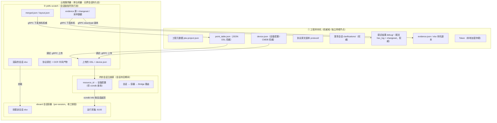
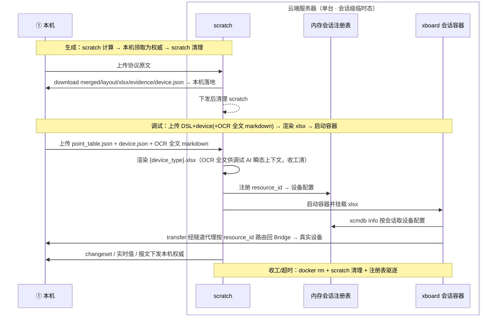

# T12 — 点表智能工作台：数据与物料存储边界设计

> 本文是「点表智能工作台」项目的**数据与物料存储边界设计文档（T12）**，只描述**目标状态（To-Be）**：在「云端无状态计算 + 数据全本地」架构下，**哪些数据 / 文件存在工程师本机、哪些只在云端会话存活期间临时存在**，以及每一类物料的「权威方 / 副本方 / 流转方向 / 生命周期」。
> 本文是对 [T1 §1.2/1.4/1.5](T1-系统架构设计.md) 能力划分与状态归属、[T3 §1.4](T3-数据库与数据模型设计.md) 存储归属的**主题化提炼与扩充**，作为「存储边界」这一独立设计问题的权威说明。
> **架构基线（已确认）**：云端不再持久化任何业务状态（无 SQLite CMDB、无常驻 jobfs）；调试改为**每会话启动一个 xboard Docker 容器，收工销毁**。现状代码与目标的差距见 [T1A](../现状&&演进/T1A-现状到目标架构演进方案.md) / [T3A](../现状&&演进/T3A-数据存储现状与演进方案.md)。

---

## 目录

- [§1 为什么需要一份存储边界文档](#1-为什么需要一份存储边界文档)
- [§2 两类存储/计算域](#2-两类存储计算域)
- [§3 物料与数据全量归属清单](#3-物料与数据全量归属清单)
- [§4 关键物料的边界详解](#4-关键物料的边界详解)
- [§5 跨边界流转与「谁是源」规则](#5-跨边界流转与谁是源规则)
- [§6 边界设计不变量](#6-边界设计不变量)
- [§7 生命周期与清理策略](#7-生命周期与清理策略)
- [§8 待对齐项与现状差距](#8-待对齐项与现状差距)

---

## §1 为什么需要一份存储边界文档

在「云端无状态计算 + 数据全本地」架构下，同一份「点表」会以**不同形态、出于不同目的**短暂或长期存在于多个位置：工程师本机有 JSON DSL 权威、设备配置权威和调试结果权威；云端在一次生成或一次调试会话**存活期间**会有临时产物（OCR 中间态、渲染的 xlsx、采样数据），以及一个临时启动的 xboard 容器。如果不把边界一次性讲清楚，极易出现以下问题：

- **权威漂移**：分不清哪份是真身，改了副本却没回写权威；
- **隐私 / 合规风险**：本应只留本机的现场数据（设备帧、报文）被误存云端；
- **状态泄漏**：把「会话级临时态」当「权威」长期保留，或会话结束后容器/产物未销毁导致泄漏；
- **跨工程师污染**：多个工程师共用同一份云端态导致互相覆盖（本架构用 per-session 容器从根本上消除，见 [§4.2](#42-xboard-会话容器与采集-xlsx)）。

本文用**统一的归属语言**消除这些歧义：每一类物料只有一个明确的「权威方」，云端只持有可随时重建、会话结束即销毁的临时态。

### 1.1 核心设计原则

| 原则 | 说明 |
|---|---|
| **内容权威全归本机** | 点表内容（JSON DSL）、设备配置（device.json）、现场采集的设备帧 / 报文、澄清决策、调试结果，权威都在工程师本机工程目录 |
| **云端无跨会话持久态** | LLM 调用、Agent 编排、生成 / 调试会话的执行过程在服务器，所有产物均为**会话级临时态**，会话结束即清；服务器重启不丢任何权威数据（因权威不在云端）|
| **调试 = 每会话一个 xboard 容器** | 调试时按会话临时启动一个 xboard Docker 容器，挂载该会话的 xlsx、注入该会话的设备配置；收工 / 超时即 `docker rm` 销毁。容器边界即多工程师隔离边界 |
| **设备配置随 DSL 上传** | xboard 采集所需的设备配置（protocol / transfer / status_rule / device_type）存本机 `device.json`，发起调试时随 DSL 上传，云端仅在内存中、仅会话存活期间持有 |
| **副本可重建，权威不可丢** | 任何云端临时态（scratch、渲染 xlsx、容器）丢失都能从本机权威重新生成；本机权威丢失即数据丢失 |

---

## §2 两类存储/计算域

> **拓扑前提**：真正的网络边界只有一处——工程师本机 ① ↔ 云端服务器 ②。云端是**单台服务器**，其上的 jobfs scratch、内存会话注册表、xboard 会话容器都是**会话级临时态**，跨会话零持久。xboard 不再是常驻的共享单实例，而是每个调试会话临时启动的容器。

| # | 存储/计算域 | 物理位置 | 定位 | 持久性 |
|---|---|---|---|---|
| ① | **本机权威域** | 工程师电脑工程目录（**独立网络节点**）| 点表内容、设备配置、现场数据、决策、调试结果的**权威** | 随工程长期存在 |
| ② | **云端会话级临时态** | 后端服务器（单台机器）| 生成 / 调试会话的**执行环境与中间产物**，分三块：jobfs scratch（文件）/ 内存会话注册表 / xboard 会话容器 | 会话存活期间，结束 / 超时即销毁；跨会话零持久 |

> 云端 ② 的三块（scratch / 内存注册表 / 容器）同机协作，进程内调用或本地文件操作；它们都不跨会话保留。网络传输 / 鉴权 / TLS 只发生在 ① ↔ 服务器这条链路。

---

## §3 物料与数据全量归属清单

> 图例：✅权威 / 📄副本 / ⏳会话临时态 / —不涉及

| 物料 / 数据 | ① 本机 | ② 云端会话临时态 | 权威方 |
|---|---|---|---|
| 工程元数据 `ptw-project.json` | ✅ | — | 本机 |
| 协议点表任务列表与状态 | ✅ | — | 本机 |
| **点表内容（JSON DSL `point_table.json`）** | ✅ | ⏳上传副本 / 生成产物 | **本机** |
| **设备配置（CMDB `device.json`）** | ✅ | ⏳上传后入内存注册表 | **本机** |
| **xlsx（采集用渲染制品）** | 📄副本（展示用）| ⏳从上传 DSL 渲染 → 挂载入会话容器 | 见 [§4.2](#42-xboard-会话容器与采集-xlsx) |
| 证据链 `evidence.json`（含文档页 `docPages`：原文 + OCR 片段，供 UI / 溯源）| ✅下发后落地 | ⏳生成源 | 本机（生成后下发留存）|
| 协议原文（PDF/Word/图片原件）| ✅ | ⏳上传副本（供 OCR / 生成）| 工程师本机 |
| **OCR 全文 markdown（MinerU 还原的协议原文）** | ✅ 下发本机持久（`ocr/{docId}.md`）| ⏳生成产物 / **调试上传作 AI 上下文** | **本机** |
| MinerU 纯中间产物（切片 / 版面图等）| — | ⏳ | 云端 scratch（临时，不下发）|
| 澄清会话（问题/选项/决策）| ✅ `clarifications/` | ⏳合并执行态 | **本机** |
| 调试报文日志（TX/RX hex 帧）| ✅ `debug/hex_log.json` | ⏳采样数据 | **本机** |
| 调试逐轮留痕 `debug/{id}/rounds/{n}/`（`observation`/`verdicts`/`apply_record`/`converged`）+ 会话 `session.json` | ✅落地归档 | ⏳自收敛 loop 源 | 本机（loop 自动应用，无人工评审；见 T3）|
| 历史版本快照 `sessions/` | ✅本地归档 | — | 本机归档 |
| 设备注册（CMDB / 供 xboard 查询）| ✅ `device.json` 上传源 | ⏳内存会话注册表 | **本机**（云端仅会话内存持有）|
| 规则包 `rulePack` | 📄缓存版本号 | ⏳校验时拉取 | 云端规则包服务（只读分发，非业务状态）|
| 工程用量汇总 | ✅本地累计 | — | 本机（云端仅按请求回传单次计量）|
| 鉴权 Token | ✅本地加密存储 | ⏳仅鉴权时校验 hash | 服务器签发 / 本机持有 |

> 注：本架构下云端**不再有 SQLite 永久态**。设备身份、任务索引、版本索引等在旧设计中归 SQLite 的内容，权威均移到本机；云端仅在会话存活期间于内存持有所需子集。

---

## §4 关键物料的边界详解

### 4.1 点表内容与设备配置：JSON DSL 与 device.json 是本机权威

- **点表内容权威**：本机 `tasks/{task_id}/point_table.json`。它是工程师编辑、AI 调试迭代、最终验收的真身，给「人 + AI」使用。
- **设备配置权威**：本机 `tasks/{task_id}/device.json`（protocol / transfer / status_rule / device_type / is_collect / limit_interval）。它是 xboard 采集所需的设备实例配置，发起调试时随 DSL 一起上传。
- 云端 scratch 的 `merged.json` / `layout.json` 是**生成执行态**，下发本机后即可清理。
- 云端**不存任何持久点表内容或设备注册**；只在调试会话存活期间，把上传的 device.json 放进内存会话注册表供 xcmdb 查询。

### 4.2 xboard 会话容器与采集 xlsx

xlsx 与 JSON DSL 是**两种不同语义的产物**，必须分开理解：

| 维度 | JSON DSL（`point_table.json`）| xlsx |
|---|---|---|
| 用途 | 人 + AI 编辑 / 调试 / 验收 | xboard 容器采集加载 |
| 权威方 | **本机** | **会话临时态**（云端从上传 DSL 渲染，挂载入会话容器；收工销毁）|
| 本机的份 | 权威 | 只读副本（展示用，可从 DSL 重渲染）|

调试时的 xlsx 流转：

1. 客户端上传 `point_table.json` + `device.json`（+ 相关文档的 **OCR 全文 markdown** 作 AI 调试上下文，见 [§4.4](#44-协议原文与-ocr-全文本机持久--调试时作为-ai-上下文上传)）；
2. 云端在 scratch 把 DSL **渲染为 `{device_type}.xlsx`**（文件名 = `device_type` 把 `.` 换成 `_`）；
3. 启动 / 绑定一个 xboard 会话容器，把该 xlsx **挂载进容器的点表目录**；
4. 把 device.json 写入内存会话注册表，容器内 xboard 通过 xcmdb Info 按会话拿到设备配置；
5. 会话结束 / 超时：`docker rm` 销毁容器，scratch 与挂载随之清理。

> **为什么用 per-session 容器**：xboard 的点表模板按 `device_type` 缓存在内存（固定槽 LRU），`/update`（按 resource_id）不会重读已缓存的 Excel，且文件按 `device_type` 命名会被同型号其它设备覆盖。若多个工程师共用一个常驻 xboard，会出现**模板缓存污染、陈旧表、跨工程师互相覆盖**。每会话一个独立容器让 `device_type` / `resource_id` 取自然值即可，容器边界就是隔离边界，blast radius = 1。该判定的代码依据与设计对照见 [T1 设计依据](T1-系统架构设计.md)。
>
> **会话内迭代改表**：调试中 AI 改了 DSL → 重渲染 xlsx，需要对绑定容器调 `/updateTemplate`（按 device_type 驱逐模板缓存重载）或重建容器（单设备，成本低）；不能只调 `/update`（会读到陈旧模板）。

### 4.3 现场数据（设备帧 / 报文）：权威只在本机

设备的串口 / TCP 帧由本机 Bridge 直接收发，因此 **TX/RX hex 报文日志的权威天然在本机** `debug/{debug_id}/hex_log.json`。云端 scratch 中的采样数据属调试会话临时态，会随会话销毁清理。这一边界同时满足隐私 / 合规诉求：现场原始报文不在云端长期留存。

### 4.4 协议原文与 OCR 全文：本机持久 + 调试时作为 AI 上下文上传

调试时 AI 修改点表，需要**完整的协议原文（OCR 还原的 markdown 全文）作为上下文**——不是 `evidence.json` 里的字段级片段，而是**整篇协议文本**，因为调试可能涉及协议任意位置。因此 OCR 全文必须作为本机物料持久保存，不能当临时中间产物清掉。

- **协议原件**：本机 `protocol/` 保留 PDF/Word/图片原件，供离线查阅，是权威。
- **OCR 全文 markdown（核心）**：生成阶段 MinerU 把协议原文 OCR 还原成 markdown 全文；**生成结束随产物一并下发本机持久化**（`tasks/{task_id}/ocr/{docId}.md`，见 [T3 §1.2](T3-数据库与数据模型设计.md)）。它是调试 AI 的协议上下文来源，**权威在本机，不可当临时中间产物清掉**。
- **与 `evidence.json` / `docPages` 的区别**：后者是字段级证据指针 + 选中页的还原片段，供 UI 展示与建议溯源（`evidenceRef → docId + page`）；与 OCR 全文是两回事，**不能互相替代**——AI 上下文要的是全文，溯源要的是定位片段。
- **调试上传**：点击调试时，客户端把相关文档的 **OCR 全文 markdown** 随 `point_table.json` + `device.json` 一并上传；云端会话**瞬态持有、收工清除**。由于云端无跨会话持久态，上一次生成 scratch 的 OCR 已清，必须由本机重新提供。
- **为什么不冲突**：OCR 全文权威在本机（`ocr/` 落地），云端只在调试会话存活期间临时使用、不长期留存——完全符合「内容权威全归本机 + 云端无跨会话持久态」。MinerU 的纯中间产物（切片、版面图等）才留云端 scratch、会话结束清理。

### 4.5 凭据与配置类

| 物料 | 本机 | 云端 | 说明 |
|---|---|---|---|
| Token | 本地**加密**存储 | 仅鉴权时校验 hash，不落库 | 服务器签发，本机持有，不明文留存 |
| 规则包 | 缓存版本号 | 只读分发服务 | Bridge 经 gRPC 校验版本、拉取更新；非业务状态 |
| 用量数据 | 本地累计权威 | 仅按请求回传单次计量 | 仅展示工程级汇总，**不暴露** token/model/明细 |

---

## §5 跨边界流转与「谁是源」规则

**谁是源（Source of Truth）判定规则**：

1. **能被人 / AI 直接编辑修改的 → 源在本机**（DSL、device.json、澄清决策）；
2. **由设备物理产生的 → 源在本机**（设备帧、报文、调试结果）；
3. **由 LLM/Agent 执行过程产生、且可重新生成的 → 源在云端 scratch（会话临时态）**；
4. **专供 xboard 采集消费的 → 制品（渲染 xlsx）挂载入会话容器，源仍是本机 DSL**；
5. **云端不再有「跨会话长期检索的永久态」**——旧设计中归 SQLite 的索引 / 注册，权威全部移到本机。

---

## §6 边界设计不变量

1. **单一权威**：每类物料只有一个权威方（全在本机）；副本 / 制品永远从权威派生，禁止反向把副本当权威。
2. **本机权威不出云端明文**：现场设备报文、Token 明文、点表 DSL 不在服务器长期留存。
3. **云端跨会话零持久**：生成 / 调试会话结束后，云端不残留任何业务数据；服务器重启不丢任何权威。
4. **临时态可重建、可销毁**：scratch、渲染 xlsx、xboard 容器任何丢失都能从本机权威重新生成。
5. **容器边界即隔离边界**：调试一会话一容器，blast radius = 1，多工程师互不可见、互不污染。
6. **版本只增不减**：历史版本快照在本机归档，不可覆盖删除。

---

## §7 生命周期与清理策略

| 物料 | 位置 | 清理策略 |
|---|---|---|
| 生成 scratch（merged/xlsx/evidence/OCR）| 云端 jobfs | 客户端领取后即可删；兜底短 TTL（建议 ≤ 24h）|
| 失败生成 scratch | 云端 jobfs | 失败后短 TTL（建议 ≤ 24h）清理 |
| 调试 scratch（渲染 xlsx / 采样数据 / changeset 源）| 云端 jobfs | **会话结束 / 超时即清**，随容器销毁 |
| 内存会话注册表条目 | 云端内存 | 会话结束 / 超时即驱逐 |
| xboard 会话容器 | 云端 Docker | 收工 / idle 超时 / 隧道断连兜底 → `docker rm` 销毁 |
| 本机工程目录全部内容 | 本机 | 随工程存在，由工程师自行管理 / 备份 |

> 本机工程目录的备份与迁移策略见 [T6 部署分发与运维设计](T6-部署分发与运维设计.md)。云端 warm pool 预热容器属空闲资源池，不绑定任何会话数据。

---

## §8 待对齐项与现状差距

本文描述**目标态边界**。与现状代码的主要差距（详见 [T1A](../现状&&演进/T1A-现状到目标架构演进方案.md) / [T3A](../现状&&演进/T3A-数据存储现状与演进方案.md)）：

| 差距 | 现状 | 目标 |
|---|---|---|
| 客户端权威 | 所有产物在服务器，客户端无本地持久化 | DSL + device.json + evidence + 调试结果下发 / 落地本机，云端转会话临时态 |
| 设备 CMDB | 服务器 SQLite `devices` 永久表 | 本机 `device.json` 权威，云端仅会话内存注册表，**去除持久 SQLite** |
| xboard 拓扑 | 常驻共享单实例（模板按 device_type 缓存、易污染）| **每会话一个 xboard 容器**，收工销毁，容器边界隔离 |
| jobfs | 无清理机制，产物永久堆积 | 会话临时态，结束 / 超时即清；生成 scratch 领取后即删 |
| 工程隔离 | `resource_id` 纯自增无隔离 | 会话级 resource_id + 容器隔离 + Token 工程级隔离 |
| Token 存储 | 无鉴权 | 本机加密存储 + 服务器仅校验 hash |
