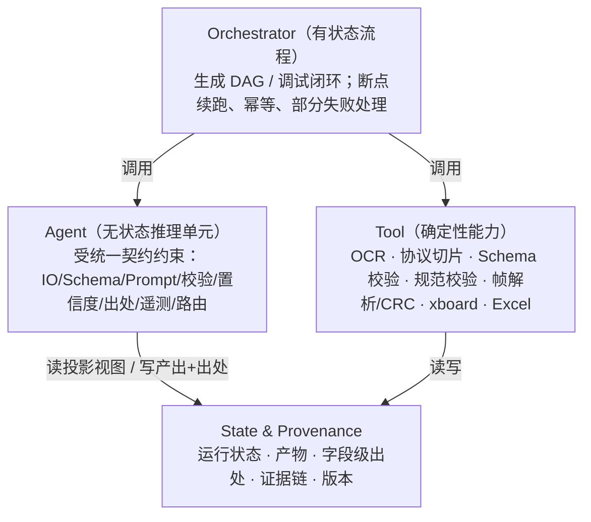
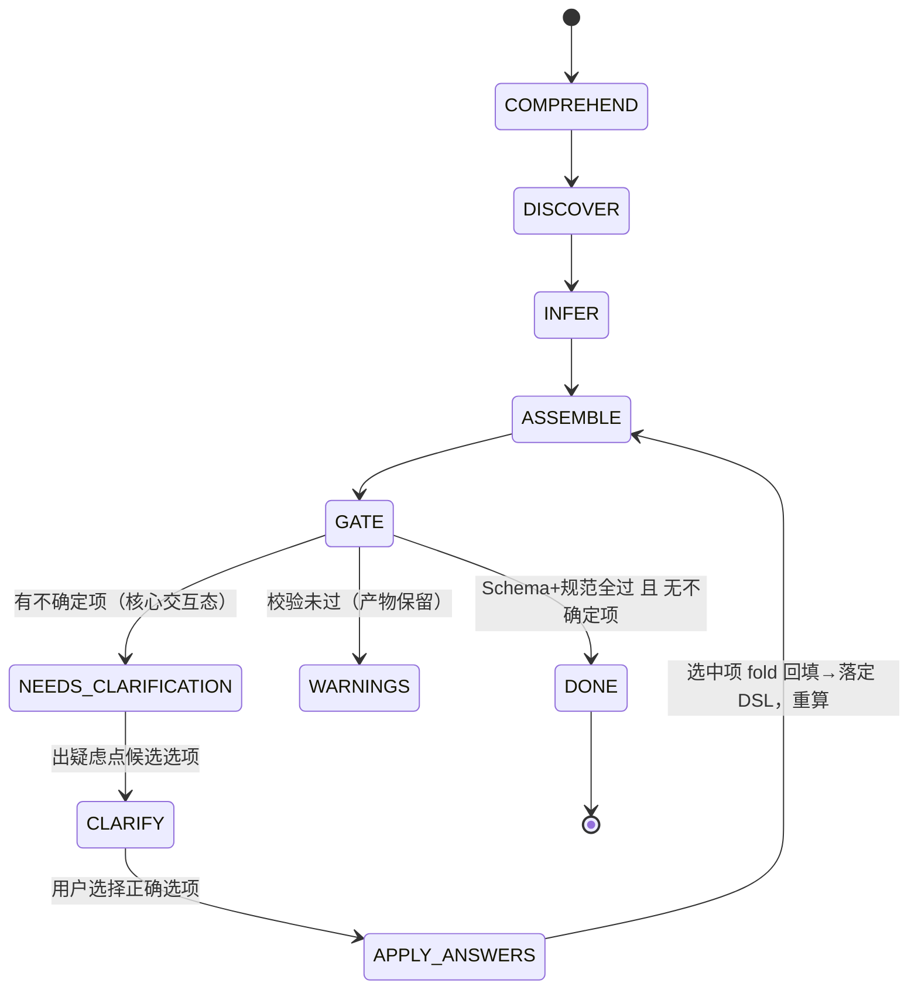
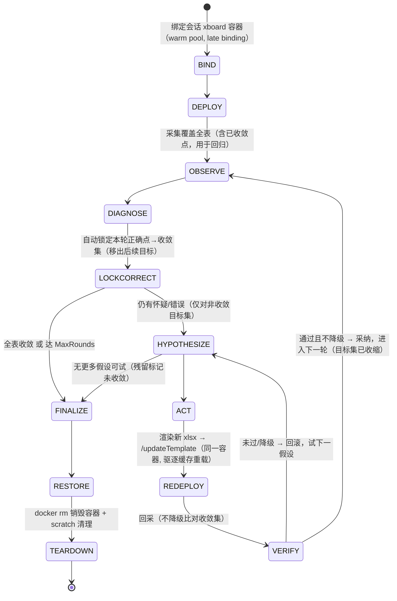

# T2 — 点表智能工作台：Agent 系统设计

> **文档定位**：本文是「点表智能工作台」的 **Agent 系统设计（T2，设计层）**——产品两大核心 AI 能力（生成 / 调试）的契约、原则、Agent 抽象与编排状态机。它从两个核心能力**自顶向下推导**，Agent 集合是能力分解的结果，不是写死的清单。
> 关联文档：T1（系统架构）/ T3（数据与证据模型）/ T7（质量保障与 Eval）/ T9（调试报文与诊断数据链路）。
> **实现层落地见 T10**：本文（T2）定义设计层（契约、原则、状态机）；**T10「Agent 能力包实现设计」**给出按 Go 代码落地的包结构、可编译接口骨架、默认适配器与构造装配。两份文档命名与契约一一对齐；如有冲突以本文契约为准。
> **配套仓库**：本文与 `ai-point-table` 仓库配套阅读。文中引用但未展开的领域类型（`types.*`/`debug.*`/`layout.*`）、确定性 Tool 与 Prompt 正文以仓库代码为准；本文负责契约与语义。

---

## 目录

- [§1 设计立场与原则](#1-设计立场与原则)
- [§2 两大核心能力契约](#2-两大核心能力契约)
- [§3 Agent 抽象与封装契约](#3-agent-抽象与封装契约)
- [§4 生成能力的编排设计（可落地）](#4-生成能力的编排设计可落地)
- [§5 调试能力的编排设计（可落地）](#5-调试能力的编排设计可落地)
- [§6 质量保障与评估](#6-质量保障与评估)

---

## §1 设计立场与原则

### 1.1 产品的两个核心 AI 能力

整套 Agent 系统只为两件事服务，其余都是支撑：

1. **生成（Generation）**：协议文档 → 结构化点表（带证据、不确定项、规范校验）。
2. **调试（Debugging）**：已部署点表 + 现场设备数据 → 诊断与修正（带证据、可回采验证）。

设计自这两个能力**自顶向下推导**，Agent 集合是能力分解的结果，不是一张写死的清单。

### 1.2 设计原则

| # | 原则 | 含义 |
|---|---|---|
| P1 | **Agent 是被封装的契约单元** | 不是自由函数。每个 Agent 显式声明 类型化 IO、输出 Schema、版本化 Prompt、校验/修复策略、置信度/不确定性、出处、遥测、模型路由档。 |
| P2 | **能力优先于"Agent 动物园"** | 按**能力家族**组织 Agent（如"字段推断家族"），新增维度=新增家族成员，不改编排骨架；不维护写死的 N 项清单。 |
| P3 | **分层解耦** | Agent（无状态推理）/ Orchestrator（有状态流程）/ Tool（确定性能力）/ State&Provenance（产物与证据）四层分离。LLM 只是一种 Tool。 |
| P4 | **质量在回路内** | 结构化输出 + **校验驱动的修复重试** + 不确定性作为一等产出驱动澄清/现场验证；绝不静默放过非法输出。 |
| P5 | **可复现可追溯** | 每次运行钉死 模型+Prompt 版本；字段级出处（哪个 Agent/Prompt/模型产出）→ 证据链（对齐 T3）。 |
| P6 | **可观测、成本可控** | 每 Agent 延迟/重试/Token/校验失败率埋点；按难度档做模型路由（仅云端后端配置，不暴露客户端）。 |

### 1.3 确定性优先

能用规则、查表、解析、校验确定性完成的，**不交给 LLM**（如序号分配、CRC 校验、Schema 校验、规范门禁、帧解析）。LLM 只承担"需要语义理解与推断"的环节。这是控制成本、提升可复现性的根本手段。

---

## §2 两大核心能力契约

先把两个能力定义成**黑盒契约**（输入 / 输出 / 质量底线 / 失败语义），§4、§5 的编排都是为兑现这两个契约。

### 2.1 能力一：生成（Protocol → Point Table）

| 维度 | 契约 |
|---|---|
| **输入** | 协议文档集（PDF / Word / 图片 / 文本）；设备上下文（型号/品类，可选） |
| **交互形态（核心）** | **两阶段**：① 先产出完整草稿点表 + 不确定项清单（每个疑虑字段给候选选项 + 推荐 + 证据）；② 用户对疑虑点逐项选择，**选中项经确定性回填（fold）成为最终点表 DSL 字段值**。不再是"一次性产出固定结果或失败" |
| **输出** | 结构化点表（合并 DSL + 布局/序号 + Excel）；**每字段带证据与出处**；不确定项清单（候选选项→用户选择→落定）；规范校验结果 |
| **质量底线** | ① 输出 100% 通过 Schema + 规范校验，否则显式标 `warning` 不静默通过；② 所有非确定字段必须带不确定性标注并以候选选项暴露给用户选择；③ 字段准确率达 T7 门槛 |
| **失败语义** | 阶段产物可落盘、可断点续跑；同输入+同版本可重放（幂等）；单点/单批失败降级为不确定项（转候选选项交用户选择），不拖垮整批 |

### 2.2 能力二：调试（Point Table + Device → Diagnosis & Fix）

| 维度 | 契约 |
|---|---|
| **输入** | 已部署点表 + 现场实时值 + 收发报文（来自 T9 诊断数据链路）+ 协议上下文 |
| **交互形态（核心）** | **唯一形态=自收敛闭环**：每轮 采集→诊断→自动锁定已正确点→对剩余点提假设并自动应用修改（重部署）→回采验证，棘轮式逐轮收缩，直到 Agent 判定全表收敛。**无 report-only 模式、无每批变更的人工 Decide/Apply 审批门** |
| **输出** | 逐点判定（正确/怀疑/错误 + 理由 + 证据）；通讯层诊断（CRC/异常码/字节序/超时）；分级修正假设；回采验证结论；每轮自动应用留痕 + 收敛集快照；最终收敛点表（或达 `MaxRounds` 时附未收敛点列表） |
| **质量底线** | ① **写点安全门**：用户预锁定点 / 已判正确点（自动收敛锁定）受保护，绝不被改；② 每条结论绑定证据（值 + 帧 + 协议）；③ 修正必须可回采验证且**不降级**（不破坏收敛集）才采纳 |
| **失败语义** | loop 内自动应用变更，仅受安全门约束（不降级 / PatchGuard / 用户预锁定点）；所有变更可回滚；全程出处留痕；达 `MaxRounds` 仍有残留 → 残留点标记未收敛（信息输出，非人工审批中间态） |

> 两个契约共享同一套 Agent 抽象（§3）、证据模型（T3）、模型路由与评估（§6）。调试不是另起一套体系。
> **不做向后兼容**：调试彻底移除 report-only 与人工评审→apply 路径，唯一形态即自收敛 loop。

---

## §3 Agent 抽象与封装契约

> 本章把 Agent 定义为受统一契约约束、可被编排/评估/观测统一对待的封装单元（而非自由函数），并钉死两个能力包对外的集成契约。

### 3.1 四层分层模型



- **Agent**：只做"需要语义推断"的事，无状态、可独立测试、可被 mock。
- **Orchestrator**：唯一持有流程状态，负责调度、并发、断点、幂等、失败降级。
- **Tool**：确定性能力（P3/P1.3），优先于 LLM。
- **State & Provenance**：产物与证据的单一事实源，对齐 T3。

### 3.2 Agent 契约（封装边界）

每个 Agent 必须声明以下要素，实现该契约即可被统一编排、评估、观测（语言无关，下为 Go 形态示意）：

```go
// Agent 是被 Orchestrator 统一对待的封装单元。
type Agent[In, Out any] interface {
    Descriptor() AgentDescriptor                 // 身份与可路由元信息
    Run(ctx context.Context, in In) (Result[Out], error) // 单次推理，输出已过三道闸（§3.3）
}

type AgentDescriptor struct {
    Name         string          // 稳定标识（遥测/出处 label）
    Version      string          // 语义版本
    PromptRef    string          // 版本化 prompt 引用（§6）
    OutputSchema json.RawMessage // 输出 JSON Schema（结构闸）
    ModelTier    ModelTier       // 难度档 → 模型路由（§3.6）
}

// Result 把"值"与"质量元信息"一起返回，质量不是事后补的。
type Result[Out any] struct {
    Value      Out
    Confidence map[string]float64 // 字段级置信度
    Uncertain  []Uncertainty      // 不确定项（一等产出，§3.4）
    Provenance Provenance         // {agent, prompt_version, model, ts}（§3.5）
    Telemetry  CallTelemetry      // 延迟/重试/token/各闸失败计数（§6）
}
```

要点：

- **类型化 IO + 投影视图**：Agent 只接收其职责所需字段（投影），避免 LLM 看到无关字段而过度推断或污染格式，也便于独立测试。
- **契约即扩展点**：新增能力 = 新增一个实现该契约的 Agent，Orchestrator/评估/观测无需改动。

#### 封装边界总则（确定性外壳 vs LLM 内核）

整个系统遵循一条硬边界，贯穿生成与调试两大能力（呼应 §1.3「确定性优先」）：

- **LLM Agent = 单次、无状态、可重放**：`ClarifyAgent` / `DiagnoseAgent` / `Repairer`（调试推理内核）只做一次推理——输入投影 → 输出判定/选项/假设，**绝不持有 loop 态、不自判收敛、不直接落地副作用**。同输入可重放（幂等），便于评测与回放。
- **确定性控制器 = 唯一持状态者**：生成控制器（澄清回填、版本落定）与调试自收敛控制器（收敛集棘轮锁定、`PatchGuard`、回采不降级、`/updateTemplate` 重部署、容器复用、`MaxRounds` 预算、**收敛判定**、回滚、逐轮留痕）全部是确定性编排，**不是 Agent**。这些安全/收敛不变量永不交给 LLM。
- **`ApplyAnswers` 是确定性 fold（非 LLM）**：两阶段生成第二阶段，用户选中项经字段白名单 setter 直接写入 DSL，不做 LLM 二次推断（详见 §4.7）。
- **推理内核可插拔**：调试"提什么修复假设"这一格抽象为 `Repairer` 端口（§5.8），v1 单次 LLM、v2 agentic 工具循环，可热插拔而外壳零改动——但 ACT/VERIFY/LOCK/收敛始终在确定性外壳内。

### 3.3 输出三道闸（在 Agent 内部完成）

Agent 的输出在返回前必须依次过三道闸，任一失败即"携带具体错误反馈给模型"做**有限次修复重试**；仍失败则**降级为不确定项上抛，绝不静默通过**：

| 闸 | 检查 | 例 |
|---|---|---|
| ① 结构闸 | 输出符合 JSON Schema | 缺 required 字段、类型错 |
| ② 值域闸 | 枚举/范围/引用完整性 | FC 码非法、寄存器地址未在协议出现、解析函数不在白名单 |
| ③ 语义闸 | 跨字段一致性 | parser 与 dataType 矛盾、写解析与读解析冲突 |

> 这与"仅 JSON 解析失败才重试"有本质区别：值域/语义错误（合法 JSON 但内容错）现在也会被拦截并修复或上抛。

### 3.4 置信度与不确定性（一等产出）

- 不确定性**不是异常**，是正常产出。Agent 对拿不准的字段给出 `Uncertainty{字段, 候选项, 推荐, 理由, 证据引用}`。
- 低置信/有不确定项的字段，按能力走不同回路：生成 → 人工澄清队列（§4.5）；调试 → 现场验证回路（§5.2）。

### 3.5 出处与证据链

- 每个产出字段标注 `Provenance{agent, prompt_version, model, ts, evidence_ref}`，汇入证据链（对齐 T3 的 FieldEvidence）。
- 作用：可解释（为什么这个字段是这个值）、可复现（钉死版本可重放）、可审计。

### 3.6 模型路由（按难度档）

- Agent 通过 `ModelTier` 声明任务难度：轻档（抽取/分类）/ 重档（发现/判定/假设）。
- 路由策略**仅在云端后端配置**，不暴露给客户端；不同档可指向不同模型或参数，平衡准确率与成本。

### 3.7 Prompt 工程（版本化）

- Prompt 是受版本管理的资产：版本号、变更记录、黄金集绑定（§6）。
- Prompt/模型变更必须过评估门禁方可生效（§6）。
- **输出 schema 即契约**（驱动确定性外壳决策，§5.3 详列）：
  - `DiagnoseAgent` 输出每点必含 `level∈{正确,怀疑,错误}` + `confidence` + `suspect_fields`——`level=正确` 驱动外壳自动锁定入收敛集（棘轮），`suspect_fields` 限定 `Repairer` 可改字段。
  - `Repairer`（§5.8 端口）输入 schema 仅含本轮**非收敛目标集**（`target_seqs` + 各自 `allowed_fields`），结构上禁止其触碰收敛点；输出 `[]Hypothesis`（只提议）。
  - v2 `agenticRepairer` 的只读侦查工具（`read_protocol`/`inspect_frame`/`decode_try`/`get_samples`）与 `propose_patch` 各有独立入出参 schema，纳入版本化与黄金集回放（§6）。

### 3.8 能力包封装边界与集成契约（先封装、后接入）

> 为支持「先把生成、调试两个核心能力封装好，待系统整体架构定后再接入」，把每个能力做成**自包含能力包**：只依赖端口接口，**不依赖传输（HTTP/gRPC/Wails）与基础设施**。
> 以下三类契约一经钉死即为稳定集成面（决策 2026-06-24）：① 门面 IO、② 端口接口、③ 证据格式。将来接入 = 实现端口适配器 + 在传输层调用门面，能力包内部零改动。

#### 契约①：门面 IO（对外调用口）

稳定签名见 §4（生成）与 §5（调试）的门面方法与 In/Out。原则：入参/出参只用领域类型（`MergedPoint`/`Verdict`/`RunEvidence`…），**不含任何传输或存储类型**。

**协议输入（决策①：结构化 + OCR 端口，对接 MinerU）**：能力包接收**已解析**的协议（文本 + 页坐标）；原始 PDF/Word/Excel/图片 → 文本/页 由 `OCR` 端口完成（对齐 T4 `internal/mineru` 与 MinerU `/file_parse`）：

```go
type ProtocolInput struct {
    Text  string         // 合并后的 Markdown 文本（生成流水线直接输入）
    Pages []ProtocolPage // 由 MinerU content_list 转换：页/块/坐标/图片，用于证据定位
    Files []SourceFile   // 可选：原始文件；若提供 OCR 端口则由能力包解析为 Text/Pages
}
type ProtocolPage struct {
    DocID     string
    Page      int
    Blocks    []ProtocolBlock // 块类型(text/table/image/formula) + bbox + 文本
    ImageRefs []string
}
type SourceFile struct { Name, Mime string; Data []byte } // PDF/DOCX/XLSX/PNG…

// 点表值对象（决策③）：调试能力直接收点表内容，不依赖 run/版本存储
type PointTable struct {
    Points []MergedPoint
    Layout Layout       // 序号/SpotResourceID 单一来源
    XlsxRef []byte      // 或可渲染：部署给 xboard 用
}
```

#### 契约②：端口接口（依赖插座）

```go
// 生成能力端口
type LLM interface { Generate(ctx, system, user string, schema json.RawMessage) (string, error) }
type ArtifactStore interface {
    PutCheckpoint(runID, state string, v any) error
    GetCheckpoint(runID, state string, v any) (bool, error)
    PutProduct(runID, name string, data []byte) error // merged.json / xlsx / evidence.json
}
type OCR interface { Parse(ctx context.Context, f SourceFile) (ProtocolInput, error) } // 对接 MinerU

// 调试能力端口
type Xboard interface {                                  // 对齐 T9
    Update(ctx, ids []string) error
    Status(ctx, rid string) ([]DeviceStatus, error)
    CollectValue(ctx, rid string) (CollectValue, error)
    GetDebug(ctx, rid, debugID string) (DebugLog, error) // T9 报文
    // Deploy：把 effective 点表 xlsx 覆盖写入会话容器模板目录（templateDir_ 解析出的目录），
    //   文件名按 board_type 点转下划线（"a.b.c" → "a_b_c.xlsx"），再 POST /updateTemplate([board_type])。
    //   /updateTemplate 会驱逐 board_type 内存模板缓存并重读新表（禁止只 /update，详见 T9 §3.1）。
    Deploy(ctx, rid, xlsx string) (Baseline, error)
    // Restore：回滚=重写旧 xlsx（同样点转下划线文件名）+ 再次 /updateTemplate，与 Deploy 同语义。
    Restore(ctx, rid string, bl Baseline) error
}
type SessionStore interface {
    SaveSession(s *Session) error                        // 含 ConvergedSeqs/UnconvergedSeqs（不再存 ChangeSet）
    SaveRound(debugID string, n int, v any) error        // 逐轮留痕（诊断/假设/部署/回采）
    SaveAppliedChange(debugID string, n int, c *AppliedChange) error // 自动应用变更审计（替代 SaveChangeSet）
}
```

> `Xboard` 端口对齐 T9（含 `GetDebug` 报文方法），由 `adapters/xboardhttp` 适配器实现（T10 §4.3）；`LLM.Generate` 带可选 `schema` 以支持结构化输出/结构闸。

#### 契约③：证据格式（决策②：证据与出处合一）

生成与调试**共享**同一证据族 `FieldEvidence`/`RunEvidence`，把"出处"并入证据（一处即可解释又可复现）：

```go
type FieldEvidence struct {
    Field, Quote, Location, Reasoning, Value, Side, SourceAgent string
    PromptVersion string  // 出处：可复现
    Model         string
    Ts            int64
    Confidence    float64 // §3.4
}
// 轻量引用：不确定项 / Verdict / Hypothesis 指向证据
type EvidenceRef struct {
    DocID string; Page int; BBox []float64  // 协议侧（来自 ProtocolPage）
    Sheet string; Seq int; Field string     // 点表侧（对齐 EvidenceItem）
}
```

- 生成侧产 `RunEvidence`（字段级证据 + Excel 坐标）；调试侧 `Verdict` 自带值+帧（T9）+ `EvidenceRef`，`Hypothesis` 用 `Quote`+`EvidenceRef`，复用同族不另造。

#### 独立运行与接入

- **独立跑**：给每个端口配默认适配器（`LLM`→真实/回放、`ArtifactStore`→本地文件、`Xboard`→连现成 xboard/录制回放、`OCR`→MinerU/预解析），加 `cmd/` 下 CLI/测试 harness，即可在无系统时端到端验证并跑黄金集（§6）。
- **接入**：系统架构定后，用真实实现满足端口 + 传输层薄 handler 调门面 + 依赖注入；能力包内部不改。
- **唯一风险**：契约漂移 —— 上述三类契约按版本管理钉死，集成即接线。

### 3.9 契约类型全集（让门面 IO 闭合）

> 本节把 §3.8 引用、但尚未给出的类型补齐，使两个门面的输入/输出**自包含可实现**。下列即系统的权威领域类型，定义所在包随名标注。

**门面方法（稳定签名）**

```go
type Generation interface {
    Generate(ctx context.Context, in GenerateInput) (GenerateResult, error)
    Clarify(ctx context.Context, runID string) ([]Clarification, error)                       // 见 §4.7
    ApplyAnswers(ctx context.Context, runID string, ans []ClarificationAnswer) (GenerateResult, error)
    AnalyzeDelta(ctx context.Context, baseRunID string, p ProtocolInput) ([]ChangeSetItem, error)
}
type Debugging interface {
    Debug(ctx context.Context, in DebugInput) (DebugResult, error)
}
```

**生成门面 In/Out 与补全类型**

```go
type GenerateInput struct {
    Protocol   ProtocolInput // §3.8
    DeviceHint DeviceHint
    Options    GenOptions
    RunID      string        // 可选：重跑指定 run；空则新建
}
type GenerateResult struct {
    RunID         string
    Version       string
    Status        GenStatus
    Points        []MergedPoint   // [types.MergedPoint]
    Evidence      RunEvidence     // [types.RunEvidence]
    Uncertainties []Uncertainty   // [types.Uncertainty，富结构定义见 §4.3]
    Issues        []ValidationIssue
}

type GenStatus string
const (
    GenCompleted     GenStatus = "completed"
    GenCompletedWarn GenStatus = "completed_with_warnings"
    GenNeedsClarify  GenStatus = "needs_clarification"
)
type DeviceHint struct { Vendor, Model, Category string } // 可空，对应 DeviceMetaOutput
type GenOptions struct {
    BatchSize        int    // 默认 5
    MaxConcurrentLLM int    // 默认 30
    PromptSetVersion string // 版本钉死（空=默认）
    Model            string // 版本钉死（空=路由默认）
}
type ValidationIssue struct { // 质量门/Schema 校验明细
    Code, Severity string // Severity: error | warning
    Sheet  string; Seq int; Field, Message string
}
type ProtocolBlock struct { // ProtocolPage.Blocks 元素（来自 MinerU content_list）
    Type string     // text | table | image | formula
    BBox []float64   // [x0,y0,x1,y1]
    Text string
}
type Delta struct { Op, Field, Value string } // ChangeSetItem.Apply：add|update|scale|na
```

**调试门面 In/Out 与补全类型**

```go
type DebugInput struct {
    Target     DebugTarget
    PointTable PointTable    // §3.8：值对象（决策③）
    LockedSeqs []int         // 用户预锁定点（PatchGuard 保护，不入调试目标）
    Sampling   SampleOptions
    MaxRounds  int           // 自收敛 loop 安全上限
}                            // 注：无 AutoFix/Mode —— 调试唯一形态即自收敛 loop
type DebugResult struct {
    Status         DebugStatus
    Rounds         []RoundResult  // [debug.RoundResult]，每轮含自动应用留痕 + 收敛集快照
    ConvergedSeqs  []int          // 最终收敛集
    UnconvergedSeqs []int         // 残留未收敛点（partial 时非空）
    Applied        *ApplyResult   // [debug.ApplyResult]：loop 内自动应用的最终留痕
}

type DebugStatus string
const (
    DebugConverged DebugStatus = "converged" // 全表收敛通过
    DebugPartial   DebugStatus = "partial"   // 达 MaxRounds 仍有残留（附 UnconvergedSeqs，非人工审批态）
    DebugFailed    DebugStatus = "failed"
)
type DebugTarget struct {
    ResourceID string // xboard 设备定位
    RunID      string // 可选：仅作出处/落盘标识；能力包不据此读存储（决策③）
}
type SampleOptions struct { Count, IntervalMs int } // 默认 Count=5
type FieldDiff struct { // Hypothesis.FieldDiffs 元素（§5.3）
    Seq int; Field, From, To string // Field 为白名单原始键
}
```

**产出物级出处**（字段级出处已并入 `FieldEvidence`，决策②；此处为 Verdict/Hypothesis 等产出物的出处）

```go
type Provenance struct { Agent, PromptVersion, Model string; Ts int64 }
```

**系统权威领域类型（定义所在包随名标注，列字段以闭合契约）**

```go
// types.MergedPoint     生成产物单元（PointID/StandardName/Address.../Parser.../Unit/StateMapping/WriteMeta/BitField/Uncertainties）
// types.RunEvidence     {RunID,BoardType,DeviceResourceID,Items []EvidenceItem,Coverage,GeneratedAt}
//   types.EvidenceItem  {Sheet,Seq,Field,Column,PointID,Evidence FieldEvidence}
// layout.Layout         {DeviceResourceID,Spots []Spot}；layout.Spot{PointID,Sheet,ReadSeq,WriteSeq,SpotResourceID}
// debug.RoundResult     {Round,Verdicts []Verdict,AppliedHypothesis,ConvergedSeqs []int,Summary}
//   debug.Summary       {Total,Correct,Suspect,Error,Missing,Converged}
// debug.AppliedChange   {Round,Seq,Sheet,PointID,PointName,Field,Column,OldValue,NewValue,HypothesisID,Reason,Evidence FieldEvidence,AppliedAt}  // loop 内自动应用留痕（无人工 Decision）
// debug.ApplyResult     {NewVersion,BaseVersion,Applied,Valid,Errors,Degraded,CreatedAt}
// xboard.DeviceStatus / xboard.CollectValue{ResourceID,Version,Spots[]} / xboard.Spot{ResourceID,RealValue,Status,Timestamp,TimeMs,CollectMs}
// T9: DebugLog/DebugCommand/DebugPacket/DebugSpot（§3.8 端口）；Deployer.Baseline{Target,Existed,Data}
// debug.Session         {DebugID,RunID,ResourceID,BoardType,Status,LockedSeqs,ConvergedSeqs,UnconvergedSeqs,Rounds,Error,CreatedAt,CompletedAt}  // 无 AutoFix
```

> 至此两个门面的 In/Out 全部可解析为具体类型：`Verdict`/`Hypothesis`/`VerifyResult` 见 §5.3，`Clarification`/`ClarificationAnswer`/`ChangeSetItem` 见 §4.7，其余在本节定义。可据此直接搭建两个能力包骨架（实现见 T10）。

### 3.10 执行与横切契约（保证可插拔）

> 数据契约（§3.8/§3.9）只解决"传什么"，要做到「系统怎么设计都能直接把两个 Agent 塞进去、包内零改动」，还须钉死**执行模型与横切面**——即包**绝不泄漏**执行/传输/部署假设。以下 5 条为强约束。

#### ① 执行模型：同步 + ctx，async 交给系统

- 门面只暴露**同步、可取消**调用：`Generate(ctx, in)`、`Debug(ctx, in)`。
- 能力包**不自起 goroutine、不自管 job/队列、不自做限流**；异步化、并发度、任务编排是**系统**的职责（包外包一层即可）。
- 取消/超时一律经 `ctx` 传播；包内长循环（家族推断、调试多轮）必须响应 `ctx.Done()`。

> 例：异步提交、设备串行锁、任务队列属于**系统层**编排职责，不进能力包；能力包只暴露同步 `Debug`。

#### ② 进度/事件：注入式 ProgressSink（唯一新增端口）

长流程（生成阶段进度、调试每轮 `Verdict`、收发报文）需要外推，但传输（SSE / gRPC Server Streaming / Wails `EventsEmit` / 日志）由系统定。能力包只发**结构化事件**到注入的 Sink：

```go
type ProgressEvent struct {
    Kind  string // stage_started | stage_done | clarify | round | verdict | frame | locked | converged | warning | done
    Stage string // comprehend/discover/infer/... 或 observe/diagnose/lockcorrect/...
    Round int    // 调试轮次（生成为 0）
    Data  any    // 结构化负载：[]Verdict / Frame / Clarification / ConvergedSeqs / ...
}
type ProgressSink interface { Emit(ev ProgressEvent) } // 系统适配为任意传输；未注入时用 no-op
```

- Sink 经构造参数注入（可为 no-op，不影响主结果）。
- 主结果仍由门面同步返回；Sink 只用于"过程可见"，二者不耦合。

#### ③ 错误模型：导出哨兵错误，由系统映射状态码

能力包导出稳定的哨兵错误，系统据此映射 gRPC 状态码（`codes.*`）与 UI 文案，不靠字符串匹配：

```go
var (
    ErrInvalidInput      = errors.New("invalid input")        // codes.InvalidArgument
    ErrNotFound          = errors.New("not found")            // codes.NotFound
    ErrConflict          = errors.New("conflict")             // codes.Aborted（设备调试占用 / 基线变化）
    ErrNotDebuggable     = errors.New("run not debuggable")   // codes.FailedPrecondition
    ErrBaseMismatch      = errors.New("base version mismatch")// codes.Aborted
    ErrXboardUnreachable = errors.New("xboard unreachable")   // codes.Unavailable
)
// 包内统一用 fmt.Errorf("...: %w", ErrXxx) 包装，调用方 errors.Is 判定。
```

#### ④ 寻址中立：检查点/产物用逻辑名，物理布局归适配器

- 包对 `ArtifactStore`/`SessionStore` 只用 `(runID, logicalName)`（如 `"gen/checkpoint/infer"`、`"merged.json"`），**不拼物理路径**。
- `jobs/{run_id}/...` 这类布局是**适配器**的实现细节；换成对象存储/DB/内存只改适配器，包不动。

#### ⑤ 配置全注入：包不读 env/全局

- 模型档/批大小/并发/超时/Prompt 版本等，全部经构造参数或 `Options` 注入。
- 能力包**不直接读环境变量、不依赖全局 config 单例**；`MINERU_*`、`LLM_*` 等由系统读取后注入适配器。

#### 集成视角（钉死后对系统的样子）

两个能力包对任意系统呈现为统一形态：

```
能力 = 同步门面(ctx, In)→(Out, error)
     + 注入端口（LLM / Store / OCR / Xboard / SessionStore / ProgressSink）
     + 哨兵错误集
```

系统负责 **传输 + 异步/任务 + 鉴权/多租户 + 配置 + 物理存储 + 进度传输**；能力包负责 **推理与编排**。两侧只经上述契约相接，**包内零改动**即可接入。

> 传输归属：本项目桌面端↔服务端**统一走 gRPC（T8 决策）**，能力包对此无感（它只暴露同步门面 + 端口，由系统在 gRPC handler 里调用）。能力包本身不依赖任何传输（gRPC / 进程内 / CLI 均可承载），但**不要据此在产品里另开 HTTP 对外接口**——对外即 gRPC。注：服务端↔外部服务（xboard、MinerU）走 HTTP，属另一条链路，与桌面↔服务端的 gRPC 决策无关。

---

## §4 生成能力的编排设计（可落地）

> 兑现 §2.1 契约。本节给出可直接实现的：控制器状态机、Agent/Tool 清单与 IO、数据契约、字段家族的扩展机制、失败/幂等/并发策略、生产就绪清单。

### 4.1 生成控制器（GenerationController）状态机

控制器是唯一持状态者，按 run 持久化、可断点续跑、可幂等重放：



> **`NEEDS_CLARIFICATION` 是核心交互态而非旁支**：两阶段生成的第二阶段就发生在这里——`Clarify` 把疑虑字段以候选选项暴露（§4.7），用户选择后 `ApplyAnswers` 把**选中项确定性 fold 成最终 DSL 字段值**（对齐 T3 版本化：`dsl_version` 落版）。无不确定项时直接 `DONE`。

**落地约束**：

- **检查点**：每个状态产物以逻辑名 `(runID, "gen/checkpoint/{state}")` 经 `ArtifactStore` 落盘（物理布局归适配器，§3.10④），内含 `{input_hash, prompt_versions, model, artifact_ref}`。
- **断点续跑**：重启时若某状态检查点存在且 `input_hash` 与当前一致，则跳过该状态；否则从该状态起重算。
- **幂等**：`input_hash = hash(协议文本 + 配置 + 各 Agent 的 prompt/model 版本)`；同 hash 必产同结果（除非显式 bump 版本）。
- **取消/超时**：`ctx` 贯穿；状态级超时；取消时保留已完成检查点。

### 4.2 组件清单与落地 IO

| 组件 | 类型 | 输入 | 输出 |
|---|---|---|---|
| `ComprehendAgent` | Agent | 协议文本（+型号提示） | `DeviceMeta{vendor,model,category,protocolType,boardTypeCandidates}` |
| `BoardTypeResolver` | Tool | DeviceMeta + 候选库 | 命中的 board_type（确定性检索/打分） |
| `DiscoverAgent` | Agent（Map-Reduce） | 协议分块 | `[]CandidatePoint + []Uncertainty` |
| `FieldAgent`（家族，见 §4.4） | Agent | `[]ProjectedView`（按字段裁剪） | `[]FieldRow`（带置信度/不确定项/出处） |
| `Assembler` | Tool | 各 FieldRow + CandidatePoint | `[]MergedPoint` + `layout` + `xlsx` + `evidence` |
| `Gate` | Tool | MergedPoint + layout | 校验结论（pass/warnings）+ 不确定项汇总 |
| `ClarifyAgent` | Agent（LLM，单次） | 不确定项 | 澄清项（候选选项 + 推荐 + 证据），两阶段生成第二阶段 |
| `MergeAnswer` | Tool（确定性 fold，**非 LLM**） | 用户选中项 | 字段白名单 setter 落定 DSL + `dsl_version` bump（见 §4.7） |
| `DeltaAgent` | Agent（LLM，单次） | 增量协议 | `[]ChangeSetItem`（新增/变更/不适用） |

### 4.3 核心数据契约

```go
// 发现阶段产物：候选测点（尚未推断字段）
type CandidatePoint struct {
    PointID      string         // 流程内稳定 ID（p1, p2…）
    ProtocolName string         // 协议中的原始名
    RawEvidence  EvidenceRef    // 来源页/表/行（对齐 T3）
    Skip         bool           // 非测点行（表头/分隔）过滤标记
    Hints        map[string]any // 发现阶段顺带提取的弱信号（fc/寄存器猜测等）
}

// 字段推断家族统一产物
type FieldKind string // "address" | "parser" | "unit" | "state_map" | "naming" | "write_meta" | "bit_field"

type FieldRow struct {
    PointID    string
    Field      FieldKind
    Value      map[string]any         // 该字段维度的结构化结果（如 address: {fc, reg, span, access}）
    Confidence float64                // 字段级置信度（§3.4）
    Uncertain  []Uncertainty          // 不确定项（候选+推荐+理由+证据）
    Prov       Provenance             // {agent, prompt_version, model, ts}（§3.5）
}

// 装配产物为扁平的 types.MergedPoint（PointID/StandardName/SheetTarget/
// ReadFunctionCode/RegisterNo/ReadParser/Unit/StateMapping/... 见 §3.9 类型列表）。
// 字段级出处与证据不放进 MergedPoint，统一由 RunEvidence 的 FieldEvidence 承载（决策②）。

// Uncertainty（唯一权威定义，补足澄清所需）
type Uncertainty struct {
    PointID     string
    Field       string        // 字段键（白名单原始键）
    Options     []string      // 候选项
    Recommend   string        // AI 推荐
    Reason      string
    EvidenceRef EvidenceRef
    ImpactCount int           // 受影响点数（澄清排序）
}
```

### 4.4 字段推断家族的扩展机制（落地关键）

家族成员实现统一接口并注册，控制器只认接口、不认具体字段 —— **新增一个字段维度 = 新增一个实现 + 注册，编排零改动**：

```go
// 所有字段 Agent 的统一契约（继承 §3.2 Agent 契约）
type FieldAgent interface {
    Field() FieldKind
    Applicable(cp CandidatePoint) bool      // 该 Agent 适用哪些候选点（如 write_meta 仅 rw/w）
    Project(cp CandidatePoint) any           // 字段投影视图（只给必要字段，防污染）
    Descriptor() AgentDescriptor             // §3：OutputSchema / PromptRef / ModelTier
    RunBatch(ctx context.Context, views []any) ([]FieldRow, error) // 批推断，输出过三道闸
}

// 注册表：编排遍历它，不硬编码字段集合
var FieldRegistry = map[FieldKind]FieldAgent{
    "address": addressAgent, "parser": parserAgent, "unit": unitAgent,
    "state_map": stateMapAgent, "naming": namingAgent,
    "write_meta": writeMetaAgent, "bit_field": bitFieldAgent,
}
```

INFER 状态的落地逻辑（伪码）：

```go
func (c *GenerationController) infer(ctx, cands []CandidatePoint) ([]FieldRow, error) {
    sem := semaphore.NewWeighted(c.cfg.MaxConcurrentLLM)
    var rows []FieldRow; var mu sync.Mutex; g, ctx := errgroup.WithContext(ctx)
    for _, fa := range FieldRegistry {              // 遍历注册表，新增维度自动纳入
        applicable := filter(cands, fa.Applicable)  // 投影 + 适用过滤
        for _, batch := range chunk(applicable, c.cfg.BatchSize) {
            fa, batch := fa, batch
            g.Go(func() error {
                sem.Acquire(ctx, 1); defer sem.Release(1)
                out, err := fa.RunBatch(ctx, project(batch, fa))
                if err != nil { return markBatchUncertain(batch, fa.Field(), err) } // 部分失败降级
                mu.Lock(); rows = append(rows, out...); mu.Unlock(); return nil
            })
        }
    }
    return rows, g.Wait()
}
```

**扩展一个新字段维度的 5 步**：① 定义 `FieldKind` 与其 `Value` 结构 + JSON Schema；② 写投影 `Project`；③ 写版本化 prompt；④ 实现 `FieldAgent` 并 `register`；⑤ 提供黄金集（§6 门禁）。无需改控制器与装配：产物 `types.MergedPoint` 的对应字段填入即可，出处走 `RunEvidence`（`FieldEvidence` 以字段键索引，天然容纳新字段）。实现见 T10 §5.3。

### 4.5 Discovery 的 Map-Reduce 落地

- **Map**：按文档结构（表格 `<table>` 边界优先，约束块大小）切片，并发（信号量）对每块跑 `DiscoverAgent`，产 `CandidatePoint + Uncertainty`。
- **Reduce**：按 `(fc, register)` 去重；重排稳定 `point_id`；不确定项归并。切片以表边界为锚，避免测点表跨块截断。

### 4.6 失败 / 幂等 / 并发（生产策略）

| 关注点 | 落地策略 |
|---|---|
| 部分失败 | 字段推断按批隔离；单批失败 → 该批点对应字段标 `Uncertainty{reason: 推断失败}`，不抛整体错误 |
| 重试 | 三道闸驱动的修复重试（§3.3），有限次后降级为不确定项 |
| 幂等 | 状态级 `input_hash` + 版本钉死；重放产相同产物 |
| 并发 | `MaxConcurrentLLM` 全局信号量 + `BatchSize` 控批；Discovery 另设 Map 并发上限 |
| 限流/退避 | 传输层交给 LLM SDK（429/5xx 指数退避）；后端按端点配额做令牌桶（仅云端配置） |

### 4.7 澄清 / 增量回路（门面方法与契约）

"澄清/合并/增量"是生成能力的**核心交互主路径**（两阶段生成的第二阶段），不是可选延伸：`Clarify` 出选项、用户选择、`ApplyAnswers` 把选中项 fold 落定为最终 DSL。它们是**能力门面方法**（见 §3.9），不是 HTTP 路由——对外暴露由系统层负责，桌面端↔服务端按 **T8 决策走 gRPC**（§3.10：能力包不依赖传输）：

```
Clarify(ctx, runID)                  → ClarifyAgent：不确定项 → []Clarification（每项含候选选项+推荐+证据）
ApplyAnswers(ctx, runID, answers)    → MergeAnswerAgent：用户选中项 → 字段级变更（出处=clarification/{cid}）→ 确定性 fold → 落定为最终 DSL 新版本（dsl_version bump，对齐 T3）
AnalyzeDelta(ctx, baseRunID, proto)  → DeltaAgent：增量文档 → []ChangeSetItem（新增/变更/不适用）→ fold
```

> **选项→DSL 落定**：`ApplyAnswers` 是两阶段生成"落定"动作——用户选中的候选选项经确定性 fold 直接成为最终点表 DSL 的字段值（非 LLM 二次推断），并 bump `dsl_version`、写 `sessions/{run_id}_vN` 快照（T3）。这是生成产出最终 DSL 的核心路径。

```go
type Clarification struct { ID, Q, Recommend, Reason string; Options []string; EvidenceRef EvidenceRef; ImpactPoints []string; Resolved bool }
type ClarificationAnswer struct { ClarificationID, ChosenOption, Operator string; Ts int64 }
type ChangeSetItem struct { ID, Type, State, Title, Detail string; EvidenceRef EvidenceRef; Apply Delta }
```

> 合并/增量产出的是**字段级变更 + 出处**，交给确定性 fold 引擎产新 Effective 点表（对齐 T3 版本化），不直接改写产物。

### 4.8 生成能力生产就绪清单

- [ ] 每个 Agent 有 OutputSchema + 版本化 prompt + 黄金集（§6 门禁）
- [ ] 控制器状态检查点 + 断点续跑 + 幂等重放
- [ ] 字段级出处贯穿到证据链（T3），产物可解释
- [ ] 部分失败降级为不确定项，绝不静默丢点
- [ ] 并发/限流可配；单 Agent 遥测（延迟/重试/Token/闸失败率）
- [ ] 模型/Prompt 版本随 run 钉死并记录

---

## §5 调试能力的编排设计（可落地）

> 兑现 §2.2 契约。核心是有状态的**调试控制器（DebugController）**闭环，诊断/假设是回路内 Agent 角色，下发/验证是受安全门约束的 Tool。

### 5.1 调试控制器状态机

按调试会话持久化，**唯一形态=自收敛闭环、全程可回滚**（无 report-only、无人工 Decide/Apply 审批门）：



**落地约束**：

- **会话容器复用**：`BIND` 从 warm pool 绑定一个独立 xboard 容器（late binding 注入设备配置），**整个 loop 全程复用同一容器**，保持"容器↔会话隧道↔工程师 Bridge↔真机"实时长链路；收工/超时/隧道断连才 `docker rm`（对齐 T1 §1.6/§2.4）。
- **每轮重部署走 `/updateTemplate`**：`ACT` 后重部署=渲染新 xlsx 覆盖容器模板目录的 `{board_type}.xlsx` → `POST /updateTemplate([board_type])`（xboard 驱逐按 board_type 的内存模板缓存并重建板卡、重读新表）。**禁止只 `/update`**（按 board_type 缓存不驱逐→读旧表→假收敛/不收敛）；重部署后等一个采集周期再 `OBSERVE`。详见 T9 §3.1 / T1 §2.3。
- **棘轮收敛**：每轮 `DIAGNOSE` 后把 `Level==正确` 的点并入**收敛锁定集**并移出后续 `HYPOTHESIZE/ACT` 目标集；活跃目标集逐轮单调收缩，保证正确性只增不减。
- **并发安全**：同一 `resource_id` 串行锁，同时仅一个会话。
- **检查点**：每轮产物落 `jobs/{run_id}/debug/{debug_id}/rounds/{n}/`（采样/诊断/假设/验证/自动应用留痕/收敛集快照）；会话级 `session.json` 记录状态、轮次、`converged_seqs`/`unconverged_seqs`。
- **可恢复**：异常重启时按检查点恢复到最近一致状态；`RESTORE` 在 `DEPLOY` 后用 `defer` 保证执行（回滚加载位）。
- **收敛退出（确定性）**：全表进入收敛集且无更多假设可试 → `converged`；达 `MaxRounds` 仍有残留 → `partial`（附未收敛点列表），非人工审批中间态。

### 5.2 组件清单与落地 IO

| 组件 | 类型 | 输入 | 输出 |
|---|---|---|---|
| `Deployer` | Tool | effective 点表 xlsx + resource_id/board_type | **覆盖容器模板目录 `{board_type}.xlsx` + `POST /updateTemplate`（驱逐缓存重载）** + 回滚基线；loop 全程同一会话容器 |
| `Observer` | Tool | resource_id（多轮采样，覆盖全表含收敛点） | `RoundObservation{spots[], frames[]}`（T9：工程值 + 收发报文，按 seq 对齐） |
| `DiagnoseAgent` | Agent（LLM，单次） | 逐点证据（值 + 帧 + 字段 + 协议片段） | `[]Verdict`（判定 `level∈{正确,怀疑,错误}` + `confidence` + 理由 + 证据 + 通讯层标注；判定正确驱动自动锁定） |
| `Repairer` | **端口（LLM 内核，可插拔）** | **非收敛目标集** Verdict + 已拒假设历史 | `[]Hypothesis`（分级修正 + 预期值 + 证据），**只提议不落地**；v1 单次 / v2 agentic（见 §5.8） |
| `ConvergenceController` | Tool（确定性，唯一持状态） | 逐轮 Verdict | 收敛集棘轮锁定 + 目标集收缩 + 收敛判定（converged/partial） |
| `Actuator` / `Deployer` | Tool + 安全门（确定性） | 候选 patch | 渲染新表 + `/updateTemplate` 热重载（PatchGuard 拦截锁定/收敛点改动） |
| `Verifier` | Tool + 判定（确定性） | 回采新观测 + 收敛集（PrevCorrectSeqs） | `VerifyResult{passed, degraded, evidence}` |

### 5.3 核心数据契约

```go
// 单点判定（诊断产物）
type Verdict struct {
    Seq           int
    SpotID        string         // {device}_{seq}
    PointName     string
    Level         string         // 正确 | 怀疑 | 错误
    Reason        string
    SuspectFields []FieldKind    // 怀疑的字段维度（指引假设）
    Samples       []string       // 工程值序列
    RequestHex    string         // 收发帧（来自 T9）
    ResponseHex   string
    ModbusExcept  int            // 后端从响应帧派生
    CrcOK         bool
    Confidence    float64
    EvidenceRef   EvidenceRef
    Locked        bool           // 受保护点（PatchGuard 保护）
    LockSource    string         // "user"（入参 LockedSeqs）| "auto_converged"（本轮起判定正确自动锁）
}

// 修正假设（分级、可回采验证）
type Hypothesis struct {
    ID          string
    Rank        int                       // 可信度排序（1 最高）
    Targets     []int                     // 受影响 seq
    FieldDiffs  []FieldDiff               // {seq, field, from, to}
    ExpectedAfter map[int]string          // 预期回采值（供 Verify 判定）
    Rationale   string
    EvidenceRef EvidenceRef
    Prov        Provenance
}

// 验证结果（不降级是硬约束）
type VerifyResult struct {
    HypothesisID string
    Passed       bool
    Degraded     bool      // 先前正确点是否变差 → 必拒
    NewVerdicts  []Verdict
}
```

### 5.4 假设引擎（`Repairer` 端口）落地

> 即 §5.8 的推理内核端口；v1 单次实现、v2 agentic 实现都遵循以下落地约束。

- **只对非收敛目标集**：输入仅含未进入收敛集的可疑/错误 Verdict；已收敛点不参与提假设（棘轮）。
- **分级**：按可信度产出多个 `Hypothesis`（Rank 升序），控制器逐个试，命中即止。
- **去重已拒**：输入携带本会话 `rejectedHypotheses`（指纹 = `targets+fieldDiffs` 哈希），避免重复推荐被验证否决的方案。
- **跨字段联动**：如 `fc` 改动须同步评估 `parser/address` 是否需联动改（一个 Hypothesis 内给出成套 FieldDiff）。
- **预期值预测**：每个假设给 `ExpectedAfter`，Verify 用它判断"改对没有"，而非仅看是否仍报错。

### 5.5 安全门 / PatchGuard 落地

| 规则 | 落地 |
|---|---|
| 用户预锁定点不可改 | `seq ∈ LockedSeqs`（入参人为指定）的 FieldDiff 一律拒绝进入 patch |
| 自动收敛锁定点不可改 | 每轮 `DIAGNOSE` 后 `Level==正确` 的点自动并入**收敛锁定集**（`Verdict.Locked` 标记来源=auto-converged），移出后续目标且受保护 |
| 不降级 | Verify 比对收敛集（`PrevCorrectSeqs`），任一由正确变非正确 → `Degraded=true` → 拒绝该假设并回滚 |
| 可回滚 | `Deployer` 持回滚基线；每次 `ACT` 前快照，`VERIFY` 失败即 `Restore`（重写旧 xlsx + `/updateTemplate`） |
| 出处留痕 | 每轮记录 `{round, hypothesis_id, evidence, verify_result, converged_seqs}`，进入证据链 |

### 5.6 失败 / 回滚 / 幂等 / 并发

| 关注点 | 落地策略 |
|---|---|
| xboard 不可达 | `Observer` 全部采样失败即终止本轮并报错，不进入诊断（避免空判定） |
| 单次采样失败 | 不致命，记录后继续；缺失点在判定中标 `怀疑/missing` |
| 回滚保证 | `RESTORE` 用 `defer` 兜底；自动应用失败也回滚到部署前加载位 |
| 幂等 | 每轮以 `(debug_id, round, hypothesis_id)` 为键；重放同假设产相同 patch |
| 并发 | 设备级串行锁；轮内采样并发受控（与 T9 §3.4 保活轮询节奏对齐） |

### 5.7 与生成能力的统一 & 生产就绪清单

- 复用同一 Agent 契约（§3）、证据模型（T3）、模型路由（§3.6）、评估（§6）；知识沉淀作为回路可选插件，不改主回路。
- 生产就绪：
  - [ ] 唯一形态=自收敛 loop，变更自动应用，全程可回滚（无 report-only、无人工 Decide/Apply）
  - [ ] 棘轮收敛：每轮自动锁定正确点入收敛集并移出后续目标；观测仍覆盖收敛点做回归
  - [ ] 写点安全门（用户预锁定点 + 自动收敛锁定点保护）+ 回采不降级硬约束
  - [ ] 会话容器全程复用；每轮重部署走 `/updateTemplate`（禁止只 `/update`）；重部署后等一个采集周期
  - [ ] 每条判定/假设绑定证据（值+帧+协议）与出处
  - [ ] 会话检查点 + 异常恢复 + 设备级串行锁；收敛退出 `converged`/`partial`
  - [ ] DiagnoseAgent 黄金集（带真值的现场样本：值+帧+正确判定）入 §6 门禁

### 5.8 推理内核 `Repairer` 端口（确定性外壳 + 可插拔内核）

调试终态把"提什么修复假设"这一格抽象为一道**端口**，与确定性外壳解耦。外壳（§5.1 控制器）独占安全/收敛不变量，内核只负责"侦查 + 提议"：

| 层 | 职责 | 谁实现 |
|---|---|---|
| **确定性外壳 Harness** | 自收敛 loop、收敛集棘轮锁定、`PatchGuard`、回采不降级、`/updateTemplate` 重部署、容器复用、`MaxRounds` 预算、**收敛判定**、回滚、留痕 | 控制器（确定性，唯一持状态者），**永不交给 LLM** |
| **可插拔内核 Repairer** | 对本轮非收敛目标集，侦查证据并产出候选修复假设（**只提议不落地**） | LLM；v1 单次 / v2 agentic |

```go
// 外壳只认这道端口；v1/v2 换实现，外壳零改动。
type Repairer interface {
    // 入参=本轮非收敛目标集 + 证据 + 已拒假设；出参=候选假设（只提议，不部署/不锁定/不判收敛）
    Propose(ctx context.Context, targets []FixInput, ev Evidence, rejected map[string]struct{}) ([]Hypothesis, error)
}
```

- **v1 `singleShotRepairer`（M3，先做）**：包 `DiagnoseAgent` 同款单次 LLM 推理（即原 `HypothesizeAgent`）。端到端最快跑通；**永久作为基线 + agentic 跑飞/超预算时的兜底**，非过渡代码。
- **v2 `agenticRepairer`（M4，演进）**：端口内部跑 tool-loop —— 只给**只读侦查工具**（零副作用、不消耗部署预算）：
  - `read_protocol(section)` 读协议片段；`inspect_frame(seq)` 看收发帧/CRC/异常码；
  - `decode_try(seq, {parser,byteorder,scale,bit})` 本地试算候选解码值（纯计算，不碰设备）；`get_samples(seq)` 取已采工程值；
  - 唯一副作用工具 `propose_patch(field_diffs)` —— 仍只是"提议"，真正 ACT/部署/VERIFY/LOCK/收敛由外壳执行并过安全门；
  - 终止：可 `propose_finish()`，但**是否收敛由外壳确定性判定**（目标集空 + 回采不降级），非 Agent 自判；工具调用预算 + `MaxRounds` 硬兜底。

> **为什么不裸上纯 agentic**：真机不可逆 + 写点安全、单调正确性硬保证、可复现与可 eval、每轮 `/updateTemplate` 重部署成本——这些要求安全/收敛必须确定性。真正前置门是"评测反馈信号"（录制-回放，见 T7），不是历史包袱。故终态=确定性外壳内嵌可插拔推理内核。

---

## §6 质量保障与评估

> 评估是设计的一部分，不是事后补。详细指标体系见 T7，本节给 Agent 维度的约束。

| 项 | 设计 |
|---|---|
| **黄金集** | 每个 Agent（及能力维度）维护带标注的输入/输出对；调试侧维护带真值的现场样本（值+帧+正确判定） |
| **指标** | 生成：字段准确率、格式合规率、重试率；调试：判定准确率、误报率、修正采纳率 |
| **门禁** | Prompt/模型变更必须跑黄金集；关键指标回归超阈值**阻断生效** |
| **在线评估** | 抽样人工复核结果反哺黄金集，形成闭环 |
| **可复现** | 评估钉死 模型+Prompt 版本，与 §3.5 出处一致 |
