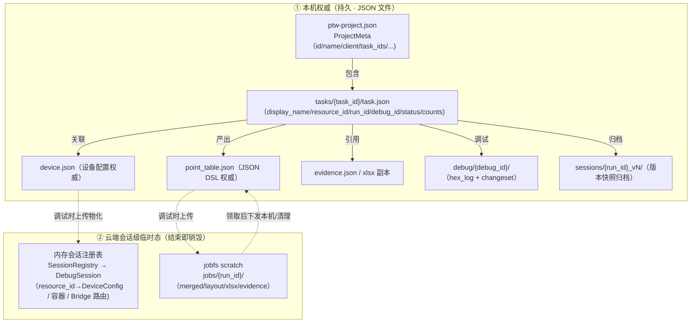

# T3 — 点表智能工作台：数据库与数据模型设计

> 本文是「点表智能工作台」项目的**数据库与数据模型设计文档（T3）**，只描述**目标数据模型（To-Be）**：客户端 JSON DSL 权威产物、设备配置（`device.json`，合一）、证据/文档页、本地工程目录树、服务器端**会话级临时态**（内存会话注册表 + jobfs scratch）、存储归属与数据关系；以及**运行态/流式数据结构**（§2，调试叠加，非点表权威）。
> **架构基线（已确认）**：**云端无跨会话持久态**——服务器**不再有持久化 SQLite**；工程/任务/运行/用量等元数据权威全部在本机（`ptw-project.json` + `task.json`），设备配置（CMDB）随 DSL 上传、仅会话存活期间在**内存会话注册表**持有。存储边界见 [T12](T12-数据与物料存储边界设计.md)。
> **现状存储层（现有 SQLite DDL、JobFS 产物树、关联机制）与到目标模型的差距/迁移路径**见 `T3A-数据存储现状与演进方案.md`。
> 系统架构总览见 `T1-系统架构设计.md`；Agent 设计见 `T2-Agent设计.md`。

---

## 目录

- [§1 目标数据模型](#1-目标数据模型)
- [§2 运行态与流式数据结构](#2-运行态与流式数据结构调试叠加非点表权威)
- [§3 MVP 数据模型范围](#3-mvp-数据模型范围首版裁剪)

---

## §1 目标数据模型

### 1.1 JSON DSL 权威产物完整数据模型

以原型 `mock-data.js` 的字段结构为依据，定义客户端本机持有的 `point_table.json` JSON DSL 规范。

> **权威 vs 运行态（数据结构边界）**：`point_table.json` 是**点表定义**的权威——协议定位、解析、物模型映射、命令关联、生成期质量标记（`ctDep`/`descWarn`/`protoWarn`）、以及被采纳的变更状态（`na`/`fromDoc`）。下列字段为**调试运行态叠加**，由一次调试会话产出、随 `debug/` 结果落地、UI 展示时合并，**不属于点表权威**：`raw`/`rawVal`/`val`/`state`/`aiNote`/`suggestion`、命令的 `req`/`respHead`/`respData`/`respTail`/`error`、`CommandProfile` 的实时统计。本轮为减少耦合，结构上保留这些可选字段并标注「非权威」，其独立的运行态/流式结构留待下一轮（见 [T13](T13-功能点与数据契约草案.md) 运行态/流式条目）。
>
> **设备配置不在此**：设备的通信链路与采集配置由 **`device.json`（§1.1.6）** 权威承载；`point_table.json` 仅含「设备信息表」Sheet（`device_info`），其与身份相关的字段应源出 `device.json` 以避免漂移。**证据链**结构见 §1.1.7。

#### 1.1.1 读测点（ReadPoint）

```go
// ReadPoint — 测点表_读中的单个测点
type ReadPoint struct {
    // === 协议定位字段（来自 AddressAgent）===
    ID     int    `json:"id"`      // 设备内稳定整数序号（layout 计算）
    Name   string `json:"name"`    // 规范化点名（NamingAgent 产出）
    FC     string `json:"fc"`      // 功能码（"03"/"04" 等）
    Reg    string `json:"reg"`     // 寄存器地址（十进制字符串，如 "103-104" 表示多寄存器）
    RegNum int    `json:"regNum"`  // 起始寄存器数值（整数，供地址计算）
    Span   int    `json:"span"`    // 占用寄存器数量

    // === 解析字段（来自 ParserAgent / BitFieldAgent）===
    Bit    string `json:"bit"`     // 位偏移（"" 表示整寄存器，"0"~"15" 表示位域）
    Parser string `json:"parser"`  // 解析函数（UBInt16/SBInt16/UBInt32/ULInt32/Bit 等）
    Scale  string `json:"scale"`   // 变比乘法（如 "0.1"，空=无变比不填 1）
    Unit   string `json:"unit"`    // 工程单位（V/A/W/Hz/℃/%RH 等）
    DType  string `json:"dtype"`   // 数据类型（"float"/"int"/"string"）
    Mapping string `json:"mapping"` // 离散状态映射（"0=分闸;1=合闸"，连续量为 ""）

    // === 命令关联 ===
    Cmd    string `json:"cmd"`     // 所属命令 ID（"cmd0"/"cmd1" 等）

    // === 调试运行时字段（可选，非权威）===
    Raw    string  `json:"raw,omitempty"`    // 最新采集原始 hex（"09 12"）
    RawVal *int64  `json:"rawVal,omitempty"` // 原始整数值（null=未采）
    Val    string  `json:"val,omitempty"`    // 工程值字符串（"232.2"）
    State  string  `json:"state,omitempty"`  // 采集判定（"pass"/"suspect"/"fail"/"unread"）
    AINote string  `json:"aiNote,omitempty"` // AI 判定备注
    Suggestion *PointSuggestion `json:"suggestion,omitempty"` // AI 修正建议

    // === 物模型映射列（Digital Twins / DTDL）===
    DtModel   string `json:"dtModel,omitempty"`   // DTDL 设备模型 URI
    DtDevice  string `json:"dtDevice,omitempty"`  // 逻辑设备名（拆分时使用）
    Comp      string `json:"comp,omitempty"`       // 组件分类名（如"进线回路"）
    CompModel string `json:"compModel,omitempty"` // 组件 DTDL 模型 URI
    CompIdx   int    `json:"compIdx,omitempty"`   // 组件序号（不定路数）
    DtID      string `json:"dtId,omitempty"`       // 孪生点位 ID（空=待映射）

    // === 元信息标记（生成期质量 + 变更状态，属权威）===
    CtDep    bool   `json:"ctDep,omitempty"`    // 是否依赖互感器变比（CT/PT）
    DescWarn bool   `json:"descWarn,omitempty"` // 描述/单位存在协议模糊性
    Na       bool   `json:"na,omitempty"`       // 型号不适用/已取消（变更集采纳后的稳定状态）
    FromDoc  string `json:"fromDoc,omitempty"`  // 该点/变更来源文档 docId（溯源）
}

// PointSuggestion — AI 修正建议（调试产出）
type PointSuggestion struct {
    Title      string            `json:"title"`
    Reason     string            `json:"reason"`
    Diff       []FieldDiff       `json:"diff"`
    Fix        map[string]string `json:"fix,omitempty"`
    FieldIssue bool              `json:"fieldIssue,omitempty"` // 现场安装问题（非点表参数问题）
    EvidenceRef EvidenceRef       `json:"evidenceRef"`
}

type FieldDiff struct {
    Field string `json:"field"`
    From  string `json:"from"`
    To    string `json:"to"`
}

type EvidenceRef struct {
    DocID string `json:"docId"`
    Page  int    `json:"page"`
}
```

#### 1.1.2 写测点（WritePoint）

```go
// WritePoint — 测点表_写中的单个写测点
type WritePoint struct {
    // === 协议定位字段 ===
    ID    int    `json:"id"`
    Name  string `json:"name"`
    FC    string `json:"fc"`   // 写功能码（"05"=单线圈/"06"=单寄存器 等）
    Reg   string `json:"reg"`
    Bit   string `json:"bit"`

    // === 写端解析字段 ===
    Parser  string `json:"parser"`  // 写解析函数（HUBInt16/HUBInt32 等）
    Scale   string `json:"scale"`
    Mapping string `json:"mapping"`
    Bound   string `json:"bound"`   // 数值边界（"[20, 60]"，无限制为 ""）
    Tip     string `json:"tip"`     // 操作提示（如"修改后立即生效"）

    // === 协议校验标记 ===
    ProtoWarn bool `json:"protoWarn,omitempty"` // 协议描述存在缺失/疑问

    // === 物模型映射列（同 ReadPoint）===
    DtModel   string `json:"dtModel,omitempty"`
    DtDevice  string `json:"dtDevice,omitempty"`
    Comp      string `json:"comp,omitempty"`
    CompModel string `json:"compModel,omitempty"`
    CompIdx   int    `json:"compIdx,omitempty"`
    DtID      string `json:"dtId,omitempty"`
}
```

#### 1.1.3 命令表（CommandEntry）

```go
// CommandEntry — 命令表中的单条读命令
type CommandEntry struct {
    ID    string `json:"id"`    // "cmd0"/"cmd1" 等
    Name  string `json:"name"`  // "读命令0"
    FC    string `json:"fc"`    // 功能码（"03"/"04"）
    Start int    `json:"start"` // 起始寄存器（十进制）
    End   int    `json:"end"`   // 末位寄存器（十进制）
    State string `json:"state"` // "ok"/"error"

    // === 通讯统计（调试后填充）===
    Profile *CommandProfile `json:"profile,omitempty"`

    // === 最新帧数据（调试运行时，可选）===
    Req      []FrameField `json:"req,omitempty"`
    RespHead []FrameField `json:"respHead,omitempty"`
    RespData []RegData    `json:"respData,omitempty"`
    RespTail []FrameField `json:"respTail,omitempty"`
    Error    string       `json:"error,omitempty"`
}

// CommandProfile — 命令通讯统计
type CommandProfile struct {
    RespTypical  *int     `json:"respTypical"`  // 典型响应时间(ms)，null=暂无
    RespWorst    *int     `json:"respWorst"`
    Jitter       *int     `json:"jitter"`
    RecInterval  int      `json:"recInterval"`  // 采集周期(ms)
    RecTimeout   int      `json:"recTimeout"`   // 超时(ms)
    RecRetry     int      `json:"recRetry"`     // 重试次数
    Samples      int      `json:"samples"`      // 统计样本数
    SuccessRate  *float64 `json:"successRate"`  // 成功率(%)
    FrameReq     int      `json:"frameReq"`     // 请求帧字节数
    FrameResp    int      `json:"frameResp"`    // 响应帧字节数
    Warn         string   `json:"warn,omitempty"`
}
```

#### 1.1.4 设备信息表（DeviceInfoEntry）

```go
// DeviceInfoEntry — 设备信息表中的一行
type DeviceInfoEntry struct {
    Name  string `json:"name"`  // 字段名（group/board_type/company/model 等）
    Value string `json:"value"` // 字段值
    Desc  string `json:"desc"`  // 说明
}
```

#### 1.1.5 完整 `point_table.json` 根结构

```go
// PointTableDSL — JSON DSL 权威产物根结构
type PointTableDSL struct {
    Version    string           `json:"version"`     // DSL schema 版本（如 "1.0"）
    TaskID     string           `json:"task_id"`     // 协议点表任务 ID，工作台和本地目录的稳定边界
    DeviceID   string           `json:"device_id"`   // 后端 CMDB resource_id，发布给 xboard 后用于查询
    RunID      string           `json:"run_id"`      // 最后一次生成/更新的服务器 run_id
    DSLVersion string           `json:"dsl_version"` // 点表内容版本（对应服务器 "v1"/"v2"）；ApplyAnswers/调试自动应用落定后 bump
    UpdatedAt  string           `json:"updated_at"`  // ISO8601

    DeviceInfo []DeviceInfoEntry `json:"device_info"` // 设备信息表
    ReadPoints []ReadPoint       `json:"read_points"` // 测点表_读
    WritePoints []WritePoint     `json:"write_points"`// 测点表_写
    Commands   []CommandEntry    `json:"commands"`    // 命令表

    Clarifications []Clarification `json:"clarifications,omitempty"` // 两阶段生成第二阶段：疑虑点候选选项 + 用户选择
    ChangeSet      *ChangeSet      `json:"change_set,omitempty"`     // 增量变更集（型号变更说明差量分析，post-MVP，与调试无关）
}
```

> **选项→落定 DSL 的落版链路（两阶段生成）**：`Clarify` 产出 `Clarifications`（每项含候选选项 + 推荐）；用户逐项选择后，`ApplyAnswers` 把**选中项确定性 fold** 进 `read_points`/`write_points`/`commands` 的对应字段，并 `bump dsl_version`、`UpdatedAt`、写 `sessions/{run_id}_vN/` 归档快照（§1.2）。选中项即最终 DSL 字段值，非 LLM 二次推断。调试自收敛 loop 自动应用的每轮修改同样走 `bump dsl_version`（见 §2.10）。

#### 1.1.6 设备运行配置（`device.json`，合一）

> **Reconciliation（关键）**：原型 UI 侧的 `device`（含 `comm`：serial/tcp 全套 + `addr`）与采集侧 CMDB 的 `transfer`/`protocol`/`status_rule`/`device_type`/`is_collect`/`limit_interval` 是**同一台设备的两种描述**。目标态收成**唯一的 `DeviceConfig`**：原 `transfer`（serial/tcp）并入 `comm.mode`；`protocol` 与 xboard 采集字段上提为顶层；不再并存两份。`device.json` 本机权威，发起调试时随 `point_table.json` 一并上传，云端会话存活期间持有（§1.3 会话注册表直接复用本结构）。

```go
// DeviceConfig — 设备运行配置（device.json）。本机权威；调试时上传，会话内物化。
type DeviceConfig struct {
    // === 身份 ===
    ResourceID  string `json:"resource_id"` // 设备标识（会话级分配/回填，非跨会话持久）
    Name        string `json:"name"`        // 设备显示名
    Vendor      string `json:"vendor"`      // 厂家
    Model       string `json:"model"`       // 型号
    DeviceType  string `json:"device_type"` // 七级分类编码（= board_type，xboard 模板键：. → _ 拼 xlsx）
    Group       string `json:"group"`       // 七级分类路径
    Fingerprint string `json:"fingerprint"` // 设备指纹
    Protocol    string `json:"protocol"`    // modbusRTU / modbusTCP

    // === 从机 / 通信链路（合并原 comm + transfer）===
    Addr int        `json:"addr"`           // Modbus 从机地址
    Comm CommConfig `json:"comm"`           // 链路参数

    // === xboard 采集配置 ===
    IsCollect     int    `json:"is_collect"`     // 是否采集（1=是）
    LimitInterval int    `json:"limit_interval"` // 采集最小间隔(ms)
    StatusRule    string `json:"status_rule"`    // 状态规则（JSON 字符串）
    IsSimulated   int    `json:"is_simulated"`   // 是否模拟设备
}

// CommConfig — 链路参数。Mode 取代旧 transfer。
type CommConfig struct {
    Mode string `json:"mode"` // serial | tcp（= 旧 transfer 语义；决定隧道回写哪个 Bridge）
    // 串口（mode=serial）
    Port     string `json:"port,omitempty"`      // COM3 / /dev/ttyUSB0
    Baud     int    `json:"baud,omitempty"`
    DataBits int    `json:"data_bits,omitempty"`
    Parity   string `json:"parity,omitempty"`     // N / E / O
    StopBits int    `json:"stop_bits,omitempty"`
    // TCP（mode=tcp）
    IP      string `json:"ip,omitempty"`
    TCPPort int    `json:"tcp_port,omitempty"`
    // 设备级采集默认（命令级可被 CommandProfile.rec* 覆盖，见 §1.1.3）
    TimeoutMs  int `json:"timeout_ms"`  // 单帧超时
    Retry      int `json:"retry"`       // 错误重试次数
    IntervalMs int `json:"interval_ms"` // 采集轮询间隔
}
```

> **两层 timing**：设备级默认在 `comm.{timeout_ms,retry,interval_ms}`；命令级调优在 `CommandProfile.{recTimeout,recRetry,recInterval}`（§1.1.3）。两者结构上分离——前者是设备缺省，后者是按命令覆盖。
>
> **链路运行态不入 `device.json`**：连接状态（device/instance/tunnel 在线、latency、tx/rx 计数）属调试运行态/流式，不在本结构内（同 §1.1 权威 vs 运行态边界）。

#### 1.1.7 证据链与文档页（`evidence.json` / `docPages`）

> `EvidenceRef{docId,page}`（§1.1.1 已定义）是嵌在澄清/变更/建议里的**轻量指针**；它必须能定位回**文档页 `DocPage`**（原文 + OCR）。字段级证据 `EvidenceItem` 把某测点的某字段锚定到具体文档位置。

```go
// DocPage — 协议文档单页（原文 + OCR 还原），证据定位的落地源。
type DocPage struct {
    DocID string   `json:"docId"`
    No    int      `json:"no"`    // 页码（EvidenceRef.Page 指向此）
    Title string   `json:"title"` // 节标题
    Raw   []string `json:"raw"`   // 原文行（PDF 渲染）
    OCR   []string `json:"ocr"`   // OCR 还原行
}

// EvidenceItem — 字段级证据：把某测点的某字段锚定到文档位置。
type EvidenceItem struct {
    PointID      string      `json:"pointId"`      // 关联测点（稳定锚）
    Seq          int         `json:"seq"`          // 表内序号
    Sheet        string      `json:"sheet"`        // read / write
    Column       string      `json:"column"`       // 字段名（scale/parser/unit...）
    EvidenceType string      `json:"evidenceType"` // doc_table / doc_text / sample_frame
    Ref          EvidenceRef `json:"ref"`          // 文档定位（→ DocPage）
    Snippet      string      `json:"snippet"`      // 命中片段
    Confidence   float64     `json:"confidence"`   // 置信度 0~1
}

// EvidenceFile — evidence.json 根
type EvidenceFile struct {
    RunID string                `json:"run_id"`
    Items []EvidenceItem        `json:"items"`           // 字段级证据
    Pages map[string][]DocPage  `json:"pages,omitempty"` // docId → 页；体量大时可拆 docPages/{docId}.json
}
```

#### 1.1.8 协议文档（Document）

> 一个协议点表任务的上传文档清单（主文档 + 变更说明等）。`docId` 是 `EvidenceRef`/`DocPage`/`ChangeSet.docId` 的关联键。原文落 `protocol/`，清单元数据归属任务（随 `task.json`，§1.2）。

```go
type Document struct {
    ID       string `json:"id"`       // docId（"doc1"/"doc2"）
    Name     string `json:"name"`     // 文件名
    Role     string `json:"role"`     // 主文档 | 变更说明 | ...
    Pages    int    `json:"pages"`    // 页数
    Size     string `json:"size"`     // 体积（"3.2M"）
    State    string `json:"state"`    // new | parsed | failed（解析状态）
    Uploaded bool   `json:"uploaded"` // 是否已上传至云端处理
}
```

> **OCR 全文 markdown（区别于 docPages）**：生成阶段 MinerU 把协议原文 OCR 还原成 **markdown 全文**，按文档落本机 `ocr/{docId}.md`（纯文本文件，无独立结构体）。它是**调试 AI 修改点表时的协议上下文**——整篇协议文本，发起调试时随点表上传、云端会话瞬态使用（见 [T12 §4.4](T12-数据与物料存储边界设计.md)）。这与 §1.1.7 的 `docPages`（字段级证据的选中页片段，供 UI / 溯源）是**两类不同物料，不能互相替代**：AI 上下文要全文，溯源要定位片段。

### 1.2 本地工程目录树规范

客户端本机工程目录（对应 `ptw-project.json` 中 `path` 字段）：

```
{工程目录}/
├── ptw-project.json          # 工程元数据（名称/客户/创建时间/任务列表索引）
└── tasks/
    └── {task_id}/            # 协议点表任务目录；一次协议导入创建一个 task_id
        ├── task.json         # 任务元数据（名称/厂家/型号/协议类型/resource_id/run_id/status）
        ├── protocol/         # 上传的协议原文（保留副本，供本地查阅）
        │   ├── {filename}.pdf     # 主文档原件
        │   └── {filename_v2}.pdf  # 增量文档（如有）
        ├── ocr/              # OCR 全文 markdown（MinerU 还原；调试 AI 上下文，§1.1.8）
        │   ├── {docId}.md
        │   └── {docId_v2}.md
        ├── point_table.json  # JSON DSL 权威产物（点表定义，§1.1）
        ├── device.json       # 设备运行配置（合一，§1.1.6；调试时上传）
        ├── point_table.xlsx  # xlsx 副本（点表 + 设备信息表渲染）
        ├── evidence.json     # 证据链 + 文档页（§1.1.7）
        ├── clarifications/   # 澄清会话
        │   ├── {c_id}.json       # 单条澄清（问题+选项+答案）
        │   └── summary.json      # 澄清摘要索引
        ├── debug/            # 自收敛调试会话与报文日志
        │   ├── {debug_id}/
        │   │   ├── session.json       # 会话状态（DebugResult：status/rounds/converged_seqs/unconverged_seqs）
        │   │   ├── hex_log.json       # 报文日志（TX/RX 帧序列）
        │   │   └── rounds/            # 逐轮留痕（自收敛 loop）
        │   │       └── {n}/
        │   │           ├── observation.json   # 本轮采样值+帧
        │   │           ├── verdicts.json      # 本轮逐点判定
        │   │           ├── apply_record.json  # 本轮自动应用留痕（无人工采纳）
        │   │           └── converged.json     # 本轮累计收敛集快照
        │   └── latest_session_id     # 纯文本，最新 debug_id
        └── sessions/         # 历史版本快照（归档用，按需领取）
            ├── {run_id}_v1/
            │   ├── point_table.json
            │   └── meta.json     # 快照元数据（来源 run_id/版本/时间）
            └── {run_id}_v2/
```

**`ptw-project.json` 结构**：

```go
type ProjectMeta struct {
    ID          string   `json:"id"`           // 工程 UUID
    Name        string   `json:"name"`         // "××银行数据中心二期"
    Client      string   `json:"client"`       // "××银行"
    Path        string   `json:"path"`         // 绝对路径（冗余自描述）
    CreatedAt   string   `json:"created_at"`
    UpdatedAt   string   `json:"updated_at"`
    ServerURL   string   `json:"server_url"`   // 后端服务器地址
    ProjectKey  string   `json:"project_key"`  // 服务器侧工程 key（发布用）
    TaskIDs     []string `json:"task_ids"`     // 本工程包含的协议点表任务 ID 列表
    RulePack    string   `json:"rule_pack"`    // 规则包版本（如 "v2026.05"）
    AppVersion  string   `json:"app_version"`  // 客户端版本（如 "v0.4.0"）
}
```

**`tasks/{task_id}/task.json` 结构（`TaskMeta`，本机权威）**：对应原型 `project.tasks[]`，是工作台任务卡片与本地任务目录的稳定边界。

```go
type TaskMeta struct {
    ID          string `json:"id"`           // 协议点表任务 ID（= 目录名 task_id）
    DisplayName string `json:"display_name"` // "艾默生 060KVA-2 列头柜"
    Vendor      string `json:"vendor"`       // 厂家
    Model       string `json:"model"`        // 型号
    Protocol    string `json:"protocol"`     // modbusRTU / modbusTCP
    DeviceType  string `json:"device_type"`  // 七级分类编码（原型 board，= DeviceConfig.DeviceType）
    Status      string `json:"status"`       // 草稿 | 待澄清 | 调试中 | 已确认 | 已提交

    // === 计数（点表 + 调试结果汇总）===
    ReadCount   int    `json:"read_count"`   // 读测点数
    WriteCount  int    `json:"write_count"`  // 写测点数
    ErrCount    int    `json:"err_count"`    // 异常/失败点数
    SuspectCount int   `json:"suspect_count,omitempty"` // 可疑点数（调试态）

    // === 关联运行/会话 ===
    ResourceID  string `json:"resource_id"`  // 最近一次调试分配的设备标识
    RunID       string `json:"run_id"`       // 最近生成/更新 run_id
    DebugID     string `json:"debug_id"`     // 最近调试会话 ID

    Documents   []Document `json:"documents"` // 本任务上传的协议文档清单（§1.1.8）
    UpdatedAt   string `json:"updated_at"`   // 最近更新（原型 "10 分钟前" 为展示态，存 ISO8601）
}
```

> **派生计数说明**：`ReadCount`/`WriteCount` 由点表得出；`ErrCount`/`SuspectCount` 由调试运行态（`PointRuntime.State` 聚合，§2.1）得出，是**派生视图**，权威源是点表 + `debug/` 结果。原型 `coldStart.summary{read,write,suspect,fail}` 即这组计数在生成完成时的快照，不单独持久化。

**启动页状态分布（`StatusDist`，派生视图）**：原型 `recentProjects[].dist`，由工程下各 `TaskMeta.Status` 聚合，**不单独存储**，进入工程时实时算出。

```go
type StatusDist struct {
    Submitted int `json:"submitted"` // 已提交
    Done      int `json:"done"`      // 已确认
    Debugging int `json:"debugging"` // 调试中
    Clarify   int `json:"clarify"`   // 待澄清
    Draft     int `json:"draft"`     // 草稿
}
```

**客户端全局配置（`ClientConfig`，app 级，非工程内）**：原型 `client`，存客户端配置目录（非工程目录）。

```go
type ClientConfig struct {
    Version           string `json:"version"`             // 客户端版本（如 "v0.4.0"）
    RulePack          string `json:"rule_pack"`           // 当前规则包版本
    DefaultProjectDir string `json:"default_project_dir"` // 新建工程默认目录
}
```

### 1.3 服务器端状态设计（目标：无跨会话持久态）

> **核心转变**：目标态**取消服务器端持久化 SQLite**。工程（projects）、协议点表任务（device_tasks）、运行记录（runs）、用量（project_usage）的**权威全部移到本机**（`ptw-project.json` + `tasks/{task_id}/task.json`）；规则包由只读分发服务提供。服务器侧只保留两类**会话级软状态**：jobfs scratch（文件）与内存会话注册表（替代 SQLite `devices`/`resource_seq`），会话结束 / 超时即销毁。

#### 1.3.1 内存会话注册表（替代 SQLite CMDB）

设备配置（CMDB）不再落库。发起调试时客户端随 DSL 上传 `device.json`，服务器把它放进**进程内内存会话注册表**，仅供当前会话绑定的 xboard 容器经 xcmdb 兼容接口查询；会话结束即驱逐。

```go
// SessionRegistry — 进程内、会话作用域的设备注册表（满足 store.DeviceStore 接口）
type SessionRegistry struct {
    mu       sync.RWMutex
    sessions map[string]*DebugSession // key: session_id
}

// DebugSession — 一次调试会话的全部会话级软状态
type DebugSession struct {
    SessionID   string            // 会话唯一 ID
    ProjectID   string            // 来自 Bearer Token 的工程归属
    ResourceID  string            // 会话级临时 resource_id（会话内分配，结束驱逐）
    Device      DeviceConfig      // 从上传 device.json 物化的设备配置
    ContainerID string            // 绑定的 xboard 容器 ID（Docker）
    Endpoint    string            // 容器采集端点（如 http://127.0.0.1:6100）
    BridgeRoute string            // 隧道路由：回写设备帧的目标工程师 Bridge 连接
    ScratchDir  string            // jobs/{run_id}/debug/{debug_id}/ 临时目录
    LastBeat    time.Time         // 心跳时间，用于 idle 超时回收
    ExpireAt    time.Time         // 硬超时
}
```

> `Device` 字段复用 §1.1.6 定义的唯一 `DeviceConfig`（由上传的 `device.json` 物化），不再单独定义采集侧子集——全局只存在一个设备配置结构。隧道回写路由由 `Device.Comm.Mode`（serial/tcp）决定。
>
> xcmdb 兼容数据源由 SQLite 改为 `SessionRegistry`，按会话作用域返回；未命中会话返回未找到。语义不变，仅数据源改变（本轮只关注数据结构，不展开接口形态）。

#### 1.3.2 jobfs scratch 会话临时态策略

服务器 jobfs（`jobs/{run_id}/`）是**执行环境的会话临时态**，不再长期保留：

- **生成 scratch**：客户端领取 `merged.json`/`xlsx`/`evidence.json`/`device.json` 后即可删除；兜底短 TTL（≤24h）。
- **调试 scratch**（`debug/{debug_id}/`：渲染 xlsx、采样数据、changeset 源）：**会话结束 / 超时即清**，随 xboard 容器销毁。
- **失败 scratch**：短 TTL（≤24h）清理。
- 服务器**不保留**任何「已交付」的长期副本——权威已在本机，丢失可从本机重新上传重建。

#### 1.3.3 CMDB 的角色与边界（去持久化后）

| 职责 | 内存会话注册表（`SessionRegistry`）| jobfs scratch（`jobs/{run_id}/`） |
|---|---|---|
| **设备配置（会话作用域）** | ✅ `resource_id`、`name`、`device_type`、protocol/transfer | ❌ |
| **xboard 部署 xlsx** | ❌（容器挂载）| ✅ 从上传 DSL 渲染 `{device_type}.xlsx` |
| **点表内容** | ❌ | ✅ `merged.json`/`layout.json`（临时）|
| **证据链** | ❌ | ✅ `evidence.json`（生成后下发本机）|
| **调试产物** | ❌ | ✅ `debug/{debug_id}/`（下发本机后清）|
| **持久性** | 会话存活期间内存持有，结束即驱逐 | 会话临时态，TTL / 会话结束清理 |

### 1.4 存储归属两分表

> 目标态只有两类域：① 本机权威（持久）；② 云端会话级临时态（jobfs scratch + 内存会话注册表，会话结束即销毁）。详见 [T12 §2/§3](T12-数据与物料存储边界设计.md)。

| 数据类型 | ① 客户端本机 | ② 云端会话级临时态 |
|---|---|---|
| 工程元数据（`ptw-project.json`） | ✅ 权威 | — |
| 协议点表任务状态列表（`task.json`） | ✅ 权威 | — |
| JSON DSL 权威产物（`point_table.json`） | ✅ 权威 | ⏳上传副本 / 生成产物（领取后清）|
| 设备配置（`device.json`，CMDB）| ✅ 权威 | ⏳上传后入内存会话注册表（结束驱逐）|
| xlsx 副本（`point_table.xlsx`） | ✅ 副本 | ⏳从上传 DSL 渲染 → 挂载入会话容器 |
| 证据链（`evidence.json`） | ✅ 副本（下发后落地）| ⏳生成源（下发后清）|
| 澄清会话（`clarifications/`） | ✅ 权威 | ⏳合并执行态 |
| 调试会话日志（`debug/`） | ✅ 权威（hex 日志 + changeset）| ⏳采样数据（随会话清）|
| 历史版本快照（`sessions/`） | ✅ 本地归档 | — |
| Run 索引 / 运行状态 | ✅ 本机 `task.json`（run_id/debug_id）| ⏳会话内存（运行中）|
| 工程用量汇总 | ✅ 本地累计 | ⏳按请求回传单次计量 |
| 协议原文（`protocol/`）| ✅ 权威 | ⏳上传副本（OCR/生成后清）|
| 规则包 `rulePack` | 📄缓存版本号 | 只读分发服务（非业务状态）|

> 说明：旧设计的 `projects`/`device_tasks`/`runs`/`project_usage`/`rule_packs`/`devices`/`resource_seq` 等 SQLite 表在目标态**全部取消**；其承载的元数据权威移到本机 JSON 文件，设备配置改为会话内存注册表（[§1.3.1](#131-内存会话注册表替代-sqlite-cmdb)）。

### 1.5 数据关系图（本机权威 + 会话内存注册表）

目标态没有服务器关系数据库，数据关系体现为「本机 JSON 文件层级」与「会话存活期间的内存对象」两部分：



## §2 运行态与流式数据结构（调试叠加，非点表权威）

> 本章定义**一次调试会话**产生的运行态/流式数据。除「澄清决策」与「变更应用结果」会回写本机权威（`point_table.json` / `clarifications/`）外，其余均为会话临时态：实时经服务端流推给桌面渲染，落地 `debug/{debug_id}/`，会话 / 容器销毁即清（§1.3.2）。gRPC 形态下由 server-stream 承载，本章只定数据结构、不展开流协议。

### 2.1 测点运行态叠加（PointRuntime）

> §1.1 已说明 `raw/rawVal/val/state/aiNote/suggestion` 是叠加在 `ReadPoint` 上的运行态、非权威。独立结构如下，按测点 `id` 与权威点表合并展示。

```go
// PointRuntime — 单测点一次采集判定（叠加在 ReadPoint 上，按 id 对齐）
type PointRuntime struct {
    PointID    int              `json:"pointId"`              // 对齐 ReadPoint.ID
    Raw        string           `json:"raw"`                  // 原始 hex（"15 13"），未采为 "--"
    RawVal     *int64           `json:"rawVal"`               // 原始整数值，null=未采
    Val        string           `json:"val"`                  // 工程值字符串，未采为 "--"
    State      string           `json:"state"`                // unread | pass | suspect | fail
    AINote     string           `json:"aiNote,omitempty"`     // AI 判定备注
    Suggestion *PointSuggestion `json:"suggestion,omitempty"` // AI 修正建议（§1.1.1）
    FieldFlag  bool             `json:"fieldFlag,omitempty"`  // 已标记为现场安装问题（非点表参数问题）
}
```

### 2.2 命令运行态与报文帧（CommandRuntime / FrameField / RegData）

> `CommandEntry`（§1.1.3）的 `req/respHead/respData/respTail/error` 与实时 `CommandProfile` 是运行态。帧结构如下（§1.1.3 中引用的 `FrameField`/`RegData` 即此处定义）。

```go
// CommandRuntime — 单命令最近一次往返报文 + 实时统计
type CommandRuntime struct {
    CmdID    string          `json:"cmdId"`             // 对齐 CommandEntry.ID
    Req      []FrameField    `json:"req"`               // 请求帧字段分解
    RespHead []FrameField    `json:"respHead"`          // 响应头字段
    RespData []RegData       `json:"respData"`          // 响应寄存器数据区
    RespTail []FrameField    `json:"respTail"`          // 响应尾（CRC）
    Error    string          `json:"error,omitempty"`   // 异常描述（如"异常码02"）
    Profile  *CommandProfile `json:"profile,omitempty"` // 实时统计（§1.1.3）
}

// FrameField — 报文按字段分解的一段（req/respHead/respTail 通用）
type FrameField struct {
    Name  string `json:"name"`            // 段名（从机地址/功能码/CRC16...）
    Hex   string `json:"hex"`             // 该段 hex（"01" / "C5 CD"）
    Src   string `json:"src,omitempty"`   // 取值来源说明（"命令表" / "START_ADDR=0"）
    Check bool   `json:"check,omitempty"` // 是否校验段（CRC）
    Err   bool   `json:"err,omitempty"`   // 是否异常段（异常功能码/异常码）
}

// RegData — 响应数据区的单个寄存器
type RegData struct {
    Reg int    `json:"reg"` // 寄存器地址
    Hex string `json:"hex"` // 该寄存器 hex（"09 12"）
}
```

### 2.3 报文日志（hex_log.json / HexLogEntry）

> 调试期完整 TX/RX 帧流水，实时推给桌面、落地 `debug/{debug_id}/hex_log.json`（本机权威留存）。

```go
type HexLogEntry struct {
    Dir  string `json:"dir"`           // TX | RX
    T    string `json:"t"`             // 时间戳（"14:32:01.482"）
    Hex  string `json:"hex"`           // 整帧 hex
    Note string `json:"note"`          // 备注（"读保持寄存器 R0–R9" / "41ms · 10 寄存器"）
    Cmd  string `json:"cmd"`           // 关联命令 ID
    Err  bool   `json:"err,omitempty"` // 是否异常帧
}
```

### 2.4 连接与隧道状态（LinkStatus，流式）

> 调试链路实时健康度，仅流式展示——不落地、不入 `device.json`。

```go
type LinkStatus struct {
    Device     string `json:"device"`     // 设备链路：ok | down | ...
    Instance   string `json:"instance"`   // xboard 采集实例（容器）：ok | ...
    Tunnel     string `json:"tunnel"`     // 隧道（容器↔工程师 Bridge）：ok | ...
    Latency    int    `json:"latency"`    // 往返延迟(ms)
    TX         int64  `json:"tx"`         // 累计发送字节
    RX         int64  `json:"rx"`         // 累计接收字节
    InstanceID string `json:"instanceId"` // 会话容器实例 ID（"col-7f3e21"）
    TTL        string `json:"ttl"`        // 容器剩余存活（"27 分钟"）
}
```

### 2.5 平台连接（PlatformConn，在线服务器 + 快捷提交合一）

> 原型的「在线点表服务器」（拉标准表头）与「快捷提交目标」（确认无误后一次性上报）是**同一个平台连接**的两种用途，合一为单一结构。属客户端配置，非调试运行态。

```go
type PlatformConn struct {
    Server      string `json:"server"`      // 平台地址
    ProjectKey  string `json:"projectKey"`  // 平台侧工程 key
    ProjectName string `json:"projectName"` // 工程名
    Account     string `json:"account"`     // 登录账号
    Connected   bool   `json:"connected"`   // 当前连通
    LastSync    string `json:"lastSync"`    // 最近同步描述（"今天 14:02 拉取标准表头 v3"）
}
```

### 2.6 澄清项（Clarification，问题流式 + 决策权威）

> **两阶段生成的核心数据结构**：AI 在生成期对疑虑点产出候选选项（`Opts` + `Recommend`，流式）；工程师逐项选择后，`Answer` 经 `ApplyAnswers` **确定性 fold 落定为 `point_table.json` 的最终字段值**并 bump `dsl_version`（§1.1.5）。决策同时回写本机权威（`clarifications/{c_id}.json`）。同一结构承载问题与答案——§1.1.5 根结构引用的 `Clarification` 即此。选项→选择→落定是生成产出最终 DSL 的主路径，非可选旁路。

```go
type Clarification struct {
    ID          string      `json:"id"`          // "c1"
    Q           string      `json:"q"`           // 问题描述
    Evidence    string      `json:"evidence"`    // 证据文本（"P23 表 6-2 / P24 示例帧"）
    EvidenceRef EvidenceRef `json:"evidenceRef"` // 文档定位（§1.1.7）
    Impact      int         `json:"impact"`      // 影响测点数
    Opts        []string    `json:"opts"`        // 可选项
    Recommend   string      `json:"recommend"`   // AI 推荐项
    Reason      string      `json:"reason"`      // 推荐理由
    Points      []int       `json:"points"`      // 受影响测点 id

    // === 决策（工程师选择后回写，属权威）===
    Resolved bool   `json:"resolved"`         // 是否已决策
    Answer   string `json:"answer,omitempty"` // 采纳的选项
}
```

### 2.7 增量变更集（ChangeSet，分析流式 + 应用权威）

> 上传「变更说明」文档后由 AI 分析产出（流式）；工程师逐项接受，**应用结果回写本机权威**（落到 `point_table.json` 的 `na`/`scale`/新增点 + `debug/{debug_id}/changeset.json` 留存）。§1.1.5 根结构引用的 `ChangeSet` 即此。

```go
type ChangeSet struct {
    DocID    string       `json:"docId"`    // 变更说明来源文档
    Analyzed bool         `json:"analyzed"` // 是否分析完成
    Items    []ChangeItem `json:"items"`
}

type ChangeItem struct {
    ID       string      `json:"id"`       // "g1"
    Type     string      `json:"type"`     // 新增点 | 字段变更 | 不适用
    State    string      `json:"state"`    // pending | accepted | rejected
    Title    string      `json:"title"`
    Detail   string      `json:"detail"`
    Evidence EvidenceRef `json:"evidence"` // 文档定位（§1.1.7）
    Apply    ApplyOp     `json:"apply"`    // 接受后施加的操作
}

// ApplyOp — 变更施加操作（kind 决定生效字段）
type ApplyOp struct {
    Kind  string     `json:"kind"`            // add | scale | na
    Point *ReadPoint `json:"point,omitempty"` // kind=add：要新增的测点
    IDs   []int      `json:"ids,omitempty"`   // kind=scale/na：受影响测点 id
    Scale string     `json:"scale,omitempty"` // kind=scale：新变比
}
```

### 2.8 流式 vs 落地一览

| 数据结构 | 来源 | 流式推送 | 落地本机 | 权威性 |
|---|---|---|---|---|
| `PointRuntime`（§2.1）| 调试采集判定 | ✅ | `debug/{debug_id}/` | 运行态（非权威）|
| `CommandRuntime`（§2.2）| 命令往返报文 | ✅ | `debug/{debug_id}/` | 运行态（非权威）|
| `HexLogEntry`（§2.3）| TX/RX 帧流水 | ✅ | `hex_log.json` | 运行态留存 |
| `LinkStatus`（§2.4）| 链路健康度 | ✅ | ❌ | 纯流式（不落地）|
| `PlatformConn`（§2.5）| 平台连接配置 | ❌ | 客户端配置 | 配置 |
| `Clarification`（§2.6）| AI 澄清 + 决策 | 问题流式 | `clarifications/` | 决策属权威 |
| `ChangeSet`（§2.7）| AI 变更分析 + 应用 | 分析流式 | `changeset.json` + 回写 DSL | 应用属权威 |
| `AIStage`（§2.9）| 生成/校验流水进度 | ✅ | ❌ | 纯流式（不落地）|
| `ValidationIssue`（§2.9）| 规则校验结果 | 流式 | 随 run 结果 | 生成输出（可重算）|
| `DebugResult`（§2.10）| 自收敛调试结果汇总（含 converged/unconverged_seqs、rounds）| 逐轮流式 | `session.json` + `rounds/{n}/` | 本机权威留存 |
| `ApplyRecord`（§2.10）| loop 每轮自动应用留痕（无人工采纳）| — | `rounds/{n}/apply_record.json` | 本机权威留存 |

### 2.9 生成/校验流水（AIStage / ValidationIssue / GenSummary）

> 生成与校验阶段的进度与结果。`AIStage` 是流水进度（流式、不落地）；`ValidationIssue` 是规则校验产出的问题清单（聚合展示，区别于测点级 `descWarn/protoWarn` 标志）；`GenSummary` 是生成完成时的计数快照（派生，对齐 §1.2 `TaskMeta` 计数）。

```go
// AIStage — 生成/校验流水的单个阶段（原型 ai.stages / coldStart.genStages）
type AIStage struct {
    Name  string `json:"name"`  // 文档解析 | 点位提取 | 字段补全 | 规则校验 | 调试验证
    State string `json:"state"` // pending | active | done | warn | error
    Tip   string `json:"tip"`   // 阶段说明（"候选 41 点，跳过保留点 6 个"）
}

// ValidationIssue — 规则校验结果项（原型 ai.validation）
type ValidationIssue struct {
    Cat  string `json:"cat"`  // proto（协议缺失/疑问）| desc（描述/单位模糊）| ...
    Text string `json:"text"` // 问题描述
    Loc  string `json:"loc"`  // 定位（"测点表_写 #1" / "测点表_读 #17"）
}

// GenSummary — 生成完成计数快照（原型 coldStart.summary，派生不持久化）
type GenSummary struct {
    Read    int `json:"read"`    // 读测点数
    Write   int `json:"write"`   // 写测点数
    Suspect int `json:"suspect"` // 可疑点数
    Fail    int `json:"fail"`    // 失败点数
}
```

### 2.10 调试结果落地（DebugResult / ApplyRecord）

> 这是「**反馈调试结果到客户端**」最终落地的容器：自收敛 loop 每轮流式推送的 `PointRuntime`/`CommandRuntime`/`LinkStatus` 落 `debug/{debug_id}/rounds/{n}/`，会话结束汇总成 `DebugResult`，持久化到本机 `debug/{debug_id}/session.json`（`hex_log.json` 单独落帧流水）。loop **自动应用**每轮采纳的修改（无人工 Decide/Apply），每轮落 `apply_record.json` 留痕。

```go
// DebugResult — 一次自收敛调试会话在客户端的落地结果（session.json）
type DebugResult struct {
    DebugID         string           `json:"debug_id"`
    TaskID          string           `json:"task_id"`
    RunID           string           `json:"run_id"`           // 调试起点的点表版本
    FinalDSLVersion string           `json:"final_dsl_version"`// loop 收敛后落定的最终 dsl_version
    ResourceID      string           `json:"resource_id"`
    Status          string           `json:"status"`           // converged | partial | failed（运行中为 running，落地为前三者；无 awaiting_review）
    Rounds          int              `json:"rounds"`           // 实际收敛轮数
    MaxRounds       int              `json:"max_rounds"`       // 安全上限
    StartedAt       string           `json:"started_at"`       // ISO8601
    EndedAt         string           `json:"ended_at,omitempty"`
    Device          DeviceConfig     `json:"device"`           // 调试时设备配置快照（§1.1.6）
    Summary         DebugSummary     `json:"summary"`          // 判定计数
    LockedSeqs      []int            `json:"locked_seqs"`      // 用户预锁定点（PatchGuard 保护，不入调试目标）
    ConvergedSeqs   []int            `json:"converged_seqs"`   // 最终收敛集（含用户锁定 + 逐轮自动锁定）
    UnconvergedSeqs []int            `json:"unconverged_seqs"` // 残留未收敛点（partial 时非空）
    Points          []PointRuntime   `json:"points"`           // 各测点最终判定快照（§2.1）
    Commands        []CommandRuntime `json:"commands"`         // 各命令最终报文快照（§2.2）
    Link            LinkStatus       `json:"link"`             // 最终链路状态快照（§2.4）
}

// DebugSummary — 调试判定计数
type DebugSummary struct {
    Total     int `json:"total"`     // 参与判定测点总数
    Pass      int `json:"pass"`
    Suspect   int `json:"suspect"`
    Fail      int `json:"fail"`
    Unread    int `json:"unread"`
    Converged int `json:"converged"` // 已收敛锁定点数（单调不减）
}

// ApplyRecord — 自收敛 loop 每轮自动应用的修改留痕（rounds/{n}/apply_record.json）
type ApplyRecord struct {
    DebugID   string      `json:"debug_id"`
    Round     int         `json:"round"`       // 所属轮次
    AppliedAt string      `json:"applied_at"`  // ISO8601
    Items     []ApplyItem `json:"items"`
}

type ApplyItem struct {
    PointID      int         `json:"point_id"`      // 被修正的测点（对齐 ReadPoint.ID）
    Source       string      `json:"source"`        // auto_fix（loop 自动应用；无人工 suggestion/clarification 采纳）
    HypothesisID string      `json:"hypothesis_id"` // 来源假设 id（可回采验证、可回滚）
    Diff         []FieldDiff `json:"diff"`          // 字段变更（复用 §1.1.1 FieldDiff）
}
```

> **多轮持久化**：`debug/{debug_id}/rounds/{n}/` 每轮存 `observation.json`（采样值+帧）、`verdicts.json`（逐点判定）、`apply_record.json`（本轮自动应用留痕）、`converged.json`（本轮累计收敛集快照）；会话级 `session.json` 即 `DebugResult`。收敛退出写 `status=converged`；达 `MaxRounds` 仍有残留写 `status=partial`（`unconverged_seqs` 非空），均非人工审批中间态。**不再持久化逐条 accept/reject 决策**（人工 Decide/Apply 路径已删）。

## §3 MVP 数据模型范围（首版裁剪）

> 本章在 §1/§2 已定义的全量结构上，划定**首版 MVP** 要落地的数据模型子集。原则：**保住核心闭环**——导入协议 → AI 生成点表 → 澄清 → 本地存储 → 在线调试 → AI 建议修正 → 提交平台；其余高级能力与原型未覆盖领域**显式暂缓**。暂缓项的字段已在 §1/§2 定义好，MVP 阶段**结构保留、不实现/不渲染**即可，后续拉入无需改模型。

### 3.1 MVP 纳入（核心闭环必需）

| 功能点 | MVP 结构 | 备注 |
|---|---|---|
| 工程 / 任务管理（本地）| `ProjectMeta`、`TaskMeta` | 计数字段 `read/write/err` 必需；`suspect_count` 可选 |
| 协议导入 / 文档 | `Document` | `state`/`uploaded` 必需 |
| 生成流水进度 | `AIStage` | 流式展示 |
| 点表权威产物 | `PointTableDSL`、`ReadPoint`、`WritePoint`、`CommandEntry`、`CommandProfile`、`DeviceInfoEntry` | **不含** `dt*` 物模型字段（§3.2）|
| 证据链 | `EvidenceRef`、`DocPage` | 字段级 `EvidenceItem` 暂缓（§3.2）|
| 澄清 | `Clarification` | 含 `resolved/answer` 决策回写 |
| 规则校验 | `ValidationIssue` | |
| 设备配置 | `DeviceConfig`、`CommConfig` | 调试必需 |
| 在线调试运行态 | `PointRuntime`、`CommandRuntime`、`FrameField`、`RegData`、`HexLogEntry`、`LinkStatus` | |
| **调试结果落地** | `DebugResult`、`DebugSummary`、`ApplyRecord`、`ApplyItem` | 流程终点：结果落 `session.json`，修正落 `apply_record.json` |
| AI 建议修正 | `PointSuggestion` | 核心调试价值 |
| 平台提交 | `PlatformConn` | 交付闭环 |
| 生成计数 | `GenSummary` | 派生，展示用 |

### 3.2 MVP 暂缓（post-MVP，结构保留不实现）

| 暂缓项 | 涉及结构 / 字段 | 暂缓理由 |
|---|---|---|
| **增量变更 / 型号变更说明** | `ChangeSet`、`ChangeItem`、`ApplyOp`，及 `ReadPoint.na`/`fromDoc` | 二次迭代能力，非首版闭环必需 |
| **物模型映射（DTDL）** | `ReadPoint`/`WritePoint` 的 `dtModel`/`dtDevice`/`comp`/`compModel`/`compIdx`/`dtId` | 数字孪生映射为进阶交付 |
| **字段级证据** | `EvidenceItem`（`pointId`+`column`+`confidence` 锚定）| MVP 用 `EvidenceRef`+`DocPage` 页级定位即可 |
| **启动页状态分布** | `StatusDist` | 仪表盘锦上添花，派生可后补 |

> 上述字段在 §1/§2 中保留定义，MVP 序列化时可不填/置零，**不构成破坏性变更**；拉入正式实现时无需改结构。

### 3.3 MVP 之外（原型未覆盖领域，本版不建模）

以下为原型未展示、首版**不纳入数据建模**的领域，待立项后单独设计，避免提前过度设计：

- **鉴权 / 身份**：当前仅 `PlatformConn.account` 与 Bearer Token 工程归属（见 §1.3），无完整用户/角色/权限模型。
- **用量 / 计费**：T12 提及「单次计量回传」，仅有归属、无数据结构。
- **错误 / 异常态模型**：除 `CommandRuntime.error`、`AIStage.state=error` 外，无统一错误结构。
- **检索 / 分页**：工程/任务/测点的列表查询、分页、过滤未建模。
- **多设备并发隧道编排**：会话注册表（§1.3.1）已含单会话隧道路由，未覆盖并发编排的数据结构。

### 3.4 MVP 枚举待形式化（落 proto 前补齐）

MVP 落地前需把以下「注释级取值」提升为枚举：`TaskMeta.status`（草稿/待澄清/调试中/已确认/已提交）、`PointRuntime.state`（unread/pass/suspect/fail）、`DebugResult.status`（running/converged/partial/failed，无 awaiting_review）、`ApplyItem.source`（auto_fix）、`Document.state`（new/parsed/failed）、`AIStage.state`（pending/active/done/warn/error）、`ValidationIssue.cat`（proto/desc）、`CommConfig.mode`（serial/tcp）。展示态时间串（`updated_at`/`ttl`）统一存 ISO8601 / 秒数。
