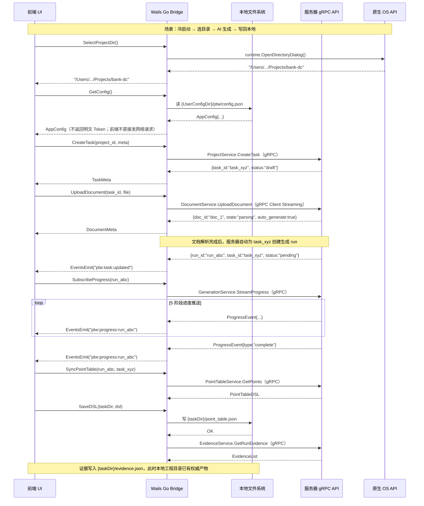

# T4 — 点表智能工作台：API 与桌面 Bridge 设计

> **文档定位**：本文是「点表智能工作台」的 **API 接口与桌面 Bridge 设计（T4）**。覆盖两类接口边界：① **桌面业务 API**——全部为服务器 **gRPC**，由本地 Wails Go Bridge 调用（前端只调 Wails Binding，**不直接发任何 HTTP**）；② **本地 Wails Go Bridge**——文件、串口、导出等仅在客户端本机执行。
> **传输边界（最终形态）**：桌面端↔服务端**统一 gRPC**。仅 xcmdb 兼容接口（供 xboard 调用）与 `/health`（运维探活）保留 Gin HTTP，属服务端↔外部链路，**不在桌面端调用路径上**。
> **与 T8 的分工**：**T4 是接口契约权威**（接口语义、字段、错误码、Bridge 方法签名、本地写回契约）；**T8 是 gRPC 实现权威**（proto 文件、server/client 脚手架、流处理代码、端口共存）。同一内容只在一处定义，分工边界见 T8 §1.2。
> 关联文档：T1（系统架构）/ T2（Agent 设计）/ T3（数据模型）/ T8（gRPC Bridge 架构）/ T9（调试报文链路）。

---

## 目录

- [§1 业务 API 体系（gRPC）](#1-业务-api-体系grpc)
  - [1.1 接口全景总览](#11-接口全景总览)
  - [1.2 业务 gRPC 服务契约（A–J 域）](#12-业务-grpc-服务契约aj-域)
  - [1.3 gRPC Streaming 与 Wails Events 实时协议](#13-grpc-streaming-与-wails-events-实时协议)
  - [1.4 统一响应格式与错误码体系](#14-统一响应格式与错误码体系)
  - [1.5 鉴权方案](#15-鉴权方案)
  - [1.6 API 版本策略](#16-api-版本策略)
  - [1.7 本地 Wails Go Bridge 正式契约](#17-本地-wails-go-bridge-正式契约)
  - [1.8 服务器结果写回本地工程目录的契约](#18-服务器结果写回本地工程目录的契约)
  - [1.9 xcmdb 兼容与健康检查（Gin HTTP，非桌面端）](#19-xcmdb-兼容与健康检查gin-http非桌面端)
- [§2 实施路线（M1 / M2 / M3）](#2-实施路线m1--m2--m3)

> **约定**：A–J 域均为桌面端业务契约，全部生成 proto、由 Wails Go Bridge 经 gRPC 调用云端服务器；前端只调用 `wailsjs/go/main/App.xxx()`。下表中的 `请求` / `响应` 为 gRPC 消息的 JSON 投影，用于说明字段形状。

---

## §1 业务 API 体系（gRPC）

### 1.1 接口全景总览

#### 服务器 gRPC 业务 API 全景

| 域 | gRPC Service | 方法数 | 里程碑 |
|---|---|---|---|
| A | `ProjectService` 工程/任务管理 | 7 | M1 |
| B | `DocumentService` 文档上传与解析 | 5 | M1 |
| C | `GenerationService` 点表生成（含进度流） | 3 | M1 |
| D | `ClarificationService` 澄清队列 | 4 | M1 |
| E | `DeltaService` 增量文档分析 | 4 | M2 |
| F | `PointTableService` 点表数据（读写/选择/版本） | 6 | M1 |
| G | `EvidenceService` 证据链 | 2 | M1 |
| H | `DebugService` 调试与 Harness（含 2 个流） | 12 | M3 |
| I | `WorkflowService` 确认与提交 | 3 | M2 |
| J | `RulePackService` 规则包与工程用量 | 3 | M2 |
| — | **合计（gRPC 业务方法）** | **49** | — |

> xcmdb 兼容（K）与健康检查（L）为 Gin HTTP，供 xboard / 运维使用，不计入桌面端 gRPC 业务，见 §1.9。

#### 本地 Wails Go Bridge 全景

| # | 方法 | 里程碑 |
|---|---|---|
| 1 | `SelectProjectDir` | M1 |
| 2 | `GetConfig` | M1 |
| 3 | `SaveConfig` | M1 |
| 4 | `ListRecentProjects` | M1 |
| 5 | `ListSerialPorts` | M3 |
| 6 | `SendFrame` | M3 |
| 7 | `SaveDSL` | M1 |
| 8 | `LoadDSL` | M1 |
| 9 | `ExportXlsx` | M1 |
| 10 | `ValidateDSL` | M1 |
| 11 | `SubmitToServer` | M2 |
| 12 | `GetRulePackVersion` | M2 |

---

### 1.2 业务 gRPC 服务契约（A–J 域）

#### A 域：工程/任务管理（`ProjectService`）

**A-1 创建工程**

| 项目 | 值 |
|---|---|
| gRPC 方法 | `ProjectService.CreateProject` |
| 说明 | 创建新工程，在服务器建立工程元数据记录；客户端本地目录由 Bridge 独立创建 |
| 请求 | `{"name":"银行数据中心二期","client":"××银行","description":"..."}` |
| 响应 | `{"id":"proj_abc123","name":"...","created_at":"2026-06-18T10:00:00Z"}` |
| 状态 | `OK`；`InvalidArgument`（参数缺失） |
| 备注 | `id` 即 `workspace_id`，写入本地 `ptw-project.json` |

**A-2 工程列表**

| 项目 | 值 |
|---|---|
| gRPC 方法 | `ProjectService.ListProjects` |
| 说明 | 返回当前 Token 用户有权访问的工程列表 |
| 请求 | `{"page":1,"page_size":20}` |
| 响应 | `{"items":[{...}],"total":3}` |

**A-3 工程详情**

| 项目 | 值 |
|---|---|
| gRPC 方法 | `ProjectService.GetProject` |
| 请求 | `{"project_id":"proj_abc123"}` |
| 响应 | 单工程对象 + 任务数统计 |
| 状态 | `OK`；`NotFound` |

**A-4 创建协议点表任务（设备任务）**

| 项目 | 值 |
|---|---|
| gRPC 方法 | `ProjectService.CreateTask` |
| 说明 | 在工程下建立协议点表任务；产品 UI 中通常由「导入文档建点表」自动触发创建 |
| 请求 | `{"project_id":"proj_abc123","name":"艾默生列头柜","vendor":"艾默生","model":"060KVA-2","protocol":"modbusRTU","board_type":"2.4.4.7.1.6.2"}` |
| 响应 | `{"id":"task_xyz","status":"draft","created_at":"..."}`；该 `task_id` 是后续生成、编辑、调试、验收的工作台边界 |
| 状态 | `OK`；`InvalidArgument`；`NotFound`（工程不存在） |

**A-5 协议点表任务列表**

| 项目 | 值 |
|---|---|
| gRPC 方法 | `ProjectService.ListTasks` |
| 请求 | `{"project_id":"proj_abc123","status":"debugging","page":1,"page_size":20}`（status 枚举：draft/clarifying/reviewing/debugging/confirmed/submitted） |
| 响应 | `[{"id":"t1","name":"...","status":"调试中","read":29,"write":6,"err":2,...}]`；每个元素对应工程下一个独立协议点表任务 |

**A-6 协议点表任务详情**

| 项目 | 值 |
|---|---|
| gRPC 方法 | `ProjectService.GetTask` |
| 请求 | `{"project_id":"proj_abc123","task_id":"t1"}` |
| 响应 | 任务元数据 + 关联 run_id（最新生成记录） |

**A-7 任务状态查询**

| 项目 | 值 |
|---|---|
| gRPC 方法 | `ProjectService.GetTaskStatus` |
| 说明 | 轻量接口，仅返回状态机当前状态，用于轮询更新 |
| 响应 | `{"task_id":"t1","status":"debugging","run_id":"run_abc","updated_at":"..."}` |

---

#### B 域：文档上传与解析（`DocumentService`）

**B-1 上传协议文档**

| 项目 | 值 |
|---|---|
| gRPC 方法 | `DocumentService.UploadDocument`（Client Streaming，分块上传二进制） |
| 说明 | 向某个协议点表任务上传协议文档，触发 OCR/版面还原流水线；若为主文档首次上传，解析完成后自动触发该任务的首次生成 |
| 请求 | 首帧元数据 `{"task_id":"...","filename":"...","role":"primary","auto_generate":true}` + 后续二进制分块（role：primary/supplement/changelog/capture） |
| 约束 | 文件大小 ≤ 20 MB；支持 `.pdf`/`.docx`/`.doc`/`.xlsx`/`.xls`/`.md`/`.txt`/`.png`/`.jpg` |
| 响应 | `{"doc_id":"doc_1","filename":"...","role":"primary","state":"parsing","pages":null,"auto_generate":true}` |
| 状态 | `OK`；`InvalidArgument`（格式不支持）；`ResourceExhausted`（超大小限制） |

**B-2 文档列表**

| 项目 | 值 |
|---|---|
| gRPC 方法 | `DocumentService.ListDocuments` |
| 请求 | `{"task_id":"..."}` |
| 响应 | `[{"doc_id":"doc_1","filename":"...","role":"primary","state":"parsed","pages":46,"size_bytes":3354624}]`（state：parsing/parsed/failed） |

**B-3 文档解析状态**

| 项目 | 值 |
|---|---|
| gRPC 方法 | `DocumentService.GetDocument` |
| 请求 | `{"task_id":"...","doc_id":"doc_1"}` |
| 响应 | `{"doc_id":"...","state":"parsed","pages":46,"failed_pages":[]}` |

**B-4 获取文档解析结果（分页）**

| 项目 | 值 |
|---|---|
| gRPC 方法 | `DocumentService.GetDocumentPages` |
| 请求 | `{"task_id":"...","doc_id":"doc_1","page":1,"page_size":10}` |
| 说明 | 返回指定文档的 OCR 页面内容（原始文本 + OCR 还原文本） |
| 响应 | `{"doc_id":"doc_1","pages":[{"no":12,"title":"5.1 模拟量寄存器定义","raw":["..."],"ocr":["..."]}],"total":46}` |

**B-5 重试失败页**

| 项目 | 值 |
|---|---|
| gRPC 方法 | `DocumentService.RetryPage` |
| 说明 | 重新触发单页 OCR（框选裁剪参数可选） |
| 请求 | `{"task_id":"...","doc_id":"doc_1","page_no":12,"crop":{"x":0,"y":100,"w":800,"h":600}}`（crop 可选） |
| 状态 | `OK`；`NotFound` |

##### B 域后端实现：MinerU API 对接契约

> 服务端↔MinerU 为 **HTTP**（服务端调用外部 OCR 服务，非桌面端链路）。

**服务地址约定**

| 服务 | 访问方 | 地址 |
|---|---|---|
| MinerU API | Go 后端访问 | `http://192.168.20.99:8001`（生产可配置为 `MINERU_API_BASE_URL`） |
| MinerU API 健康检查 | Go 后端 / 运维 | `GET http://192.168.20.99:8001/health` |
| MinerU VLM Server | MinerU API 容器内部访问 | `http://mineru-openai-server:30000` |
| VLM Server 健康检查 | 运维 | `GET http://192.168.20.99:30000/health` |

**关键约束**

- Go 后端只调用 MinerU API 的 `8001` 端口，不直接调用 `mineru` CLI，也不直接调用 `mineru-openai-server:30000`。
- `server_url` 是给 `mineru-api` 容器内部访问 VLM Server 使用的地址，必须使用 `http://mineru-openai-server:30000`。
- 不要把 `server_url` 写成 `http://127.0.0.1:30000`，容器内的 `127.0.0.1` 指向 `mineru-api` 自身。

**接入顺序与 `/file_parse` 固定参数**

| 阶段 | MinerU 接口 | 用途 |
|---|---|---|
| 最小接入 | `POST /file_parse` | 单文件/小文件解析，快速打通 OCR 流水线 |
| 批量导入 | `POST /tasks`、`GET /tasks/{task_id}`、`GET /tasks/{task_id}/result` | 大 PDF / PPT / 批量导入，需任务状态、排队和失败重试 |

`/file_parse` multipart 固定参数：`files`（文件流）、`backend=vlm-http-client`、`server_url=http://mineru-openai-server:30000`、`return_md=true`、`return_content_list=true`、`return_images=true`、`response_format_zip=true`、`return_original_file=false`。

**ZIP 结果处理**：保存原始 ZIP 到 `jobs/{run_id}/protocol/mineru/`，解压后递归查找 `*.md`、`*content_list*.json`、`images/`、图片文件（不硬编码目录层级）。Markdown 合并为 Pipeline 输入文本；content_list + 图片路径转换为 `ProtocolInput`（T2 §3.8）的页码、块类型、坐标和图片引用。`images/xxx.jpg` 相对路径改写为任务内可访问路径或对象存储 URL。

**超时/并发/缓存**：同步单文件解析 HTTP timeout 设 10–30 分钟；同实例并发限制，大文件/批量切异步任务接口；非 2xx 不按 ZIP 保存，记录状态码/响应体/参数/原始文件/run-task 标识；同文件按 hash 缓存结果。

**Go 后端封装边界**：MinerU 对接收敛到 `internal/mineru` package（`client.go`/`task.go`/`unzip.go`/`result.go`/`markdown.go`），业务层不直接拼 multipart：

```go
type MinerUClient interface {
    ParseSync(ctx context.Context, filePath string) (*ParseResult, error)
    SubmitTask(ctx context.Context, filePath string) (taskID string, err error)
    GetTask(ctx context.Context, taskID string) (*TaskStatus, error)
    GetResult(ctx context.Context, taskID string) (*ParseResult, error)
}
```

---

#### C 域：点表生成（`GenerationService`）

**C-1 提交生成任务**

| 项目 | 值 |
|---|---|
| gRPC 方法 | `GenerationService.Generate` |
| 说明 | 触发某协议点表任务的多智能体点表生成流水线；首次生成由 B-1 主文档解析完成后自动调用，工作台内可手动重跑 |
| 请求 | `{"task_id":"task_xyz","resource_id":"...","device_name":"...","async":true,"batch_size":5}` |
| 响应（async） | `{"run_id":"run_abc","status":"pending","task_id":"task_xyz","submitted_at":"..."}` |
| 响应（同步） | 完整 run 对象（含点表数据） |
| 状态 | `OK`；`InvalidArgument`；`ResourceExhausted`（超大小） |
| 备注 | 文档已由 B 域 OCR 流水线解析为 `ProtocolInput`（T2 §3.8） |

**C-2 生成进度推送（Server Streaming）**

| 项目 | 值 |
|---|---|
| gRPC 方法 | `GenerationService.StreamProgress(run_id)` |
| 说明 | gRPC Server Streaming 推送生成阶段进度；Bridge 接收后通过 `runtime.EventsEmit("ptw:progress:{run_id}")` 推给前端 |
| 事件格式 | 见 §1.3 |
| 状态 | `OK`（流建立）；`NotFound`（run 不存在） |

**C-3 获取 Run 状态**

| 项目 | 值 |
|---|---|
| gRPC 方法 | `GenerationService.GetRun` |
| 说明 | 获取生成 Job 的元数据与当前状态 |
| 响应 | `{"run_id":"run_abc","status":"completed","device_name":"艾默生...","board_type":"2.4.4.7.1.6.2","error":"","created_at":"...","completed_at":"..."}` |
| 状态 | `OK`；`NotFound` |

---

#### D 域：澄清队列 / 两阶段生成第二阶段（`ClarificationService`）

> **生成核心交互主路径**：生成第一阶段产草稿 + 不确定项（`opts` 候选选项 + `recommend`）；第二阶段经本域 `ListClarifications → AnswerClarification/AcceptAllRecommended → ApplyClarifications`，把**用户选中项确定性 fold 落定为最终点表 DSL**（`dsl_version` bump，对齐 T3 §1.1.5 / §2.6）。非可选旁路。

**D-1 获取澄清列表**

| 项目 | 值 |
|---|---|
| gRPC 方法 | `ClarificationService.ListClarifications` |
| 请求 | `{"run_id":"...","status":"pending"}`（pending/answered/skipped/all） |
| 响应 | `[{"id":"c1","q":"协议文档 6.2 节...","evidence":"P23 表 6-2","impact":4,"opts":["以示例帧为准（03）",...],"recommend":"以示例帧为准（03）","reason":"...","points":[26,27,28,29],"resolved":false}]` |
| 状态 | `OK`；`NotFound` |

**D-2 提交单条答案**

| 项目 | 值 |
|---|---|
| gRPC 方法 | `ClarificationService.AnswerClarification` |
| 请求 | `{"run_id":"...","clarification_id":"c1","choice":"以示例帧为准（03）","answered_by":"js_engineer"}` |
| 响应 | 更新后的澄清项对象 |
| 状态 | `OK`；`InvalidArgument`（无效选项）；`Aborted`（已答不可更改，需先撤销） |

**D-3 全部采纳推荐**

| 项目 | 值 |
|---|---|
| gRPC 方法 | `ClarificationService.AcceptAllRecommended` |
| 说明 | 批量采纳所有 pending 澄清项的 AI 推荐答案 |
| 响应 | `{"accepted":2,"skipped":0}` |

**D-4 澄清完成，触发重新合并**

| 项目 | 值 |
|---|---|
| gRPC 方法 | `ClarificationService.ApplyClarifications` |
| 说明 | 所有疑虑点选择完毕后，把选中项**确定性 fold 落定为最终 DSL 字段值**并 bump `dsl_version`、写 `sessions/{run_id}_vN/` 快照（非 LLM 二次推断）；任务状态 → `reviewing` |
| 响应 | `{"run_id":"...","status":"merging","dsl_version":"v2","task_status":"reviewing"}` |
| 状态 | `OK`；`Aborted`（仍有 pending 项未处理） |

---

#### E 域：增量文档分析（`DeltaService`）

**E-1 上传补充/变更文档**

| 项目 | 值 |
|---|---|
| gRPC 方法 | `DeltaService.UploadIncrementalDoc`（Client Streaming） |
| 说明 | 上传变更说明等补充文档，触发增量影响分析（不重跑全表） |
| 请求 | 首帧 `{"run_id":"...","role":"supplement"}` + 二进制分块（role：supplement/changelog） |
| 响应 | `{"doc_id":"doc_2","analysis_status":"analyzing"}` |
| 状态 | `OK`；`ResourceExhausted` |

**E-2 获取增量变更清单**

| 项目 | 值 |
|---|---|
| gRPC 方法 | `DeltaService.GetChangeSet` |
| 响应 | `{"doc_id":"doc_2","analyzed":true,"items":[{"id":"g1","type":"新增点","state":"pending","title":"新增「进线温度C」FC03 R304","detail":"...","evidence":{"doc_id":"doc_2","page":3},"apply":{...}},...]}` |
| 状态 | `OK`；`NotFound` |

**E-3 接受/拒绝单条变更**

| 项目 | 值 |
|---|---|
| gRPC 方法 | `DeltaService.DecideChange` |
| 请求 | `{"run_id":"...","change_id":"g1","decision":"accept"}`（accept/reject） |
| 响应 | 更新后的变更项 + 受影响点位摘要 |
| 状态 | `OK`；`InvalidArgument`；`Aborted`（已裁决） |

**E-4 批量裁决**

| 项目 | 值 |
|---|---|
| gRPC 方法 | `DeltaService.DecideChangeBatch` |
| 请求 | `{"run_id":"...","decision":"accept","change_ids":["g1","g2"]}` |
| 响应 | `{"accepted":2,"rejected":0,"failed":[]}` |

---

#### F 域：点表数据（`PointTableService`）

**F-1 获取点表数据**

| 项目 | 值 |
|---|---|
| gRPC 方法 | `PointTableService.GetPoints` |
| 请求 | `{"run_id":"...","version":"canonical","sheet":["read","write","cmd","info"]}` |
| 响应 | `{"read_points":[{"id":1,"name":"源1线电压AB","fc":"03","reg":"0","regNum":0,"span":1,"bit":"","parser":"UBInt16","scale":"0.1","unit":"V","dtype":"float","mapping":"","raw":"09 12","rawVal":2322,"val":"232.2","state":"pass","cmd":"cmd0","dtModel":"...","dtDevice":"...","dtId":"1_1_0"}],"write_points":[...],"commands":[...],"device_info":[...]}` |
| 状态 | `OK`；`NotFound` |

**F-2 人工选择** — `PointTableService.GetSelections` / `SetSelections`（body：`{updated_by, items:[{point_id,seq,enabled,reason}]}`）。

**F-3 版本列表** — `PointTableService.ListVersions` → `{"versions":[...],"canonical":"v2"}`。

**F-4 设为基线** — `PointTableService.SetCanonical`（`{version}`）→ `{"canonical":"v3"}`。

**F-5 下载点表文件** — `PointTableService.Download`（Server Streaming 回传 xlsx 二进制块；桌面端另由 Bridge `ExportXlsx` 本地生成，见 §1.7）。

**F-6 发布到 xboard**

| 项目 | 值 |
|---|---|
| gRPC 方法 | `PointTableService.Publish` |
| 请求 | `{"run_id":"...","confirm_spot_drift":false}` |
| 响应 | `{"published":true,"xboard_instance_id":"...","synced_at":"..."}` |
| 状态 | `OK`；`Aborted`（存在 spot_drift 且未确认）；`NotFound` |

---

#### G 域：证据链（`EvidenceService`）

**G-1 获取 Run 级证据**

| 项目 | 值 |
|---|---|
| gRPC 方法 | `EvidenceService.GetRunEvidence` |
| 响应 | `{"run_id":"...","items":[{"seq":7,"sheet":"read","column":"scale","evidence_type":"doc_table","doc_id":"doc_1","page":12,"snippet":"注②：电流分辨率 0.01A...","confidence":0.6}]}` |
| 状态 | `OK`；`NotFound` |

**G-2 获取字段级证据**

| 项目 | 值 |
|---|---|
| gRPC 方法 | `EvidenceService.GetFieldEvidence` |
| 请求 | `{"run_id":"...","sheet":"read","seq":7,"column":"scale"}` |
| 响应 | `{"found":true,"item":{"seq":7,"sheet":"read","column":"scale",...}}` |
| 状态 | `OK`；`InvalidArgument`（缺参数）；`NotFound` |

---

#### H 域：调试与 Harness（`DebugService`）

> **调试唯一形态=自收敛 loop**：发起即自动跑 采集→诊断→自动锁定正确点→对剩余点提假设并自动应用（每轮 `/updateTemplate` 重部署、复用同一会话容器）→回采验证，直到收敛或达 `MaxRounds`。**无 `auto_fix` 开关、无 `GetChanges`/`DecideChange`/`Apply` 人工审批门**（H-4~H-7 已删除）。变更经安全门自动应用并落定新版本。

**H-1 发起调试**

| 项目 | 值 |
|---|---|
| gRPC 方法 | `DebugService.StartDebug` |
| 请求 | `{"run_id":"...","max_rounds":5,"sample_count":10,"sample_interval_ms":2000,"locked_seqs":[1,2,3]}`（无 `auto_fix`；`locked_seqs`=用户预锁定点，PatchGuard 保护不入调试目标） |
| 响应 | `{"debug_id":"dbg_001","status":"running","run_id":"...","started_at":"..."}` |
| 状态 | `OK`；`NotFound`；`Aborted`（已有进行中的调试 / 设备占用） |

**H-2 通过 resource_id 发起调试**

| 项目 | 值 |
|---|---|
| gRPC 方法 | `DebugService.StartDebugByResource` |
| 说明 | 通过后端 CMDB `resource_id` 而非 `run_id` 定位设备，自动关联最新 run |
| 请求 | `{"resource_id":"...", ...同 H-1}` |

**H-3 获取调试会话**

| 项目 | 值 |
|---|---|
| gRPC 方法 | `DebugService.GetSession` |
| 请求 | `{"run_id":"...","debug_id":"dbg_001"}` |
| 响应 | `{"debug_id":"dbg_001","status":"running","rounds_completed":2,"rounds_max":5,"converged_seqs":[1,2,3,5],"unconverged_seqs":[7,8],"final_dsl_version":"","current_round":{"round_no":3,"target_seqs":[7,8],"applied_changes":[]}}` |
| 终态 status | `converged`（全表收敛）/ `partial`（达 MaxRounds 仍有 `unconverged_seqs`）/ `failed`；**无 `awaiting_review`** |

**H-4 查询逐轮自动应用记录（只读）**

| 项目 | 值 |
|---|---|
| gRPC 方法 | `DebugService.GetRounds` |
| 说明 | 返回 loop 各轮自动应用的修改与收敛进度（只读审计视图，非人工审批） |
| 响应 | `{"rounds":[{"round_no":2,"target_seqs":[7,8,9],"applied_changes":[{"point_id":7,"seq":7,"field":"scale","old_value":"0.1","new_value":"0.01","hypothesis":"变比假设：偏大10倍模式","evidence_ref":{"doc_id":"doc_1","page":12},"verify":"passed","source":"auto_fix"}],"converged_seqs":[1,2,3,5]}]}` |

> H-5/H-6/H-7（`DecideChange`/`DecideChanges`/`Apply` 人工评审与应用门）已随人工审批路径**整体删除**；调试不再有 `pending` 变更与人工 accept/reject。

**H-8 查询设备所有 Run** — `DebugService.ListRunsByResource`（`{resource_id}`）→ `{"runs":[{"run_id":"...","status":"completed","created_at":"..."}]}`。

**H-9 调试实时值流（Bidirectional Streaming）**

| 项目 | 值 |
|---|---|
| gRPC 方法 | `DebugService.StreamRealtime(debug_id)` |
| 说明 | 推送实时采集值与判定状态，对应原型右栏「实时调试」Tab；前端 pause/resume/step/stop 经 Bridge 写入上行流 |
| 消息格式 | 见 §1.3 |
| 鉴权 | Bridge 通过 gRPC Metadata 携带 `authorization: Bearer <token>`；前端不接触 Token |

**H-10 收发报文流（Server Streaming）**

| 项目 | 值 |
|---|---|
| gRPC 方法 | `DebugService.StreamFrames(debug_id)` |
| 说明 | 推送原始 Modbus 帧收发日志，对应原型右栏「收发报文」Tab |
| 数据来源 | 后端经 xboard `debug/info` 取「帧↔测点↔解析值↔错误码」绑定（**T9**）；`StreamFrames`（报文）与 `StreamRealtime`（实时值）**同源于同一份 `Verdict`** |
| 消息格式 | 见 §1.3 |

**H-10a 设备帧代理链路（后端内部 + Bridge WSS）**

| 项目 | 值 |
|---|---|
| 方向 | xboard 采集实例 → 云端后端设备代理 → WSS → 本地 Wails Bridge → 串口/TCP 设备，并按原路返回 |
| 说明 | xboard 不直接连接工程师电脑、Bridge 或物理设备；所有采集请求先进入后端设备代理，由后端统一鉴权、路由、审计和转发 |
| UI 关系 | 该链路产生的 TX/RX 帧由 H-10 推送；采集完成后的实时值由 H-9 推送 |
| 失败处理 | 后端代理或 WSS 隧道断开时自动调试暂停；本地 `SendFrame` 手动发包仍可用 |

**H-11 命令画像** — `DebugService.GetCommandProfiles` → `{"profiles":[{"cmd_id":"cmd0","resp_typical_ms":41,"resp_worst_ms":168,"jitter_ms":12,"rec_interval_ms":1000,"rec_timeout_ms":300,"rec_retry":2,"samples":240,"success_rate":99.6,"frame_req_bytes":8,"frame_resp_bytes":25}]}`。

**H-12 Harness 调参假设列表** — `DebugService.GetHypotheses` → `{"rounds":[{"round_no":1,"triggered_points":[7,8,9],"hypothesis":"变比错误假设","diff":[{"field":"scale","from":"0.1","to":"0.01"}],"result":"improved"}]}`（对齐 T2 §5 假设闭环）。

---

#### I 域：确认与提交（`WorkflowService`）

**I-1 执行确认**

| 项目 | 值 |
|---|---|
| gRPC 方法 | `WorkflowService.Confirm` |
| 说明 | 人工确认点表，生成确认记录（人/时/内容哈希），完成质量门禁检查 |
| 请求 | `{"run_id":"...","confirmed_by":"js_engineer","declaration":"本人已复核该点表内容并确认无误"}` |
| 响应 | `{"confirmed":true,"confirmed_by":"js_engineer","confirmed_at":"2026-06-18T14:30:00Z","content_hash":"sha256:abcd1234...","task_status":"confirmed"}` |
| 状态 | `OK`；`FailedPrecondition`（质量门禁未通过，含阻塞原因清单）；`NotFound` |
| 门禁检查 | ① 校验错误数=0 ② 所有澄清项已处理 ③ 无未采/失败点位（或已勾选"已知悉残留"） |

**I-2 获取确认状态**

| 项目 | 值 |
|---|---|
| gRPC 方法 | `WorkflowService.GetConfirmStatus` |
| 响应 | `{"confirmed":true,"confirmed_by":"...","confirmed_at":"...","content_hash":"..."}` 或 `{"confirmed":false,"blockers":[{"type":"validation_errors","count":2},{"type":"pending_clarifications","count":1}]}` |

**I-3 快捷提交**

| 项目 | 值 |
|---|---|
| gRPC 方法 | `WorkflowService.Submit` |
| 说明 | 将已确认的点表幂等提交到远端在线点表服务器 |
| 请求 | `{"run_id":"...","project_key":"projectConfiguration.06f5adb8b2138f67","account":"js_engineer","include_documents":true,"include_debug_report":false}` |
| 响应 | `{"receipt_id":"rcpt_20260618_001","content_hash":"sha256:abcd...","submitted_at":"...","task_status":"submitted"}` |
| 状态 | `OK`；`FailedPrecondition`（未确认不可提交）；`Unavailable`（目标服务器不可达） |
| 幂等性 | 相同 `content_hash` 的重复提交服务端识别后返回原回执 |

---

#### J 域：规则包与工程用量（`RulePackService`）

**J-1 获取规则包版本** — `RulePackService.GetRulePack` → `{"version":"v2026.05","released_at":"2026-05-01","changelog_url":"...","rules_count":47}`。

**J-2 检查更新** — `RulePackService.CheckUpdate`（`{current_version}`）→ `{"has_update":true,"latest_version":"v2026.05","diff_summary":"新增5条规则..."}`。

**J-3 获取工程用量概览**

| 项目 | 值 |
|---|---|
| gRPC 方法 | `RulePackService.GetProjectUsage` |
| 说明 | 供 P2 工程总览展示工程级用量（如右上角 `¥86 工程用量`）；不返回 token、模型、Agent 或会话级明细 |
| 响应 | `{"project_id":"proj_abc","amount_cny":86.00,"label":"工程用量","currency":"CNY","updated_at":"2026-06-18T14:30:00Z"}` |

---

### 1.3 gRPC Streaming 与 Wails Events 实时协议

#### 生成进度流（C-2）

Bridge 调用 `GenerationService.StreamProgress(run_id)` 建立 gRPC Server Streaming，在后台 goroutine 接收流事件，再通过 Wails `runtime.EventsEmit` 推给前端。前端监听事件名：`ptw:progress:{run_id}`。

```json
{
  "type": "stage",
  "stage_index": 2,
  "stage_name": "字段补全",
  "stage_status": "running",
  "progress_pct": 65,
  "message": "地址/访问专家处理中",
  "elapsed_ms": 18400
}

{
  "type": "complete",
  "run_id": "run_abc",
  "status": "completed",
  "read_count": 29,
  "write_count": 6,
  "suspect_count": 4,
  "clarification_count": 2
}

{
  "type": "error",
  "run_id": "run_abc",
  "status": "failed",
  "error": "AI 服务调用超时，请重试",
  "stage_index": 3
}
```

**5 个阶段定义：**

| stage_index | stage_name | 说明 |
|---|---|---|
| 0 | 文档解析 | OCR/版面还原，表格还原，失败页记录 |
| 1 | 点位提取 | 候选点发现，跳过点记录 |
| 2 | 字段补全 | 专家 Agent 并行（地址/解析/单位/状态映射/命名/写元数据） |
| 3 | 规则校验 | schema 校验 + rules 校验，生成澄清队列 |
| 4 | 调试验证 | 与 xboard 实例交互，实时采集判定 |

> 进度事件由 Agent `ProgressSink`（T2 §6 / T10 §3.6）产生，经服务端归一化后写入 gRPC 流。

#### 调试实时值流（H-9）

Bridge 调用 `DebugService.StreamRealtime(debug_id)` 建立 gRPC 双向流。服务端推送点位值、AI 判定、Harness 轮次；前端的 pause/resume/step/stop 先调用 Bridge 方法，再由 Bridge 写入上行流。前端监听事件名：`ptw:realtime:{debug_id}`。

```json
{
  "type": "point_update",
  "payload": {
    "cmd_id": "cmd0",
    "timestamp": "2026-06-18T14:32:01.523Z",
    "points": [
      {"seq": 1, "point_id": "P001", "name": "源1线电压AB", "raw": "09 12", "raw_val": 2322, "val": "232.2", "unit": "V", "state": "pass", "ai_note": null},
      {
        "seq": 7, "point_id": "P007", "name": "A相电流", "raw": "15 13", "raw_val": 5395, "val": "539.5", "unit": "A", "state": "suspect",
        "ai_note": "539.5A 超出列头柜额定电流（≤250A），数值呈「偏大10倍」模式",
        "suggestion": {"title": "变比假设：0.1 → 0.01", "diff": [{"field": "scale", "from": "0.1", "to": "0.01"}]}
      }
    ]
  }
}
```

```json
{"type": "harness_round", "payload": {"round_no": 2, "status": "applying", "target_seqs": [7,8,9], "changes_count": 3, "elapsed_ms": 1850}}
```

```json
{"type": "points_locked", "payload": {"round_no": 2, "newly_locked_seqs": [3,5], "converged_seqs": [1,2,3,5], "source": "auto_converged"}}
```

```json
{"type": "converged", "payload": {"status": "converged", "rounds": 3, "converged_seqs": [1,2,3,5,7,8], "unconverged_seqs": [], "final_dsl_version": "v3"}}
```

> 自收敛 loop 的流事件：每轮 `harness_round`（含本轮目标集 `target_seqs`）→ `points_locked`（本轮自动锁定的正确点并入收敛集，棘轮）→ 终态 `converged`（`status ∈ {converged, partial}`；`partial` 时 `unconverged_seqs` 非空）。无人工 accept/reject 事件。

**前端命令控制：** `App.PauseDebug(debugID)` / `App.ResumeDebug(debugID)` / `App.StepDebug(debugID)` / `App.StopDebug(debugID)`。

#### 收发报文流（H-10）

Bridge 调用 `DebugService.StreamFrames(debug_id)` 建立 gRPC Server Streaming，通过 `runtime.EventsEmit("ptw:frames:{debug_id}")` 推送 TX/RX 原始帧、解析注释和错误码。

```json
{"type": "frame", "payload": {"dir": "TX", "timestamp": "2026-06-18T14:32:01.482Z", "hex": "01 03 00 00 00 0A C5 CD", "note": "读保持寄存器 R0–R9", "cmd_id": "cmd0", "err": false}}
```

```json
{"type": "frame", "payload": {"dir": "RX", "timestamp": "2026-06-18T14:32:01.856Z", "hex": "01 84 02 C2 C1", "note": "异常码02 · 非法数据地址", "cmd_id": "cmd3", "err": true, "modbus_exception_code": 2}}
```

---

### 1.4 统一响应格式与错误码体系

#### 成功响应

gRPC 直接返回 message。投影到前端时**直接是业务对象**，不额外包装 `data` 字段：

```json
// 单对象
{"run_id": "run_abc", "status": "completed"}
// 列表
{"items": [...], "total": 5}
// 空内容（删除/无返回）
{}
```

#### 错误响应

服务端统一以 gRPC `status.Status` 返回，`code` 用 gRPC 标准码，`message` 为用户可读文案，业务细节放入 `details`（`google.rpc.ErrorInfo` / `BadRequest`）。Bridge 将其翻译为前端事件/异常：

```json
{
  "code": "FAILED_PRECONDITION",
  "biz_code": "GATE_FAILED",
  "message": "质量门禁未通过，无法确认",
  "details": [
    {"type": "validation_errors", "count": 2, "message": "协议采数错误 2 项"},
    {"type": "pending_clarifications", "count": 1, "message": "澄清项 1 项未处理"}
  ]
}
```

#### gRPC 状态码 → 业务错误码映射表

| gRPC Code | 业务错误码 | 场景 |
|---|---|---|
| `OK` | — | 正常成功、资源创建、异步任务已接受 |
| `InvalidArgument` | `INVALID_INPUT` / `UNSUPPORTED_MEDIA` | 请求参数缺失/格式错误、不支持的文件格式 |
| `Unauthenticated` | `UNAUTHORIZED` | Token 缺失或过期 |
| `PermissionDenied` | `FORBIDDEN` | Token 有效但权限不足 |
| `NotFound` | `NOT_FOUND` | 资源不存在 |
| `AlreadyExists` / `Aborted` | `CONFLICT` | 业务状态冲突（已有进行中任务、基线冲突等） |
| `FailedPrecondition` | `GATE_FAILED` | 确认/提交门禁检查失败 |
| `ResourceExhausted` | `FILE_TOO_LARGE` | 上传文件超过大小限制 |
| `Internal` | `INTERNAL_ERROR` | 服务器内部错误 |
| `Unavailable` | `UPSTREAM_UNAVAILABLE` / `SERVICE_UNAVAILABLE` | 云端 AI、OCR、提交目标或 xboard 不可达 |

> 该映射与 T2 §3.10 / T10 哨兵错误一致：能力包返回哨兵错误，服务端 gRPC Handler 据此映射为上表 `codes.*`。

---

### 1.5 鉴权方案

#### Bearer Token（gRPC Metadata）

```
metadata:
  authorization: Bearer <token>
```

Token 由平台建站资产库账号登录接口颁发，由 Wails Go Bridge 加密存储，并在每次 gRPC 调用时写入 Metadata。**前端不直接持有服务器地址或 Token，也不拼接 Authorization Header。**

#### 数据隔离

Token 内嵌 `user_id` + `workspace_id`（工程级）声明，服务端拦截器解析后注入请求上下文，所有业务查询自动附加 `WHERE workspace_id = ?` 过滤，不同工程师/客户端的工程数据严格隔离。

#### gRPC 拦截器接入

在 gRPC Server 上配置 Unary/Stream Auth Interceptor：

```go
func UnaryAuthInterceptor(verifier TokenVerifier) grpc.UnaryServerInterceptor {
    return func(ctx context.Context, req any, info *grpc.UnaryServerInfo, handler grpc.UnaryHandler) (any, error) {
        md, _ := metadata.FromIncomingContext(ctx)
        raw := md.Get("authorization")
        if len(raw) == 0 || !strings.HasPrefix(raw[0], "Bearer ") {
            return nil, status.Error(codes.Unauthenticated, "缺少 Bearer Token")
        }
        claims, err := verifier.Verify(ctx, strings.TrimPrefix(raw[0], "Bearer "))
        if err != nil {
            return nil, status.Error(codes.Unauthenticated, "Token 无效或已过期")
        }
        return handler(WithClaims(ctx, claims), req)
    }
}
```

桌面业务全部经 gRPC 拦截器鉴权；`/health` 与 xcmdb 兼容接口的鉴权见 §1.9。桌面端不建立业务 WebSocket。

---

### 1.6 API 版本策略

- **主业务 API 统一使用 proto package 版本**（如 `ptw.v1`），当 gRPC 契约发生不向后兼容变更时升级至 `ptw.v2`；字段只增不改，废弃字段用 `reserved`。
- **xcmdb 兼容接口维持 `/api/v3/` 前缀**：该前缀是 xboard 查询设备信息时依赖的兼容协议约定，不是本服务的版本号（见 §1.9）。
- **不采用前端 HTTP Header 版本**：桌面前端不直接发 HTTP 请求，版本兼容由 Bridge 生成的 Go/TypeScript 绑定和 proto 文件共同约束。
- **客户端与服务端 proto 版本配套发布**：桌面 App 二进制分发时打包对应 proto 版本基准，升级 App 即迁移契约版本，避免多版本长期共存的维护负担。

---

### 1.7 本地 Wails Go Bridge 正式契约

> 所有 Bridge 方法通过 Wails JS Bindings 暴露给前端，调用路径：
> `前端 JS` → `wailsjs/go/main/App.xxx()` → `Wails IPC` → `Go App.xxx()`。Bridge 内部再以 gRPC 调用服务端。

**1. SelectProjectDir**

```go
// SelectProjectDir 弹出原生目录选择框，返回用户选中的本地工程目录绝对路径。
func (a *App) SelectProjectDir() (string, error) {
    return runtime.OpenDirectoryDialog(a.ctx, runtime.OpenDialogOptions{Title: "选择工程目录"})
}
```

**2. GetConfig / SaveConfig**

```go
// AppConfig 客户端本地配置，持久化在 {UserConfigDir}/ptw/config.json
type AppConfig struct {
    Onboarded        bool   `json:"onboarded"`
    ProjectDir       string `json:"project_dir"`        // 默认工程根目录
    GRPCAddr         string `json:"grpc_addr"`           // 云端后端 gRPC 地址；仅 Bridge 使用，前端可展示/编辑但不直接请求
    TokenRef         string `json:"token_ref"`           // Keychain 引用；Token 不明文写入 JSON
    ProjectKey       string `json:"project_key"`         // 目标工程 projectKey
    Account          string `json:"account"`             // 登录账号
    DefaultBaudRate  int    `json:"default_baud_rate"`   // 默认波特率，0 表示 9600
    RulePackVersion  string `json:"rule_pack_version"`   // 当前本地规则包版本
    LastOpenedAt     string `json:"last_opened_at"`      // ISO 8601
}

func (a *App) GetConfig() (AppConfig, error)
func (a *App) SaveConfig(config AppConfig) error
```

**3. ListRecentProjects**

```go
// ProjectMeta 最近工程卡片数据
type ProjectMeta struct {
    ID          string            `json:"id"`
    Name        string            `json:"name"`
    Client      string            `json:"client"`
    Path        string            `json:"path"`          // 本地工程目录绝对路径
    TaskCount   int               `json:"task_count"`
    StatusDist  map[string]int    `json:"status_dist"`   // {"submitted":1,"done":1,...}
    LastOpened  string            `json:"last_opened"`   // 人类可读相对时间
}

func (a *App) ListRecentProjects() ([]ProjectMeta, error)
```

**4. ListSerialPorts**

```go
type SerialPortInfo struct {
    Port        string `json:"port"`         // "COM3" / "/dev/ttyUSB0"
    Description string `json:"description"`  // "USB Serial Port (COM3)"
    IsUSB       bool   `json:"is_usb"`
}

func (a *App) ListSerialPorts() ([]SerialPortInfo, error)
```

**5. SendFrame**

```go
type FrameResult struct {
    ResponseHex string `json:"response_hex"`  // 响应帧 hex，如 "01 03 14 09 12..."
    ElapsedMs   int    `json:"elapsed_ms"`
    Error       string `json:"error,omitempty"`
}

// SendFrame 通过当前链路（串口/TCP）下发一帧 hex 并同步等待响应。frameHex 形如 "01 03 00 00 00 0A C5 CD"
func (a *App) SendFrame(frameHex string) (FrameResult, error)
```

**6. SaveDSL / LoadDSL**

```go
// DSLMeta DSL 内嵌元数据（用于客户端判断是否需要从服务器重新同步）
type DSLMeta struct {
    RunID     string `json:"run_id"`      // 生成此 DSL 的服务器 run_id
    Version   string `json:"version"`     // 版本标识，如 "v3"
    UpdatedAt string `json:"updated_at"`  // ISO 8601
    Hash      string `json:"hash"`        // SHA-256（用于确认记录与幂等提交）
}

// PointRow 单条测点数据，与 PointTableService.GetPoints 响应对齐
type PointRow struct {
    ID        int     `json:"id"`
    Name      string  `json:"name"`
    FC        string  `json:"fc"`
    Reg       string  `json:"reg"`
    RegNum    int     `json:"reg_num"`
    Span      int     `json:"span"`
    Bit       string  `json:"bit"`
    Parser    string  `json:"parser"`
    Scale     string  `json:"scale"`
    Unit      string  `json:"unit"`
    DType     string  `json:"dtype"`
    Mapping   string  `json:"mapping"`
    State     string  `json:"state"`    // pass/suspect/fail/unread
    CmdID     string  `json:"cmd"`
    DtModel   string  `json:"dt_model"`
    DtDevice  string  `json:"dt_device"`
    Comp      string  `json:"comp"`
    CompModel string  `json:"comp_model"`
    CompIdx   string  `json:"comp_idx"`
    DtID      string  `json:"dt_id"`
}

type CommandRow struct {
    CMD       string `json:"cmd"`
    StartAddr int    `json:"start_addr"`
    EndAddr   int    `json:"end_addr"`
}

type DeviceInfoRow struct {
    Name  string `json:"name"`
    Value string `json:"value"`
    Desc  string `json:"desc"`
}

// DSL 本地工程目录的点表 JSON DSL 权威格式
type DSL struct {
    Meta        DSLMeta         `json:"_meta"`
    DeviceInfo  []DeviceInfoRow `json:"device_info"`
    ReadPoints  []PointRow      `json:"read_points"`
    WritePoints []PointRow      `json:"write_points"`
    Commands    []CommandRow    `json:"commands"`
}

func (a *App) SaveDSL(taskDir string, dsl DSL) error   // 写 taskDir/point_table.json
func (a *App) LoadDSL(taskDir string) (DSL, error)
```

**7. ExportXlsx**

```go
// ExportXlsx 将本地 DSL 转换为 xlsx 工作簿（多 Sheet，与平台导入格式严格兼容），返回导出文件绝对路径
func (a *App) ExportXlsx(taskDir string, dsl DSL) (string, error)
```

**8. ValidateDSL**

```go
type ValidationError struct {
    Sheet   string `json:"sheet"`    // read/write/cmd/info
    Row     int    `json:"row"`      // 行号（1 起）
    Column  string `json:"column"`   // 字段名
    Rule    string `json:"rule"`     // 规则标识，如 "duplicate_key"
    Message string `json:"message"`
    Domain  string `json:"domain"`   // protocol（协议采数）或 description（测点描述）
}

// ValidateDSL 本地规则校验（离线可用，使用本地规则包）
func (a *App) ValidateDSL(dsl DSL) ([]ValidationError, error)
```

**9. SubmitToServer**

```go
type SubmitPayload struct {
    RunID              string `json:"run_id"`
    ContentHash        string `json:"content_hash"`
    DSL                DSL    `json:"dsl"`
    IncludeDocuments   bool   `json:"include_documents"`
    IncludeDebugReport bool   `json:"include_debug_report"`
}

// SubmitToServer 确认无误后封装 WorkflowService.Submit gRPC 调用，返回回执号
func (a *App) SubmitToServer(projectKey string, payload SubmitPayload) (string, error)
```

**10. GetRulePackVersion**

```go
// GetRulePackVersion 读取本地规则包目录 version.json
func (a *App) GetRulePackVersion() (string, error)
```

#### Bridge 调用时序图



---

### 1.8 服务器结果写回本地工程目录的契约

#### 本地工程目录结构

```
{工程根目录}/
├── ptw-project.json            # 工程元数据（workspace_id, 连接配置等）
└── tasks/
    └── {task_id}/              # 协议点表任务目录（以服务器 task_id 命名）
        ├── point_table.json    # JSON DSL 权威产物（由 SaveDSL 写入）
        ├── point_table.xlsx    # xlsx 副本（由 ExportXlsx 生成）
        ├── evidence.json       # 证据链本地缓存
        ├── clarifications/     # 澄清记录存档
        │   └── {run_id}.json
        └── debug/              # 调试会话产物
            ├── {debug_id}/
            │   └── report.json
            └── sessions.json   # 调试会话索引
```

#### 写回时机与流程

| 时机 | 服务器 gRPC 方法 | 本地操作 | Bridge 方法 |
|---|---|---|---|
| 生成完成 | `PointTableService.GetPoints` | 写 `point_table.json` | `SaveDSL` |
| 生成完成 | `EvidenceService.GetRunEvidence` | 写 `evidence.json` | `SaveDSL`（复用路径写入） |
| 调试收敛完成（converged/partial）| `DebugService.GetSession` → `PointTableService.GetPoints` | 覆盖 `point_table.json`（loop 自动落定的最终版本）| `SaveDSL` |
| 澄清应用后（两阶段生成落定）| `ClarificationService.ApplyClarifications` → `GetPoints` | 覆盖 `point_table.json`（选中项 fold 为最终 DSL）| `SaveDSL` |
| 接受增量变更 | `DeltaService.DecideChangeBatch` → `GetPoints` | 覆盖 `point_table.json` | `SaveDSL` |
| 导出 xlsx | — | 本地 DSL → xlsx | `ExportXlsx` |
| 离线校验 | — | 读 `point_table.json` + 本地规则包 | `LoadDSL` + `ValidateDSL` |

#### DSL 版本标记与同步判断

`point_table.json` 内嵌 `_meta` 字段，客户端据此判断是否需要从服务器重新同步：

```json
{
  "_meta": {"run_id": "run_abc", "version": "v3", "updated_at": "2026-06-18T14:30:00Z", "hash": "sha256:abcd1234ef5678..."},
  "device_info": [...],
  "read_points": [...],
  "write_points": [...],
  "commands": [...]
}
```

**同步判断规则：**
1. 客户端读取本地 `_meta.run_id` + `_meta.version`；
2. Bridge 调用 `GenerationService.GetRun(run_id)` 获取服务端最新版本；
3. 若服务端 `canonical_version` ≠ 本地 `_meta.version`，提示「点表已更新，同步到本地？」；
4. 用户确认后，Bridge 调用 `PointTableService.GetPoints` 并覆盖本地 DSL。

---

### 1.9 xcmdb 兼容与健康检查（Gin HTTP，非桌面端）

> 以下两域是服务端↔外部（xboard / 运维）的链路，保留 **Gin HTTP**，**不在桌面端调用路径上**，桌面前端与 Bridge 均不调用。

#### K 域：xcmdb 兼容

`xcmdb` 不是独立服务，而是本 Go 后端内置的兼容接口域，只暴露 `list`、`count`、`info` 三类查询能力，调用方是 xboard。

| HTTP 路由 | Handler | 说明 |
|---|---|---|
| `GET /api/v3/link/board/list` | `Xcmdb.List` | xboard 查询设备列表 |
| `GET /api/v3/link/board/count` | `Xcmdb.Count` | xboard 查询设备数量 |
| `GET /api/v3/link/board?resource_id=xxx` | `Xcmdb.Info` | xboard 按 `resource_id` 查询单设备信息（从 SQLite 读取） |

`/api/v3/link/board/*` 按部署要求可独立鉴权，与桌面端 gRPC 鉴权解耦。

#### L 域：健康检查

| HTTP 路由 | 说明 |
|---|---|
| `GET /health` | 返回 `{"status":"ok"}`，运维探活，豁免鉴权 |

---

## §2 实施路线（M1 / M2 / M3）

> 全部为 gRPC 业务方法的分阶段就绪计划；Bridge 端方法配套实现。

```
M1 生成器 GUI 化（文档 → 点表草稿 → 编辑校验 → 导出）
├── 服务端 gRPC：
│   ├── ProjectService（A 域，7 方法）
│   ├── DocumentService（B 域，5 方法，接入 MinerU OCR）
│   ├── GenerationService（C 域：Generate / StreamProgress / GetRun）
│   ├── ClarificationService（D 域，4 方法）
│   ├── PointTableService（F 域：GetPoints/Selections/Versions/SetCanonical/Download/Publish）
│   ├── EvidenceService（G 域，2 方法）
│   └── gRPC Auth Interceptor（§1.5）+ /health + xcmdb 兼容（§1.9）
└── Bridge：
    ├── 初始化 gRPC 连接与 A/B/C/D/F/G 域客户端
    ├── SelectProjectDir / GetConfig / SaveConfig / ListRecentProjects
    ├── SaveDSL / LoadDSL
    ├── SubscribeProgress（StreamProgress → EventsEmit）
    ├── ExportXlsx
    └── ValidateDSL

M2 双介质与提交（JSON DSL 落地 + 快捷提交 + 增量分析）
├── 服务端 gRPC：
│   ├── DeltaService（E 域，4 方法）
│   ├── WorkflowService（I 域：Confirm / GetConfirmStatus / Submit）
│   └── RulePackService（J 域：GetRulePack / CheckUpdate / GetProjectUsage）
└── Bridge：
    ├── SubmitToServer
    └── GetRulePackVersion

M3 调试闭环（真机 Harness · 自收敛 loop）
├── 服务端 gRPC：
│   ├── DebugService.StartDebug / StartDebugByResource（H-1/H-2，无 auto_fix）
│   ├── DebugService.GetSession（H-3，含 converged/unconverged_seqs）
│   ├── DebugService.GetRounds（H-4，逐轮自动应用只读审计；无 Decide/Apply）
│   ├── DebugService.StreamRealtime（H-9，双向流；含 points_locked/converged 事件）
│   ├── DebugService.StreamFrames（H-10，服务端流，数据源见 T9）
│   ├── DebugService.GetCommandProfiles（H-11）
│   └── DebugService.GetHypotheses（H-12）
└── Bridge：
    ├── StreamRealtime / StreamFrames → EventsEmit
    ├── ListSerialPorts（真实串口枚举）
    └── SendFrame（串口/TCP 双模式帧收发）
```

**里程碑收敛条件：**

| 里程碑 | 就绪门禁 |
|---|---|
| M1 | A/B/C/D/F/G 域 gRPC 就绪；Auth 接入；Bridge SelectProjectDir/Config/DSL/Xlsx/Validate 实现 |
| M2 | M1 基础上 E/I/J 域就绪；Bridge Submit/RulePack 实现；JSON ⇄ xlsx 往返无损验证通过 |
| M3 | M2 基础上 H-9/H-10/H-11/H-12 就绪；Bridge ListSerialPorts/SendFrame 实现；gRPC 流 → EventsEmit 端到端延迟 ≤ 200ms |
