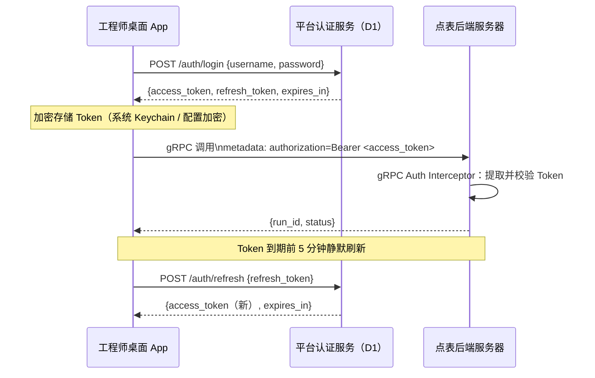
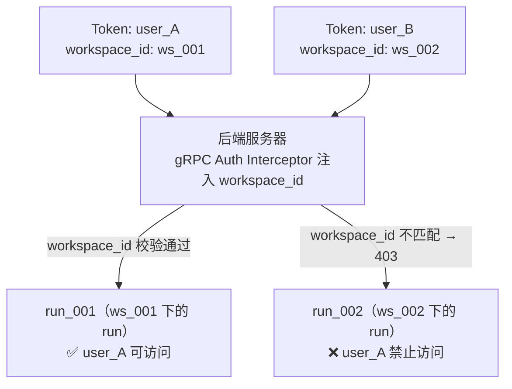
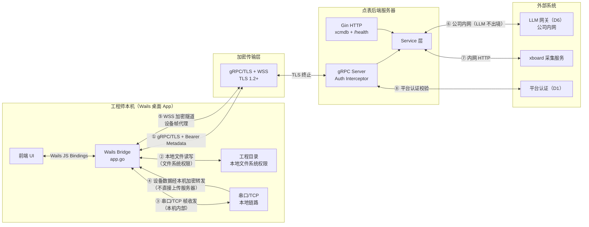
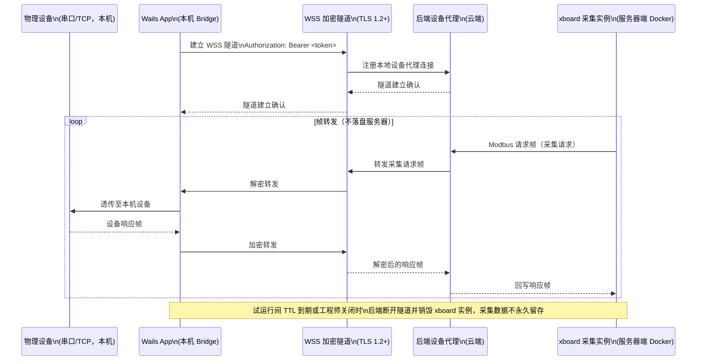
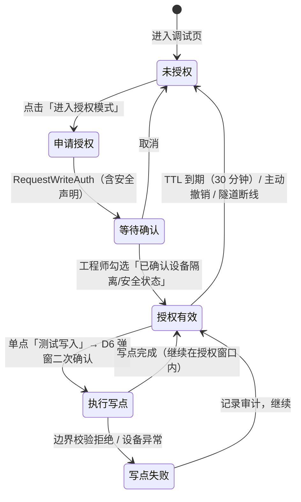
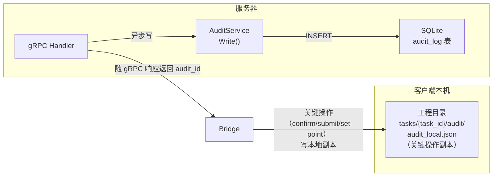
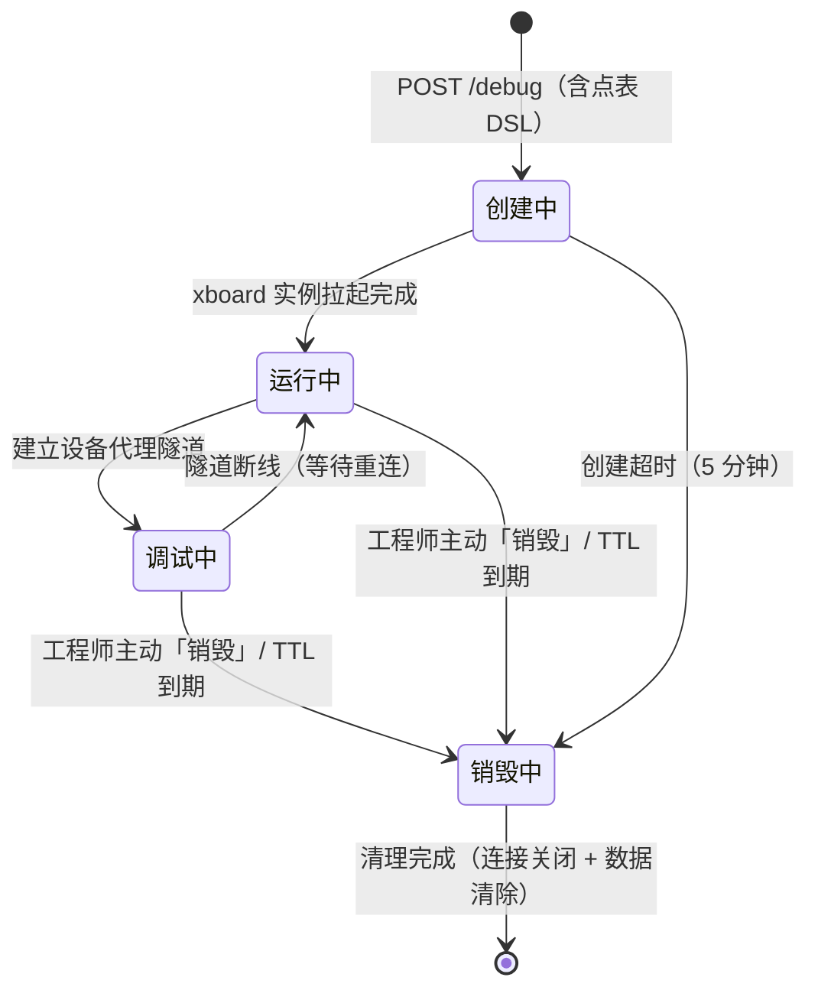

# T5 — 点表智能工作台：安全权限与审计设计

> 本文是「点表智能工作台」项目的**安全架构设计文档（T5）**，只描述**目标安全体系（To-Be）**：身份认证与授权、通信安全、写点调试安全门禁、操作审计留痕、试运行间安全与敏感配置安全，供架构评审与安全实施参考。
> **现状安全评估（威胁全景、已有安全能力、鉴权链路现状）与到目标体系的差距/演进路线**见 `T5A-安全现状评估与演进方案.md`。
> 关联文档：T1（系统架构）、T3（数据库与数据模型）、T8（桌面端 gRPC Bridge 架构）、BRD §8（外部依赖 D1/D6）、原型说明 F17（写点调试安全）。

---

## 目录

- [§1 目标安全体系](#1-目标安全体系)
  - [1.1 身份认证与授权（与平台 D1 对齐）](#11-身份认证与授权与平台-d1-对齐)
  - [1.2 通信安全](#12-通信安全)
  - [1.3 写点调试安全（F17/D6）](#13-写点调试安全f17d6)
  - [1.4 操作审计与留痕](#14-操作审计与留痕)
  - [1.5 试运行间安全](#15-试运行间安全)
  - [1.6 敏感配置安全](#16-敏感配置安全)

---

## §1 目标安全体系

### 1.1 身份认证与授权（与平台 D1 对齐）

#### 认证模型

产品采用**平台 Bearer Token 单点认证**方案，与 BRD §8 依赖项 D1「认证接口（平台）」对齐，避免引入独立用户体系增加运维负担。



#### Token 生命周期

| 属性 | 设计值 | 说明 |
|------|--------|------|
| access_token 有效期 | 2 小时 | 与平台统一，现场调试单次作业通常在此内完成 |
| refresh_token 有效期 | 7 天 | 工程师周内无需重复登录 |
| 静默刷新窗口 | 到期前 5 分钟 | 桌面端后台定时器触发，用户无感知 |
| 吊销机制 | 平台端主动吊销（黑名单） | 工程师离职/账号异常时平台侧拉黑 Token；服务器每次 gRPC Auth Interceptor 均须实时校验（不依赖本地缓存） |
| 离线降级 | 仅限查看/编辑/导出已有点表 | Token 失效后，AI 生成、调试、快捷提交功能置灰，本地功能不受影响（原型原则 1） |

#### 服务器端鉴权拦截器设计

主业务 API 走 gRPC，在 `internal/grpc/interceptor/` 新增 Auth Interceptor，并同时覆盖 Unary 与 Streaming 调用：

```go
// internal/grpc/interceptor/auth.go

// UnaryAuthInterceptor 从 gRPC Metadata authorization: Bearer <token> 提取并校验平台 Token。
// 校验通过后将 user_id 与 workspace_id 注入 context，供下游 Handler/Service 使用。
func UnaryAuthInterceptor(verifier TokenVerifier) grpc.UnaryServerInterceptor {
    return func(ctx context.Context, req any, info *grpc.UnaryServerInfo, handler grpc.UnaryHandler) (any, error) {
        md, _ := metadata.FromIncomingContext(ctx)
        raw := md.Get("authorization")
        if len(raw) == 0 || !strings.HasPrefix(raw[0], "Bearer ") {
            return nil, status.Error(codes.Unauthenticated, "missing or malformed authorization metadata")
        }
        token := strings.TrimPrefix(raw[0], "Bearer ")

        claims, err := verifier.Verify(ctx, token)
        if err != nil {
            return nil, status.Error(codes.Unauthenticated, "invalid or expired token")
        }

        ctx = WithTokenClaims(ctx, claims)
        return handler(ctx, req)
    }
}

// TokenClaims 平台 Token 的关键声明字段。
type TokenClaims struct {
    UserID      string
    WorkspaceID string  // 对应工程隔离的 workspace/project 维度
    Role        string  // "engineer" | "admin"
}

// TokenVerifier 依赖倒置接口，便于测试和替换验签实现。
type TokenVerifier interface {
    Verify(ctx context.Context, token string) (*TokenClaims, error)
}
```

服务器启动时将 Auth Interceptor 挂载到 gRPC Server；Gin HTTP 只保留 `/api/v3/link/board/*` 与 `/health`，其中 `/health` 不鉴权，xcmdb 兼容接口按部署要求单独鉴权：

```go
// internal/grpc/server.go（改造后）
grpcSrv := grpc.NewServer(
    grpc.UnaryInterceptor(interceptor.UnaryAuthInterceptor(verifier)),
    grpc.StreamInterceptor(interceptor.StreamAuthInterceptor(verifier)),
)
ptwv1.RegisterProjectServiceServer(grpcSrv, projectHandler)
ptwv1.RegisterGenerationServiceServer(grpcSrv, generationHandler)

// internal/api/router.go（保留 Gin 兼容面）
func NewHTTPRouter(h XcmdbHandlers) *gin.Engine {
    r := gin.New()
    r.GET("/health", func(c *gin.Context) { c.JSON(200, gin.H{"status": "ok"}) })
    r.GET("/api/v3/link/board/list", h.List)
    r.GET("/api/v3/link/board/count", h.Count)
    r.GET("/api/v3/link/board", h.Info)
    return r
}
```

#### 权限模型

**工程级隔离**是本产品最关键的横向权限边界。同一个后端服务器可能同时服务多位工程师处理不同甲方项目，必须确保工程师 A 无法访问工程师 B 的点表数据。



| 角色 | 权限范围 | 实现方式 |
|------|----------|----------|
| **工程师**（engineer） | 读写其 `workspace_id` 下的所有工程数据（run、debug、audit） | 所有 Service 方法加 `workspace_id` 过滤条件 |
| **管理员**（admin） | 跨 workspace 查看（只读）+ 审计日志全量查询 | Middleware 注入 `role=admin`，Service 层特殊分支 |
| **只读模式**（离线） | 仅限本地工程文件读写，无 API 调用权限 | 客户端侧，Token 失效时屏蔽远端调用 |

资源归属校验示例（所有 Handler 遵循此模式）：

```go
// 通用资源归属校验，防止越权访问
func assertWorkspace(ctx context.Context, runWorkspaceID string) error {
    claims := ClaimsFromContext(ctx)
    callerWorkspace := claims.WorkspaceID
    role := claims.Role
    if role == "admin" {
        return nil // 管理员跨 workspace 只读
    }
    if callerWorkspace != runWorkspaceID {
        return status.Error(codes.PermissionDenied, "access denied: run belongs to a different workspace")
    }
    return nil
}
```

**细粒度权限**（写点调试）见 §1.3 专节。

#### 多客户端并发访问的冲突处理

服务器侧**设备调试串行锁**（`internal/debug/lock.go` 的 `LockSet`）防止同一设备被多个调试任务并发操控。在引入 Token 鉴权后，锁粒度应从单纯 `resource_id` 扩展为 `workspace_id + resource_id`，确保跨工程的设备不会相互干扰：

```go
// 扩展后的锁 key（workspace_id 防止不同工程的同名资源冲突）
lockKey := fmt.Sprintf("%s:%s", workspaceID, resourceID)
```

同时，写点授权令牌（见 §1.3）绑定 `user_id + run_id`，确保写点操作不可被其他会话复用。

---

### 1.2 通信安全

#### 整体数据流安全架构



#### 客户端↔服务器：gRPC/TLS 与设备 WSS 隧道

| 要求 | 说明 |
|------|------|
| 协议版本 | TLS 1.2+，禁用 TLS 1.0/1.1 和弱密码套件（RC4、3DES） |
| 证书管理 | 服务器使用受信任 CA 证书（公司内网 CA 或公网 CA）；桌面 App 内置公司根 CA 证书，用于内网环境证书验证 |
| 桌面业务传输 | Bridge → 服务器统一使用 gRPC/TLS；Token 放在 gRPC Metadata，不由前端拼接 Header |
| HTTP 兼容面 | Gin HTTP 仅开放 `/api/v3/link/board/*` 与 `/health`；`/health` 可按运维环境允许明文内网访问 |
| WebSocket 安全 | 仅设备代理隧道使用 WSS；握手时携带 Bearer Token（`Sec-WebSocket-Protocol` 或 URL 参数），后端隧道网关同等鉴权 |
| HSTS | 若部署 HTTPS 反代给 Gin 兼容面，服务器响应头添加 `Strict-Transport-Security: max-age=31536000` |

#### 设备数据经本机加密转发

原型明确承诺「设备数据经本机加密转发，收工后试运行间自动销毁」（`index.html` 信息条）。架构实现如下：

- 现场物理设备（串口/TCP）**只与工程师本机通信**，设备物理链路不直接暴露给 xboard 或外部网络；设备帧只通过受控 WSS 隧道进入云端后端设备代理
- 客户端 `Wails Bridge` 作为设备代理中间人，将设备帧通过 **WSS 加密隧道**转发给云端后端设备代理
- 服务器端 xboard 采集请求先进入云端后端设备代理，后端再经 WSS 隧道转发给本地 Bridge；xboard 不直接连接 Bridge 或物理设备
- xboard 收到的是云端后端代理回写的设备响应帧，设备的物理 IP/COM 口对 xboard 不可见
- 隧道建立需要有效 Bearer Token，确保非授权客户端无法建立设备代理



#### 协议文档上传安全

协议文档（PDF/DOC/XLSX 等）可能含有甲方敏感信息（设备参数、厂家资料）。

| 环节 | 安全措施 |
|------|----------|
| 传输 | Bridge 通过 gRPC/TLS 上传协议文档，无额外端到端加密（协议文档不含个人隐私数据，传输层加密已足够） |
| 服务器存储 | 文档存于 `jobs/{run_id}/` 目录，随 Job TTL 策略（建议 30 天）自动清理 |
| 访问控制 | 文档路径不直接暴露，只通过 EvidenceService 等 gRPC 方法间接访问，且经 workspace_id 校验 |
| MinerU OCR | Go 后端仅访问内网 MinerU API（当前 `http://192.168.20.99:8001`），不得暴露公网；传给 MinerU 的 `server_url` 限制为白名单 `http://mineru-openai-server:30000` |
| MinerU 上传限制 | 限制上传文件大小、并发数与任务日志；非 2xx 响应不得按 ZIP 保存，需记录状态码和错误体 |
| LLM 调用 | 协议文档内容通过公司 LLM 网关（D6）调用，**不出境**，LLM 网关侧有配额与访问日志 |

#### 桌面 App 本地数据

| 数据类型 | 安全策略 | 说明 |
|----------|----------|------|
| 工程目录（JSON DSL、xlsx） | 不加密，依赖文件系统权限 | 工程师本机文件权限即安全边界；点表数据不含高敏感个人信息 |
| 平台 Token | 加密存储（系统 Keychain 或 AES 加密配置文件） | 见 §1.6 |
| LLM API Key | 不存本地，由服务器管理 | 见 §1.6 |
| 调试会话日志 | 明文存于工程目录，依赖文件系统权限 | 日志可能含设备采集值，已在本机隔离 |

---

### 1.3 写点调试安全（F17/D6）

#### 风险背景

写点操作（SetPoint）会**实际改变现场运行中的设备寄存器值**，误操作可能导致：
- UPS/精密空调/列头柜等关键设备异常动作
- 生产环境意外停机或告警
- 现场工程师人身安全风险（高压设备）

BRD §10 明确将「写点调试导致设备误动作」列为**高风险**，F17 要求三重防护：默认禁用 / 逐点确认 / 边界校验。

#### 写点授权状态机



#### 授权模式设计

**步骤一：触发 D6 写点调试安全弹窗**

原型 T5 调试页底部「写点调试区」默认折叠并锁定（红色警示横幅），工程师需主动点击「进入授权模式」。弹窗要求工程师明确确认：

- ☑ 我已确认当前操作设备已处于**安全隔离状态**（非带载运行的生产设备）
- ☑ 我已知悉写点操作将**实际改变设备寄存器值**，操作不可自动恢复
- ☑ 我对本次写点操作**承担现场安全责任**

**步骤二：后端申请写点授权**

```
DebugService.RequestWriteAuth（gRPC）
metadata: authorization=Bearer <token>

Request Body:
{
  "debug_id": "dbg_xxx",
  "safety_acknowledged": true,   // 工程师已勾选安全声明
  "device_name": "UPS-01",       // 提示后端记录操作设备名称
  "reason": "测试写点：设置电流上限"
}

Response:
{
  "write_auth_id": "wa_xxxxxxxx",
  "expires_at": "2026-06-18T20:36:00+08:00",  // 30 分钟后到期
  "user_id": "user_abc",
  "run_id": "run_xxx"
}
```

**步骤三：逐点执行写入**

每次单点写入需：
1. 前端展示 D6 弹窗（原型 D6「写点确认」）：写入点名、目标值、数值边界校验结果、解析函数与编码预览、影响说明
2. 工程师需输入"确认"二字或勾选二次确认框
3. 前端调用 Bridge 写点方法，Bridge 携带 `write_auth_id` 调用 gRPC 写点接口，后端**实时校验**：
   - `write_auth_id` 有效且未过期
   - `write_auth_id` 归属的 `user_id` 与当前 Token `user_id` 一致
   - `write_auth_id` 归属的 `run_id` 与路径参数一致
   - 写入值在 `min_val ~ max_val` 边界内

```
DebugService.SetPoint（gRPC）
metadata: authorization=Bearer <token>

Request Body:
{
  "write_auth_id": "wa_xxxxxxxx",
  "debug_id": "dbg_xxx",
  "point_id": "p42",
  "register_addr": "40031",
  "function_code": "06",
  "value_raw": 1500,          // 写入原始值
  "value_display": "1500 (15.00A)",
  "user_confirmed": true       // 前端二次确认已完成
}

Response:
{
  "success": true,
  "device_response_hex": "01 06 00 1E 05 DC XX XX",
  "audit_id": "aud_xxxxxxxx"   // 审计记录 ID
}
```

#### 安全威胁与缓解措施

| 威胁 | 当前风险等级 | 目标缓解措施 |
|------|-------------|-------------|
| 未授权工程师执行写点操作 | 🔴 严重（无鉴权） | gRPC Auth Interceptor + write_auth_id 双重校验 |
| 写点授权被其他会话复用 | 🔴 严重 | write_auth_id 绑定 user_id + run_id，不可跨用户使用 |
| 越界值导致设备异常 | 🔴 高 | 服务器端强制边界校验（`min_val`/`max_val`），拒绝越界请求 |
| 工程师误操作（无二次确认） | 🟠 高 | D6 弹窗要求手动输入"确认"或二次勾选，前后端双重校验 `user_confirmed=true` |
| 写点授权长时间有效 | 🟡 中 | 授权 TTL 30 分钟，隧道断线自动撤销 |
| 批量写点（脚本攻击） | 🟡 中 | 每次 SetPoint 独立调用，无批量写接口；审计日志实时记录异常频率 |
| 写点操作无记录，事后无法溯源 | 🔴 严重（无审计） | 见 §1.4 审计设计 |

---

### 1.4 操作审计与留痕

#### 审计范围

「AI 全程留痕」是产品原则 2（原型说明 §0）。以下操作均需记录审计日志：

| 事件类型 | 关键字段 | 说明 |
|----------|----------|------|
| `ai_generate` | 模型名/版本、prompt 版本、input_tokens、elapsed_ms | AI 生成调用，成本核算与可追溯性 |
| `clarification_decide` | clarification_id、问题描述、选择答案、候选列表 | 澄清拍板，追溯人工决策依据 |
| `selection_change` | point_id、原状态→新状态（enabled/disabled）、原因 | 人工筛选 disable/enable overlay |
| `debug_auto_apply` | debug_id、round、hypothesis_id、seq、字段 diff、verify 结果 | 自收敛 loop 每轮自动应用变更留痕（无人工 accept/reject，T2 §5）|
| `table_confirm` | 确认人、内容 SHA-256 哈希、json_dsl_size | 点表人工确认，不可否认性证据 |
| `submit` | 目标服务器、提交内容哈希、远端回执号、耗时 | 快捷提交，对应 D8 回执 |
| `write_auth_grant` | write_auth_id、安全声明内容、设备名称 | 写点授权申请记录 |
| `set_point` | write_auth_id、point_id、register_addr、value_raw、value_display、设备响应 hex | **所有写点操作**，最高级别审计 |
| `debug_session_start` | debug_id、点表版本、xboard 地址 | 调试会话开始 |
| `debug_session_end` | debug_id、结束原因（完成/熔断/手动停止）、轮次数 | 调试会话结束 |
| `run_create` | resource_id、device_name、协议文件 hash | AI 生成任务创建 |

#### 审计记录数据结构

```go
// internal/audit/model.go

// AuditLog 操作审计记录。
type AuditLog struct {
    ID          string          `json:"id"`           // UUID
    EventType   string          `json:"event_type"`   // 见上表
    UserID      string          `json:"user_id"`
    WorkspaceID string          `json:"workspace_id"`
    ResourceID  string          `json:"resource_id,omitempty"` // 设备 resource_id
    RunID       string          `json:"run_id,omitempty"`
    DebugID     string          `json:"debug_id,omitempty"`
    Timestamp   time.Time       `json:"timestamp"`
    RequestID   string          `json:"request_id"`           // 链路追踪
    DetailJSON  json.RawMessage `json:"detail_json"`          // 事件特定详情
    ContentHash string          `json:"content_hash,omitempty"` // 关键操作内容 SHA-256
    IPAddr      string          `json:"ip_addr"`              // 客户端 IP
}
```

#### 审计存储



**服务器端 SQLite DDL**（新增 `audit_log` 表）：

```sql
-- 在 store/sqlite/schema.sql 追加

CREATE TABLE IF NOT EXISTS audit_log (
    id           TEXT PRIMARY KEY,                       -- UUID
    event_type   TEXT NOT NULL,                          -- 事件类型枚举
    user_id      TEXT NOT NULL,
    workspace_id TEXT NOT NULL,
    resource_id  TEXT,
    run_id       TEXT,
    debug_id     TEXT,
    timestamp    DATETIME NOT NULL DEFAULT (datetime('now', 'utc')),
    request_id   TEXT,
    detail_json  TEXT NOT NULL DEFAULT '{}',             -- JSON 字符串
    content_hash TEXT,                                   -- SHA-256（可选）
    ip_addr      TEXT
);

CREATE INDEX IF NOT EXISTS idx_audit_run_id    ON audit_log(run_id);
CREATE INDEX IF NOT EXISTS idx_audit_user_id   ON audit_log(user_id);
CREATE INDEX IF NOT EXISTS idx_audit_event     ON audit_log(event_type);
CREATE INDEX IF NOT EXISTS idx_audit_timestamp ON audit_log(timestamp);
```

**审计查询接口**：

```
AuditService.ListRunAudit（gRPC）
metadata: authorization=Bearer <token>

Query Params:
  event_type  string   // 可选，过滤事件类型（如 set_point）
  from        string   // ISO8601 起始时间
  to          string   // ISO8601 结束时间
  limit       int      // 默认 100，最大 500
  offset      int

Response:
{
  "total": 42,
  "items": [
    {
      "id": "aud_xxx",
      "event_type": "set_point",
      "user_id": "user_abc",
      "timestamp": "2026-06-18T18:30:00+08:00",
      "detail_json": { "register_addr": "40031", "value_raw": 1500, ... }
    }
  ]
}
```

#### 客户端本机审计副本

关键操作（`table_confirm`、`submit`、`set_point`、`write_auth_grant`）在服务器写入审计的同时，客户端将该记录追加写入本地工程目录：

```
{工程目录}/tasks/{task_id}/audit/audit_local.jsonl
```

格式为 JSON Lines，每行一条记录（与服务器结构相同）。用途：
- 服务器不可达时提供本地回溯依据
- 工程交付时作为本地归档的可信证据
- 客户端不依赖服务器即可展示本任务的操作历史

---

### 1.5 试运行间安全

「试运行间」（xboard 采集实例）是真机调试闭环的核心组件，生命周期安全是防止资源泄漏和数据留存的关键。

#### 采集实例生命周期与自动销毁



| 销毁触发条件 | 超时/阈值 | 销毁动作 |
|-------------|----------|----------|
| 工程师主动点击「销毁」 | 立即 | ① 断开设备代理隧道 ② 通知 xboard 停止采集 ③ 清除实例内临时采集数据 |
| 调试会话 TTL | 2 小时（可配） | 同上，后端定时器触发 |
| 隧道断线后超时 | 30 分钟内无重连 | 同上 |
| 服务器重启 | N/A | 启动时清理所有孤儿实例（无对应活跃会话的 xboard 实例） |

#### 设备代理隧道安全

| 安全要求 | 实现 |
|----------|------|
| 传输加密 | WSS（TLS 1.2+），设备帧不明文传输 |
| 身份鉴权 | 隧道建立时携带 Bearer Token，服务器校验后绑定 `run_id + user_id` |
| 设备 IP 不暴露 | 服务器侧只持有隧道连接句柄，不记录工程师本机的设备 IP/COM 口 |
| 隧道独占 | 同一 `run_id + resource_id` 最多一条活跃隧道（复用调试串行锁机制） |
| 自动断开 | 隧道空闲超过 30 分钟无帧转发，服务器主动断开并记录审计 |

#### 数据留存策略

| 数据类型 | 留存位置 | 留存策略 |
|----------|----------|----------|
| 实时采集值（原始帧 hex） | xboard 实例内存 | **不永久落盘**，实例销毁时清除 |
| 调试轮次产物（`rounds/{n}/` + `session.json`，自动应用留痕） | 服务器 `jobs/{run_id}/debug/` | 随 Job TTL（建议 30 天）清理 |
| 采样数据（Triage 依据） | 服务器 `jobs/{run_id}/debug/` | 同上 |
| 调试会话日志（收发报文记录） | 客户端本机工程目录 | 永久，随工程目录保留，用于本地调试报告 |
| 审计日志 | 服务器 SQLite `audit_log` + 客户端本机副本 | 服务器端保留 1 年；本机副本随工程目录保留 |

---

### 1.6 敏感配置安全

#### LLM API Key 存储

> 明文 API Key 的现状风险见 `T5A-安全现状评估与演进方案.md` §1.4。

**目标方案**：

| 方案层次 | 实现 | 适用场景 |
|----------|------|----------|
| **P0 最小可行**：环境变量注入 | `OPENAI_API_KEY` 环境变量，`config.json` 不包含此字段（代码库和配置文件均不留密钥） | 所有部署场景 |
| **P1 推荐**：密钥管理服务 | 对接公司密钥管理服务（Vault / AWS Secrets Manager），服务启动时动态获取 | 生产环境 |
| **P2 兜底**：加密配置文件 | `config.json` 中 API Key 字段用服务器主密钥 AES-256 加密，主密钥由环境变量注入 | 无密钥服务的简单部署 |

**代码改造点**：

```go
// config/config.go（改造后）
type OpenAIConfig struct {
    BaseURL    string `json:"base_url"`
    // api_key 不再从 config.json 读取
    Model      string `json:"model"`
    MaxRetries int    `json:"max_retries"`
}

// LoadAPIKey 优先从环境变量读取，兜底从加密配置读取。
func LoadAPIKey() (string, error) {
    if key := os.Getenv("OPENAI_API_KEY"); key != "" {
        return key, nil
    }
    // 兜底：加密配置文件读取（P2 方案）
    return loadEncryptedKey()
}
```

**`.gitignore` 要求**：`config.json`（含任何密钥字段的文件）必须加入 `.gitignore`，代码库提供 `config.example.json`（无真实密钥）。

#### 平台 Token 客户端存储

工程师登录平台后，`access_token` 和 `refresh_token` 存储在客户端本机：

| 方案 | 安全级别 | 实现 |
|------|---------|------|
| **系统 Keychain（推荐）** | 高 | Windows: DPAPI / Credential Manager；macOS: Keychain；通过 `zalando/go-keyring` 或 Wails 原生 API 调用 |
| **AES 加密配置文件** | 中 | 在本地用户配置目录（`%APPDATA%/PointTableWorkbench/`）存储 AES-256-GCM 加密的 Token 文件，AES 密钥由 DPAPI 保护（Windows）或 `security` 命令派生（macOS） |
| **明文配置文件** | ❌ 禁止 | `localStorage`（原型用法）和明文 JSON 均不允许在正式版使用 |

对应 `app.go` 中 `GetConfig()`/`SaveConfig()` 桩方法的正式版实现应调用 Keychain 存取 Token，而非 `localStorage`。

#### xboard 连接凭证管理

| 凭证类型 | 存储位置 | 安全措施 |
|----------|----------|----------|
| xboard 服务地址 | 客户端工程目录 `ptw-project.json`（明文可接受，地址非密钥） | 无 |
| xboard API Token（如有） | 客户端 Keychain | 与平台 Token 同等处理 |
| xboard → 服务器调用 | 服务器内环境变量 | 不存 `config.json` |

---

*文档版本 V0.1 · 2026-06-18*
*作者：架构设计（T5）*
*关联：T1（系统架构）/ T3（数据模型）/ BRD §8 / 原型说明 F17/D6*
