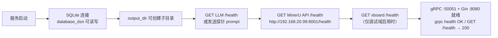
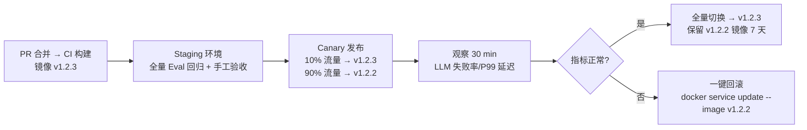
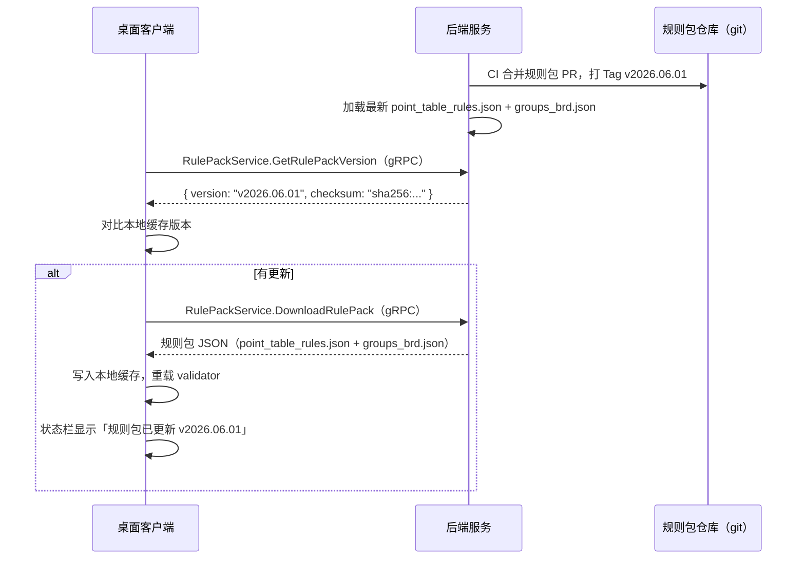
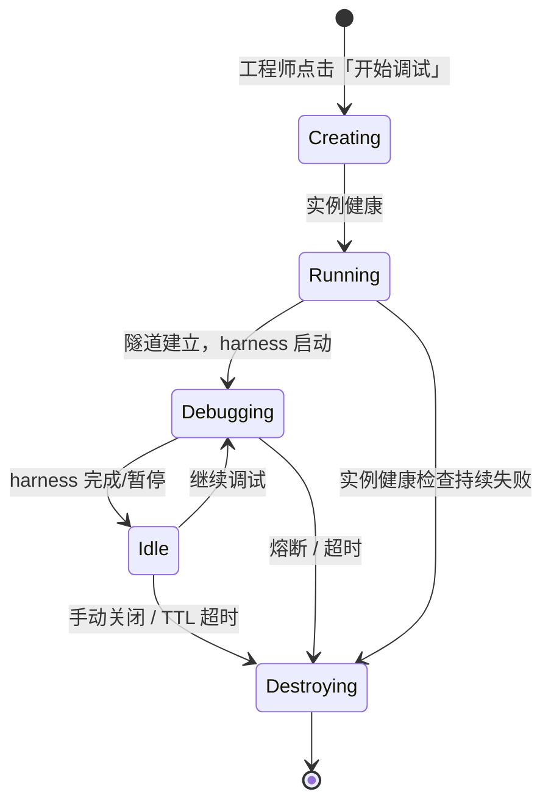

# T6 — 部署分发与运维设计

> 本文是「点表智能工作台」项目的**部署分发与运维**技术设计文档（T6），只描述**目标状态（To-Be）**的部署与运维设计：服务器统一后端容器化、桌面 App 二进制分发与版本管理、**per-session xboard 容器生命周期与编排**、可观测性，以及本机工程目录备份与迁移目标功能。
> **架构基线（已确认）**：**云端无跨会话持久态**（后端无持久 SQLite 卷）；调试改为**每会话一个 xboard Docker 容器（warm pool 预热 + late binding 注入 + 收工销毁）**，由后端经 Go Docker SDK 直控容器生命周期。架构与依据见 [T1](T1-系统架构设计.md)，存储边界见 [T12](T12-数据与物料存储边界设计.md)。
> **部署运维现状（As-Is）、现状缺口与差距演进路线**（现有构建体系 / 配置 / Wails 打包梳理、缺口汇总、补齐优先级与 Docker 最小可行配置）见 `T6A-部署运维现状与演进方案.md`。
> 关联文档：T1 系统架构总览、T5 调试子系统设计、[AI 生成点表设计](../../ai-point-table/docs/设计文档/AI%20生成点表.md)。

---

## §1 目标部署形态

### §1.1 整体拓扑

```mermaid
graph TB
    subgraph 工程师笔记本
        DE["桌面客户端<br/>Wails 二进制<br/>（macOS .app / Windows .exe）"]
        WD["本地工程目录（唯一权威）<br/>JSON DSL / device.json<br/>点表/证据/调试报告"]
        DEV["真实设备<br/>串口 / TCP"]
    end

    subgraph 公司服务器["公司服务器（单台 · 无跨会话持久态）"]
        BE["后端服务<br/>Go 单进程<br/>gRPC + Gin 兼容面<br/>会话协调器 + 容器编排器(Go Docker SDK)"]
        SCR["jobfs scratch<br/>会话临时态（TTL 即清）"]
        MEM["内存会话注册表<br/>resource_id→设备配置 / 路由"]
        LLM["LLM 网关<br/>（OpenAI 兼容）"]
        OCR["MinerU API<br/>http://192.168.20.99:8001"]
        TUN["会话级隧道代理<br/>按 resource_id 路由 + WSS"]
        DSOCK["Docker Engine<br/>/var/run/docker.sock"]
        POOL["warm pool<br/>预热 xboard 容器"]
        C1["xboard 容器(会话A) :6100"]
        C2["xboard 容器(会话B) :6101"]
    end

    subgraph 平台
        PLAT["建站资产库<br/>远端点表系统"]
    end

    DE -->|gRPC/TLS<br/>业务 API + 上传 DSL/device.json| BE
    DE -->|gRPC Streaming<br/>进度/实时值/报文| BE
    DE -->|串口/TCP 直连| DEV
    DE <-->|WSS Tunnel<br/>设备帧透传（按 resource_id）| TUN
    BE --> SCR
    BE --> MEM
    BE --> LLM
    BE --> OCR
    BE --> TUN
    BE -->|容器生命周期| DSOCK
    DSOCK --> POOL
    POOL --> C1
    POOL --> C2
    C1 <-->|采集请求 / 设备回包| TUN
    C1 -->|xcmdb 查询(会话作用域)| MEM
    DE -->|快捷提交| PLAT
```

**核心约定**：
- JSON DSL / `device.json` 等权威产物**始终在工程师本机**，调试时随请求上传，云端仅会话存活期间临时持有。
- 后端服务无持久卷：只承载 LLM 流水线计算、会话临时 scratch、内存会话注册表与容器编排；**无 SQLite 数据库卷**。
- 调试时每会话一个独立 xboard 容器：后端经 Go Docker SDK 从 warm pool 绑定、late binding 注入会话配置、挂载会话 xlsx，收工 / 超时 `docker rm` 销毁。
- 桌面 app 是唯一分发给现场工程师的可执行文件。
- 桌面业务请求统一由 Wails Go Bridge 通过 gRPC 访问后端；Gin HTTP 仅用于会话容器经 xcmdb `/api/v3/link/board/*` 查询和 `/health` 探活。

---

### §1.2 服务器统一后端部署

#### §1.2.1 后端镜像方案（无持久卷）

后端以单 Go 二进制打入镜像。**目标态不再挂载 SQLite 数据库卷**；只把 `output_dir` 作为**会话临时 scratch**（可为容器本地临时目录或临时卷，随会话清理）。后端需访问宿主 Docker Engine 以编排 xboard 会话容器，因此挂载 `/var/run/docker.sock`（或经远程 Docker API）。

**后端 Dockerfile 设计要点**：

```dockerfile
# ---- 构建阶段 ----
FROM golang:1.25-bookworm AS builder
WORKDIR /src
COPY go.mod go.sum ./
RUN go mod download
COPY . .
# wire 生成后再编译（CI 中 wire 产物已提交或在此重新生成）
RUN go run github.com/google/wire/cmd/wire ./cmd/server && \
    CGO_ENABLED=0 GOOS=linux GOARCH=amd64 \
    go build -ldflags="-s -w -X main.version=${VERSION}" \
    -o /dist/server ./cmd/server

# ---- 运行阶段 ----
FROM debian:bookworm-slim
RUN apt-get update && apt-get install -y ca-certificates tzdata && rm -rf /var/lib/apt/lists/*

WORKDIR /app
COPY --from=builder /dist/server /app/server
COPY config/config.json /app/config/config.json

# 仅 scratch 临时目录（无持久数据库卷）
VOLUME ["/app/scratch"]

ENV TZ=Asia/Shanghai
ENV APP_SERVER_ADDR=":8080"
ENV APP_GRPC_ADDR=":50051"
ENV APP_OUTPUT_DIR="/app/scratch"
# 容器编排：访问宿主 Docker Engine
ENV APP_DOCKER_HOST="unix:///var/run/docker.sock"
ENV APP_XBOARD_IMAGE="xboard-collect:latest"
ENV APP_WARM_POOL_SIZE="2"
ENV APP_MAX_DEBUG_SESSIONS="8"

EXPOSE 50051 8080
ENTRYPOINT ["/app/server", "-config", "/app/config/config.json"]
```

> 注意：`APP_DATABASE_DSN` 已退役（目标态无持久 SQLite，见 [T3](T3-数据库与数据模型设计.md) / [T3A §2.5](../现状&&演进/T3A-数据存储现状与演进方案.md)）。运行时需把宿主 `/var/run/docker.sock` 挂载进后端容器，或为后端配置可达的 Docker API 端点，以驱动 xboard 容器编排。

**镜像构建与版本标签规范**：

```bash
docker build \
  --build-arg VERSION=v1.2.3 \
  -t ai-point-table-server:v1.2.3 \
  -t ai-point-table-server:latest \
  .
```

#### §1.2.1bis xboard 最小采集镜像

调试会话使用的 xboard 容器应是**最小采集镜像**，只保留采集闭环所需模块，关闭无关重型模块以缩短冷启动、降低资源占用：

| 模块 | 取舍 | 理由 |
|---|---|---|
| `collect` 采集 | **保留** | 调试采集核心 |
| `api` HTTP 接口 | **保留** | `/update`、`/updateTemplate`、`/status`、`/collect/value`、`/api/v3/project/device/debug` |
| `modbus` 驱动 | **保留** | 现场设备协议（按需含其它必要驱动）|
| `north` 上报 | **关闭** | 调试不需要北向上报 |
| `tsdb` 时序库 | **关闭** | 调试不落时序 |
| `strategy` 策略引擎 | **关闭** | 调试不跑策略 |

**xboard 镜像构建注意**：

- **bundled libc**：xboard 依赖特定 glibc / 第三方库，最小运行镜像需带齐其捆绑的运行时库（不可简单用 distroless 砍掉 libc），否则启动即失败。
- **`@RUNTIME_ROOTFS@` 路径替换**：xboard 配置 / 模板加载路径含构建期占位符 `@RUNTIME_ROOTFS@`，镜像构建时须替换为容器内实际根路径，保证点表 xlsx 目录、配置目录在容器内可被正确解析。
- **点表目录可挂载**：容器内点表目录设计为挂载点，后端把会话渲染的 `{device_type}.xlsx` 挂载 / 注入进去；`device_type`（`.`→`_`）决定文件名（见 [T1 §2.3](T1-系统架构设计.md)）。
- **端口外露**：暴露采集 HTTP 端口（如 6100），由后端按会话分配宿主侧端口（6100、6101…）或走容器网络内部寻址。

```bash
docker build -f xboard/Dockerfile.collect \
  --build-arg RUNTIME_ROOTFS=/app \
  -t xboard-collect:latest .
```

#### §1.2.2 配置管理

配置采用**文件 + 环境变量双层**方案：`config/config.json` 是基准默认值，环境变量在运行时**覆盖**对应字段，优先级高于文件。

| 环境变量 | 对应 config.json 字段 | 说明 |
|---|---|---|
| `APP_SERVER_ADDR` | `server_addr` | 监听地址，默认 `:8080` |
| `APP_GRPC_ADDR` | `grpc_addr` | 桌面业务 gRPC 监听地址，默认 `:50051` |
| `APP_DATABASE_DSN` | `database_dsn` | SQLite 路径，挂载卷后应改为 `/app/data/app.db` |
| `APP_OUTPUT_DIR` | `output_dir` | Job 产物根目录，挂载卷后为 `/app/output` |
| `APP_MAX_UPLOAD_SIZE_MB` | `max_upload_size_mb` | 最大上传文件大小，默认 30 |
| `APP_BATCH_SIZE` | `batch_size` | LLM 批处理大小，默认 5 |
| `APP_MAX_CONCURRENT_LLM` | `max_concurrent_llm` | LLM 并发数上限，默认 10 |
| `OPENAI_BASE_URL` | `openai.base_url` | LLM 网关地址，**不可泄露到镜像** |
| `OPENAI_API_KEY` | `openai.api_key` | LLM 鉴权密钥，**必须走 Secret** |
| `OPENAI_MODEL` | `openai.model` | 模型名称 |
| `OPENAI_MAX_RETRIES` | `openai.max_retries` | 最大重试次数，默认 5 |
| `MINERU_API_BASE_URL` | `mineru.base_url` | MinerU API 地址，当前部署示例 `http://192.168.20.99:8001` |
| `MINERU_VLM_SERVER_URL` | `mineru.server_url` | 传给 MinerU API 的容器内部 VLM 地址，固定推荐 `http://mineru-openai-server:30000` |
| `MINERU_TIMEOUT_MINUTES` | `mineru.timeout_minutes` | 单文件同步解析超时，建议 10–30 分钟 |
| `MINERU_MAX_CONCURRENT` | `mineru.max_concurrent` | 单个 MinerU API 实例并发上限 |
| `XBOARD_BASE_URL` | `xboard.base_url` | xboard 平台地址（调试域） |
| `XBOARD_TOKEN` | `xboard.token` | xboard 鉴权 Token，**必须走 Secret** |

**Secret 注入方式**（生产推荐 Kubernetes Secret 或 Docker Swarm Secret，开发可用 `.env` 文件）：

```yaml
# docker-compose.yml（开发/单机部署）
services:
  server:
    image: ai-point-table-server:${VERSION:-latest}
    env_file:
      - .env.local        # 本地 secret，不提交 git
    environment:
      APP_DATABASE_DSN: /app/data/app.db
      APP_OUTPUT_DIR: /app/output
    volumes:
      - ./data:/app/data
      - ./output:/app/output
	    ports:
	      - "50051:50051"
	      - "8080:8080"
    healthcheck:
      test: ["CMD", "wget", "-qO-", "http://localhost:8080/health"]
      interval: 30s
      timeout: 5s
      retries: 3
      start_period: 10s
    restart: unless-stopped
```

#### §1.2.3 外部依赖与启动时健康检查

后端启动时需依次验证以下外部依赖；任一检查失败则拒绝启动（fail-fast）：



| 依赖 | 检查方式 | 失败策略 |
|---|---|---|
| SQLite | 打开连接、执行 `PRAGMA journal_mode=WAL` | Fatal 退出 |
| output_dir | `os.MkdirAll` 并写入测试文件 | Fatal 退出 |
| LLM 网关 | HTTP GET `{base_url}/models`（或发送 1-token 探针） | Fatal 退出（可配置为 Warn + 降级） |
| MinerU API | HTTP GET `{mineru.base_url}/health`，当前 `http://192.168.20.99:8001/health` | Warn + OCR 功能降级；仅文本协议可继续 |
| MinerU VLM Server | 运维侧 HTTP GET `http://192.168.20.99:30000/health` | 不由 Go 后端直接依赖，作为 MinerU 故障排查项 |
| xboard | HTTP GET `{xboard_base_url}/health` | Warn 仅告警，调试域功能不可用 |

#### §1.2.4 多工程师并发访问的进程模型

当前目标架构：**单 Go 进程 + gRPC Server（桌面业务）+ Gin HTTP（xcmdb/health 兼容面）+ goroutine 并发**。

```
gRPC 请求 / Stream → goroutine per RPC
                    ↓
           pipeline.Run (errgroup + semaphore)
           max_concurrent_llm = 10（全局信号量）
                    ↓
           SQLite（WriteDB: SetMaxOpenConns(1)）
```

**SQLite 并发瓶颈分析与对策**：

| 场景 | 当前行为 | 风险 | 对策 |
|---|---|---|---|
| 多工程师同时触发生成 | 所有 goroutine 竞争单连接写锁 | 写入串行化，高并发下响应慢 | 启用 WAL 模式（`PRAGMA journal_mode=WAL`），读写分离（ReadDB 多连接，WriteDB `SetMaxOpenConns(1)`） |
| Job 状态频繁更新 | 短写事务频率高 | 锁争用 | 批量写 / 异步状态更新队列 |
| 大文件上传 + LLM 调用 | `max_upload_size_mb=30`，LLM 调用阻塞 goroutine | goroutine 泄漏 | 设置 context timeout；semaphore 保护 `max_concurrent_llm` |

SQLite 推荐配置：

```sql
PRAGMA journal_mode=WAL;
PRAGMA busy_timeout=5000;
PRAGMA synchronous=NORMAL;
PRAGMA cache_size=-32000;   -- 32 MB page cache
```

> 若并发工程师数超过 5 人或单机 LLM 调用 QPS 持续 > 2，应评估切换至 PostgreSQL（替换 `modernc.org/sqlite` 驱动层，无需改动上层业务逻辑）。

#### §1.2.5 灰度发布与回滚策略



**回滚操作**（Docker Compose 单机场景）：

```bash
# 回滚到上一个稳定版本
VERSION=v1.2.2 docker compose up -d --no-deps server

# 验证
curl http://localhost:8080/health
```

---

### §1.3 桌面 App 二进制分发与版本管理

#### §1.3.1 Wails 打包命令与产物

```bash
# 在 desktop/ 目录下执行
cd ai-point-web/desktop

# 同步前端原型到 dist
node frontend/sync-frontend.mjs

# 生产打包
wails build

# 产物位置：
#   macOS:   build/bin/point-table-workbench.app
#             → 打包为 .dmg 分发
#   Windows: build/bin/设备驱动点表智能工作台.exe
#             → 打包为 .msi 或自解压 .zip 分发
```

**交叉编译（CI 服务器统一出包）**：

```bash
# macOS Intel (amd64)
GOOS=darwin GOARCH=amd64 wails build -platform darwin/amd64

# macOS Apple Silicon (arm64)
GOOS=darwin GOARCH=arm64 wails build -platform darwin/arm64

# Windows amd64
GOOS=windows GOARCH=amd64 wails build -platform windows/amd64
```

#### §1.3.2 版本号方案

产品采用**客户端版本 + 规则包版本**双轨版本管理：

| 版本维度 | 格式 | 管理位置 | 更新频率 |
|---|---|---|---|
| 客户端版本 `appVersion` | `v{MAJOR}.{MINOR}.{PATCH}` | `desktop/wails.json`→`info.productVersion` | 功能发布或 Bug 修复时 |
| 规则包版本 `rulePackVersion` | `v{YEAR}.{MONTH}.{SEQ}` 如 `v2026.06.01` | `RulePackService.GetRulePackVersion` gRPC 下发 | 规则维护者更新 `point_table_rules.json` / `groups_brd.json` 时 |

客户端启动时从服务器拉取规则包版本，底部状态栏展示：

```
客户端 v0.1.0  |  规则包 v2026.06.01
```

#### §1.3.3 规则包更新机制



规则包 gRPC 设计（最小方案）：

```
RulePackService.GetRulePackVersion
     → { version, checksum, updated_at }

RulePackService.DownloadRulePack
     → { point_table_rules: {...}, groups_brd: {...} }
```

#### §1.3.4 客户端自动检查更新（版本接口）

```
MetaService.GetClientVersion
     → {
         latest_version: "v0.2.0",
         download_url: "https://dl.example.com/client/v0.2.0/windows/",
         release_notes: "修复了 xxx",
         force_update: false
       }
```

客户端启动后由 Bridge 通过 gRPC 静默请求上述接口；若 `latest_version` > 当前版本，弹出非阻断式提示（非强制更新时允许用户忽略）。

---

### §1.4 试运行间（采集实例/隧道）生命周期管理

调试阶段，客户端通过平台 D3 接口创建 Docker 采集实例，并通过 D5/后端设备代理建立设备代理通道。xboard 的采集请求先进入云端后端设备代理，后端通过 WSS 转发给工程师本地 Bridge，Bridge 再透传到本地串口/TCP 设备；设备响应按原路回到 xboard。



| 生命周期事件 | 触发条件 | 处理动作 |
|---|---|---|
| 创建实例 | 工程师进入调试页，选择连接设备 | 调用 D3 API，传入点表 DSL 当前版本 |
| 健康检查 | 每 30s 轮询实例 `/health` | 失败 3 次 → 告警并尝试重建 |
| TTL 超时 | 实例创建后 2h 无活跃 harness 迭代 | 自动销毁，释放平台资源 |
| 隧道断线 | WebSocket 连接中断 | 自动重连（指数退避，最多 5 次）；暂停 harness |
| 热下发 DSL | harness 生成新版本点表 | 通过 D3 热更新接口推送，无需重建实例 |
| 调试完成/中断 | 工程师点击「结束调试」或 harness 熔断 | 销毁实例，释放隧道，保存调试报告到本地工程目录 |

---

### §1.5 可观测性设计

#### §1.5.1 日志规范

所有日志输出为结构化 JSON，字段规范如下：

```json
{
  "time": "2026-06-18T10:23:45.123Z",
  "level": "INFO",
  "request_id": "req-550e8400-e29b-41d4-a716-446655440000",
  "run_id": "run-abc123",
  "engineer_id": "eng-007",
  "module": "pipeline",
  "msg": "Stage1a 全部 Agent 完成",
  "duration_ms": 4230,
  "llm_tokens": 3812,
  "agent": "ParserAgent"
}
```

| 级别 | 使用场景 |
|---|---|
| `INFO` | 请求开始/完成、Job 状态变更、规则包更新、版本检查 |
| `WARN` | 云端 AI 单次重试、xboard 健康检查失败（服务降级中）、外部依赖响应变慢 |
| `ERROR` | LLM 调用最终失败、Job 失败、SQLite 写入失败、外部依赖不可达 |

`request_id` 由 gRPC Interceptor 在业务请求入口生成（UUID v4），贯穿日志全程，并通过 gRPC Metadata 返回 Bridge；Gin HTTP 兼容面继续通过响应 Header `X-Request-Id` 返回，便于问题追踪。

#### §1.5.2 关键指标

| 指标名 | 类型 | 说明 |
|---|---|---|
| `llm_calls_total` | Counter | LLM 调用总次数（按 agent 名称、结果 success/error 分标签） |
| `llm_call_duration_seconds` | Histogram | LLM 单次调用耗时（P50/P95/P99） |
| `job_queue_depth` | Gauge | 当前排队中的生成 Job 数量 |
| `job_duration_seconds` | Histogram | Job 端到端耗时（提交到完成） |
| `active_debug_sessions` | Gauge | 当前活跃调试会话数（有采集实例的） |
| `output_dir_bytes` | Gauge | `output_dir` 磁盘占用字节数 |

推荐使用 `prometheus/client_golang` 暴露 `/metrics` 端点，接入 Prometheus + Grafana。

#### §1.5.3 工程用量汇总

工程用量只面向工程总览展示，客户端不展示 LLM token、模型或会话级明细：

```
project_usage:
  project_id | amount_cny | generated_tasks | debug_sessions | submitted_tasks | calculated_at
```

后端 gRPC 方法供 P2 工程总览查询：

```
ProjectUsageService.GetUsageSummary(project_id)
→ {
    project_id: "proj_abc",
    amount_cny: 86.00,
    label: "工程用量",
    currency: "CNY"
  }
```

客户端只展示工程级汇总值；云端后端内部的模型、密钥、配额和成本策略不下发给桌面端。

#### §1.5.4 告警规则

| 告警名 | 条件 | 级别 | 处理建议 |
|---|---|---|---|
| `LLMHighErrorRate` | LLM 5min 失败率 > 20% | Critical | 检查 LLM 网关状态；临时降低 `max_concurrent_llm` |
| `LLMHighLatency` | LLM P95 延迟 > 30s（连续 5min） | Warning | 检查网关排队；考虑降模型或限流 |
| `OutputDirHighUsage` | `output_dir` 磁盘占用 > 80% | Warning | 清理 30 天以上的 Job 产物 |
| `OutputDirCritical` | `output_dir` 磁盘占用 > 95% | Critical | 立即扩容或归档，服务可能拒绝新 Job |
| `JobQueueDepthHigh` | `job_queue_depth` > 20 持续 5min | Warning | 服务器负载过高，通知工程师稍后重试 |
| `DebugSessionLeak` | 单个会话 TTL 超过 4h 未销毁 | Warning | 检查平台 D3 采集实例销毁接口是否异常 |

---

### §1.6 本机工程目录备份与迁移

由于 JSON DSL 权威产物保存在工程师本机，需提供明确的备份与迁移指引。

**工程目录结构**（工程师自选根目录，如 `~/projects/point-tables/`）：

```
~/projects/point-tables/
└── {project_id}/
    └── {device_task_id}/
        ├── protocol.md          # 导入的协议文档（转换后）
        ├── jobs/
        │   └── {run_id}/
        │       ├── versions/
        │       │   ├── v1/      # AI 生成初版
        │       │   │   ├── {board_type}.xlsx
        │       │   │   ├── merged.json
        │       │   │   ├── layout.json
        │       │   │   └── device_info.json
        │       │   └── v2/      # 调试修正版
        │       ├── canonical    # 指向当前权威版本的文本指针
        │       ├── evidence.json
        │       └── debug/       # 调试会话记录
        └── export/              # 最终确认导出的产物
            ├── {board_type}_final.xlsx
            └── {board_type}_final.json
```

**跨机器迁移步骤（用户指引）**：

1. **打包工程目录**：将整个 `{project_id}/` 目录压缩（`zip` 或 `tar.gz`）。
2. **拷贝到新机器**：通过 U 盘、内网共享或公司网盘传输。
3. **在新机器客户端「导入工程」**：首启引导页选择解压后的工程根目录，客户端自动识别 `canonical` 指针并恢复状态。
4. **重连服务器**：配置新机器的服务器地址（后端服务不存储工程目录，无需迁移）。

> **重要**：`canonical` 文件记录了当前权威版本路径，迁移后路径应保持相对关系不变。若需移动目录层级，修改 `canonical` 文件内容（相对 `jobs/{run_id}/` 的相对路径）即可。

---

> 以上为目标部署/运维设计（To-Be）。**部署运维现状（As-Is）、现状缺口与差距演进路线**见 `T6A-部署运维现状与演进方案.md`。
