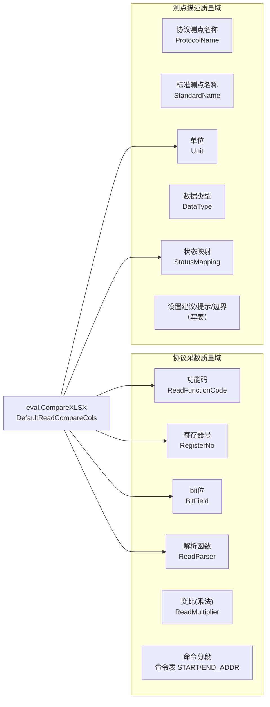
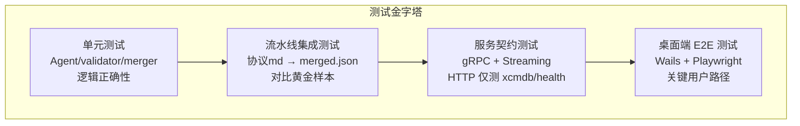
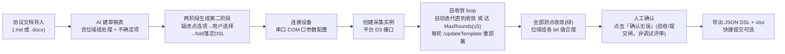

# T7 — 质量保障与测试 Eval 设计

> 本文是「点表智能工作台」项目的**质量保障与测试 Eval** 技术设计文档（T7），只描述**目标形态（To-Be）**的质量体系：准确率指标定义、黄金样本体系、端到端测试分层、现场验收用例与持续质量监控的目标设计，供质量评审与后续实施参考。
> **测试覆盖现状（As-Is）、与目标的差距、黄金样本库建设与测试层级补齐、Eval 接入 CI 的演进路线见 `T7A-测试覆盖现状与演进方案.md`**，本文不重复描述现状与迁移步骤。
> 关联文档：T6 部署分发与运维设计、[AI 生成点表设计](../../ai-point-table/docs/设计文档/AI%20生成点表.md)、[BRD 里程碑验收标准](../../ai-point-web/BRD-设备驱动点表智能工作台.md)。

---

## §1 目标质量体系

### §1.1 准确率指标定义与目标

产品质量分为**两个正交质量域**，对应 BRD §1.3 中的两条质量链：

| 质量域 | 定义 | 典型字段 | 错误后果 |
|---|---|---|---|
| **协议采数准确率** | 决定采集值是否正确的字段的准确率 | 功能码、寄存器号、bit位、解析函数、变比(乘法)、转换函数、命令分段 | 采集值错误，可能偏大/偏小 10ⁿ 倍，甚至全为 0/-1 |
| **测点描述准确率** | 描述业务语义的字段的准确率 | 协议测点名称、标准测点名称、单位、数据类型、状态映射、设置项 | 数据展示/告警含义错误，影响运维判断 |

#### §1.1.1 准确率目标（按里程碑）

| 指标 | M1（生成器 GUI 化） | M2（双介质与提交） | M3（调试闭环） |
|---|---|---|---|
| 协议采数准确率（字段级） | ≥ 90% | ≥ 92% | ≥ 95% |
| 测点描述准确率（字段级） | ≥ 90% | ≥ 92% | ≥ 95% |
| 澄清推荐采纳一致率（AI 推荐与用户选择一致率，两阶段生成）| — | ≥ 80% | ≥ 85% |
| 调试 Triage 判定精准率（正确/可疑/错误分类正确率） | — | — | ≥ 90% |
| **调试收敛率（自收敛 loop 在 MaxRounds 内全表收敛的样本占比）** | — | — | ≥ 90% |
| **平均收敛轮数（收敛样本达 converged 的轮数）** | — | — | ≤ 3 |
| **单调正确性（任一轮新部署后已收敛点被打破=违例，目标违例率）** | — | — | = 0% |
| **调试 Fix 多轮有效率（被采纳假设 / 全部尝试假设，跨全 loop 口径）** | — | — | ≥ 70% |
| **诊断误报率（正确点被误判为可疑/错误的比例）** | — | — | ≤ 5% |
| 端到端点表交付耗时（含两阶段澄清 + 自收敛调试） | ≤ 1h | ≤ 1h | ≤ 1h |

> 收敛率/收敛轮数针对 T2 §5 自收敛 loop（无 report-only、无人工 Decide/Apply）；单调正确性守 §5.5「不降级」硬约束（每轮 `/updateTemplate` 重部署后回采全表，已收敛点不得回退）。
> 准确率定义：以「正确字段数 / 评估字段总数」衡量（字段级，非行级）。
> 目标 Eval 对比以「寄存器号+功能码」为行键匹配、按列对比，字段准确率 = `matchedFields / totalFields`。`eval.CompareXLSX` 对比引擎的实现细节与能力边界见 T7A §1.1。

#### §1.1.2 两类质量域与技术字段的对应关系



Eval 对比列应横跨两个质量域（`协议测点名称`、`功能码`、`寄存器号`、`bit位`、`解析函数`、`单位`、`状态映射`），并通过 `CompareOptions` 支持按质量域分别统计：

```go
// 目标：分域统计
type DomainReport struct {
    Protocol    SheetReport `json:"protocol"`    // 协议采数域
    Description SheetReport `json:"description"` // 测点描述域
    Overall     float64     `json:"overall"`
}
```

---

### §1.2 黄金样本体系

#### §1.2.1 样本来源

| 来源 | 描述 | 优先级 |
|---|---|---|
| 历史人工点表 | 已交付项目中经真机调试验证的标准点表（Excel），与对应协议文档配对 | P0（最高权威） |
| 人工标注新样本 | 规则维护者或资深工程师阅读新协议文档，手工标注期望输出 JSON | P0 |
| 调试闭环结果 | M3 阶段经 harness 调试并人工确认的点表，回流为黄金样本 | P1 |

#### §1.2.2 样本结构

目标黄金样本采用 `eval/golden/{case_name}/case.json` 结构：

```
eval/
└── golden/
    ├── transformer/                     ← 变压器温控器（FC03 + 位域组）
    │   ├── case.json
    │   ├── protocol.md                  ← 协议文档（Markdown 格式）
    │   └── expected.xlsx                ← 标准点表（人工标注或历史交付产物）
    ├── meter_spm33/                     ← 电表 SPM33（FC03 多寄存器）
    │   ├── case.json
    │   └── protocol.md
    ├── dehumidifier/                    ← 除湿机
    │   ├── case.json
    │   └── protocol.md
    ├── modbus_fc01_coil/                ← FC01 线圈读
    │   ├── case.json
    │   ├── protocol.md
    │   └── expected.xlsx
    ├── modbus_fc02_discrete/            ← FC02 离散输入
    ├── modbus_fc03_holding/             ← FC03 保持寄存器
    ├── modbus_fc04_input/               ← FC04 输入寄存器
    ├── bitfield_group/                  ← 位域组
    ├── write_points/                    ← 写点和命令表
    └── multi_sheet_complex/             ← 读/写/命令三表混合
```

**`case.json` 字段规范**：

```json
{
  "name": "transformer",
  "protocol": "../../协议/变压器/变压器温控器通讯规约说明书.md",
  "expected": "../../协议/变压器/TCP-R5-3lu-2_4_11_102_1_1_1.xlsx",
  "tags": ["modbus_tcp", "holding_register", "bitfield"],
  "compare_options": {
    "sheets": ["测点表_读", "测点表_写"],
    "key_columns": ["寄存器号", "功能码"],
    "compare_cols": ["协议测点名称", "功能码", "寄存器号", "bit位", "解析函数", "单位", "状态映射"],
    "protocol_cols": ["功能码", "寄存器号", "bit位", "解析函数"],
    "description_cols": ["协议测点名称", "单位", "状态映射"]
  }
}
```

#### §1.2.3 样本库覆盖度要求（M3 前）

| 覆盖维度 | 要求 |
|---|---|
| Modbus FC01（读线圈） | ≥ 1 个样本，含 expected |
| Modbus FC02（读离散输入） | ≥ 1 个样本，含 expected |
| Modbus FC03（读保持寄存器） | ≥ 2 个样本，含 expected |
| Modbus FC04（读输入寄存器） | ≥ 1 个样本，含 expected |
| 位域组（BitField） | ≥ 1 个样本，含 expected |
| 写点（FC06/FC10） | ≥ 1 个样本，含 expected |
| 命令表 | ≥ 1 个样本，含 expected |
| 多设备协议混合 | ≥ 1 个样本 |
| **样本总数（含 expected）** | **≥ 10 个** |

> 各维度的覆盖现状与差距对照见 T7A §1.4。

#### §1.2.4 黄金样本管理规范

1. **版本控制**：所有样本文件（协议 md + expected xlsx）纳入 git，随代码库版本管理。
2. **不可变性**：`expected.xlsx` 一旦标注确认，只能通过 PR + 复核员审查才能修改；修改需附说明（为何原标注有误）。
3. **协议文档脱敏**：如协议文档含甲方敏感信息，脱敏后再入库（替换公司名/项目名为通用名称）。
4. **标注者记录**：在 `case.json` 中增加 `"annotator": "工程师姓名"` 和 `"annotated_at": "2026-06-01"` 字段，便于溯源。
5. **覆盖度报告**：每次 CI Eval 运行后，输出覆盖度摘要（各 Tag 的样本数量和准确率）。

---

### §1.3 端到端测试分层



#### §1.3.1 单元测试

**覆盖目标**：

| 模块 | 测试内容 | 测试文件位置 |
|---|---|---|
| `internal/debug/triage` | Triage 按 layout seq 绑定、缺失点标记、LLM 判定集成 | `internal/debug/triage_test.go` |
| `internal/debug/loop` | 自收敛 loop：每轮自动锁定正确点入收敛集（棘轮单调收缩目标集）、达 MaxRounds 退 `partial`、全收敛退 `converged`、每轮 `/updateTemplate` 重部署后回采 | `internal/debug/loop_test.go` |
| `internal/debug/apply` | loop 自动应用变更、版本化（v1→v2，每轮 bump）、canonical 切换、回滚（重写旧表 + `/updateTemplate`） | `internal/debug/apply_test.go` |
| `internal/debug/sampler` | 多轮采样、覆盖全表（含收敛点做回归）、per-spot 聚合（Seen/StatusOK/StatusBad/Values） | `internal/debug/sampler_test.go` |
| `internal/debug/patchguard` | 收敛集（用户锁定 + 自动锁定正确点）拦截、无证据丢弃、不降级（已收敛点被打破即拒绝并回滚）| `internal/debug/patchguard_test.go` |
| `internal/validator` | G6 校验规则（必填字段、序号连续、重复键检测、命令表格式） | `internal/validator/*_test.go` |
| `internal/merger` | 多 Agent 输出合并、字段证据收集、冲突处理 | `internal/merger/*_test.go` |
| `internal/layout` | 序号单一来源（ReadSeq/WriteSeq/SpotResourceID 计算）、both 点处理 | `internal/layout/*_test.go` |
| `internal/agents` | 各 Agent prompt 渲染、callWithRetry 重试逻辑、输出 JSON 解析 | `internal/agents/*_test.go` |
| `eval` | `CompareXLSX`（同文件 100%，字段级回归） | `eval/compare_test.go` |
| `internal/api` | 路由注册无冲突 | `internal/api/router_test.go` |

> 上述模块的现有测试覆盖情况与补齐计划见 T7A §1.3、§2.2。

**单元测试规范**：
- 使用 `testify/assert` + `testify/require` 减少样板代码。
- LLM 调用通过接口（`LLMClient interface`）注入 `fakeLLM`，不发真实请求。
- xboard 调用通过 `fakeXboard` 接口注入。
- 测试目标覆盖率：核心业务逻辑（agents/validator/merger/layout）≥ 80%。

#### §1.3.2 流水线集成测试

使用黄金样本驱动端到端管道，验证「协议 md → merged.json → xlsx」全链路：

```go
// 目标：集成测试示例
func TestPipeline_Transformer_GoldenSample(t *testing.T) {
    // 加载真实配置（使用测试 LLM 端点或 mock）
    cfg := loadTestConfig(t)
    // 运行 pipeline
    result, err := pipeline.Run(ctx, protocolText, opts)
    require.NoError(t, err)
    // 与黄金样本 expected.xlsx 对比
    report, err := eval.CompareXLSX(expectedPath, result.XlsxPath, compareOpts)
    require.NoError(t, err)
    // 断言准确率阈值
    assert.GreaterOrEqual(t, report.Overall, 0.90, "总体准确率应≥90%%")
    assert.GreaterOrEqual(t, protocolAccuracy(report), 0.90, "协议采数准确率应≥90%%")
}
```

集成测试分两类运行环境：
- **离线 Mock 模式**（`-tags mock`）：LLM 调用返回预设固定响应，验证 pipeline 框架逻辑，不依赖 LLM 网关，适合 CI 快速门控。
- **真实 LLM 模式**（`-tags live`）：连接真实 LLM 网关，产出真实准确率报告，每次 prompt 变更前必跑，并行量受 `-run` 限制。

```bash
# CI 快速门控（秒级）
go test ./internal/pipeline/... -tags mock -timeout 60s

# Eval 回归（分钟级，需 LLM 网关）
go test ./internal/pipeline/... -tags live -timeout 600s -run TestPipeline_.*_Golden
```

#### §1.3.3 服务契约测试（gRPC + HTTP 兼容面）

主业务契约使用 gRPC 测试，覆盖 A–J 域 Unary 与 Streaming 方法；Gin HTTP 仅验证 xboard 使用的 xcmdb 兼容接口和 `/health`：

| 接口 | 测试场景 |
|---|---|
| `GenerationService.Generate` | 正常上传、文件过大、无文件、格式不支持 |
| `GenerationService.GetRun` | 查询存在/不存在的 run_id；状态值枚举（pending/running/completed/failed） |
| `PointTableService.GetPointTable/GetXlsx` | 已完成 Job 获取点表与 xlsx；未完成 Job 返回 `FailedPrecondition` |
| `RulePackService.GetRulePackVersion` | 返回版本号和 checksum |
| `MetaService.GetClientVersion` | 返回最新客户端版本 |
| `ProjectUsageService.GetUsageSummary` | 返回工程级用量概览，不包含 token/model 明细 |
| `DebugService.StartDebug/GetSession/GetRounds` | 发起自收敛 loop（需 mock xboard，无 `auto_fix` 入参）；`GetSession` 返回 `converged/partial` 终态与 `converged_seqs/unconverged_seqs`；`GetRounds` 逐轮自动应用只读审计（无 `DecideChange/Apply` 人工门）|
| `ClarificationService.ApplyClarifications` | 两阶段生成落定：选中项 fold → `dsl_version` bump；仍有 pending 返回 `Aborted` |
| `GET /health` | 200 + `{"status":"ok"}` |
| `GET /api/v3/link/board/*` | xboard 调用的后端内置 xcmdb 兼容查询；不存在的 board_type 返回 404 |

**gRPC Streaming 测试**（生成进度推送）：

```go
func TestGenerateProgress_Stream(t *testing.T) {
    srv, conn := startGRPCTestServer(t)
    defer srv.Stop()

    client := ptwv1.NewGenerationServiceClient(conn)
    runID := submitGenerateGRPC(t, client, protocolContent)

    stream, err := client.StreamProgress(context.Background(), &ptwv1.StreamProgressRequest{RunId: runID})
    require.NoError(t, err)

    event, err := stream.Recv()
    require.NoError(t, err)
    assert.Equal(t, ptwv1.ProgressEvent_STAGE, event.Type)
}
```

#### §1.3.4 桌面端 E2E 测试

针对 Wails 桌面应用，测试关键用户路径。推荐使用 **Playwright** 通过 `--inspect-brk` 或 Wails 的 DevTools 远程调试协议驱动 WebView。

**关键测试路径（按 BRD F1~F7 功能）**：

| 路径 ID | 操作序列 | 验收标准 |
|---|---|---|
| E2E-01 | 首启引导 → 选择工程目录 → 新建工程 | 工程出现在最近列表；本地目录结构已创建 |
| E2E-02 | 导入协议文档（PDF）→ 触发 AI 生成 → 等待完成 | 进度条推进；最终显示点表草稿 |
| E2E-03 | 澄清队列 → 逐项确认（选择选项）→ 继续生成 | 澄清项减少；点表更新 |
| E2E-04 | 点表编辑器 → 修改一个字段值 → 实时校验触发 | 修改保存；校验问题清单更新 |
| E2E-05 | 导出 xlsx → 导出 JSON DSL | 文件出现在本地工程目录；格式正确 |
| E2E-06 | 工程总览 → 检查工程用量显示 | 显示工程级用量；页面不出现 token 用量、token 成本或模型配置项 |
| E2E-07 | 版本检查 → 服务器返回新版本 → 提示更新弹窗 | 弹窗非阻断；点「稍后」可忽略 |

**工具链**：

```bash
# 安装 Playwright（Node.js 端）
npm install -D @playwright/test

# 启动 Wails 开发模式（暴露 WebSocket 调试端口）
wails dev --devtools

# 运行 E2E 测试
npx playwright test --project=chromium
```

> **限制**：Wails WebView2（Windows）不支持 `target="_blank"`，E2E 测试需注意同窗导航行为（见 `desktop/README.md`）。macOS 下使用 WKWebView，行为略有差异，建议两平台均覆盖冒烟测试。

---

### §1.4 现场验收用例（M3）

M3 里程碑的现场验收需覆盖 2 种真实 Modbus 设备场景，参照 BRD §11 验收标准。

#### §1.4.1 设备 A：标准 Modbus RTU（含位域组）

| 项目 | 规格 |
|---|---|
| 设备类型 | 精密空调 / 温湿度传感器（含位域状态寄存器） |
| 连接方式 | RS-485 串口（COM 口），波特率 9600/N/8/1 |
| 功能码覆盖 | FC03（读保持寄存器）为主，FC01（读线圈）为辅 |
| 特殊场景 | 至少 1 个位域组（单寄存器含 4+ 独立状态 bit） |

**验收流程**：



**验收判定标准**：
- 全程无需驱动开发介入。
- 所有读点显示「通过」（绿色）；位域组各 bit 的值映射与协议文档描述一致。
- 耗时（从导入协议到「全绿确认」）≤ 2h。

#### §1.4.2 设备 B：Modbus TCP（含写点和命令表）

| 项目 | 规格 |
|---|---|
| 设备类型 | UPS / 列头柜（含写点控制和多段命令表） |
| 连接方式 | TCP IP:Port（同局域网直连）|
| 功能码覆盖 | FC03/FC04 读，FC06/FC16 写 |
| 特殊场景 | 至少 1 个写点（带数值边界）、命令表（≥ 2 个命令段） |

**验收流程**（在设备 A 基础上增加写点验收）：

- 写点调试默认禁用（F17 安全机制），需现场负责人模式授权后逐点确认。
- 写点操作需二次确认弹窗，记录操作留痕（操作者/时间/写入值）。
- 命令表字段（`CMD`/`START_ADDR`/`END_ADDR`）生成正确，与采集实例实际轮询包一致。

#### §1.4.3 验收失败处理

| 失败情形 | 处理流程 |
|---|---|
| 准确率 < 90%（验收前 Eval 回归） | 不进入现场验收；分析 Mismatch 报告，修复 prompt 后重跑 |
| 自收敛 loop 达 MaxRounds 仍有残留（`status=partial`，`unconverged_seqs` 非空）| 记录设备型号 + `unconverged_seqs` 字段，提交至「规则库回流」待排查；当次验收标记「部分通过」 |
| 单调正确性违例（某轮 `/updateTemplate` 重部署后已收敛点回退）| 视为缺陷阻断：PatchGuard「不降级」未生效；定位假设并回滚，记安全事件 |
| 写点调试导致告警 | 立即回滚点表（`canonical` 指针回退至上一版本）；记录安全事件 |
| 耗时 > 2h | 复盘耗时分布（哪阶段超时），调整澄清队列 UI 或 harness 参数 |

---

### §1.5 持续质量监控

#### §1.5.1 生产环境准确率监控


抽检记录格式（保存在内部 QA 系统）：

| 字段 | 说明 |
|---|---|
| `run_id` | 被抽检的生成任务 ID |
| `device_model` | 设备型号（用于分析哪类设备准确率低） |
| `protocol_accuracy` | 本次抽检的协议采数准确率（人工评分） |
| `description_accuracy` | 测点描述准确率 |
| `mismatch_fields` | 错误字段清单（字段名 + 期望值 + 实际值） |
| `reviewer` | 复核人 |
| `reviewed_at` | 复核时间 |

#### §1.5.2 Eval 基准回归触发规则

| 触发事件 | 必跑 Eval 范围 | 通过标准 |
|---|---|---|
| **Prompt 变更（任意 Agent）** | 全量黄金样本（含 expected）| 整体准确率不低于变更前 -2%（允许小幅波动） |
| **规则文件变更**（`point_table_rules.json`/`groups_brd.json`） | 全量黄金样本 | 校验逻辑覆盖的字段准确率不下降 |
| **Merger/Layout/Excel Writer 变更** | 全量黄金样本 | 整体准确率不低于变更前 |
| **新增功能码支持（FC01/FC02 等）** | 对应功能码的全部样本 | 新覆盖功能码样本准确率 ≥ 90% |
| **PR 合并到 main** | 离线 Mock 模式集成测试 | 100% 通过（无需真实 LLM） |

### §1.6 录制-回放评测台（M3 前置门禁）

调试自收敛 loop 依赖真机 OBSERVE 反馈，无法在 CI 里直接驱动真实设备。因此把"录制真机 → 确定性回放"评测台设为 **M3 就绪硬门禁**：没有回放台，不得把推理内核（T2 §5.8 `Repairer`）从 v1 单次升级到 v2 agentic。真正的前置门是"评测反馈信号"，不是历史包袱。

#### §1.6.1 录制

- 录制对象：每轮 `OBSERVE` 的 **`observe/frames`**——逐点工程值 + 收发帧（RequestHex/ResponseHex/异常码），按 `seq`/轮号对齐（对齐 T9 数据链路、T3 留痕）。
- 录制时机：现场验收（§1.4）与生产调试会话顺带落盘，沉淀为带真值标注的回放用例（设备型号 + 协议版本 + 每轮全表观测序列 + 人工确认的正确判定）。
- 关键性质：回放用例**确定性可重放**——同一 patch 序列喂入回放台，OBSERVE 结果逐字节一致，从而把"设备/网络抖动"从评测中剔除。

#### §1.6.2 回放与用途

回放台用 `fakeXboard` 注入录制好的 OBSERVE 序列，让确定性外壳（loop/PatchGuard/Deployer/Verifier）与 `Repairer` 内核在离线、秒级、可复现的环境下端到端跑：

| 用途 | 说明 |
|---|---|
| ① M3 离线验证自收敛外壳 | 度量收敛率 / 平均收敛轮数 / 单调正确性 / 不降级（对齐 §1.1.1 三项收敛指标），作为 M3 上线门禁 |
| ② M4 切 agentic 的离线迭代 | agentic `Repairer` 在回放台上秒级试错调优，不碰真机、不耗部署预算 |
| ③ v1↔v2 对比基准 | 同一批回放用例上比较 v1 单次与 v2 agentic 的收敛率/轮数/成本；**v2 不优于 v1 基线则不上真机** |

#### §1.6.3 门禁规则

| 触发事件 | 必跑范围 | 通过标准 |
|---|---|---|
| **`Repairer` 内核变更（v1 调参 / v2 升级）** | 全量回放用例 | 收敛率不低于基线、单调正确性违例 = 0%、平均收敛轮数不劣化 |
| **确定性外壳变更（loop/PatchGuard/Deployer/Verifier）** | 全量回放用例 | 三项收敛指标全部不回归 |
| **M3 就绪评审** | 回放台建成 + 最小回放用例集 | 作为 M3 Definition of Done 之一 |

---

> **测试覆盖现状、与目标的差距、黄金样本库建设与测试层级补齐计划、Eval 接入 CI 的演进路线，以及测试覆盖度追踪表（当前快照），见 `T7A-测试覆盖现状与演进方案.md`。**
