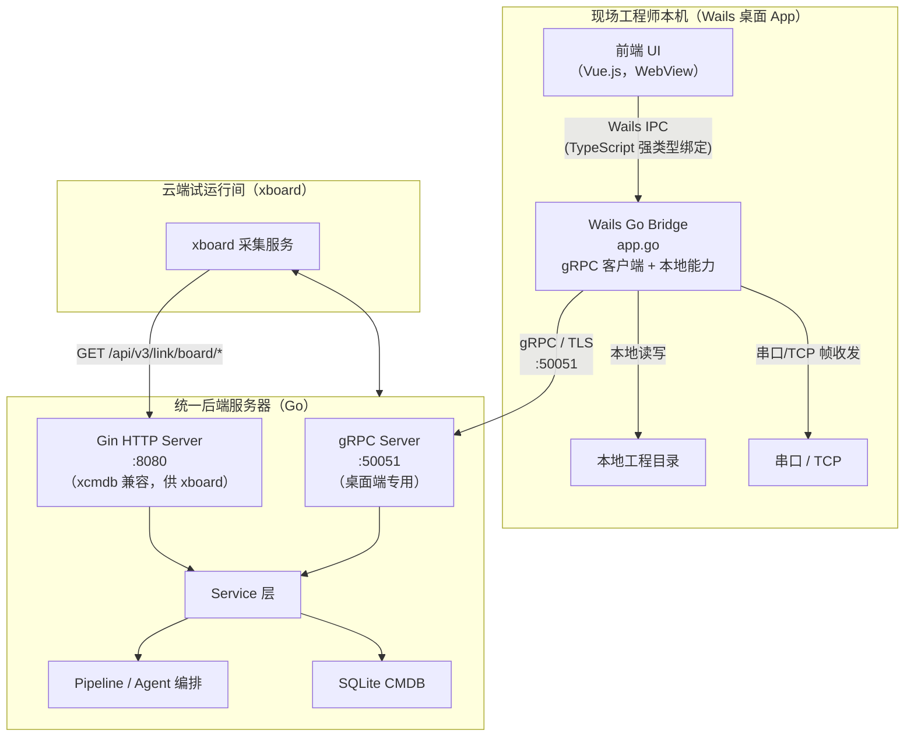

# T8 — 点表智能工作台：桌面端 gRPC Bridge 架构设计

> **文档定位**：本文是桌面 App（Wails）与服务器之间 gRPC 通信的**传输层实施规范**——proto 文件设计、服务器侧 gRPC 框架、Wails Bridge gRPC 客户端、流式接口处理与 Gin 共存方案。
> **与 T4 的分工**：**T4 是接口契约权威**（每个接口做什么、字段、错误语义、本地写回契约）；**T8 是 gRPC 实现权威**（proto 定义、server/client 脚手架、目录结构、流处理代码）。两者交叉引用、互不重复定义同一内容。详见 §1.2。
> **核心形态**：桌面端↔服务端统一 gRPC（前端只调 Wails Bridge）；xcmdb 兼容接口与 `/health` 保留 Gin HTTP（供 xboard / 运维）。
> 关联文档：T1（系统架构）/ T4（API 与 Bridge 契约）/ T5（鉴权安全）。

---

## 目录

- [§1 架构约定与文档分工](#1-架构约定与文档分工)
- [§2 通信架构全景](#2-通信架构全景)
- [§3 Proto 文件设计](#3-proto-文件设计)
- [§4 服务器侧 gRPC 服务设计](#4-服务器侧-grpc-服务设计)
- [§5 Wails Bridge gRPC 客户端设计](#5-wails-bridge-grpc-客户端设计)
- [§6 流式接口处理（EventsEmit）](#6-流式接口处理eventssemit)
- [§7 前端调用方式变更规范](#7-前端调用方式变更规范)
- [§8 Gin HTTP 与 gRPC 共存方案](#8-gin-http-与-grpc-共存方案)
- [§9 实施路线图](#9-实施路线图)

---

## §1 架构约定与文档分工

### 1.1 核心约定

1. **前端不直接调用服务器**：Vue.js 中不出现直接调用服务器地址的 `fetch`/`axios`。
2. **Bridge 是唯一出口**：所有需要服务器数据的操作，均通过 `wailsjs/go/main/App.xxx()` 调用，由 Bridge 经 gRPC 转发。
3. **gRPC 是 Bridge → 服务器的唯一协议**：Bridge 侧使用 `google.golang.org/grpc` 客户端，Wails 自动生成强类型 TypeScript 绑定，契约编译期可校验。
4. **xcmdb 兼容接口走 Gin HTTP**：`/api/v3/link/board/*` 供 xboard 调用、`/health` 供运维探活，与桌面端 gRPC 解耦。
5. **流式推送通过 EventsEmit**：gRPC Streaming 在 Bridge 内接收后，通过 `runtime.EventsEmit` 推给前端。

### 1.2 与 T4 的分工边界

T4 与 T8 各自是不同维度的权威，**同一内容只在一处定义，另一处引用**：

| 主题 | 权威文档 | 另一文档的处理 |
|---|---|---|
| 接口清单 / 字段 / 请求响应语义 | **T4 §1.2** | T8 §3 的 proto 按 T4 字段定义 |
| 错误码语义（gRPC code → 业务码） | **T4 §1.4** | T8 §5.4 client 错误转换引用该表 |
| Streaming 事件 JSON 格式 / 阶段定义 | **T4 §1.3** | T8 §6 的实现代码引用该格式 |
| Bridge 方法签名 / Go struct | **T4 §1.7** | T8 §5 给出 gRPC client 实现 |
| 本地工程目录写回契约 | **T4 §1.8** | — |
| 接口域里程碑（M1/M2/M3 就绪门禁） | **T4 §2** | T8 §9 给实现任务分解，引用 T4 §2 |
| **proto 文件设计 / 组织** | **T8 §3** | T4 引用服务/方法名 |
| **服务器侧 gRPC 框架 / 拦截器 / 目录** | **T8 §4** | — |
| **Wails Bridge gRPC 客户端实现** | **T8 §5** | — |
| **Streaming → EventsEmit 实现代码** | **T8 §6** | — |
| **Gin/gRPC 端口共存** | **T8 §8** | T4 §1.9 给 xcmdb/health 接口契约 |

---

## §2 通信架构全景

### 2.1 通信拓扑图



### 2.2 数据流说明

| # | 流向 | 协议 | 说明 |
|---|---|---|---|
| ① | 前端 → Bridge | Wails IPC（进程内） | 强类型 TypeScript 方法调用 |
| ② | Bridge → 服务器 | **gRPC / TLS** | 业务 API（A–J 域全部） |
| ③ | 服务器 → Bridge（流式） | gRPC Server Streaming | 生成进度、调试实时值、收发报文 |
| ④ | Bridge → 前端（推送） | `runtime.EventsEmit` | 将 gRPC 流事件推给 Vue.js |
| ⑤ | xboard → 服务器 | HTTP（Gin 保留） | `/api/v3/link/board/*` xcmdb 兼容接口 |
| ⑥ | Bridge → 本地文件系统 | 进程内文件 I/O | SaveDSL / LoadDSL / ExportXlsx |
| ⑦ | Bridge → 串口/TCP | 系统 API | SendFrame（M3） |

---

## §3 Proto 文件设计

### 3.1 文件组织

```
ai-point-table/
└── proto/
    ├── common.proto          # 公共消息类型（分页、错误码等）
    ├── project.proto         # A 域：工程/任务管理
    ├── document.proto        # B 域：文档上传与解析
    ├── generation.proto      # C 域：点表生成（含进度流）
    ├── clarification.proto   # D 域：澄清队列
    ├── incremental.proto     # E 域：增量文档分析
    ├── point_table.proto     # F 域：点表数据
    ├── evidence.proto        # G 域：证据链
    ├── debug.proto           # H 域：调试与 Harness（含实时流）
    ├── workflow.proto        # I 域：确认与提交
    └── rule_pack.proto       # J 域：规则包与工程用量
```

生成目标：
- Go 服务端 stub：`internal/grpc/gen/`
- Go 客户端（Bridge）：`ai-point-web/desktop/grpc/gen/`（git submodule 或 buf 管理）

### 3.2 common.proto

```protobuf
syntax = "proto3";
package ptw.v1;
option go_package = "go.xbrother.com/ai-point-table/internal/grpc/gen/ptwv1";

// 统一分页请求
message PageRequest {
  int32 page = 1;
  int32 page_size = 2;
}

// 统一错误详情（映射 T4 §1.4 错误码体系）
message ErrorDetail {
  string code    = 1;  // INVALID_INPUT / NOT_FOUND / CONFLICT 等
  string message = 2;
  repeated ErrorItem details = 3;
}

message ErrorItem {
  string type    = 1;
  int32  count   = 2;
  string message = 3;
}
```

### 3.3 project.proto（A 域）

```protobuf
syntax = "proto3";
package ptw.v1;
option go_package = "go.xbrother.com/ai-point-table/internal/grpc/gen/ptwv1";

import "common.proto";

service ProjectService {
  // A-1 创建工程
  rpc CreateProject(CreateProjectRequest) returns (ProjectMeta);
  // A-2 工程列表
  rpc ListProjects(ListProjectsRequest) returns (ListProjectsResponse);
  // A-3 工程详情
  rpc GetProject(GetProjectRequest) returns (ProjectMeta);
  // A-4 创建协议点表任务
  rpc CreateTask(CreateTaskRequest) returns (TaskMeta);
  // A-5 任务列表
  rpc ListTasks(ListTasksRequest) returns (ListTasksResponse);
  // A-6 任务详情
  rpc GetTask(GetTaskRequest) returns (TaskMeta);
  // A-7 任务状态查询
  rpc GetTaskStatus(GetTaskStatusRequest) returns (TaskStatusResponse);
}

message ProjectMeta {
  string project_id  = 1;
  string name        = 2;
  string client      = 3;
  string description = 4;
  string created_at  = 5;
  int32  task_count  = 6;
}

message CreateProjectRequest {
  string name        = 1;
  string client      = 2;
  string description = 3;
}

message TaskMeta {
  string task_id    = 1;
  string project_id = 2;
  string name       = 3;
  string vendor     = 4;
  string model      = 5;
  string protocol   = 6;
  string board_type = 7;
  string status     = 8;  // draft/clarifying/reviewing/debugging/confirmed/submitted
  string run_id     = 9;  // 最新关联 run_id
  string created_at = 10;
}

message CreateTaskRequest {
  string project_id = 1;
  string name       = 2;
  string vendor     = 3;
  string model      = 4;
  string protocol   = 5;
  string board_type = 6;
}

// 其余 Request/Response 消息从略，按 T4 §1.2 A 域字段定义
```

### 3.4 document.proto（B 域）

文件上传使用 **gRPC 客户端流**（client streaming），分块传输：

```protobuf
service DocumentService {
  // B-1 上传协议文档（客户端流，分块上传）
  rpc UploadDocument(stream UploadDocumentChunk) returns (DocumentMeta);
  // B-2 文档列表
  rpc ListDocuments(ListDocumentsRequest) returns (ListDocumentsResponse);
  // B-3 OCR 状态轮询
  rpc GetDocument(GetDocumentRequest) returns (DocumentMeta);
  // B-4 获取文档解析结果（分页）
  rpc GetDocumentPages(GetDocumentPagesRequest) returns (DocumentPagesResponse);
  // B-5 重试失败页
  rpc RetryPage(RetryPageRequest) returns (RetryPageResponse);
}

message UploadDocumentChunk {
  oneof data {
    UploadDocumentMeta meta  = 1;  // 第一个 chunk：元数据
    bytes              chunk = 2;  // 后续 chunk：文件内容
  }
}

message UploadDocumentMeta {
  string task_id       = 1;
  string filename      = 2;
  string role          = 3;  // primary/supplement/changelog/capture
  bool   auto_generate = 4;
}

message DocumentMeta {
  string doc_id    = 1;
  string filename  = 2;
  string role      = 3;
  string state     = 4;  // parsing/parsed/failed
  int32  pages     = 5;
  int64  size_bytes = 6;
}
```

### 3.5 generation.proto（C 域）

生成进度使用 **Server Streaming**：

```protobuf
service GenerationService {
  // C-1 提交生成任务
  rpc StartGeneration(StartGenerationRequest) returns (GenerationRun);
  // C-2 订阅生成进度（服务端流）
  rpc StreamProgress(StreamProgressRequest) returns (stream ProgressEvent);
  // C-3 获取 Run 状态
  rpc GetRun(GetRunRequest) returns (GenerationRun);
}

message StartGenerationRequest {
  string task_id     = 1;
  bool   async       = 2;  // 默认 true
  int32  batch_size  = 3;
}

message GenerationRun {
  string run_id       = 1;
  string task_id      = 2;
  string status       = 3;  // pending/running/completed/failed
  string submitted_at = 4;
  string completed_at = 5;
  string board_type   = 6;
  string error        = 7;
}

message StreamProgressRequest {
  string run_id = 1;
}

// Bridge 接收后通过 EventsEmit 推前端（事件 JSON 格式见 T4 §1.3）
// 事件类型：stage / complete / error
message ProgressEvent {
  string event_type   = 1;  // "stage" | "complete" | "error"
  int32  stage_index  = 2;
  string stage_name   = 3;
  string stage_status = 4;  // running/done/failed
  int32  progress_pct = 5;
  string message      = 6;
  int64  elapsed_ms   = 7;
  // complete 时填充
  int32  read_count         = 8;
  int32  write_count        = 9;
  int32  suspect_count      = 10;
  int32  clarification_count = 11;
  // error 时填充
  string error = 12;
}
```

### 3.5a clarification.proto（D 域，两阶段生成第二阶段：选项→落定 DSL）

> 生成核心交互主路径：第一阶段产草稿 + 不确定项（候选选项 + 推荐）；第二阶段用户逐项选择，`ApplyClarifications` 把选中项**确定性 fold 落定为最终点表 DSL** 并 bump `dsl_version`（对齐 T4 D 域 / T3 §1.1.5、§2.6）。

```protobuf
service ClarificationService {
  // D-1 获取澄清列表（疑虑点 + 候选选项 + 推荐）
  rpc ListClarifications(ListClarificationsRequest) returns (ListClarificationsResponse);
  // D-2 提交单条选择
  rpc AnswerClarification(AnswerClarificationRequest) returns (Clarification);
  // D-3 全部采纳推荐
  rpc AcceptAllRecommended(AcceptAllRecommendedRequest) returns (AcceptAllRecommendedResponse);
  // D-4 选择完毕→fold 落定最终 DSL（dsl_version bump）
  rpc ApplyClarifications(ApplyClarificationsRequest) returns (ApplyClarificationsResponse);
}

message Clarification {
  string id            = 1;
  string q             = 2;
  string evidence      = 3;
  int32  impact        = 4;
  repeated string opts = 5;  // 候选选项
  string recommend     = 6;  // AI 推荐项
  string reason        = 7;
  repeated int32 points = 8;
  bool   resolved      = 9;
  string answer        = 10; // 用户选中项（落定时 fold 进 DSL）
}

message AnswerClarificationRequest {
  string run_id           = 1;
  string clarification_id = 2;
  string choice           = 3;  // 必须 ∈ opts
  string answered_by      = 4;
}

message ApplyClarificationsRequest { string run_id = 1; }

message ApplyClarificationsResponse {
  string run_id      = 1;
  string status      = 2;  // merging
  string dsl_version = 3;  // 落定后新版本
  string task_status = 4;  // reviewing
}
```

### 3.6 debug.proto（H 域，含双向流）

调试实时值使用 **双向 Streaming**（客户端可发 pause/resume/stop 指令）：

> **唯一形态=自收敛 loop**：调试发起即自动收敛，**无人工 Decide/Apply 审批门**。原 H-4~H-7 的 `GetChanges/DecideChange/DecideBatch/ApplyChanges` RPC **整体删除**；`GetRounds` 仅作只读审计。命名与 C 域一致：生成用 `StartGeneration`，调试用 `StartDebug`。

```protobuf
service DebugService {
  // H-1 发起调试（无 auto_fix；自收敛 loop）
  rpc StartDebug(StartDebugRequest) returns (DebugSession);
  // H-2 通过 resource_id 发起
  rpc StartDebugByResource(StartDebugByResourceRequest) returns (DebugSession);
  // H-3 获取调试会话（含 converged/unconverged_seqs、终态 converged/partial/failed）
  rpc GetDebugSession(GetDebugSessionRequest) returns (DebugSession);
  // H-4 逐轮自动应用只读审计（无人工 accept/reject）
  rpc GetRounds(GetRoundsRequest) returns (RoundsResponse);
  // H-9 调试实时值（双向流，支持 pause/resume/step/stop 控制）
  rpc StreamRealtime(stream RealtimeClientMsg) returns (stream RealtimeServerMsg);
  // H-10 收发报文（服务端流）
  rpc StreamFrames(StreamFramesRequest) returns (stream FrameEvent);
  // H-11 命令画像
  rpc GetCommandProfiles(GetCommandProfilesRequest) returns (CommandProfilesResponse);
  // H-12 Harness 假设时间线
  rpc GetHypotheses(GetHypothesesRequest) returns (HypothesesResponse);
}

message StartDebugRequest {
  string run_id              = 1;
  int32  max_rounds          = 2;  // 自收敛 loop 安全上限（无 auto_fix 开关）
  int32  sample_count        = 3;
  int32  sample_interval_ms  = 4;
  repeated int32 locked_seqs = 5;  // 用户预锁定点（PatchGuard 保护，不入调试目标）
}

message DebugSession {
  string debug_id              = 1;
  string status                = 2;  // running/converged/partial/failed（无 awaiting_review）
  string run_id                = 3;
  int32  rounds_completed      = 4;
  int32  rounds_max            = 5;
  repeated int32 converged_seqs   = 6;  // 收敛集（用户锁定 + 逐轮自动锁定的正确点）
  repeated int32 unconverged_seqs = 7;  // 残留点（partial 时非空）
  string final_dsl_version     = 8;
  string started_at            = 9;
}

// 客户端发往服务器的控制指令（双向流）
message RealtimeClientMsg {
  oneof payload {
    StartRealtimeRequest start = 1;
    ControlCommand       cmd   = 2;
  }
}

message ControlCommand {
  string type = 1;  // pause / resume / step / stop
}

// 服务器推送的实时值/Harness 轮次/自动锁定/收敛（双向流）
message RealtimeServerMsg {
  oneof payload {
    PointUpdateEvent   point_update  = 1;
    HarnessRoundEvent  harness_round = 2;  // 含本轮目标集 target_seqs
    PointsLockedEvent  points_locked = 3;  // 本轮自动锁定的正确点并入收敛集（棘轮）
    ConvergedEvent     converged     = 4;  // 终态：converged/partial
  }
}

message PointsLockedEvent {
  int32 round_no                   = 1;
  repeated int32 newly_locked_seqs = 2;
  repeated int32 converged_seqs    = 3;
  string source                    = 4;  // auto_converged
}

message ConvergedEvent {
  string status                    = 1;  // converged / partial
  int32  rounds                    = 2;
  repeated int32 converged_seqs    = 3;
  repeated int32 unconverged_seqs  = 4;
  string final_dsl_version         = 5;
}

message PointUpdateEvent {
  string cmd_id    = 1;
  string timestamp = 2;
  repeated RealtimePoint points = 3;
}

message RealtimePoint {
  int32  seq      = 1;
  string point_id = 2;
  string name     = 3;
  string raw      = 4;
  int64  raw_val  = 5;
  string val      = 6;
  string unit     = 7;
  string state    = 8;  // pass/suspect/fail
  string ai_note  = 9;
}

// 收发报文帧事件（服务端流）
message FrameEvent {
  string dir       = 1;  // TX / RX
  string timestamp = 2;
  string hex       = 3;
  string note      = 4;
  string cmd_id    = 5;
  bool   err       = 6;
  int32  modbus_exception_code = 7;
}

// 自收敛 loop 单轮事件（双向流）：本轮调试目标集 + 进度
message HarnessRoundEvent {
  int32  round_no             = 1;
  string status               = 2;  // diagnosing/applying/verifying
  repeated int32 target_seqs  = 3;  // 本轮非收敛目标集（逐轮单调收缩）
  int32  changes_count        = 4;
  int64  elapsed_ms           = 5;
}

// H-4 逐轮自动应用只读审计
message GetRoundsRequest { string run_id = 1; string debug_id = 2; }
message RoundsResponse   { repeated RoundItem rounds = 1; }

message RoundItem {
  int32 round_no                  = 1;
  repeated int32 target_seqs      = 2;
  repeated AppliedChange applied_changes = 3;  // loop 自动应用（无人工 decision 字段）
  repeated int32 converged_seqs   = 4;
}

message AppliedChange {
  int32  point_id     = 1;
  int32  seq          = 2;
  string field        = 3;
  string old_value    = 4;
  string new_value    = 5;
  string hypothesis   = 6;
  string verify       = 7;  // passed
  string source       = 8;  // auto_fix
}
```

---

## §4 服务器侧 gRPC 服务设计

### 4.1 gRPC Server 与 Gin 并行启动

```go
// cmd/server/main.go
func main() {
    cfg := config.Load(configPath)

    // Gin HTTP server（仅供 xcmdb /api/v3 接口和 /health）
    ginApp := app.NewApp(cfg, ginRouter)
    go func() {
        log.Printf("Gin HTTP listening on %s", cfg.ServerAddr)
        ginApp.Run()
    }()

    // 新增 gRPC server（桌面端专用）
    lis, _ := net.Listen("tcp", cfg.GRPCAddr) // 默认 :50051
    grpcSrv := grpc.NewServer(
        grpc.UnaryInterceptor(grpcmiddleware.ChainUnaryServer(
            interceptor.Recovery(),
            interceptor.RequestID(),
            interceptor.Auth(cfg.Auth),
            interceptor.AccessLog(),
        )),
        grpc.StreamInterceptor(grpcmiddleware.ChainStreamServer(
            interceptor.StreamAuth(cfg.Auth),
        )),
    )
    ptwv1.RegisterProjectServiceServer(grpcSrv, handler.NewProjectHandler(svc))
    ptwv1.RegisterDocumentServiceServer(grpcSrv, handler.NewDocumentHandler(svc))
    ptwv1.RegisterGenerationServiceServer(grpcSrv, handler.NewGenerationHandler(svc))
    // ... 注册其余 Service
    log.Printf("gRPC listening on %s", cfg.GRPCAddr)
    grpcSrv.Serve(lis)
}
```

### 4.2 目录结构

```
ai-point-table/
├── proto/                          # .proto 文件（§3）
├── internal/
│   ├── grpc/
│   │   ├── gen/                    # protoc 生成代码（不手写）
│   │   ├── handler/
│   │   │   ├── project.go          # ProjectServiceServer 实现
│   │   │   ├── document.go         # DocumentServiceServer 实现
│   │   │   ├── generation.go       # GenerationServiceServer 实现
│   │   │   ├── clarification.go
│   │   │   ├── point_table.go
│   │   │   ├── debug.go
│   │   │   └── workflow.go
│   │   └── interceptor/
│   │       ├── auth.go             # Bearer Token → workspace_id 注入
│   │       ├── recovery.go
│   │       ├── request_id.go
│   │       └── access_log.go
│   └── api/                        # 保留，仅 Gin xcmdb + /health
```

### 4.3 鉴权拦截器

gRPC 鉴权语义以 T5 为权威、错误码映射见 T4 §1.4；此处给出拦截器实现。Token 通过 gRPC Metadata 传递：

```go
// interceptor/auth.go
func Auth(cfg AuthConfig) grpc.UnaryServerInterceptor {
    return func(ctx context.Context, req any, info *grpc.UnaryServerInfo, handler grpc.UnaryHandler) (any, error) {
        md, _ := metadata.FromIncomingContext(ctx)
        tokens := md.Get("authorization")
        if len(tokens) == 0 {
            return nil, status.Error(codes.Unauthenticated, "缺少 Bearer Token")
        }
        raw := strings.TrimPrefix(tokens[0], "Bearer ")
        claims, err := validateToken(raw, cfg.JWTSecret)
        if err != nil {
            return nil, status.Error(codes.Unauthenticated, "Token 无效或已过期")
        }
        ctx = context.WithValue(ctx, ctxKeyUserID, claims.UserID)
        ctx = context.WithValue(ctx, ctxKeyWorkspaceID, claims.WorkspaceID)
        return handler(ctx, req)
    }
}
```

### 4.4 流式生成进度 Handler 示例

```go
// handler/generation.go
func (h *GenerationHandler) StreamProgress(
    req *ptwv1.StreamProgressRequest,
    stream ptwv1.GenerationService_StreamProgressServer,
) error {
    ch := h.svc.SubscribeProgress(req.RunId)
    defer h.svc.UnsubscribeProgress(req.RunId, ch)

    for {
        select {
        case event, ok := <-ch:
            if !ok {
                return nil // 流结束
            }
            if err := stream.Send(toProtoProgressEvent(event)); err != nil {
                return err
            }
        case <-stream.Context().Done():
            return nil
        }
    }
}
```

---

## §5 Wails Bridge gRPC 客户端设计

### 5.1 Bridge 结构扩展

```go
// desktop/app.go
type App struct {
    ctx      context.Context

    // gRPC 连接（共享，带重连）
    grpcConn *grpc.ClientConn

    // 各域 gRPC 客户端（按需懒初始化）
    projectClient      ptwv1.ProjectServiceClient
    documentClient     ptwv1.DocumentServiceClient
    generationClient   ptwv1.GenerationServiceClient
    clarificationClient ptwv1.ClarificationServiceClient
    pointTableClient   ptwv1.PointTableServiceClient
    debugClient        ptwv1.DebugServiceClient
    workflowClient     ptwv1.WorkflowServiceClient
    rulePackClient     ptwv1.RulePackServiceClient
}

// startup 时初始化 gRPC 连接
func (a *App) startup(ctx context.Context) {
    a.ctx = ctx
    cfg, _ := a.loadConfig()
    a.initGRPCClients(cfg.ServerGRPCAddr, cfg.Token)
}

func (a *App) initGRPCClients(addr, token string) {
    creds := credentials.NewClientTLSFromCert(nil, "")
    perRPC := oauth.TokenSource{TokenSource: oauth2.StaticTokenSource(
        &oauth2.Token{AccessToken: token},
    )}
    conn, err := grpc.NewClient(addr,
        grpc.WithTransportCredentials(creds),
        grpc.WithPerRPCCredentials(perRPC),
        grpc.WithKeepaliveParams(keepalive.ClientParameters{
            Time:                10 * time.Second,
            Timeout:             3 * time.Second,
            PermitWithoutStream: true,
        }),
    )
    if err != nil {
        log.Printf("gRPC 连接失败: %v", err)
        return
    }
    a.grpcConn = conn
    a.projectClient      = ptwv1.NewProjectServiceClient(conn)
    a.documentClient     = ptwv1.NewDocumentServiceClient(conn)
    a.generationClient   = ptwv1.NewGenerationServiceClient(conn)
    a.clarificationClient = ptwv1.NewClarificationServiceClient(conn)
    a.pointTableClient   = ptwv1.NewPointTableServiceClient(conn)
    a.debugClient        = ptwv1.NewDebugServiceClient(conn)
    a.workflowClient     = ptwv1.NewWorkflowServiceClient(conn)
    a.rulePackClient     = ptwv1.NewRulePackServiceClient(conn)
}
```

### 5.2 Bridge 方法分层

Bridge 方法按域组织，建议分文件管理（避免 `app.go` 膨胀）：

```
desktop/
├── app.go               # App struct 定义 + startup + gRPC 初始化
├── bridge_local.go      # 本地能力（文件/串口/导出），不走 gRPC
├── bridge_project.go    # A 域：工程/任务管理
├── bridge_document.go   # B 域：文档上传与解析
├── bridge_generation.go # C 域：生成 + 进度流订阅
├── bridge_clarification.go # D 域
├── bridge_incremental.go   # E 域
├── bridge_point_table.go   # F/G 域：点表数据 + 证据链
├── bridge_debug.go      # H 域：调试 + 实时流
├── bridge_workflow.go   # I 域：确认 + 提交
└── bridge_rule_pack.go  # J 域：规则包
```

### 5.3 Bridge 方法示例

```go
// bridge_project.go
func (a *App) CreateProject(name, client, description string) (ProjectMeta, error) {
    ctx, cancel := context.WithTimeout(a.ctx, 10*time.Second)
    defer cancel()

    resp, err := a.projectClient.CreateProject(ctx, &ptwv1.CreateProjectRequest{
        Name:        name,
        Client:      client,
        Description: description,
    })
    if err != nil {
        return ProjectMeta{}, grpcErrToAppErr(err)
    }
    return protoToProjectMeta(resp), nil
}

// bridge_document.go（文件分块上传）
func (a *App) UploadDocument(taskID, filePath, role string, autoGenerate bool) (DocumentMeta, error) {
    f, err := os.Open(filePath)
    if err != nil {
        return DocumentMeta{}, err
    }
    defer f.Close()

    ctx, cancel := context.WithTimeout(a.ctx, 30*time.Minute) // 大文件解析超时 30 min
    defer cancel()

    stream, err := a.documentClient.UploadDocument(ctx)
    if err != nil {
        return DocumentMeta{}, grpcErrToAppErr(err)
    }

    // 先发元数据
    stream.Send(&ptwv1.UploadDocumentChunk{
        Data: &ptwv1.UploadDocumentChunk_Meta{
            Meta: &ptwv1.UploadDocumentMeta{
                TaskId:       taskID,
                Filename:     filepath.Base(filePath),
                Role:         role,
                AutoGenerate: autoGenerate,
            },
        },
    })

    // 分块发文件内容（4 MB/chunk）
    buf := make([]byte, 4*1024*1024)
    for {
        n, err := f.Read(buf)
        if n > 0 {
            stream.Send(&ptwv1.UploadDocumentChunk{
                Data: &ptwv1.UploadDocumentChunk_Chunk{Chunk: buf[:n]},
            })
        }
        if err == io.EOF {
            break
        }
        if err != nil {
            return DocumentMeta{}, err
        }
    }

    resp, err := stream.CloseAndRecv()
    if err != nil {
        return DocumentMeta{}, grpcErrToAppErr(err)
    }
    return protoToDocumentMeta(resp), nil
}
```

### 5.4 错误转换

gRPC status code → 应用层错误，供前端感知；code → 业务错误码的完整映射以 **T4 §1.4** 为权威：

```go
// bridge_error.go
func grpcErrToAppErr(err error) error {
    if err == nil {
        return nil
    }
    s, ok := status.FromError(err)
    if !ok {
        return err
    }
    switch s.Code() {
    case codes.NotFound:
        return fmt.Errorf("NOT_FOUND: %s", s.Message())
    case codes.Unauthenticated:
        return fmt.Errorf("UNAUTHORIZED: %s", s.Message())
    case codes.PermissionDenied:
        return fmt.Errorf("FORBIDDEN: %s", s.Message())
    case codes.AlreadyExists, codes.FailedPrecondition:
        return fmt.Errorf("CONFLICT: %s", s.Message())
    case codes.InvalidArgument:
        return fmt.Errorf("INVALID_INPUT: %s", s.Message())
    default:
        return fmt.Errorf("INTERNAL_ERROR: %s", s.Message())
    }
}
```

---

## §6 流式接口处理（EventsEmit）

### 6.1 流式接口清单

| 接口 | gRPC 类型 | Wails 事件名 | 事件格式 |
|---|---|---|---|
| C-2 生成进度 | Server Streaming | `ptw:progress:{run_id}` | T4 §1.3 |
| H-9 调试实时值 | 双向 Streaming | `ptw:realtime:{debug_id}` | T4 §1.3 |
| H-10 收发报文 | Server Streaming | `ptw:frames:{debug_id}` | T4 §1.3 |

### 6.2 生成进度订阅示例

```go
// bridge_generation.go

// SubscribeProgress 启动后台 goroutine 接收 gRPC 流，通过 EventsEmit 推前端。
// 返回 subscriptionID，前端可用于 UnsubscribeProgress。
func (a *App) SubscribeProgress(runID string) error {
    stream, err := a.generationClient.StreamProgress(a.ctx, &ptwv1.StreamProgressRequest{
        RunId: runID,
    })
    if err != nil {
        return grpcErrToAppErr(err)
    }

    eventName := fmt.Sprintf("ptw:progress:%s", runID)
    go func() {
        for {
            event, err := stream.Recv()
            if err == io.EOF {
                runtime.EventsEmit(a.ctx, eventName, map[string]any{"event_type": "done"})
                return
            }
            if err != nil {
                runtime.EventsEmit(a.ctx, eventName, map[string]any{
                    "event_type": "error",
                    "error":      grpcErrToAppErr(err).Error(),
                })
                return
            }
            runtime.EventsEmit(a.ctx, eventName, protoToProgressEvent(event))
        }
    }()
    return nil
}
```

### 6.3 前端订阅模式

前端通过 Wails 的 `Events.On` 监听：

```typescript
// composables/useGenerationProgress.ts
import { Events } from '@wailsio/runtime'
import { App } from '../wailsjs/go/main/App'

export function useGenerationProgress(runID: string) {
  const stages = ref<ProgressEvent[]>([])

  onMounted(async () => {
    // 1. 通过 Bridge 启动 gRPC 流
    await App.SubscribeProgress(runID)

    // 2. 监听 EventsEmit 推送
    Events.On(`ptw:progress:${runID}`, (event: ProgressEvent) => {
      stages.value.push(event)
    })
  })

  onUnmounted(() => {
    Events.Off(`ptw:progress:${runID}`)
  })

  return { stages }
}
```

---

## §7 前端调用方式变更规范

### 7.1 禁止的模式

```typescript
// ❌ 禁止：前端直接 fetch 服务器
const resp = await fetch(`${serverURL}/api/v1/projects`, {
    method: 'POST',
    headers: { 'Authorization': `Bearer ${token}` },
    body: JSON.stringify({ name, client })
})

// ❌ 禁止：前端直接 axios 调用服务器
const { data } = await axios.post(`${serverURL}/api/v1/projects`, { name, client })
```

### 7.2 要求的模式

```typescript
// ✅ 正确：通过 Wails Bridge 调用
import { App } from '../wailsjs/go/main/App'

const project = await App.CreateProject(name, client, description)
// project 类型由 Wails 自动从 Go struct 生成，完全类型安全
```

### 7.3 环境变量清理

服务器连接信息（gRPC 地址、Token）统一存放于 `AppConfig`（本地 JSON 文件，通过 `App.GetConfig()` 获取，结构见 T4 §1.7）。前端不持有服务器地址或 Token，由 Bridge 在 gRPC 调用时注入 Metadata。

---

## §8 Gin HTTP 与 gRPC 共存方案

### 8.1 端口分配

| 服务 | 端口 | 用途 | 调用方 |
|---|---|---|---|
| gRPC Server | `:50051`（可配置 `GRPC_ADDR`） | 桌面端所有业务 API | Wails Go Bridge |
| Gin HTTP Server | `:8080`（可配置 `HTTP_ADDR`） | `/api/v3/link/board/*`（xcmdb） + `/health` | xboard、运维探活 |

### 8.2 配置结构

```go
// config/config.go
type Config struct {
    ServerAddr string `json:"server_addr"`  // Gin HTTP 地址（xcmdb / health）
    GRPCAddr   string `json:"grpc_addr"`    // gRPC 地址，默认 :50051
}
```

### 8.3 服务健康检查

gRPC Server 注册标准 `grpc_health_v1`，运维和 Wails App 均可探活：

```go
import "google.golang.org/grpc/health/grpc_health_v1"
grpc_health_v1.RegisterHealthServer(grpcSrv, health.NewServer())
```

---

## §9 实施路线图

> 本节是 gRPC **实现任务分解**（写哪些 proto、搭哪些框架）。各里程碑的**接口域范围与就绪门禁以 T4 §2 为准**，此处不重复定义。

### M1 — 核心生成流程打通

**目标**：工程创建 → 协议文档上传 → AI 生成 → 进度推送 → 点表数据读取 → 本地写回，全链路走 gRPC。

| 任务 | 负责方 | 说明 |
|---|---|---|
| 编写 `common.proto` / `project.proto` / `document.proto` / `generation.proto` / `point_table.proto` | 后端 | A/B/C/F/G 域 |
| 搭建 gRPC Server 框架（并行启动 + Auth 拦截器） | 后端 | JWT 鉴权按 T5 |
| 实现 A/B/C/F/G 域 gRPC Handler | 后端 | Handler 经 Service 层 |
| Bridge：初始化 gRPC 连接 + A/B/C/F/G 域方法 | 桌面端 | 含 SubscribeProgress EventsEmit |
| 实现本地能力：GetConfig/SaveConfig/SaveDSL/LoadDSL/ExportXlsx/ValidateDSL | 桌面端 | 不走 gRPC，本地 I/O |
| 前端：删除所有直接 fetch，替换为 Bridge 调用 | 前端 | 覆盖 A/B/C/F/G 域 |

### M2 — 澄清 + 增量 + 确认提交

| 任务 | 负责方 | 说明 |
|---|---|---|
| 编写 `clarification.proto` / `incremental.proto` / `workflow.proto` / `rule_pack.proto` | 后端 | D/E/I/J 域 |
| 实现 D/E/I/J 域 gRPC Handler | 后端 | |
| Bridge：D/E/I/J 域方法 + SubmitToServer / GetRulePackVersion | 桌面端 | |
| 前端：D/E/I/J 域 Bridge 调用替换 | 前端 | |

### M3 — 调试闭环（实时流 + 串口）

| 任务 | 负责方 | 说明 |
|---|---|---|
| 编写 `debug.proto`（含双向流） | 后端 | H 域全部 |
| 实现 H-9 / H-10 双向流 + 服务端流 Handler | 后端 | |
| Bridge：StreamRealtime / StreamFrames EventsEmit 推送 | 桌面端 | |
| Bridge：ListSerialPorts / SendFrame 本地串口实现 | 桌面端 | M3 本地能力 |
| 前端：调试工作台接入实时流事件 | 前端 | |

### 关键约束与风险

| 项目 | 说明 |
|---|---|
| **Proto 向后兼容** | 字段只增不改；废弃字段加 `reserved`；不重用字段编号 |
| **开发阶段 TLS** | 本地开发可用 `grpc.WithInsecure()`，CI/生产必须开 TLS |
| **Wails 版本** | 需确认 Wails v2 + Go 1.25 对 `runtime.EventsEmit` 的并发安全；多流并发时加锁保护 |
| **App 签名** | macOS/Windows 的 gRPC 出站连接需在 App 打包时正确配置网络权限（macOS 沙箱） |
| **xboard 不受影响** | xboard 调用的 `/api/v3/link/board/*` 仍走 Gin HTTP，本次改动对 xboard 零影响 |
