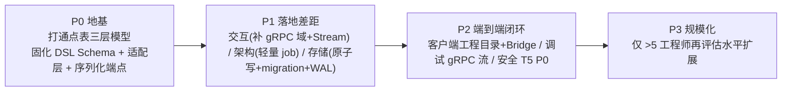
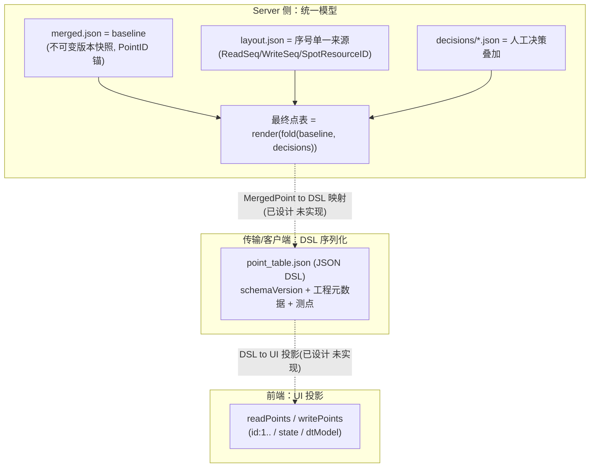
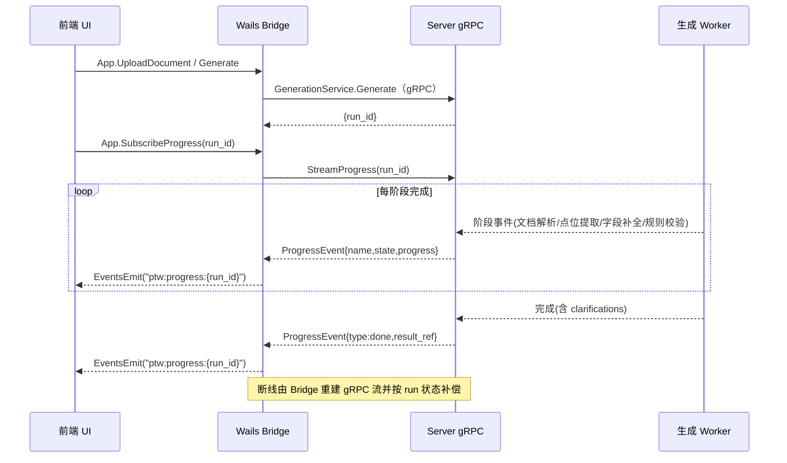
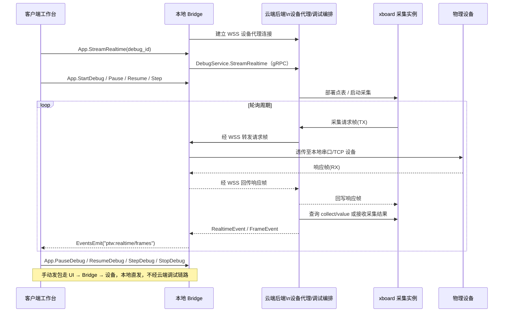
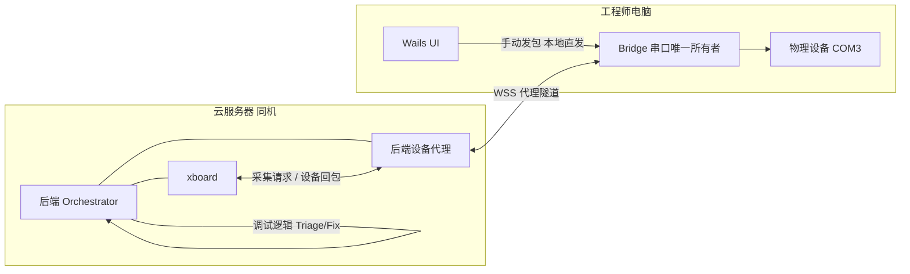
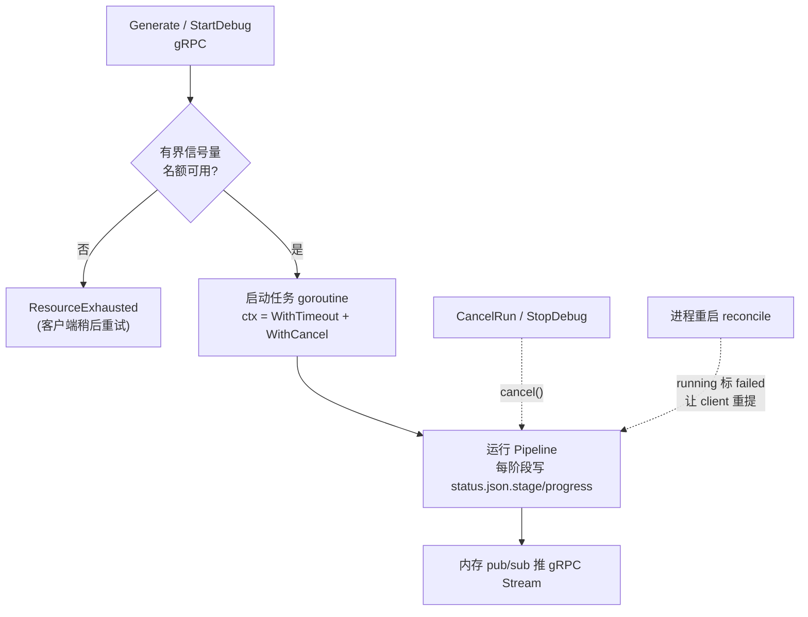
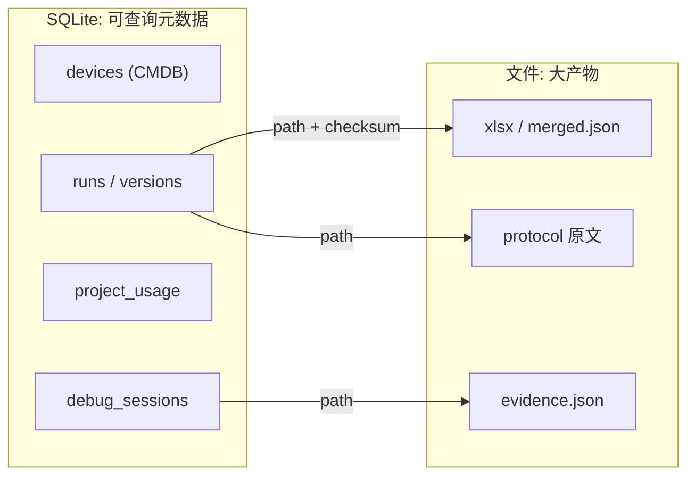
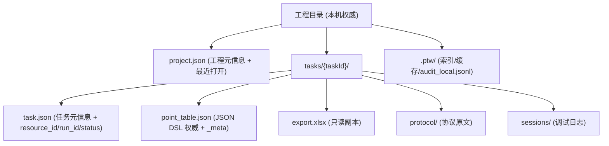

> **文档定位**：本文是「点表智能工作台」产品的**设计评审与改进建议**。它不重新设计系统，而是评审「代码现状」与「既有目标设计（产品设计 T1–T7 + `ai-point-table/docs/设计文档/` 各规范）」之间的**实现差距**，对齐既有决策、修掉与既有设计的冲突、并按真实规模给出落地优先级。
> **最后更新**：2026-06-21 | **状态**：评审稿 v1.1（含 §4.5 设备通信最终决策） | **基线**：代码现状（As-Is） vs 既有目标设计（To-Be）

---

# 点表智能工作台 — 设计评审与改进建议

## §1 评审范围与方法

### 1.1 评审对象与四个维度

本文聚焦用户最关心的四个维度，且遵循一条硬约束：**前端原型逻辑不变**（以 `ai-point-web/prototype/assets/mock-data.js` 的字段与 `prototype/workbench.html` 的交互为后端必须适配的契约）。

| 维度 | 关注点 |
|------|--------|
| 前后端交互设计 | API 契约、实时协议、响应/错误格式、与原型字段对齐 |
| 后端架构设计 | 进程/任务模型、并发与生命周期、编排 |
| 后端数据存储设计 | SQLite / jobfs 边界、可靠性、可查询性、迁移 |
| 客户端数据存储设计 | 本机工程目录、JSON DSL 权威、Wails Bridge 落地 |

### 1.2 评审方法：双基线对照

本文每个维度统一采用三段式：

1. **现状（代码取证）** —— 以 `ai-point-table` / `ai-point-web` 真实源码为准，标注文件路径与行号；
2. **既有目标设计（引用 T 系列）** —— 指出该问题在既有设计文档中**是否已被设计**及其出处；
3. **实现差距与建议** —— 二者之差，配落地优先级。

> **关键认知（贯穿全文）**：绝大多数"目标方案"（统一 DSL、client 权威 + server 无状态、gRPC Stream + Wails Events、Token 鉴权、migration/WAL、工程目录 + Bridge、补齐 CMDB）**已在 T1–T8 中设计过**。因此本文的价值不在"提出新设计"，而在 ①核实落地差距并排序、②修掉与既有设计的冲突、③按真实规模把重型方案降级。凡既有设计已覆盖处，本文一律标注出处并表述为"已设计、未落地"，不重复发明。

### 1.3 权威设计来源

- **产品设计文档**：`docs/产品设计/`（[00-总览](00-总览与文档索引.md)、产品线 P1–P5、技术线 [T1](技术/T1-系统架构设计.md)–[T8](技术/T8-gRPC桥接架构设计.md)）；
- **后端子系统规范**：`ai-point-table/docs/设计文档/{点表管理规范, AI 生成点表, AI 调试点表, 点表产物与版本管理}.md`。

> 评审取证以代码与上述文档为准。未逐字通读项（T2/T7、`AI 生成点表.md`/`AI 调试点表.md` 全文、P 系列）在引用其细节时需另行核对。

---

## §2 执行摘要

### 2.1 一句话结论

**架构方向正确，但"地基"（点表三层模型）已设计、零落地；交互/架构/存储的大量目标设计停留在文档层，代码尚未实现；并有 2 处目标设计与既有 T4 决策冲突需先调和。**

### 2.2 最高优先级问题（按维度）

| 维度 | 最关键差距 | 既有设计出处 | 现状 |
|------|----------|------------|------|
| 数据模型（地基） | server 统一模型 / DSL 序列化 / 前端 UI 投影 三层未打通 | T1§1.5、T3、T4§1.8 | DSL 序列化 gRPC 方法缺失、Bridge 全 stub |
| 前后端交互 | 前端从不调真实 Bridge/gRPC；缺 OCR/澄清/增量/门禁方法；无 gRPC Stream + EventsEmit | T4 B/D/E/I 域、§1.3；T8 | 仅 23 个历史 HTTP 端点、纯轮询 |
| 后端架构 | 无 **job 级**取消/超时/并发上限；进度无阶段粒度 | T6§1.2.4 | 裸 `go func()` + `context.Background()` |
| 后端存储 | 元数据不可聚合查询；非原子写；无 migration/WAL | T3、T6§1.2.4/§3.1 | SQLite 仅 2 表、`status.json` 直写 |
| 客户端存储 | 工程目录 / JSON DSL / Bridge 0→1 未开始 | T3、T4§1.7、T6§1.6 | 全 mock + localStorage |
| **设备通信** | 手动发包 / 隧道 / Bridge 串行化均未落地 | **§4.5 已定稿**（对齐 T5§1.2） | Bridge stub；无 WSS 隧道 |

### 2.3 必须先调和的 2 处冲突（详见 §4.4）

1. **统一 envelope + RFC7807** 与 T4§1.4 直接冲突 —— T4 已决策"**不额外包装 `data`、沿用 `{error}` 补 `code/details`、不采用 problem+json**"。本文放弃 envelope/RFC7807，改为"沿用 `{error}` + 补 `code/details`（对齐 T4）"。
2. **工作台聚合接口（BFF）** 与 T4 刻意拆分的细粒度 REST 分歧 —— 本文将其定位为**可选 BFF 补充**而非替代，并说明聚合范围。

### 2.4 改进主线



---

## §3 核心张力：点表"三层模型"未打通（地基问题）

这是全文最重要的判断，也是后续所有交互/存储问题的根因。**请先纠正一个常见误读**：点表数据模型并非"三套互相竞争、且无人定义归属"，而是**一套统一模型在三个层面的不同呈现，三者的映射与同步已被设计，只是代码尚未把它们打通**。

### 3.1 现状（代码取证）：三层各自存在



- **Server 统一模型**（权威）：`ai-point-table/docs/设计文档/点表管理规范.md` 明确 `最终点表 = render(fold(baseline, decisions))`；`merged.json` 是 baseline（`internal/pipeline/pipeline.go` 落盘），`layout.json` 是序号单一来源（`internal/layout/layout.go`，`SpotResourceID = resourceID + "_" + readSeq`，规范"铁律 1"以 PointID 为唯一锚）。
- **DSL 序列化**：面向客户端的序列化形态（T3 给出 `MergedPoint → DSL` 映射）。**代码中无任何 DSL 序列化 gRPC 方法**。
- **前端 UI 投影**：`ai-point-web/prototype/assets/mock-data.js` 的 `readPoints`（`id:1..29`、`state`、IIFE 追加 `dtModel/dtDevice/dtId`），是 DSL 面向工作台的视图。

### 3.2 既有目标设计：三层映射与同步**已定义**

| 关系 | 已定义出处 |
|------|----------|
| Server 统一模型语义（baseline/decision/fold/render/version） | `点表管理规范.md §2` |
| `MergedPoint → DSL` 字段映射 + DSL JSON Schema | [T3](技术/T3-数据库与数据模型设计.md) |
| 数据归属（client 权威 / server 无状态） | [T1](技术/T1-系统架构设计.md)§1.4、[T3](技术/T3-数据库与数据模型设计.md) |
| 端到端流转（BASE→FOLD→VER→download→DSL） | [T1](技术/T1-系统架构设计.md)§1.5 |
| 写回 client 工程目录 + `_meta` 同步判断 | [T4](技术/T4-API与桌面Bridge设计.md)§1.8 |
| 一致性/冲突策略 | [T3](技术/T3-数据库与数据模型设计.md) |

### 3.3 实现差距与建议

**差距本质：地基已设计、零落地** —— 三层之间的"翻译器"和"管道"在代码里完全不存在：
- 无 `MergedPoint ↔ DSL` 适配层；
- 无 DSL 序列化/反序列化 gRPC 方法（客户端拿不到 DSL）；
- 客户端无落盘能力（Bridge 全 stub，见 §7）。

**建议（P0，先于一切）**：
1. **固化统一 DSL JSON Schema**（带 `schemaVersion`），直接采用 T3 既有定义，不另起炉灶；
2. **实现 `MergedPoint ↔ DSL` 适配层**（anti-corruption layer），作为 server 统一模型与传输/客户端之间的唯一翻译入口；
3. **新增 DSL 序列化 gRPC 方法**（生成结果导出为 DSL、客户端回传 DSL）；
4. 前端 `readPoints` 字段保持不变，由适配层保证 DSL→UI 投影可逆。

> **措辞校准**：`merged.json` / `layout.json` **对客户端而言是中间产物**（客户端只认 DSL），**但对 server 而言仍是权威基线与序号源**，不可被描述为"可降级的中间态"。

---

## §4 维度一 · 前后端交互设计

### 4.1 现状（代码取证）

| 现状问题 | 取证 |
|---------|------|
| 前端纯 mock，从不调真实 Bridge/gRPC | `ai-point-web/prototype/assets/shell.js`（数据源 localStorage；`testPlatform()` 直接置 `connected=true` 不发请求） |
| 现有仅 23 个端点，不匹配原型所需 | `ai-point-table/internal/api/router.go` |
| 无 gRPC Stream / EventsEmit 管道 | 当前仅有 Gin router；无 `StreamProgress`、`StreamRealtime`、`StreamFrames` 与 Bridge EventsEmit 管道 |
| 进度只能轮询、无阶段粒度 | `job.Job` 无 stage 字段；`GetStatus` 返回整个 job，运行期不更新阶段 |
| 响应格式不统一 | `internal/api/handler/response.go` 无统一包装；`internal/api/handler/debug.go` 中 `Apply` 校验失败时 `c.JSON(409, res)` 返回业务体，而其余错误走 `{error}` |

### 4.2 两个实锤 Bug（直接支撑"响应不统一/接口不匹配"）

1. **`Publish` 的 409 链路断裂**：`service.Publish` 在 spot_drift 未确认时返回 `ErrConflict`，但 `internal/api/handler/debug.go` 的 `Publish` 走 `changeErr`，而 `changeErr` 只映射 `ErrNotFound / ErrInvalidInput`，其余一律 500 —— 该场景**实际返回 500 而非预期的 409**。见 [T4](技术/T4-API与桌面Bridge设计.md)§2.5 问题二。
2. **`PointTableHandler.Download` 死代码**：该 Handler 已实现但路由实际绑定的是 `Debug.Download`，前者不可达。见 [T4](技术/T4-API与桌面Bridge设计.md)§2.5 问题一。

> 这两个 Bug 既是"响应不统一"的实证，也是 P1 阶段低成本可清理的技术债。

### 4.3 既有目标设计（已规划，未实现）

| 能力 | 出处 |
|------|------|
| 生成进度 gRPC Server Streaming（5 阶段，已对齐原型 `genStages`） | [T4](技术/T4-API与桌面Bridge设计.md)§1.3（C-2）、[T8](技术/T8-gRPC桥接架构设计.md)§6 |
| 调试实时值/报文 gRPC Streaming（含 pause/resume/step/stop） | [T4](技术/T4-API与桌面Bridge设计.md)§1.3（H-9 / H-10）、[T8](技术/T8-gRPC桥接架构设计.md)§6 |
| 按业务域拆分的新增 gRPC 方法 | [T4](技术/T4-API与桌面Bridge设计.md) B/D/E/I 等域 |
| 异步任务标准模式（gRPC 接收任务 + StreamProgress 状态查询） | [T4](技术/T4-API与桌面Bridge设计.md)§1.2 C 域 |

**遗漏补全（原型需要、但既有讨论中被一笔带过的交互主体能力）**：

- **OCR / MinerU 接入**：当前 `generate` 仅接受 `.md / .txt`（`internal/service/point_table.go` 的 `AllowedProtocolExt`），而原型 `coldStart.accept` 含 PDF/Word/图片且有 `raw/ocr` 双视图 —— 对应 [T4](技术/T4-API与桌面Bridge设计.md) **B 域**（文档上传与解析）。
- **澄清队列 gRPC 方法**：原型 `ai.clarifications`（问题/选项/AI 推荐/证据/受影响测点）完整，后端 0 实现 —— [T4](技术/T4-API与桌面Bridge设计.md) **D 域**。
- **增量分析 gRPC 方法**：原型 `changeSet`（新增点/字段变更/不适用），后端无 —— [T4](技术/T4-API与桌面Bridge设计.md) **E 域**。
- **确认门禁 + 幂等提交**：原型 `gatePass` + 确认提交，后端需 `content_hash` 幂等与质量门禁 —— [T4](技术/T4-API与桌面Bridge设计.md) **I 域**。

### 4.4 实现差距与建议

#### 生成进度：gRPC Stream + EventsEmit（单向）



#### 调试试运行间：xboard 采集帧代理 + gRPC 流（双向）



#### 响应格式：对齐 T4，不引入 envelope

> **冲突调和（Critical）**：本文**放弃**"统一 envelope + RFC7807 problem+json"。原因：[T4](技术/T4-API与桌面Bridge设计.md)§1.4 已明确决策——**成功响应直接返回业务对象、不额外包装 `data`**；错误响应**沿用现有 `{error}` 格式，新增 `code` / `details`**，并给出 gRPC Code / 历史 HTTP 状态码 → 业务错误码映射表。
>
> 故本文的存量改进项收敛为：
> - 为错误响应补 `code` / `details`（对齐 T4§1.4，原型可按 `code` 细粒度处理）；
> - **修复 §4.2 的状态码不一致**（Apply/Publish 让 `changeErr` 正确映射 `ErrConflict` → 409，统一错误出口）。

#### 工作台聚合接口：定位为可选 BFF 补充

> **冲突调和（Critical）**：[T4](技术/T4-API与桌面Bridge设计.md) 刻意将工作台数据拆为 `GET /points`、`/evidence`、`/clarifications`、`/change-set`、`/command-profiles` 等细粒度端点。本文若引入"一次性返回 `window.MOCK` 同构 JSON"的聚合接口，**定位为可选 BFF 补充而非替代**：
> - 用途：首屏打开工作台时减少前端编排往返（一次拉齐 device + readPoints + writePoints + commands + hexLog + ai + documents + changeSet）；
> - 实现：聚合层内部调用上述 T4 细粒度端点，**不新增权威数据源**；
> - 增量更新仍走细粒度端点（如澄清应答 `{clarificationId, selectedOpt}` → 局部刷新）。

### 4.5 设备通信最终决策（已定稿）

> **部署拓扑（已确认）**：物理设备**直接接工程师电脑**（如 COM3）；Wails 客户端运行在工程师电脑；**仅有一台云服务器**，后端服务与 xboard 采集实例同机部署（xboard 通常 `127.0.0.1:6100`）。不存在"设备在远程试运行间、不经工程师电脑"的场景。

#### 一句话决策

**串口只在工程师电脑上，由客户端 Bridge 独占；手动发包本地直发、不经云端；自动调试由云端 xboard 把采集请求交给后端设备代理，后端再通过 WSS 隧道让 Bridge 代发帧并把设备回包交还给 xboard。**

#### 组件职责

| 组件 | 部署位置 | 职责 |
|------|---------|------|
| 物理设备 | 工程师电脑 COM 口 | 被调试对象 |
| **Wails Bridge** | 工程师电脑 | **串口/TCP 唯一所有者**；手动发包、隧道代发均经此进出 |
| 后端服务 / 设备代理 | 云服务器 | 生成点表、调试编排、Triage/Fix、gRPC 业务接口；接收 xboard 采集请求并经 WSS 转发给本地 Bridge |
| **xboard 采集实例** | 云服务器（与后端同机） | 生成 Modbus 请求帧、读缓存值；**不直接连设备、不直接连 Bridge** |

#### 两种操作、两条路径

**路径 A — 手动发包（右栏「发送」/ `SendFrame`）**

```
UI 输入 hex → Bridge → COM3 → 设备 → 响应 → UI / hexLog
```

- **不经过云端**（对齐 [T4](技术/T4-API与桌面Bridge设计.md) M3 本机 `SendFrame`、[T5](技术/T5-安全权限与审计设计.md)§1.2「设备只与本机通信」）。
- 低延迟、可离线调试连通性。

**路径 B — 自动调试 / 轮询读值**

```
云端 xboard 生成请求帧
  → 云端后端设备代理
  → WSS 加密隧道（后端 ↔ Bridge）
  → Bridge 透传 → COM3 → 设备
  → 响应经隧道回后端设备代理
  → 后端回包给 xboard
  → 后端通过 collect 接口/采集结果给 Orchestrator/Triage
  → 结果推 UI（H-9/H-10）
```

- **必须经过云端后端设备代理**（xboard 通过后端访问本地设备，AI 判读在服务器）；设备帧仍由 Bridge 代发，服务器不直接持有串口（对齐 T5§1.2 时序图）。



#### 与原型三跳链路的对应

原型左栏「调试链路」（`workbench.html`）与上述决策一一对应，**无需改 UI**：

| 原型展示 | 含义 |
|---------|------|
| 本地设备 (COM3) | Bridge ↔ 设备（本地串口） |
| 采集实例 `<instanceId>` / TTL | 云端 xboard 实例 |
| 代理隧道 / `<latency>` ms | Bridge ↔ 云端后端设备代理的 WSS 隧道 |

#### 必须补齐的三项（当前文档缺口）

1. **Bridge 单事务串行化（P1）**  
   Bridge 同时接收两路帧来源：① 隧道下行的自动采集帧；② UI 手动帧。Modbus RTU/RS-485 同一时刻只能有一个在途主站事务 → **Bridge 内必须串行化**（手动发包时暂停/排队自动轮询，或反之）。  
   > 注意：服务器侧 `internal/debug/lock.go` 的 `LockSet` 只管进程内调试会话，**管不到 Bridge 串口**；总线互斥必须在 Bridge 实现。

2. **WSS 设备隧道代理（P1，提级为核心依赖）**  
   设备在本地、xboard 在云端，且 xboard 的采集帧必须经后端设备代理中转 → **无后端代理 + WSS 隧道则自动调试完全不可用**。T1/T5 中的「设备隧道代理」不是可选增强，而是自动调试的地基，优先级应高于一般 P1 功能。

3. **写点门禁的 Bridge 本地执行（P2）**  
   手动写寄存器帧（FC 05/06/15/16）**不经云端 API**，T5§1.3 的服务端门禁拦不住。因此：授权仍由云端签发（`write_auth_id` + TTL），**功能码校验 + 拦截必须在 Bridge 本地强制执行**，并写本机审计（`audit_local.jsonl`，见 §7.3）。

#### 明确不做

- ❌ 不让云端 xboard **直接**占用工程师电脑串口（物理上不可行）；
- ❌ 不让 xboard **直接**连接工程师电脑 Bridge（必须经云端后端设备代理统一鉴权、路由、审计）；
- ❌ 不让手动发包也绕云端透传（延迟大、与 T5/T4 相反）；
- ❌ 不在工程师电脑与本机 xboard 之间搞「双主站」并发打同一条 485 线；
- ❌ 不采用曾讨论的「一律走 xboard 独占设备链路、本机退化为 127.0.0.1 xboard」方案（与 T5§1.2 相反，已作废）。

#### 既有设计对齐

| 决策点 | 对齐文档 |
|--------|---------|
| 本机 Bridge 独占串口 + 后端设备代理隧道转发 | [T5](技术/T5-安全权限与审计设计.md)§1.2 |
| 手动发帧走 `SendFrame` 本机串口 | [T4](技术/T4-API与桌面Bridge设计.md) M3 / §1.7 |
| H-10 为服务器→客户端报文推送（非手动上行） | [T4](技术/T4-API与桌面Bridge设计.md)§1.3 H-10 |
| xboard 当前仅只读采集接口 | `internal/xboard/client.go`、`AI 调试点表.md` |

---

## §5 维度二 · 后端架构设计

### 5.1 现状（代码取证）

生成与调试任务都以**裸 goroutine + `context.Background()`** 启动：

- 生成：`ai-point-table/internal/service/point_table.go` 中 `go s.runJob(context.Background(), ...)`；
- 调试：`ai-point-table/internal/service/debug_service.go` 中 `go func(){ s.orch.Run(context.Background(), ...) }()`。

由此带来：任务**不可取消**、**无整体超时**、**进程重启即丢**、**无 job 级排队/背压**、进度**不持久化阶段**。

> **nuance 校准（避免夸大）**：并非"完全无并发控制"。事实上：
> - **LLM 调用级有信号量**：`internal/pipeline/pipeline.go` 用 `semaphore.NewWeighted(MaxConcurrentLLM)` 限制并发 LLM 请求；
> - **调试有设备级串行锁**：`internal/debug/lock.go` 的 `LockSet` 保证同一 `resource_id` 同时仅一个调试会话（冲突转 409）。
>
> 准确表述应为：**缺的是"job 级"的取消/超时/排队/并发上限**，LLM 级与设备级已有局部控制。

### 5.2 既有目标设计

[T6](技术/T6-部署分发与运维设计.md)§1.2.4 已触及运维侧的任务可观测与边界：`job_queue_depth` 指标、`context timeout`、`JobQueueDepthHigh` 告警，以及"**>5 工程师再评估 PostgreSQL**"的规模拐点。本文与之交叉引用，不另起炉灶。

### 5.3 实现差距与建议（按真实规模降级）

> **规模前提**：本产品是"现场工程师桌面工具 + 单台服务器后端"，且点表权威在客户端、server 端 run 数据可重建。因此**不应**引入重型分布式任务系统。以下方案有意采用轻量实现。



建议（P1）：

1. **job 级 `context`**：`context.WithTimeout` + `context.WithCancel` 替代 `context.Background()`，支持整体超时与主动取消（新增 `CancelRun` / `StopDebug` gRPC 方法）。
2. **有界并发 + 背压**：用一个进程级有界信号量限制同时运行的生成/调试 job 数；名额满直接返回 gRPC `ResourceExhausted`（客户端重试），**不做复杂排队系统**。
3. **进度阶段化**：`status.json` 增 `stage` / `progress` 字段，Pipeline 每个 Stage 完成时更新，并通过**内存 pub/sub** 推 gRPC Stream（见 §4）。
4. **重启恢复（最简）**：进程启动时把仍处于 `running` 的 job 直接标 `failed`，由客户端重新发起 —— **不实现 requeue / idempotency_key / 持久化队列**。

> **明确不做（超出当前规模）**：asynq / Temporal 等持久化任务队列、独立事件表/事件总线、跨进程文件锁。一旦运维数据显示 `job_queue_depth` 持续偏高或工程师数 >5（对齐 T6§1.2.4），再评估升级。

### 5.4 设备通信与调试链路（见 §4.5 最终决策）

在已确认拓扑（设备 + 客户端在工程师电脑，xboard + 后端在云端）下：

| 架构要点 | 说明 |
|---------|------|
| 串口所有者 | **Bridge（本机）**，非云端 xboard |
| 自动采集路径 | 云 xboard → 后端设备代理 → WSS 隧道 → Bridge → 设备 → 原路返回后端代理 → xboard |
| 手动发包路径 | UI → Bridge → 设备，**不经云端** |
| 服务器 `LockSet` | 仍用于同一 `resource_id` 仅一个调试会话（409）；**不能替代 Bridge 串口串行化** |
| 隧道优先级 | **P1 核心依赖**；后端设备代理或隧道断开时手动发包仍可用，自动调试不可用 |

实现差距：后端 xboard 帧代理、WSS 设备隧道代理、Bridge `SendFrame`/`ListSerialPorts` 正式实现、Bridge 内帧队列串行化 —— 当前均为 stub 或未实现（`desktop/app.go`）。

---

## §6 维度三 · 后端数据存储设计

### 6.1 现状（代码取证）

后端存储分两块：SQLite（仅 2 张表）+ jobfs（文件树）。

| 现状问题 | 取证 |
|---------|------|
| `status.json` 非原子写（崩溃可能损坏） | `internal/job/jobfs/store.go` 用 `os.WriteFile` 直写；对比 `internal/debug/store.go` 已用 `tmp + os.Rename` |
| 无 migration 框架 | `internal/store/sqlite/sqlite.go` + `schema.sql` 仅 `CREATE TABLE IF NOT EXISTS`，加字段无演进路径 |
| SQLite 无 WAL | DSN 无 pragma，仅 `SetMaxOpenConns(1)` |
| `xcmdb` list/count 为空桩 | `internal/api/handler/xcmdb.go` 硬编码空/0；`internal/store/device.go` 接口无 `List` 方法 |
| `resource_seq` 并发仅靠单连接 | 序号递增仅靠 `SetMaxOpenConns(1)`，无应用层保护 |

> **措辞校准（避免夸大）**：jobfs 并非"不可查询"。`jobfs.ListRunsByResourceID` 可按 `resourceID` **全目录扫描**查询，但**无索引、无法分页/聚合、无法全局列举设备/工程**。准确表述是"缺索引化的可查询元数据层"。

### 6.2 既有目标设计

| 能力 | 出处 |
|------|------|
| 元数据入库（runs / project_usage / projects 表）+ goose 迁移 | [T3](技术/T3-数据库与数据模型设计.md)§3.2 |
| SQLite WAL（`PRAGMA journal_mode=WAL; busy_timeout=5000`） | [T6](技术/T6-部署分发与运维设计.md)§1.2.4 / §3.1 |
| 存储边界（关系元数据 vs 大产物文件） | [T3](技术/T3-数据库与数据模型设计.md) |

这些目标在 T3/T6 已写到 pragma 与迁移工具一级，本文为"指出未实现 + 排序"，引用而非新提。

### 6.3 实现差距与建议



建议（P1）：

1. **元数据入库**：将 runs / versions / debug_sessions 的索引与元信息进 SQLite（可分页/聚合），大产物仍存文件、DB 仅存 `path + checksum`；**补齐 CMDB `list` / `count`**（让"列出我的所有设备/工程"成为可能）。
2. **统一原子写**：把 `internal/debug/store.go` 已用的 `tmp + rename` 模式推广到 `status.json` 等所有 JSON 落盘。
3. **引入 migration**：采用 goose / golang-migrate，建立增量 `ALTER` 演进路径。
4. **开启 WAL**：SQLite DSN 加 `journal_mode=WAL` + `busy_timeout`，提升并发读写。
5. **明确 server run 数据 = 临时可重建**：配 TTL 清理；权威在客户端（见 §8）。

> **文档滞后提示**：`xlsx_path 不随 canonical 同步` 在 [T1](技术/T1-系统架构设计.md)§3.3 / T3 记为 Bug，但代码 `internal/service/debug_service.go` 的 `syncCMDB` **已修复**（apply/publish 后 Update `xlsx_path`）。引用此点时应标注"**代码已修、文档待更新**"。

---

## §7 维度四 · 客户端数据存储设计

### 7.1 现状（代码取证）

客户端存储**0→1 尚未开始**：

| 现状问题 | 取证 |
|---------|------|
| 全 mock + localStorage | `ai-point-web/prototype/assets/mock-data.js`（业务数据）；`shell.js` 仅用 `localStorage(ptw.config)` 存引导配置 |
| Wails Bridge 全 stub | `ai-point-web/desktop/app.go` 所有方法返回"未实现"错误；`ListSerialPorts` 硬编码 `COM3/4/7` |
| "已自动保存" 为静态文案 | 工作台 UI 文案，无真实落盘；刷新即丢业务数据 |

### 7.2 既有目标设计

| 能力 | 出处 |
|------|------|
| 工程目录 layout | [T3](技术/T3-数据库与数据模型设计.md)、[T6](技术/T6-部署分发与运维设计.md)§1.6 |
| Bridge 正式契约（SaveDSL/LoadDSL/ExportXlsx/ValidateDSL 等） | [T4](技术/T4-API与桌面Bridge设计.md)§1.7 |
| DSL `_meta` 同步标记与写回 | [T4](技术/T4-API与桌面Bridge设计.md)§1.8 |
| Token Keychain 加密存储 | [T5](技术/T5-安全权限与审计设计.md)§1.6 |
| 工程目录跨机迁移 | [T6](技术/T6-部署分发与运维设计.md)§1.6 |
| 本机审计副本 `audit_local.jsonl` | [T5](技术/T5-安全权限与审计设计.md)§1.4 |

### 7.3 实现差距与建议



建议（P2，依赖 §3 的 DSL Schema 与 §8 的同步契约）：

1. **落地工程目录 layout**（上图），`point_table.json` 为本机权威，xlsx 为只读副本。
2. **DSL schema 校验 + JSON↔xlsx 无损往返**：Bridge 侧用 Go `excelize` 实现，确保 DSL 与 xlsx 可逆。
3. **原子写**：本机所有写入用 `tmp + rename`，避免半写损坏；保留轻量本地历史快照。
4. **最近工程索引替代 mock**：用 `project.json` + `.ptw/` 索引替换原型 `recentProjects` 静态数组。
5. **Bridge 全部落地**：`SelectProjectDir / GetConfig / SaveConfig / ListRecentProjects / SaveDSL / SubmitToServer / SendFrame / ListSerialPorts`（对齐 [T4](技术/T4-API与桌面Bridge设计.md)§1.7）。
6. **离线优先**：无网也能打开工程、编辑点表；联网才生成/调试/提交。DSL `_meta`（`last_synced_run_id` / `dirty`）用于同步判断（[T4](技术/T4-API与桌面Bridge设计.md)§1.8）。

**补齐遗漏（既有设计已规划，需纳入客户端落地清单）**：
- **Token Keychain 加密存储**（[T5](技术/T5-安全权限与审计设计.md)§1.6）—— 不只是"密钥移出 config"，客户端凭证应进系统 Keychain；
- **工程目录跨机迁移**（[T6](技术/T6-部署分发与运维设计.md)§1.6）；
- **本机审计副本** `audit_local.jsonl`（[T5](技术/T5-安全权限与审计设计.md)§1.4）。

---

## §8 横切 · 数据归属与同步模型（已是既有架构决策，本文核实落地）

> 本节澄清一个评审误读：数据归属与同步**不是本文新提**，而是既有架构决策（[00-总览](00-总览与文档索引.md)§6、[T1](技术/T1-系统架构设计.md)§1.4/§1.5、[T3](技术/T3-数据库与数据模型设计.md)、`点表管理规范.md §2`）。本文重点是**核实代码缺口并排序**。

### 8.1 既有归属决策

- **客户端 = 工程/点表权威存储**（离线优先，本机 JSON DSL 为单一事实来源）；
- **Server = 无状态计算服务**（生成 + 调试 Harness）+ **全局资源分配**（`resource_id` / `seq` 仍由 server 发，因客户端无法保证全局唯一，见 `internal/store/sqlite/sqlite.go` 的 `NextResourceID`）+ **CMDB**；
- Server 端 run 数据为**临时态/可重建**（见 §6.3）。

### 8.2 同步契约（push / pull）

```mermaid
sequenceDiagram
    participant CL as 客户端 DSL权威\n(Wails Bridge)
    participant SV as Server 无状态计算\n(gRPC)
    Note over CL,SV: 生成 pull：server 产出 -> Bridge 写回 client
    CL->>SV: gRPC 上传协议文件 + 请求生成
    SV-->>CL: gRPC 返回 MergedPoint/DSL
    CL->>CL: Bridge 写回本机 point_table.json (记 last_synced_run_id)
    Note over CL,SV: 调试 push-compute-pull：Bridge 上传 -> server 部署采样 -> 变更回写
    CL->>SV: gRPC 上传 DSL 到临时 run
    SV->>SV: 部署设备 + 采样 + 生成变更集
    SV-->>CL: gRPC 回写变更 (decisions/修正)
    CL->>CL: 合并入 DSL; 冲突按版本标记处理
```

冲突处理沿用 [T3](技术/T3-数据库与数据模型设计.md) 的一致性策略（版本标记 + 显式合并）。

### 8.3 实现差距

**契约已设计，管道全缺**：DSL 序列化 gRPC 方法不存在、Bridge 全 stub、DSL `_meta` 同步标记未实现。这与 §3 是同一地基问题的两面 —— 故 **P0 必须先打通三层模型与同步管道**。

---

## §9 横切 · 安全（整体指向 T5，标注与四维强相关）

### 9.1 现状（代码取证）

- **无鉴权**：`internal/api/router.go` 全局中间件仅 `Recover / RequestID / AccessLog`，任何可达端口的客户端可操作全部 API；
- `config/config.json` 含**明文 API Key**；
- **写点（向真实设备写寄存器）无服务端保护**；
- 无审计留痕、无工程师/工程级隔离。

### 9.2 既有目标设计

[T5](技术/T5-安全权限与审计设计.md) 已完整设计：P0/P1/P2 清单、Bearer Token、数据隔离、写点授权状态机、`audit_log` DDL、Token Keychain。本节**整体指向 T5**，核实结论是"**T5 的 P0 项目前全未落地**"，不重述其设计细节。

### 9.3 与四维度的关系

安全虽非本次四个评审维度，但强相关：鉴权属于"前后端交互"（gRPC Interceptor 接入见 [T4](技术/T4-API与桌面Bridge设计.md)§1.5/§3.4）、Keychain 属于"客户端存储"（§7）、审计落盘属于"后端存储"（§6）。建议在 P2 阶段整体落地 T5 P0（最小改动：新增 gRPC 鉴权拦截器 + 密钥移环境变量），复用既有 Service 层。

### 9.4 写点门禁与设备通信（§4.5 补充）

[T5](技术/T5-安全权限与审计设计.md)§1.3 的写点授权（`write_auth_id`、逐点确认、边界校验、审计）主要在**服务器 gRPC 层**校验。但在 §4.5 拓扑下，**手动写帧经 Bridge 本地直发、不经云端 gRPC**，服务端门禁无法拦截。

因此写点安全必须**双点执行**：

| 层级 | 职责 |
|------|------|
| 云端 gRPC | 签发/校验 `write_auth_id`；自动调试经后端设备代理 + 隧道的写操作门禁 |
| **Bridge 本地** | 对手动帧强制：无授权则拒绝 FC 05/06/15/16；授权态 TTL 校验；写本机 `audit_local.jsonl` |

原型「写点调试已锁定 / 授权」按钮（`workbench.html`）应对接上述双点模型，无需改交互，仅 Bridge 层落地。

---

## §10 改进路线图与优先级

### 10.1 优先级排布

| 阶段 | 主题 | 关键任务 | 收敛门禁 |
|------|------|---------|---------|
| **P0** | 地基：打通三层模型 | 固化统一 DSL JSON Schema（T3）+ 实现 `MergedPoint↔DSL` 适配层 + 新增 DSL 序列化 gRPC 方法 | 生成结果能导出为合法 DSL 并被 Schema 校验通过 |
| **P1** | 落地差距（交互/架构/存储） | 交互：补 OCR/澄清/增量/门禁 gRPC 方法 + StreamProgress + 错误 `code/details` + 修 Apply/Publish 状态码；**设备通信：后端 xboard 帧代理 + WSS 隧道 + Bridge 帧串行化 + `SendFrame`/`ListSerialPorts` 落地**；架构：job 级取消/超时/有界并发 + `status.json` 阶段化；存储：原子写 + migration + WAL + 元数据入库 + 补 CMDB list/count | 原型核心流程可经 Bridge + gRPC 走真实后端；**自动调试经后端代理 + 隧道可采样**；手动发包本机可用 |
| **P2** | 端到端闭环 | 客户端工程目录 + DSL + Bridge 全落地 + JSON↔xlsx；调试 gRPC Streaming（H-9/H-10）；**Bridge 写点门禁本地执行**；安全落 T5 P0（gRPC 鉴权拦截器 + Keychain + 审计） | 桌面 App 可离线编辑、联网生成/调试/提交；写点受授权保护（含手动帧） |
| **P3** | 规模化（按需） | 仅当工程师数 >5 且确需多节点时，评估 PostgreSQL / 水平扩展（对齐 T6§1.2.4） | 有运维数据支撑（`job_queue_depth` 等）才启动 |

### 10.2 横切：可观测性（贯穿 P1–P2）

对齐 [T6](技术/T6-部署分发与运维设计.md)§1.5，作为贯穿项补齐：
- **结构化日志**（slog）替代裸 `log`；
- **Prometheus 指标**（`job_queue_depth`、生成耗时、LLM 调用量/失败率）；
- **工程用量汇总**（按工程级汇总，对应工程总览右上角工程用量展示；不暴露 token/model 明细）。

### 10.3 风险

- **P0 是强阻塞项**：DSL 三层未打通前，P1/P2 的交互与客户端落地都无法真正闭环；
- **前端不变约束**：所有 API/字段调整必须反向适配 `mock-data.js` 的契约，不能要求前端改结构；
- **文档与代码漂移**：评审已发现 `syncCMDB`（代码已修、文档未更）等漂移，落地时需同步回填 T 系列；
- **设备通信强依赖隧道**：P1 未交付 WSS 隧道前，自动调试无法端到端验收（手动发包可先行）。

---

## §11 不做什么（边界）

- **不改前端原型交互逻辑与字段**：以 `mock-data.js` / `workbench.html` 为后端必须适配的契约；
- **不为当前规模上重型方案**：不引入持久化任务队列（asynq/Temporal）、独立事件总线、跨进程文件锁、分布式部署；
- **不采用响应 envelope / RFC7807 problem+json**：尊重 [T4](技术/T4-API与桌面Bridge设计.md)§1.4 既有决策，仅补 `code/details`；
- **不推翻 Agent/Pipeline 算法与 server 统一模型**：仅补编排（job 生命周期）、产物序列化（DSL 适配层）与客户端落地，不重写生成/调试核心逻辑；
- **不让云端 xboard 直接占工程师电脑串口或直连 Bridge**；**不让手动发包经云端透传**；**不采用「xboard 独占设备、本机跑 xboard」方案**（见 §4.5）。

---

## 附录 · 评审意见落点对照

本文已按代码评审子代理的意见逐条修订，落点如下：

| 评审意见 | 落点 |
|---------|------|
| 诊断 1 纠错（"已定义、零实现"而非"从未定义"） | §3 全节、§8.1 |
| 调和 T4§1.4 envelope 冲突 | §4.4、§11 |
| 全文重定位为"现状 vs 既有目标设计差距" | §1.2、全篇三段式 |
| 补 OCR/澄清/增量/门禁交互能力 | §4.3 |
| 补两个实锤 Bug（Publish 409 / Download 死码） | §4.2 |
| 聚合接口定位为 BFF 补充 | §4.4 |
| nuance：LLM 信号量 + 设备锁；jobfs "无索引" | §5.1、§6.1 |
| 架构/存储按规模降级 | §5.3、§6.3、§11 |
| merged/layout 措辞 | §3.3 |
| 客户端补 Keychain/跨机迁移/本机审计 | §7.3 |
| 可观测性小节 | §10.2 |
| `syncCMDB` 代码已修、文档待更新 | §6.3 |
| **设备通信最终决策（Bridge 独占串口 + 隧道 + 手动本地直发）** | **§4.5**、§5.4、§9.4、§10.1 |
| 作废「一律走 xboard 独占设备」方案 | §4.5「明确不做」、§11 |
